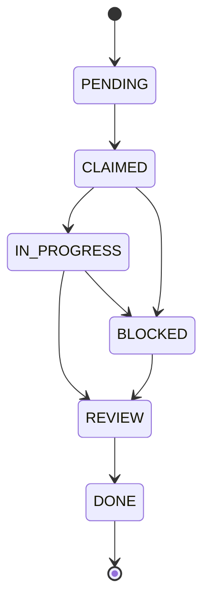

# Bead Task Decomposition System

Beads are the atomic unit of work in the SynthoraAI agentic architecture. Each bead represents a discrete, well-scoped task that an agent (human or AI) can claim, execute, and verify independently. The system provides structured task decomposition, file-level concurrency control, and a compound learning feedback loop for coordinating parallel work across the monorepo.

## Why Beads Exist

Multi-agent systems working on a shared codebase face three coordination problems:

1. **Task granularity** — large tasks are hard to parallelise, hard to retry on failure, and hard to attribute cost to.
2. **File contention** — multiple agents editing the same file leads to merge conflicts and data loss.
3. **Knowledge decay** — lessons learned during one task are invisible to future tasks.

Beads address all three by decomposing work into atomic units with explicit lifecycle states, file-level reservations, and a structured learning loop.

## Bead ID Format

Bead identifiers follow the pattern `{SERVICE}-{NUMBER}`:

| Prefix  | Service / Domain                     | Example     |
|---------|--------------------------------------|-------------|
| `ORCH`  | Orchestration layer (TypeScript)     | `ORCH-001`  |
| `MCP`   | MCP server (Python)                  | `MCP-003`   |
| `PIPE`  | Python agentic pipeline              | `PIPE-012`  |
| `CRAWL` | Crawler service                      | `CRAWL-005` |
| `NEWS`  | Newsletter service                   | `NEWS-002`  |
| `INFRA` | Infrastructure / Terraform / K8s     | `INFRA-008` |
| `DOCS`  | Documentation                        | `DOCS-004`  |
| `TEST`  | Test coverage                        | `TEST-007`  |
| `FE`    | Frontend (Next.js)                   | `FE-001`    |
| `BE`    | Backend (Express API)                | `BE-006`    |

Numbers are zero-padded to three digits and increment per prefix.

## Bead Lifecycle



| State         | Meaning                                                       | Who Transitions                    |
|---------------|---------------------------------------------------------------|------------------------------------|
| `PENDING`     | Task defined but not yet assigned.                            | Creator (human or planning agent)  |
| `CLAIMED`     | An agent has reserved the bead and intends to start.          | Executing agent                    |
| `IN_PROGRESS` | Active work is underway.                                      | Executing agent                    |
| `REVIEW`      | Work is complete and awaiting verification.                   | Executing agent                    |
| `DONE`        | Verified and merged.                                          | Reviewer or CI                     |
| `BLOCKED`     | Cannot proceed; dependency or external blocker.               | Executing agent (with reason)      |

**Transition rules:**
- Only the agent that `CLAIMED` a bead may transition it to `IN_PROGRESS`.
- `BLOCKED` beads must include a `blockedReason` field explaining the dependency.
- `BLOCKED → REVIEW` is the unblock path — the blocker is resolved and work resumes.
- `DONE` is a terminal state; a bead cannot be re-opened. If follow-up work is needed, create a new bead.

## File Reservation Rules

To prevent conflicts when multiple agents operate concurrently:

1. **Claim before editing.** Before modifying any file, the agent must transition the bead to `CLAIMED` and record the file paths in `.beads/.status.json` under `reservations`.
2. **One owner per file.** A file path may appear in at most one active reservation at a time. If another bead already reserves the file, the agent must wait or negotiate.
3. **Release on completion.** When a bead transitions to `DONE` or `BLOCKED`, its reservations are automatically released.
4. **Conflict zones.** Certain files are high-contention and require extra coordination:
   - `docker-compose.yml`
   - `package.json` (root)
   - `.env.example`
   - `CLAUDE.md`
   - `ARCHITECTURE.md`
5. **Safe parallel zones.** These directories are isolated enough for concurrent work:
   - `orchestration/src/agents/prompts/` (one file per agent)
   - `agentic_ai/agents/` (one file per agent)
   - `.claude/skills/` (one file per skill)
   - Test files (scoped to their own suite)

**Checking for conflicts before claiming:**

```bash
# See which files are currently reserved
cat .beads/.status.json | python -m json.tool | grep -A1 '"reservations"'

# Check if a specific file is available
python -c "
import json
status = json.load(open('.beads/.status.json'))
path = 'backend/src/controllers/chat.controller.ts'
owner = status['reservations'].get(path)
print(f'{path}: reserved by {owner}' if owner else f'{path}: available')
"
```

## Status File

The file `.beads/.status.json` tracks active beads and file reservations:

```json
{
  "version": "1.0.0",
  "lastUpdated": "2026-03-24T14:00:00Z",
  "beads": {
    "ORCH-001": {
      "title": "Implement ChatSupervisor",
      "state": "IN_PROGRESS",
      "assignee": "agent-a",
      "files": ["orchestration/src/supervisors/chat-supervisor.ts"]
    }
  },
  "reservations": {
    "orchestration/src/supervisors/chat-supervisor.ts": "ORCH-001"
  }
}
```

| Field | Type | Description |
|-------|------|-------------|
| `version` | string | Schema version (currently `1.0.0`) |
| `lastUpdated` | ISO 8601 | Timestamp of the most recent mutation |
| `beads` | object | Map of bead ID → bead metadata |
| `beads.*.title` | string | Human-readable bead description |
| `beads.*.state` | enum | One of: `PENDING`, `CLAIMED`, `IN_PROGRESS`, `REVIEW`, `DONE`, `BLOCKED` |
| `beads.*.assignee` | string | Agent identifier that owns the bead |
| `beads.*.files` | string[] | File paths this bead intends to modify |
| `beads.*.blockedReason` | string? | Explanation when state is `BLOCKED` |
| `reservations` | object | Map of file path → bead ID currently owning it |

## Creating a New Bead

1. Choose the correct prefix from the table above.
2. Assign the next available number for that prefix.
3. Add the bead to `.beads/.status.json` with state `PENDING`.
4. Include a clear title and list of files that will be touched.
5. Transition to `CLAIMED` when starting work.

**Example — creating CRAWL-003:**

```bash
# 1. Check the next available number
cat .beads/.status.json | python -c "
import json, sys
data = json.load(sys.stdin)
crawl_ids = [k for k in data['beads'] if k.startswith('CRAWL-')]
print(f'Existing: {sorted(crawl_ids)}')
next_num = max((int(k.split(\"-\")[1]) for k in crawl_ids), default=0) + 1
print(f'Next: CRAWL-{next_num:03d}')
"

# 2. Add the bead (or edit .status.json directly)
# Set state to PENDING, list intended files, then CLAIMED when starting
```

## Integration With AI Modules

Beads coordinate work across the three AI orchestration layers:

| Module | How Beads Apply |
|--------|----------------|
| **TypeScript Chat Orchestration** | `ChatSupervisor` can decompose complex requests into sub-beads distributed across the 16 chat agents; each agent reports bead-level status for aggregation |
| **Python LangGraph Pipeline** | Pipeline stages (scrape → summarize → bias → topics) map to beads during batch enrichment, giving per-article progress tracking and selective retry via `ContentSupervisor` |
| **MCP Server** | MCP tools read bead status to provide context-aware assistance in Claude Code, preventing conflicting edits |

## Compound Learning

After completing a bead (state = `DONE`), agents record structured learnings in `.agent-sessions/` using the compound review skill (`.claude/skills/compound-review.md`). Each session file (`{BEAD_ID}_{TIMESTAMP}.md`) captures:

- **Summary** — what was accomplished
- **Files touched** — paths with rationale for each change
- **Learnings** — codebase insights, patterns discovered, pitfalls (tag critical ones with `[KEEP]`)
- **Gotchas** — unexpected issues that cost time
- **Recommendations** — suggestions for future related beads

Future agents read recent sessions before starting related beads to avoid repeating mistakes and reuse proven approaches. See [.agent-sessions/README.md](../.agent-sessions/README.md) for the session log format and retention policy.

## Querying Beads

```bash
# List all beads and their states
cat .beads/.status.json | python -c "
import json, sys
data = json.load(sys.stdin)
for bid, info in sorted(data['beads'].items()):
    print(f\"{bid:12s} {info['state']:12s} {info['title']}\")
"

# Find all in-progress beads
cat .beads/.status.json | python -c "
import json, sys
data = json.load(sys.stdin)
active = {k: v for k, v in data['beads'].items() if v['state'] == 'IN_PROGRESS'}
print(f'{len(active)} in-progress beads')
for bid, info in active.items():
    print(f'  {bid}: {info[\"title\"]} (files: {\", \".join(info[\"files\"])})')
"

# Find sessions for a specific bead
ls .agent-sessions/ORCH-001_*.md
```
