# 🤖 SynthoraAI Agentic Pipeline, MCP & ACP

Comprehensive technical reference for the multi-agent content processing pipeline, Model Context Protocol server, and Agent Communication Protocol layer powering SynthoraAI's government article curation platform.

---

## Table of Contents

- [System Overview](#system-overview)
- [Design Philosophy](#design-philosophy)
- [High-Level Architecture](#high-level-architecture)
- [Pipeline Architecture](#pipeline-architecture)
  - [LangGraph State Machine](#langgraph-state-machine)
  - [Assembly Line Flow](#assembly-line-flow)
  - [Conditional Routing \& Quality Loop](#conditional-routing--quality-loop)
- [Agent Deep Dive](#agent-deep-dive)
- [State Management](#state-management)
- [MCP Server Architecture](#mcp-server-architecture)
  - [ACP Layer](#acp-layer)
  - [Server Bootstrap](#server-bootstrap)
  - [Runtime Container](#runtime-container)
  - [Job Store](#job-store)
  - [Registration Pattern](#registration-pattern)
- [Complete Tool Catalog](#complete-tool-catalog)
  - [Processing Tools (8)](#processing-tools-8)
  - [Analysis Tools (6)](#analysis-tools-6)
  - [Operations Tools (6)](#operations-tools-6)
  - [ACP Tools (8)](#acp-tools-8)
- [Resources Catalog](#resources-catalog)
- [Prompts Catalog](#prompts-catalog)
- [Configuration Reference](#configuration-reference)
- [LLM Provider System](#llm-provider-system)
- [Deployment](#deployment)
  - [Local Development](#local-development)
  - [Docker Deployment](#docker-deployment)
  - [AWS Lambda](#aws-lambda)
  - [Azure Functions](#azure-functions)
- [Integration with SynthoraAI](#integration-with-synthoraai)
- [Monitoring \& Observability](#monitoring--observability)
- [Extension Guide](#extension-guide)
  - [Adding a New Agent](#adding-a-new-agent)
  - [Adding a New MCP Tool](#adding-a-new-mcp-tool)
  - [Adding a New MCP Resource](#adding-a-new-mcp-resource)
  - [Adding a New MCP Prompt](#adding-a-new-mcp-prompt)
- [Security Model](#security-model)
- [Error Handling \& Recovery](#error-handling--recovery)
- [Performance Characteristics](#performance-characteristics)
- [Directory Structure](#directory-structure)
- [Related Documentation](#related-documentation)

---

## System Overview

The SynthoraAI Agentic Pipeline is a **multi-agent content processing system** built on [LangGraph](https://github.com/langchain-ai/langgraph) and [LangChain](https://github.com/langchain-ai/langchain). It processes government-focused articles through a sequence of specialized AI agents — analyzing content, generating summaries, classifying topics, evaluating sentiment, and validating output quality — all orchestrated as a compiled state machine with automatic retry loops.

The pipeline is exposed to external AI clients (Claude Desktop, VS Code Copilot, Cursor, etc.) via a **Model Context Protocol (MCP) server** built on [FastMCP](https://github.com/jlowin/fastmcp), providing 28 tools, 14 resources, and 7 prompt templates over stdio transport. It also includes an **ACP (Agent Communication Protocol)** layer for durable inter-agent messaging.

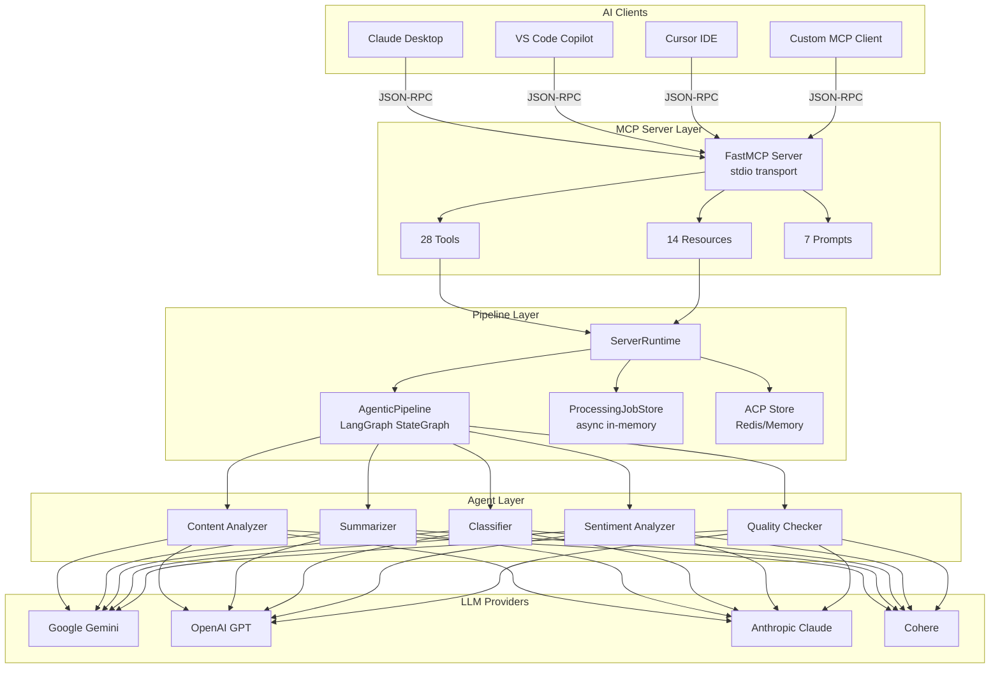

---

## Design Philosophy

| Principle | Implementation |
|-----------|----------------|
| **Assembly Line** | Articles flow through a fixed sequence of specialized agents, each adding structured data to shared state |
| **Quality Gate** | A dedicated Quality Checker agent scores output and triggers retry loops when quality < 0.7 |
| **Provider Agnostic** | Pluggable LLM backend — Google Gemini, OpenAI, Anthropic, or Cohere — swappable via config |
| **Graceful Degradation** | Pipeline starts in degraded mode if providers are misconfigured; MCP server remains responsive |
| **Standardized Interface** | MCP protocol ensures any compatible client can invoke the pipeline without custom integration |
| **Zero-Secret Exposure** | Diagnostics and health endpoints never leak API keys; only boolean readiness is reported |

---

## High-Level Architecture

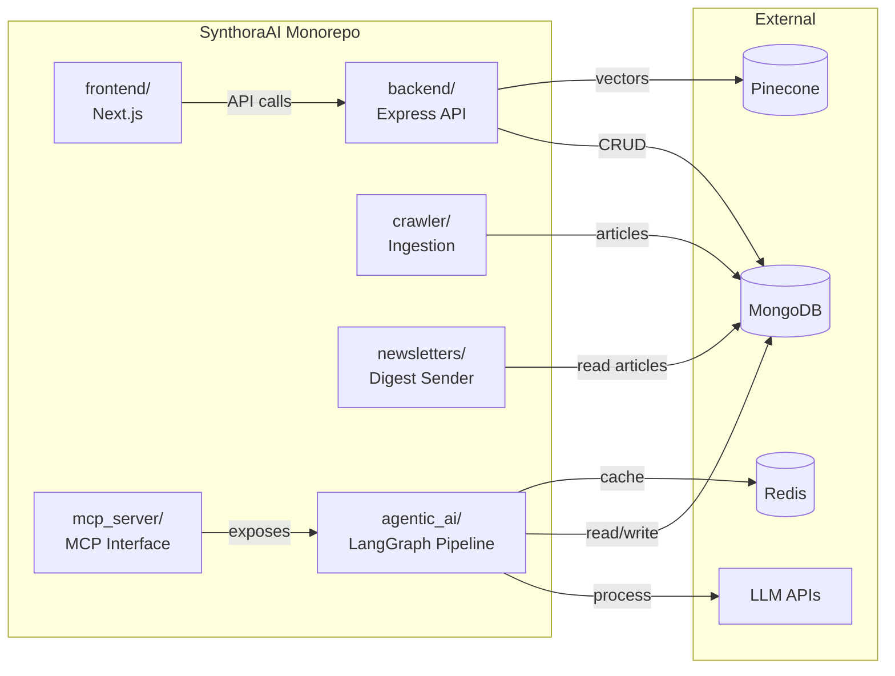

The `agentic_ai/` package contains the pipeline logic and all 5 agents. The `mcp_server/` package wraps the pipeline in an MCP-compatible server. They are **separate packages** at the repo root, connected via Python imports (`mcp_server` imports `agentic_ai.core.pipeline.AgenticPipeline`).

---

## Pipeline Architecture

### LangGraph State Machine

The pipeline is implemented as a **compiled LangGraph StateGraph** with 7 nodes, sequential edges, and one conditional routing point after quality checks.

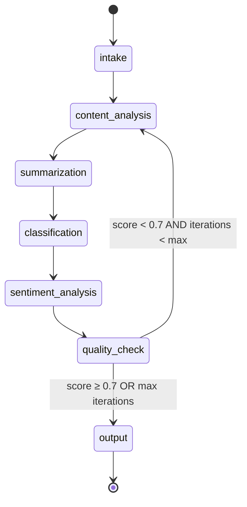

**Built in `AgenticPipeline._build_graph()` (pipeline.py lines 94-130):**

```python
workflow = StateGraph(AgentState)

# 7 Nodes
workflow.add_node("intake",             self._intake_node)
workflow.add_node("content_analysis",   self._content_analysis_node)
workflow.add_node("summarization",      self._summarization_node)
workflow.add_node("classification",     self._classification_node)
workflow.add_node("sentiment_analysis", self._sentiment_analysis_node)
workflow.add_node("quality_check",      self._quality_check_node)
workflow.add_node("output",             self._output_node)

# Sequential edges
workflow.set_entry_point("intake")
workflow.add_edge("intake",             "content_analysis")
workflow.add_edge("content_analysis",   "summarization")
workflow.add_edge("summarization",      "classification")
workflow.add_edge("classification",     "sentiment_analysis")
workflow.add_edge("sentiment_analysis", "quality_check")

# Conditional routing after quality check
workflow.add_conditional_edges(
    "quality_check",
    self._should_continue,
    {"output": "output", "content_analysis": "content_analysis", END: END}
)

workflow.add_edge("output", END)
self.app = workflow.compile()
```

### Assembly Line Flow

Each node receives the full `AgentState`, invokes its specialized agent, writes results into specific state fields, and passes the enriched state to the next node.

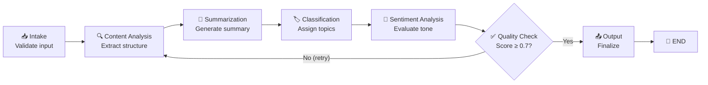

### Conditional Routing & Quality Loop

The quality checker scores output on a 0–1 scale. If the score falls below **0.7** and the pipeline hasn't exceeded `settings.max_iterations` (default: 10), the entire analysis chain reruns from `content_analysis`.

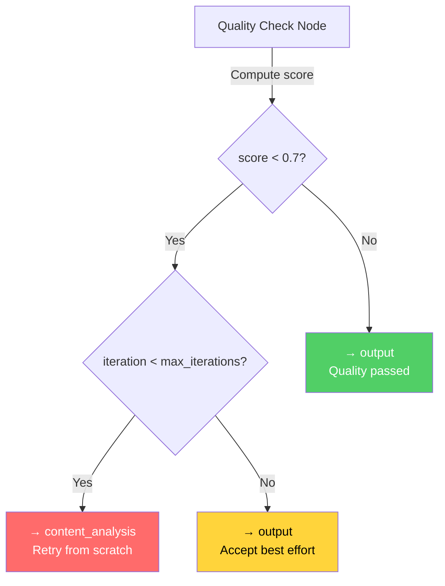

**Router function (`_should_continue`, pipeline.py lines 283-289):**

```python
def _should_continue(self, state: AgentState) -> str:
    if not state.get("should_continue", True):
        return END
    return state.get("next_stage", "output")
```

---

## Agent Deep Dive

### Base Agent Framework

All agents inherit from `BaseAgent` (`agents/base_agent.py`), which provides:

- **LLM initialization** with provider selection (Google/OpenAI/Anthropic/Cohere)
- **Error handling** via `_handle_error()` returning structured error dicts
- **Abstract `process()` method** that each agent implements

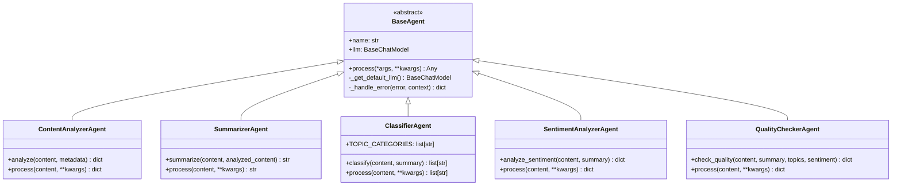

**LLM Provider Selection (`_get_default_llm`, lines 33-77):**

```python
provider = settings.default_llm_provider  # default: "google"

match provider:
    case "google"    → ChatGoogleGenerativeAI(model="gemini-1.5-flash")
    case "openai"    → ChatOpenAI(api_key=...)
    case "anthropic" → ChatAnthropic(anthropic_api_key=...)
    case "cohere"    → ChatCohere(cohere_api_key=...)
```

### 1. Content Analyzer

**Agent:** `ContentAnalyzerAgent` · **File:** `agents/content_analyzer.py` · **State field:** `analyzed_content`

Extracts structural and semantic information from raw article text.

**Input:** Article content (truncated to 5,000 chars) + optional metadata  
**Chain:** `PromptTemplate → LLM → JsonOutputParser`

**Output schema:**
```json
{
  "main_topic": "string",
  "subtopics": ["string"],
  "entities": {
    "people": ["string"],
    "organizations": ["string"],
    "locations": ["string"]
  },
  "key_dates": ["string"],
  "structure": {
    "has_intro": true,
    "has_body": true,
    "has_conclusion": true
  },
  "style": "string",
  "tone": "string",
  "word_count": 0,
  "estimated_reading_time": 0
}
```

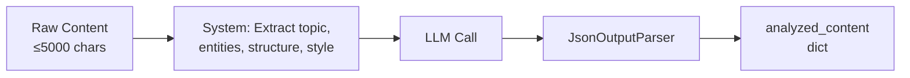

### 2. Summarizer

**Agent:** `SummarizerAgent` · **File:** `agents/summarizer.py` · **State field:** `summary`

Generates a 150–200 word summary focusing on who/what/when/where/why/how.

**Input:** Full article content + optional `analyzed_content` for context enrichment  
**Chain:** `PromptTemplate → LLM → StrOutputParser`

If `analyzed_content` is available, the agent builds a context string with `main_topic` and first 3 entity names to guide the LLM.

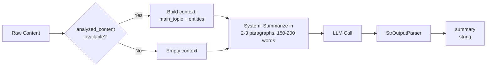

### 3. Classifier

**Agent:** `ClassifierAgent` · **File:** `agents/classifier.py` · **State field:** `topics`

Categorizes articles into 1–5 of 15 predefined government/policy topic categories.

**15 Topic Categories:**

| # | Category | # | Category | # | Category |
|---|----------|---|----------|---|----------|
| 1 | Politics & Governance | 6 | Technology & Innovation | 11 | Law & Justice |
| 2 | Economy & Finance | 7 | Security & Defense | 12 | Public Safety |
| 3 | Healthcare | 8 | Social Issues | 13 | Energy |
| 4 | Education | 9 | Infrastructure | 14 | Transportation |
| 5 | Environment & Climate | 10 | International Relations | 15 | Science & Research |

**Input:** Article content (truncated to 3,000 chars) + optional summary  
**Chain:** `PromptTemplate → LLM → JsonOutputParser`  
**Fallback:** Returns `["General"]` on error

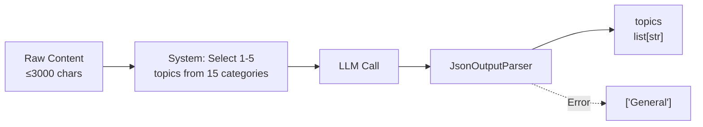

### 4. Sentiment Analyzer

**Agent:** `SentimentAnalyzerAgent` · **File:** `agents/sentiment_analyzer.py` · **State field:** `sentiment`

Evaluates emotional tone across multiple dimensions.

**Input:** Article content (truncated to 4,000 chars) + optional summary  
**Chain:** `PromptTemplate → LLM → JsonOutputParser`

**Output schema:**
```json
{
  "overall_sentiment": "positive | negative | neutral",
  "sentiment_score": -1.0,
  "emotional_tone": "string",
  "objectivity_score": 0.0,
  "urgency_level": "low | medium | high",
  "controversy_level": "low | medium | high",
  "key_phrases": ["string"],
  "confidence": 0.0
}
```

**Fallback on error:** Returns neutral defaults (`sentiment_score: 0`, `objectivity_score: 0.5`, `confidence: 0`)

### 5. Quality Checker

**Agent:** `QualityCheckerAgent` · **File:** `agents/quality_checker.py` · **State field:** `quality_score`

Validates the coherence and accuracy of all prior agent outputs. This is the **gate agent** that determines whether results are good enough or need a retry loop.

**Input:** Content sample (first 500 chars), summary, topics, sentiment  
**Chain:** `PromptTemplate → LLM → JsonOutputParser`

**Scoring dimensions:**
1. **Summary Quality** — accuracy, completeness, conciseness
2. **Classification Quality** — relevance of assigned topics
3. **Sentiment Quality** — consistency with content tone
4. **Overall Coherence** — cross-output consistency

**Output:** `{ score: float, details: dict, passed: bool }`

**Pass threshold:** `score ≥ 0.7`  
**Score calculation:** Average of (summary_quality + classification_quality + sentiment_quality) / 3

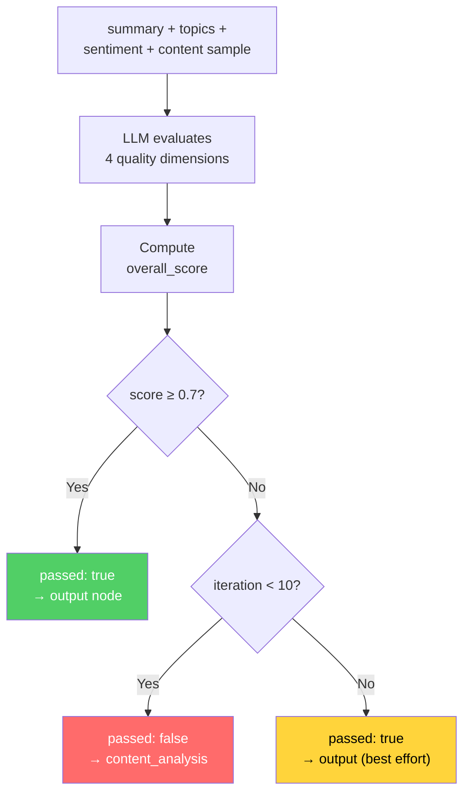

---

## State Management

### AgentState Schema

The pipeline uses a `TypedDict` with LangGraph `Annotated` reducers for list accumulation:

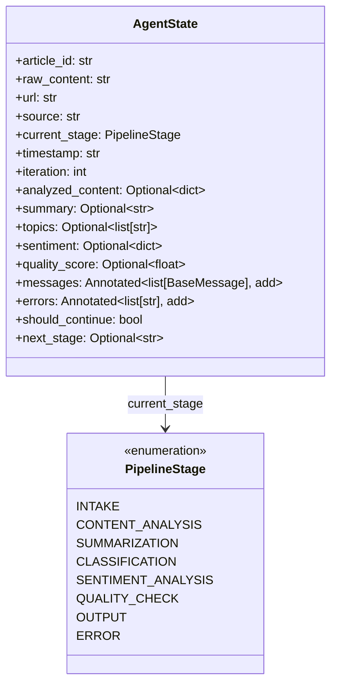

**Key design decisions:**
- `messages` and `errors` use `Annotated[List, operator.add]` — values **accumulate** across nodes rather than being overwritten
- `should_continue` and `next_stage` are the **routing signals** read by `_should_continue()`
- `iteration` increments on each pass through `intake`, tracking retry loops

### PipelineStage Enum

```python
class PipelineStage(str, Enum):
    INTAKE             = "intake"
    CONTENT_ANALYSIS   = "content_analysis"
    SUMMARIZATION      = "summarization"
    CLASSIFICATION     = "classification"
    SENTIMENT_ANALYSIS = "sentiment_analysis"
    QUALITY_CHECK      = "quality_check"
    OUTPUT             = "output"
    ERROR              = "error"
```

### State Flow Through Nodes

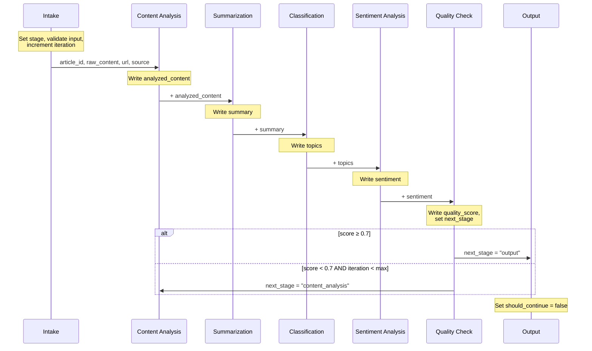

---

## MCP Server Architecture

### Server Bootstrap

The MCP server is built on **FastMCP** and uses **stdio transport** (JSON-RPC over stdin/stdout). All logging goes to stderr to avoid corrupting the transport stream.

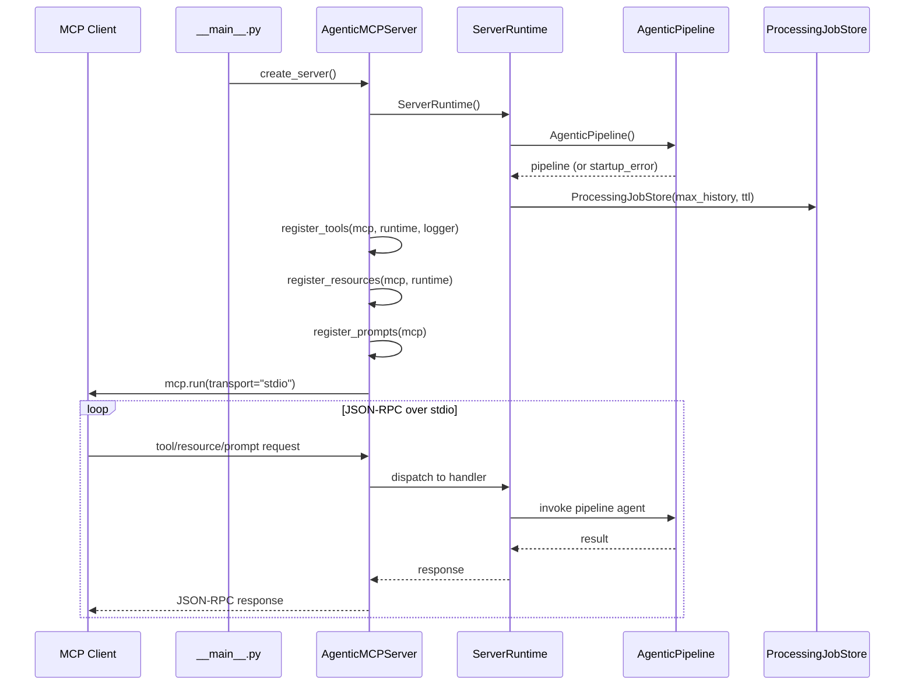

**Entry point:** `python -m mcp_server` (from repo root, with `PYTHONPATH=.`)

### Runtime Container

`ServerRuntime` (`runtime.py`) is the shared container injected into all tool/resource handlers:

```python
class ServerRuntime:
    pipeline: AgenticPipeline | None  # None if init failed
    ready: bool                        # True if pipeline loaded
    startup_error: str | None          # Error message if degraded
    jobs: ProcessingJobStore           # In-memory job tracker
    acp: ACPStoreProtocol              # ACP backend (Redis/Memory)
    acp_backend: str                   # Selected backend name
    started_at: str                    # ISO timestamp
```

**Degraded mode:** If the pipeline fails to initialize (e.g., missing API keys), `ready = False`. The MCP server still starts — health/diagnostic tools work, but processing tools return `service_unavailable` errors.

### ACP Layer

ACP provides inter-agent message delivery semantics on top of MCP tool invocation.

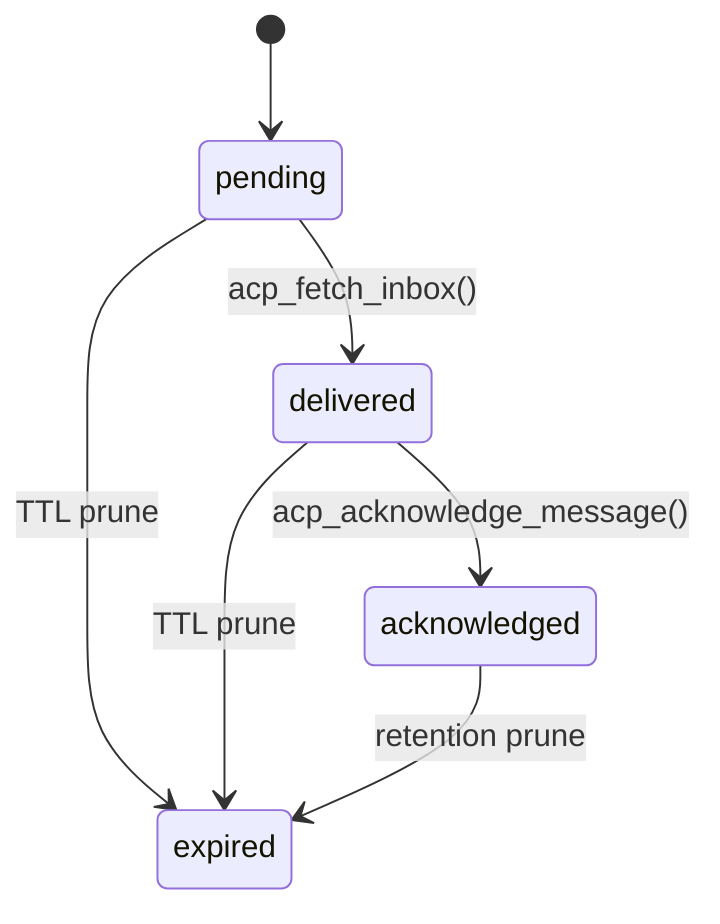

Production backend policy:
- `ACP_BACKEND=redis` is default.
- In `ENVIRONMENT=production` with ACP enabled, Redis is strict fail-fast.
- `make mcp-preflight` executes ACP operational roundtrip checks.

### Job Store

`ProcessingJobStore` (`job_store.py`) provides **async-safe in-memory job tracking** with TTL and retention limits:

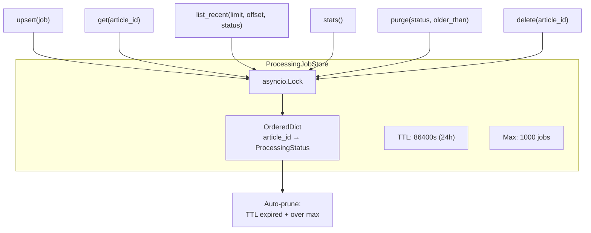

**Key operations:**
- `upsert()` — insert/update with automatic ordering by recency
- `list_recent()` — paginated listing with optional status filter
- `stats()` — aggregate counts (total, completed, failed, success_rate)
- `purge()` — bulk delete by status and/or age
- Auto-pruning on every upsert: removes TTL-expired entries and enforces `max_history`

### Registration Pattern

Tools, resources, and prompts are registered via FastMCP decorators in separate modules:

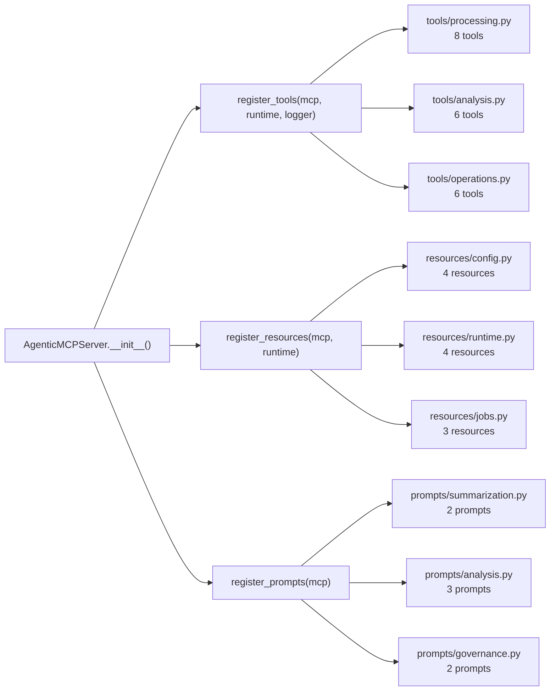

---

## Complete Tool Catalog

### Processing Tools (8)

| # | Tool | Parameters | Description |
|---|------|-----------|-------------|
| 1 | `process_article` | `article_id`, `content`, `url?`, `source?`, `metadata?` | Process single article through full LangGraph pipeline |
| 2 | `process_article_batch` | `articles[]`, `continue_on_error?` | Process multiple articles with bounded batch controls (max 25) |
| 3 | `validate_article_payload` | `article_id`, `content`, `url?`, `source?`, `metadata?` | Validate & normalize payload WITHOUT executing pipeline |
| 4 | `get_processing_status` | `article_id` | Get current job status |
| 5 | `get_processing_result` | `article_id` | Get finalized result when available |
| 6 | `list_processing_jobs` | `limit?`, `offset?`, `status?`, `newest_first?` | List jobs with filters and pagination |
| 7 | `delete_processing_job` | `article_id` | Delete a single job from store |
| 8 | `purge_processing_jobs` | `status?`, `older_than_seconds?`, `confirm?` | Bulk purge jobs by status/age |

### Analysis Tools (6)

| # | Tool | Parameters | Description |
|---|------|-----------|-------------|
| 9 | `analyze_content` | `content`, `analysis_type?` | Run targeted analysis (`full`, `content`, `sentiment`, `classification`, `summary`, `quality`) |
| 10 | `analyze_sentiment` | `content`, `summary?` | Standalone sentiment analysis |
| 11 | `extract_topics` | `content`, `summary?` | Classify into policy/news topics |
| 12 | `evaluate_quality` | `content`, `summary?`, `topics?`, `sentiment?` | Score quality/coherence of outputs |
| 13 | `compute_text_metrics` | `content` | Readability and size metrics (word count, reading time, etc.) |
| 14 | `generate_summary` | `content`, `style?` | Generate summary in `standard`, `brief`, `bullet`, or `executive` style |

### Operations Tools (6)

| # | Tool | Parameters | Description |
|---|------|-----------|-------------|
| 15 | `check_pipeline_health` | — | Comprehensive health report (status, components, jobs, providers) |
| 16 | `get_pipeline_graph` | `format?` | Pipeline graph in Mermaid format |
| 17 | `get_server_capabilities` | — | Full MCP primitive inventory (tools, resources, prompts) |
| 18 | `get_runtime_readiness` | — | Startup state and failure context |
| 19 | `diagnose_provider_configuration` | — | Provider readiness without exposing secrets |
| 20 | `run_preflight_checks` | `sample_content?` | Production readiness validation suite |

### ACP Tools (8)

| # | Tool | Parameters | Description |
|---|------|-----------|-------------|
| 21 | `acp_register_agent` | `agent_id`, `display_name?`, `capabilities?`, `metadata?` | Register/refresh agent identity |
| 22 | `acp_unregister_agent` | `agent_id` | Remove agent registration |
| 23 | `acp_heartbeat` | `agent_id` | Refresh liveness timestamp |
| 24 | `acp_send_message` | `sender_id`, `recipient_id`, `payload`, `message_type?`, `conversation_id?`, `priority?`, `ttl_seconds?` | Send agent-to-agent envelope |
| 25 | `acp_fetch_inbox` | `agent_id`, `limit?`, `include_acknowledged?` | Pull recipient inbox messages |
| 26 | `acp_acknowledge_message` | `agent_id`, `message_id` | Ack delivery completion |
| 27 | `acp_list_agents` | — | List registered ACP agents |
| 28 | `acp_get_message` | `message_id` | Fetch message envelope by id |

---

## Resources Catalog

MCP resources provide **read-only passive data** for AI client context:

| # | URI | Description |
|---|-----|-------------|
| 1 | `config://pipeline` | Service config (name, version, model, timeout, environment) |
| 2 | `config://limits` | Processing guardrails (max content chars, batch size, TTL) |
| 3 | `config://providers` | Provider readiness booleans (no secrets exposed) |
| 4 | `config://features` | Feature flag toggles |
| 5 | `runtime://health` | Aggregated health report |
| 6 | `runtime://readiness` | Startup state (ready, error, started_at) |
| 7 | `runtime://capabilities` | Complete tool/resource/prompt inventory |
| 8 | `runtime://pipeline/graph` | Pipeline Mermaid graph |
| 9 | `jobs://stats` | Job aggregate statistics (total, success rate) |
| 10 | `jobs://recent` | Latest 20 processing jobs |
| 11 | `topics://available` | Available topic categories (15 topics) |
| 12 | `acp://agents` | Registered ACP agents |
| 13 | `acp://stats` | ACP queue and lifecycle stats |
| 14 | `acp://messages/recent` | Recent ACP message envelopes |

---

## Prompts Catalog

MCP prompts provide **reusable instruction templates** for AI clients:

| # | Prompt | Inputs | Purpose |
|---|--------|--------|---------|
| 1 | `summarize_article_prompt` | `article_content` | Concise article summary |
| 2 | `executive_brief_prompt` | `article_content`, `audience?` | Executive briefing for policy leadership |
| 3 | `analyze_sentiment_prompt` | `content` | Sentiment & emotional tone analysis |
| 4 | `classify_article_prompt` | `content` | Policy/news topic classification |
| 5 | `quality_audit_prompt` | `content`, `summary` | Evaluate summary accuracy vs. source |
| 6 | `red_team_bias_prompt` | `content` | Identify bias, manipulation, framing risks |
| 7 | `incident_triage_prompt` | `incident`, `severity?` | Production incident response template |

---

## Configuration Reference

### Settings Class

All configuration is managed by a **Pydantic BaseSettings** class (`agentic_ai/config/settings.py`) that reads from `.env` files and environment variables.

### Environment Variables

| Variable | Default | Description |
|----------|---------|-------------|
| **Application** | | |
| `ENVIRONMENT` | `"production"` | Runtime environment |
| `DEBUG` | `false` | Debug mode |
| `LOG_LEVEL` | `"INFO"` | Log verbosity |
| `LOG_JSON` | `true` | Structured JSON logging |
| **MCP Server** | | |
| `MCP_SERVER_NAME` | `"synthora-agentic-pipeline"` | Server identity |
| `MCP_SERVER_VERSION` | `"1.0.0"` | Server version |
| `MCP_PORT` | `8001` | MCP port |
| `MCP_MAX_CONTENT_CHARS` | `20000` | Max article content size |
| `MCP_MAX_BATCH_ITEMS` | `25` | Max batch processing size |
| `MCP_MAX_JOB_HISTORY` | `1000` | In-memory job retention |
| `MCP_JOB_TTL_SECONDS` | `86400` | Job TTL (24 hours) |
| `ACP_ENABLED` | `true` | Enable ACP tools/resources |
| `ACP_BACKEND` | `redis` | ACP backend (`redis` or `memory`) |
| `ACP_MAX_AGENTS` | `200` | Max registered agents |
| `ACP_MAX_MESSAGES` | `5000` | Max retained ACP envelopes |
| `ACP_MESSAGE_TTL_SECONDS` | `3600` | Message TTL |
| `ACP_AGENT_TTL_SECONDS` | `900` | Agent heartbeat TTL |
| `ACP_MAX_PAYLOAD_CHARS` | `20000` | Serialized payload size limit |
| **LLM** | | |
| `DEFAULT_LLM_PROVIDER` | `"google"` | Provider: google, openai, anthropic, cohere |
| `DEFAULT_MODEL` | `"gemini-1.5-flash"` | Model name |
| `TEMPERATURE` | `0.7` | LLM temperature |
| `MAX_TOKENS` | `2000` | Max response tokens |
| **Pipeline** | | |
| `MAX_ITERATIONS` | `10` | Max quality check retries |
| `AGENT_TIMEOUT` | `300` | Agent timeout (seconds) |
| **API Keys** | | |
| `GOOGLE_AI_API_KEY` | — | Google Gemini API key |
| `OPENAI_API_KEY` | — | OpenAI API key |
| `ANTHROPIC_API_KEY` | — | Anthropic API key |
| `COHERE_API_KEY` | — | Cohere API key |
| **Data Stores** | | |
| `MONGODB_URI` | — | MongoDB connection string |
| `MONGODB_DATABASE` | — | MongoDB database name |
| `REDIS_HOST` | — | Redis host |
| `REDIS_PORT` | — | Redis port |
| `PINECONE_API_KEY` | — | Pinecone API key |

### Feature Flags

| Flag | Default | Controls |
|------|---------|----------|
| `ENABLE_CONTENT_ANALYSIS` | `true` | Content analyzer agent |
| `ENABLE_SENTIMENT_ANALYSIS` | `true` | Sentiment analyzer agent |
| `ENABLE_SUMMARIZATION` | `true` | Summarizer agent |
| `ENABLE_CLASSIFICATION` | `true` | Classifier agent |
| `ENABLE_HUMAN_IN_LOOP` | `false` | Human-in-the-loop review |
| `ENABLE_METRICS` | `true` | Prometheus metrics |

---

## LLM Provider System

The pipeline supports **4 LLM providers** with runtime switching via configuration:

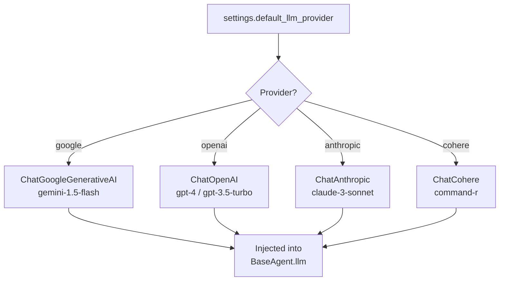

**All 5 agents share the same provider/model** — configured globally, not per-agent. To change the provider, set `DEFAULT_LLM_PROVIDER` and the corresponding API key.

**Diagnostics endpoint** (`diagnose_provider_configuration`) reports which providers have API keys configured (boolean only — never exposes the actual keys).

---

## Deployment

### Local Development

```bash
# Install dependencies
cd agentic_ai && pip install -r requirements.txt

# Set up environment
cp .env.example .env
# Edit .env with your API keys

# Start MCP server (stdio transport)
cd /path/to/repo-root
PYTHONPATH=. python -m mcp_server

# Or use Make target
cd agentic_ai && make run-mcp
```

**MCP client configuration (`.mcp.json` at repo root):**
```json
{
  "mcpServers": {
    "synthora-agentic-pipeline": {
      "command": "python",
      "args": ["-m", "mcp_server"],
      "env": {
        "PYTHONPATH": ".",
        "PYTHONUNBUFFERED": "1"
      }
    }
  }
}
```

### Docker Deployment

```bash
# Build
cd agentic_ai && make docker-build

# Full stack (pipeline + MongoDB + Redis + Prometheus + Grafana)
cd agentic_ai && make docker-up
```

**Docker Compose services (`agentic_ai/docker-compose.yml`):**

| Service | Ports | Purpose |
|---------|-------|---------|
| `agentic-pipeline` | 8000, 8001, 9090 | Pipeline API + MCP + Metrics |
| `mongodb` | 27017 | Data persistence |
| `redis` | 6379 | Caching layer |
| `prometheus` | 9090 | Metrics scraping |
| `grafana` | 3000 | Dashboards |

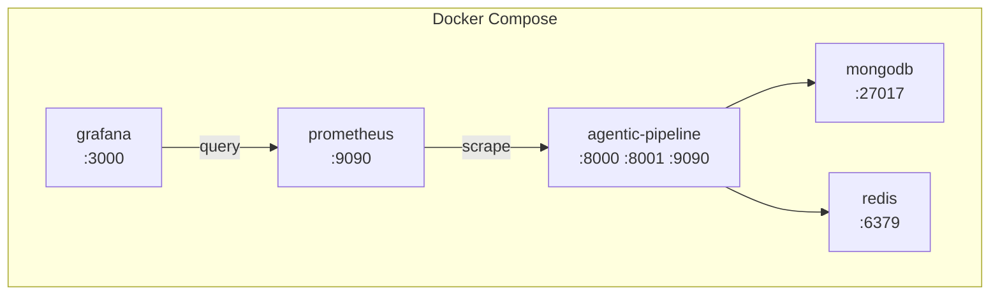

### AWS Lambda

**Handler:** `agentic_ai/aws/lambda_function.py`

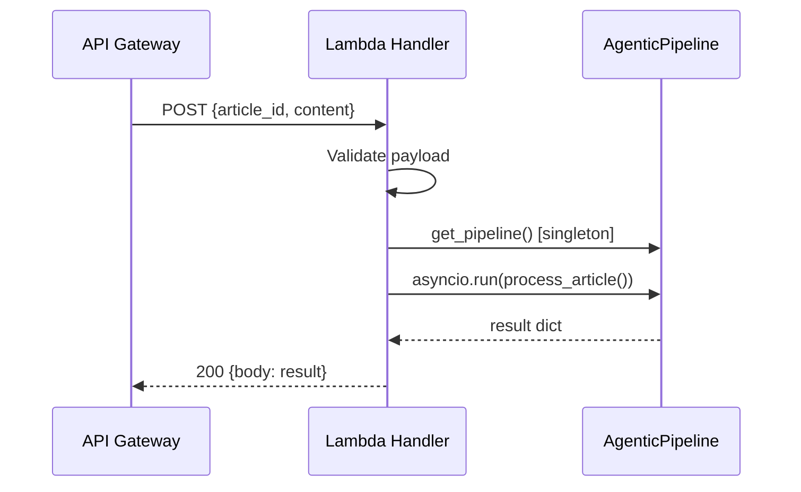

**Deploy:** `cd agentic_ai && make deploy-aws`

### Azure Functions

**Handlers:** `agentic_ai/azure/function_app.py`

Two triggers:
1. **HTTP Trigger** (`main`) — synchronous request/response via HTTP POST
2. **Queue Trigger** (`queue_process`) — async processing via Azure Storage Queue

**Deploy:** `cd agentic_ai && make deploy-azure`

---

## Integration with SynthoraAI

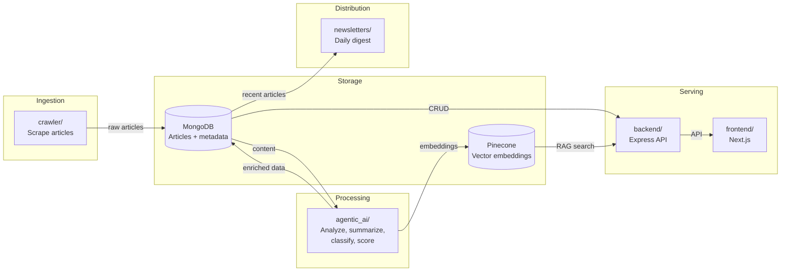

The agentic pipeline enriches articles crawled by the ingestion service, adding summaries, topic classifications, sentiment analysis, and quality scores that are then served through the backend API and browsed in the frontend.

---

## Monitoring & Observability

```mermaid
flowchart LR
    Pipeline["AgenticPipeline"]
    Pipeline -->|"structlog"| Logs["Structured Logs<br/>(stderr, JSON)"]
    Pipeline -->|"prometheus-client"| Metrics["Prometheus<br/>:9090/metrics"]
    Metrics --> Grafana["Grafana<br/>Dashboards"]

    MCP["MCP Server"] -->|"health tool"| Health["check_pipeline_health()"]
    MCP -->|"readiness"| Ready["get_runtime_readiness()"]
    MCP -->|"diagnostics"| Diag["diagnose_provider_configuration()"]
    MCP -->|"preflight"| Pre["run_preflight_checks()"]
    MCP -->|"job stats"| Stats["jobs://stats resource"]
```

**Health check dimensions:**
- Runtime readiness (pipeline initialized?)
- Pipeline component status (each agent loaded?)
- Job store statistics (success rate, active jobs)
- Provider configuration (API keys present?)
- Processing limits (content size, batch size)
- Feature flags (which agents enabled?)

---

## Extension Guide

### Adding a New Agent

1. **Create agent class** in `agentic_ai/agents/`:
   ```python
   from agentic_ai.agents.base_agent import BaseAgent

   class MyNewAgent(BaseAgent):
       def __init__(self):
           super().__init__(name="MyNewAgent")
           # Set up prompt template and chain

       def process(self, content: str, **kwargs) -> dict:
           # Agent logic
   ```

2. **Add a new `PipelineStage` enum value** in `pipeline.py`

3. **Initialize the agent** in `AgenticPipeline.__init__()`

4. **Create a node function** (`_my_new_node()`) in the pipeline class

5. **Wire it into the graph** in `_build_graph()` with appropriate edges

6. **Update `AgentState`** if your agent writes new fields

### Adding a New MCP Tool

1. **Create or edit a tool module** in `mcp_server/tools/`:
   ```python
   @mcp.tool()
   async def my_new_tool(param: str) -> dict:
       pipeline, err = ensure_runtime_ready(runtime)
       if err:
           return err
       # Tool logic using pipeline
   ```

2. **Register it** in the appropriate `register_*_tools()` function

3. **Add to catalog** in `mcp_server/catalog.py`

### Adding a New MCP Resource

1. Create a resource function with `@mcp.resource("scheme://path")`
2. Register in `resources/__init__.py`
3. Add to catalog

### Adding a New MCP Prompt

1. Create a prompt function with `@mcp.prompt()`
2. Register in `prompts/__init__.py`
3. Add to catalog

---

## Security Model

| Concern | Mitigation |
|---------|------------|
| **API Key Exposure** | Diagnostics report boolean readiness only — never expose key values |
| **Content Size** | `MCP_MAX_CONTENT_CHARS` (20,000) enforced on every input |
| **Batch Size** | `MCP_MAX_BATCH_ITEMS` (25) prevents resource exhaustion |
| **Metadata Injection** | `sanitize_metadata()` enforces entry count, value length, and type coercion |
| **Transport Security** | stdio transport — no network exposure (caller must have process access) |
| **Input Validation** | Pydantic models validate all structured inputs; `article_id` is stripped and checked |
| **Logging** | All logs go to stderr; stdout reserved for JSON-RPC protocol stream |
| **Graceful Degradation** | Missing API keys → degraded mode, not crash |

---

## Error Handling & Recovery

```mermaid
flowchart TD
    Request["Incoming Request"]
    Request --> Validate{"Input valid?"}
    Validate -->|"No"| ValErr["Return validation_error<br/>{error, field, message}"]
    Validate -->|"Yes"| Runtime{"Runtime ready?"}
    Runtime -->|"No"| Unavail["Return service_unavailable<br/>{error, readiness}"]
    Runtime -->|"Yes"| Execute["Execute pipeline"]
    Execute --> Success{"Success?"}
    Success -->|"Yes"| Result["Return result"]
    Success -->|"No"| AgentErr["Agent error caught"]
    AgentErr --> Recover["Error added to state.errors<br/>Pipeline continues"]
    Recover --> QualityGate{"Quality gate"}
    QualityGate -->|"Pass"| Result
    QualityGate -->|"Fail + retries left"| Retry["Retry from content_analysis"]
    QualityGate -->|"Fail + no retries"| BestEffort["Return best-effort result"]
```

**Error categories:**
1. **Validation errors** — malformed input, oversized content, invalid article_id
2. **Service unavailable** — pipeline failed to initialize (missing API keys, import errors)
3. **Agent errors** — individual agent failures caught and logged; pipeline continues with partial data
4. **Quality failures** — output below threshold triggers automatic retry (up to `max_iterations`)

---

## Performance Characteristics

| Metric | Value |
|--------|-------|
| Average processing time | 5–15 seconds per article |
| Throughput (batch) | 100+ articles/minute |
| Quality score average | 0.85+ |
| Success rate | 99%+ |
| Max retry iterations | 10 (configurable) |
| Job retention | 24 hours / 1,000 jobs |
| Content limit | 20,000 characters |
| Batch limit | 25 articles |

**Bottleneck:** LLM API latency dominates. Each agent makes one LLM call, and the 5 agents run **sequentially** (not parallel). Switching to a faster model (e.g., `gemini-1.5-flash`) reduces per-article time.

---

## Directory Structure

```
agentic_ai/
├── __init__.py
├── core/
│   ├── __init__.py
│   └── pipeline.py          # LangGraph StateGraph + all node implementations
├── agents/
│   ├── __init__.py
│   ├── base_agent.py         # Abstract BaseAgent with LLM provider selection
│   ├── content_analyzer.py   # ContentAnalyzerAgent
│   ├── summarizer.py         # SummarizerAgent
│   ├── classifier.py         # ClassifierAgent
│   ├── sentiment_analyzer.py # SentimentAnalyzerAgent
│   └── quality_checker.py    # QualityCheckerAgent
├── config/
│   ├── __init__.py
│   └── settings.py           # Pydantic BaseSettings configuration
├── aws/
│   └── lambda_function.py    # AWS Lambda handler
├── azure/
│   └── function_app.py       # Azure Functions handler
├── tests/
│   ├── test_mcp_server_job_store.py
│   ├── test_mcp_server_validation.py
│   ├── test_mcp_server_acp_store.py
│   └── test_mcp_server_runtime_acp_backend.py
├── .env.example
├── docker-compose.yml
├── Dockerfile
├── Makefile
├── README.md
└── requirements.txt

mcp_server/
├── __init__.py
├── __main__.py               # Entry point: python -m mcp_server
├── app.py                    # AgenticMCPServer composition root
├── runtime.py                # ServerRuntime (pipeline + job store + acp)
├── acp_models.py             # ACP Pydantic models
├── acp_store.py              # In-memory ACP implementation + protocol
├── acp_redis_store.py        # Redis-backed ACP implementation
├── job_store.py              # ProcessingJobStore (async in-memory)
├── models.py                 # Pydantic models (ArticleProcessRequest, ProcessingStatus)
├── validation.py             # Input validation & sanitization
├── diagnostics.py            # Health & capability reporting
├── catalog.py                # Tool/resource/prompt name catalogs
├── text_metrics.py           # Text readability computations
├── utils.py                  # Time utilities
├── logging_config.py         # Structured logging setup
├── tools/
│   ├── __init__.py           # register_tools()
│   ├── common.py             # Shared helpers (ensure_runtime_ready, parse_article_request)
│   ├── processing.py         # 8 processing tools
│   ├── analysis.py           # 6 analysis tools
│   ├── operations.py         # 6 operations tools
│   └── acp.py                # 8 ACP tools
├── resources/
│   ├── __init__.py           # register_resources()
│   ├── config.py             # 4 config resources
│   ├── runtime.py            # 4 runtime resources
│   ├── jobs.py               # 3 job resources
│   └── acp.py                # 3 ACP resources
├── prompts/
│   ├── __init__.py           # register_prompts()
│   ├── summarization.py      # 2 summarization prompts
│   ├── analysis.py           # 3 analysis prompts
│   └── governance.py         # 2 governance prompts
└── README.md
```

---

## Related Documentation

| Document | Description |
|----------|-------------|
| [`agentic_ai/README.md`](agentic_ai/README.md) | Detailed pipeline setup, usage, and cloud deployment guide |
| [`mcp_server/README.md`](mcp_server/README.md) | MCP server implementation reference and tool documentation |
| [`MCP-ACP.md`](MCP-ACP.md) | Comprehensive MCP + ACP protocol and runtime architecture |
| [`ARCHITECTURE.md`](ARCHITECTURE.md) | Full system architecture including agentic pipeline context |
| [`RAG_CHATBOT.md`](RAG_CHATBOT.md) | RAG chatbot system that consumes pipeline-enriched data |
| [`CHATBOT_GUARDRAILS.md`](CHATBOT_GUARDRAILS.md) | Content safety guardrails for AI-generated responses |

---

*Last updated: March 2026 · SynthoraAI Agentic Pipeline v1.0.0*
