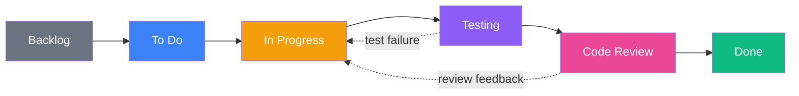
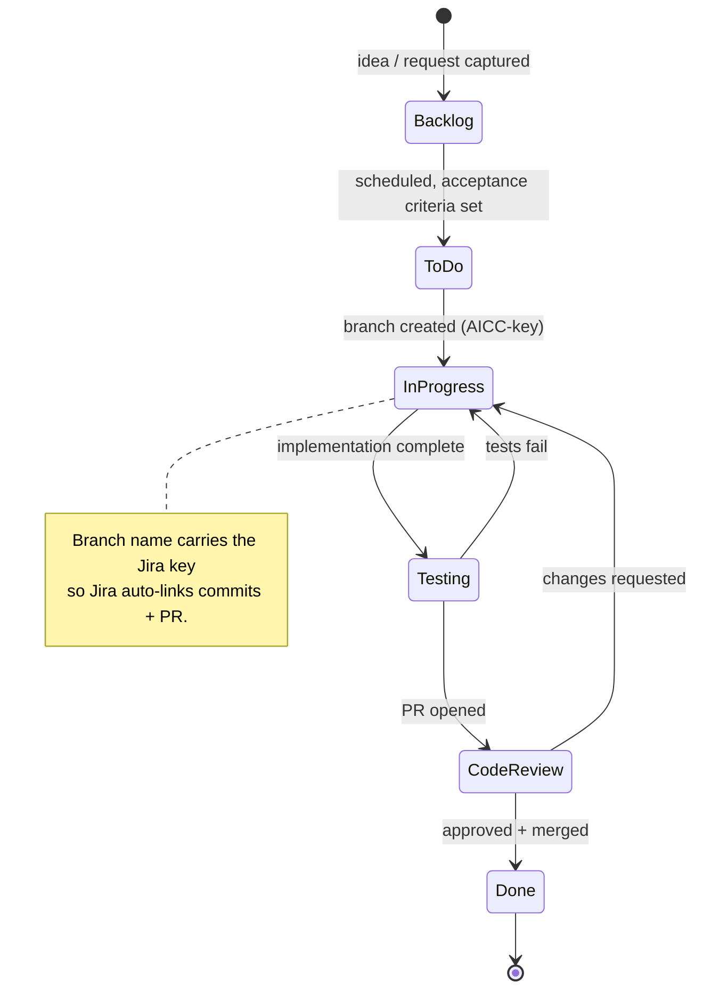
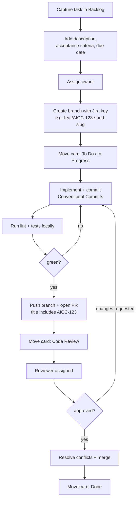
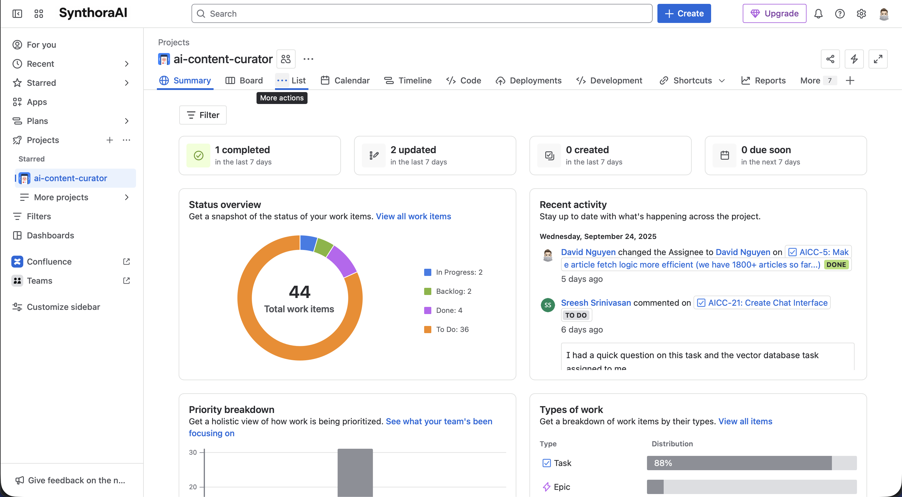
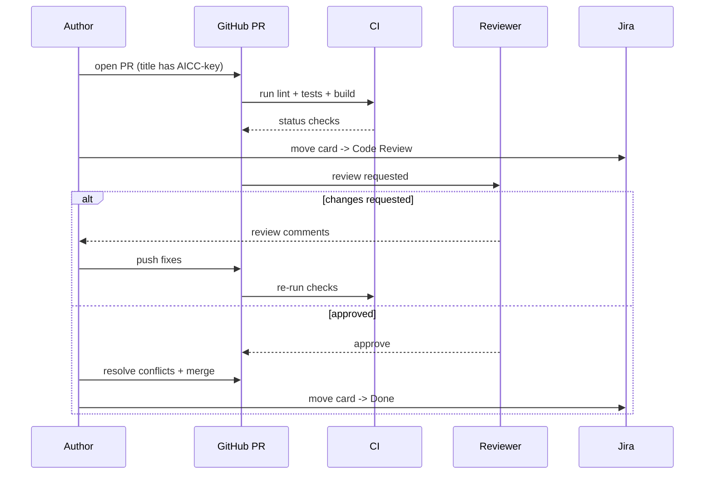
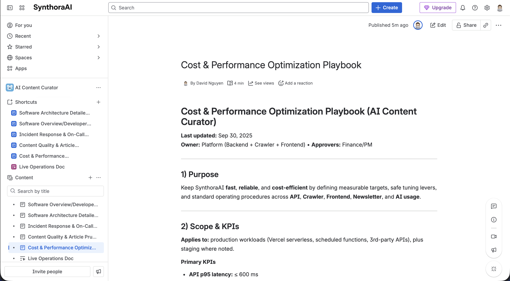

# Collaboration & Agile Workflow with Jira

The authoritative process reference for contributing to AI Content
Curator (SynthoraAI). It covers how work is planned, tracked, branched,
reviewed, and shipped. For local setup and code-style mechanics, see
[`.github/CONTRIBUTING.md`](.github/CONTRIBUTING.md).

> [!TIP]
> Read this document in full before opening your first task or branch.
> The mechanics here are not optional — they are what keeps Jira, GitHub,
> and the team in sync.

## Table of Contents

- [Introduction](#introduction)
- [Agile Approach](#agile-approach)
- [Why Jira?](#why-jira)
- [Kanban Board](#kanban-board)
- [Project Board Access](#project-board-access)
- [Task Lifecycle](#task-lifecycle)
- [End-to-End Workflow](#end-to-end-workflow)
- [Branch & PR Conventions](#branch--pr-conventions)
- [Code Review Loop](#code-review-loop)
- [Definition of Done](#definition-of-done)
- [Confluence](#confluence)

## Introduction

This project uses **Jira** for task management and collaboration. The
Kanban board is organized into six columns:

| Column | Meaning |
|--------|---------|
| **Backlog** | Captured but not yet scheduled |
| **To Do** | Scheduled, ready to start |
| **In Progress** | Actively being worked |
| **Testing** | Implementation done; under test/verification |
| **Code Review** | PR open, awaiting review |
| **Done** | Merged and verified |

Each task is assigned to a specific team member and carries a
description, acceptance criteria, and a due date.

## Agile Approach

We follow an **Agile** approach — iterative progress, collaboration, and
flexibility — so we can adapt to change quickly and deliver value
steadily.

We use **Kanban** specifically because it lets us visualize the workflow,
limit work in progress (WIP), and deliver incrementally. The board gives
a clear, real-time view of project status and surfaces bottlenecks
early.

## Why Jira?

Jira manages tasks, tracks progress, and facilitates collaboration —
creation, assignment, prioritization, and real-time status. It also
provides sprint planning, backlog management, and reporting, and models
work as user stories, epics, and tasks across the development cycle.

## Kanban Board

Work flows left to right. A card may move back (e.g. Code Review →
In Progress on review feedback) but should never skip the review or
testing gates.

## Project Board Access

**View the board at [ai-content-curator.atlassian.net](https://ai-content-curator.atlassian.net/jira/software/projects/AICC/boards/3?atlOrigin=eyJpIjoiZDM2MDQ4MWUwYTVkNGNhNzkzZmI5YjE2NGZmZjc2ZDAiLCJwIjoiaiJ9).**

> [!IMPORTANT]
> Login is required. Create an account if you don't have one.

For board access, contact the maintainer at
[sonnguyenhoang.com](https://sonnguyenhoang.com) or
[hoangson091104@gmail.com](mailto:hoangson091104@gmail.com) for an
invitation. Board visibility helps you understand progress, dependencies,
and the overall workflow — and lets you contribute more effectively.

## Task Lifecycle

Every unit of work is a Jira issue that moves through a defined state
machine. The issue key (e.g. `AICC-123`) ties together the Jira card,
the Git branch, and the GitHub PR.

## End-to-End Workflow

As soon as you receive a task (verbally or in writing) or have an idea:

The numbered steps:

1. Create a new task in the **Backlog** column of the Jira board.
2. Add a detailed description, including acceptance criteria and due date.
3. Assign the task to yourself or another team member.
4. Create a Git branch using the Jira issue key in the name (e.g.
   `feat/AICC-123-add-search`).
   - Move the Jira task to **To Do** / **In Progress**.
   - The key in the branch name is what lets Jira link the branch, its
     commits, and the PR to the card — do not skip it.
5. Work locally, committing to the branch as you go.
6. When complete, push the branch and open a pull request on GitHub.
   - Title the PR descriptively, including the Jira key (e.g.
     `feat(ui): implement new feature [AICC-123]`).
   - Run all applicable tests, formatting, and linting before committing.
   - **Note**: If your changes do not involve AI functionality (e.g.
     chatbot, crawler), set `GOOGLE_AI_API_KEY=dummy` in `backend/.env`
     to bypass the git hooks that check for AI-related env vars. This
     lets you commit/push without the real keys while keeping the
     workflow's integrity.
7. Assign the PR to the appropriate reviewer; move the card to
   **Code Review**.
8. Apply any changes requested in review.
9. Once approved, resolve conflicts and merge to the main branch.
10. After merging, move the Jira task to **Done**.

  

## Branch & PR Conventions

Branch names start with a Conventional-Commit-style type, then the Jira
key, then a short kebab-case slug:

| Type | Use for | Example |
|------|---------|---------|
| `feat/` | New feature | `feat/AICC-123-passkey-login` |
| `fix/` | Bug fix | `fix/AICC-145-chat-overflow` |
| `docs/` | Documentation only | `docs/AICC-160-update-readme` |
| `refactor/` | Non-behavioral change | `refactor/AICC-170-extract-client` |
| `chore/` | Tooling / deps / CI | `chore/AICC-181-bump-deps` |
| `test/` | Tests only | `test/AICC-190-orchestration-cov` |

PR rules:

- The PR **title must contain the Jira key** in brackets, e.g.
  `feat(api): add rating endpoint [AICC-123]`.
- Open PRs against the integration branch (`develop`) unless told
  otherwise; fill out the PR template.
- CI (lint, tests, build) must pass before review is requested.
- Keep PRs focused — one Jira issue per PR where practical.

## Code Review Loop

Reviewers: be specific and constructive; reference lines. Authors:
respond to every comment, and re-request review after pushing fixes.

## Definition of Done

A task is **Done** only when all of the following hold:

- Acceptance criteria in the Jira card are met.
- Code is committed on a Jira-keyed branch and merged via an approved PR.
- Lint, type checks, tests, and build all pass in CI.
- New behavior has tests; touched behavior keeps its tests green.
- Docs (README / module docs) updated when behavior or interfaces change.
- The Jira card is moved to **Done** and linked to the merged PR.

## Confluence

We use **Confluence** for documentation and knowledge sharing — project
overview, architecture, API documentation, and user guides.

**View the Confluence space at [ai-content-curator.atlassian.net/wiki/spaces/ACC](https://ai-content-curator.atlassian.net/wiki/spaces/ACC/).**

  

For Confluence access, contact the maintainer at
[sonnguyenhoang.com](https://sonnguyenhoang.com) or
[hoangson091104@gmail.com](mailto:hoangson091104@gmail.com).
