# AI & Machine Learning Architecture

Comprehensive reference for every AI/ML component in SynthoraAI: the three orchestration layers, how they connect, LLM providers, agents, cost controls, and deployment.

---

## Table of Contents

- [System Overview](#system-overview)
- [High-Level Architecture](#high-level-architecture)
- [Data Flow: End-to-End Request Lifecycle](#data-flow-end-to-end-request-lifecycle)
- [Module 1: TypeScript Chat Orchestration](#module-1-typescript-chat-orchestration)
- [Module 2: Python Agentic Pipeline](#module-2-python-agentic-pipeline)
- [Module 3: MCP Server](#module-3-mcp-server)
- [Integration Layer](#integration-layer)
- [LLM Providers & Models](#llm-providers--models)
- [Cost Tracking & Budgets](#cost-tracking--budgets)
- [Grounding & Quality Validation](#grounding--quality-validation)
- [Prompt Architecture](#prompt-architecture)
- [Error Recovery & Resilience](#error-recovery--resilience)
- [Observability](#observability)
- [Environment Variables](#environment-variables)
- [Deployment Architecture](#deployment-architecture)
- [Development Workflow](#development-workflow)

---

## System Overview

SynthoraAI uses three interconnected AI subsystems:

| Layer | Language | Domain | Entry Point |
|-------|----------|--------|-------------|
| **Chat Orchestration** (`orchestration/`) | TypeScript | Real-time conversational AI | `ChatSupervisor.chat()` |
| **Agentic Pipeline** (`agentic_ai/`) | Python | Batch article enrichment | `AgenticPipeline.process_article()` |
| **MCP Server** (`mcp_server/`) | Python | Tool/resource protocol bridge | `python -m mcp_server` (stdio) |

The backend (`backend/`) wires both systems together through a unified API surface:

- `/api/chat` — Direct Gemini chat
- `/api/orchestrator/chat` — Orchestrated multi-agent chat (TypeScript ChatSupervisor)
- `/api/orchestrator/process` — Article processing (Python pipeline via HTTP bridge)
- `/api/orchestrator/health` — Combined health check across both systems

---

## High-Level Architecture

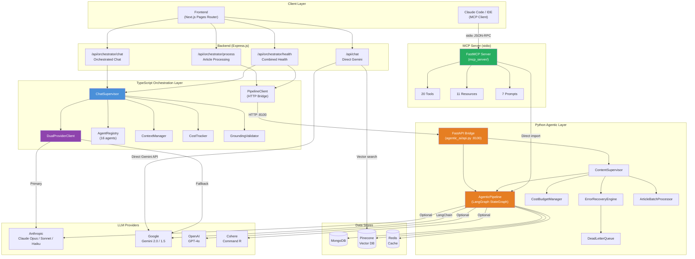
```mermaid
graph TB
    subgraph "Client Layer"
        FE["Frontend<br/>(Next.js Pages Router)"]
        IDE["Claude Code / IDE<br/>(MCP Client)"]
    end

    subgraph "Backend (Express.js)"
        DIRECT["/api/chat<br/>Direct Gemini"]
        ORCH_CHAT["/api/orchestrator/chat<br/>Orchestrated Chat"]
        ORCH_PROC["/api/orchestrator/process<br/>Article Processing"]
        ORCH_HEALTH["/api/orchestrator/health<br/>Combined Health"]
    end

    subgraph "TypeScript Orchestration Layer"
        CS["ChatSupervisor"]
        DPC["DualProviderClient"]
        AR["AgentRegistry<br/>(16 agents)"]
        CM["ContextManager"]
        CT["CostTracker"]
        GV["GroundingValidator"]
        PC["PipelineClient<br/>(HTTP Bridge)"]
    end

    subgraph "Python Agentic Layer"
        API["FastAPI Bridge<br/>(agentic_ai/api.py :8100)"]
        AP["AgenticPipeline<br/>(LangGraph StateGraph)"]
        COSUP["ContentSupervisor"]
        CBM["CostBudgetManager"]
        ERE["ErrorRecoveryEngine"]
        DLQ["DeadLetterQueue"]
        ABP["ArticleBatchProcessor"]
    end

    subgraph "MCP Server (stdio)"
        MCP["FastMCP Server<br/>(mcp_server/)"]
        TOOLS["20 Tools"]
        RES["11 Resources"]
        PROMPTS["7 Prompts"]
    end

    subgraph "LLM Providers"
        ANTH["Anthropic<br/>Claude Opus / Sonnet / Haiku"]
        GOOG["Google<br/>Gemini 2.0 / 1.5"]
        OAI["OpenAI<br/>GPT-4o"]
        COH["Cohere<br/>Command R"]
    end

    subgraph "Data Stores"
        MONGO[(MongoDB)]
        PINE[(Pinecone<br/>Vector DB)]
        REDIS[(Redis<br/>Cache)]
    end

    FE --> DIRECT
    FE --> ORCH_CHAT
    FE --> ORCH_PROC
    FE --> ORCH_HEALTH

    DIRECT -->|"Direct Gemini API"| GOOG
    DIRECT -->|"Vector search"| PINE

    ORCH_CHAT --> CS
    ORCH_PROC --> PC
    ORCH_HEALTH --> CS
    ORCH_HEALTH --> PC

    CS --> DPC
    CS --> AR
    CS --> CM
    CS --> CT
    CS --> GV
    DPC -->|"Primary"| ANTH
    DPC -->|"Fallback"| GOOG

    PC -->|"HTTP :8100"| API
    API --> AP
    API --> COSUP
    COSUP --> AP
    COSUP --> CBM
    COSUP --> ERE
    ERE --> DLQ
    COSUP --> ABP

    AP -->|"LangChain"| GOOG
    AP -->|"Optional"| OAI
    AP -->|"Optional"| ANTH
    AP -->|"Optional"| COH

    IDE -->|"stdio JSON-RPC"| MCP
    MCP --> TOOLS
    MCP --> RES
    MCP --> PROMPTS
    MCP -->|"Direct import"| AP

    AP --> MONGO
    AP --> PINE
    AP --> REDIS

    style CS fill:#4a90d9,color:#fff
    style AP fill:#e67e22,color:#fff
    style MCP fill:#27ae60,color:#fff
    style DPC fill:#8e44ad,color:#fff
    style API fill:#e67e22,color:#fff
```

---

## Data Flow: End-to-End Request Lifecycle

### Chat Request Flow

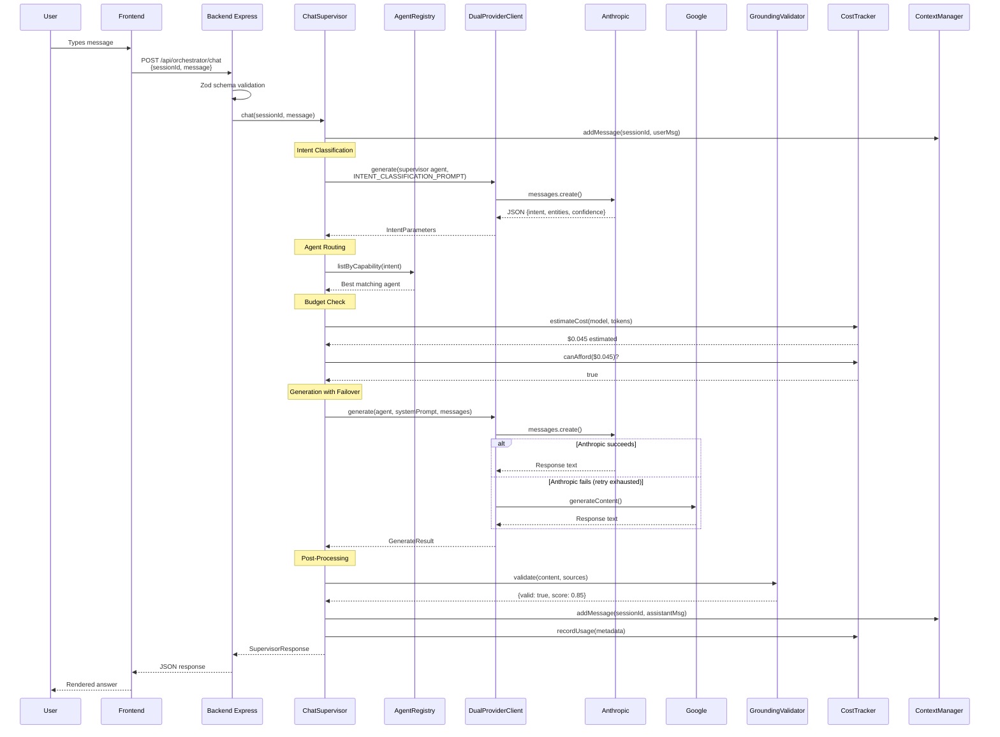
```mermaid
sequenceDiagram
    participant User
    participant Frontend
    participant Backend as Backend Express
    participant Supervisor as ChatSupervisor
    participant Registry as AgentRegistry
    participant LLM as DualProviderClient
    participant Anthropic
    participant Google
    participant Grounding as GroundingValidator
    participant Cost as CostTracker
    participant Context as ContextManager

    User->>Frontend: Types message
    Frontend->>Backend: POST /api/orchestrator/chat<br/>{sessionId, message}
    Backend->>Backend: Zod schema validation

    Backend->>Supervisor: chat(sessionId, message)
    Supervisor->>Context: addMessage(sessionId, userMsg)

    Note over Supervisor: Intent Classification
    Supervisor->>LLM: generate(supervisor agent,<br/>INTENT_CLASSIFICATION_PROMPT)
    LLM->>Anthropic: messages.create()
    Anthropic-->>LLM: JSON {intent, entities, confidence}
    LLM-->>Supervisor: IntentParameters

    Note over Supervisor: Agent Routing
    Supervisor->>Registry: listByCapability(intent)
    Registry-->>Supervisor: Best matching agent

    Note over Supervisor: Budget Check
    Supervisor->>Cost: estimateCost(model, tokens)
    Cost-->>Supervisor: $0.045 estimated
    Supervisor->>Cost: canAfford($0.045)?
    Cost-->>Supervisor: true

    Note over Supervisor: Generation with Failover
    Supervisor->>LLM: generate(agent, systemPrompt, messages)
    LLM->>Anthropic: messages.create()
    alt Anthropic succeeds
        Anthropic-->>LLM: Response text
    else Anthropic fails (retry exhausted)
        LLM->>Google: generateContent()
        Google-->>LLM: Response text
    end
    LLM-->>Supervisor: GenerateResult

    Note over Supervisor: Post-Processing
    Supervisor->>Grounding: validate(content, sources)
    Grounding-->>Supervisor: {valid: true, score: 0.85}

    Supervisor->>Context: addMessage(sessionId, assistantMsg)
    Supervisor->>Cost: recordUsage(metadata)

    Supervisor-->>Backend: SupervisorResponse
    Backend-->>Frontend: JSON response
    Frontend-->>User: Rendered answer
```

### Article Processing Flow

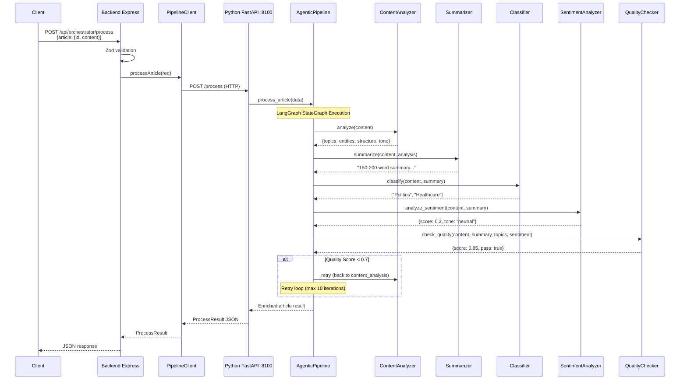
```mermaid
sequenceDiagram
    participant Client
    participant Backend as Backend Express
    participant Bridge as PipelineClient
    participant FastAPI as Python FastAPI :8100
    participant Pipeline as AgenticPipeline
    participant CA as ContentAnalyzer
    participant SUM as Summarizer
    participant CLS as Classifier
    participant SA as SentimentAnalyzer
    participant QC as QualityChecker

    Client->>Backend: POST /api/orchestrator/process<br/>{article: {id, content}}
    Backend->>Backend: Zod validation
    Backend->>Bridge: processArticle(req)
    Bridge->>FastAPI: POST /process (HTTP)

    FastAPI->>Pipeline: process_article(data)

    Note over Pipeline: LangGraph StateGraph Execution
    Pipeline->>CA: analyze(content)
    CA-->>Pipeline: {topics, entities, structure, tone}

    Pipeline->>SUM: summarize(content, analysis)
    SUM-->>Pipeline: "150-200 word summary..."

    Pipeline->>CLS: classify(content, summary)
    CLS-->>Pipeline: ["Politics", "Healthcare"]

    Pipeline->>SA: analyze_sentiment(content, summary)
    SA-->>Pipeline: {score: 0.2, tone: "neutral"}

    Pipeline->>QC: check_quality(content, summary, topics, sentiment)
    QC-->>Pipeline: {score: 0.85, pass: true}

    alt Quality Score < 0.7
        Pipeline->>CA: retry (back to content_analysis)
        Note over Pipeline: Retry loop (max 10 iterations)
    end

    Pipeline-->>FastAPI: Enriched article result
    FastAPI-->>Bridge: ProcessResult JSON
    Bridge-->>Backend: ProcessResult
    Backend-->>Client: JSON response
```

---

## Module 1: TypeScript Chat Orchestration

**Package:** `@synthoraai/orchestration` (npm workspace in `orchestration/`)

### Component Architecture

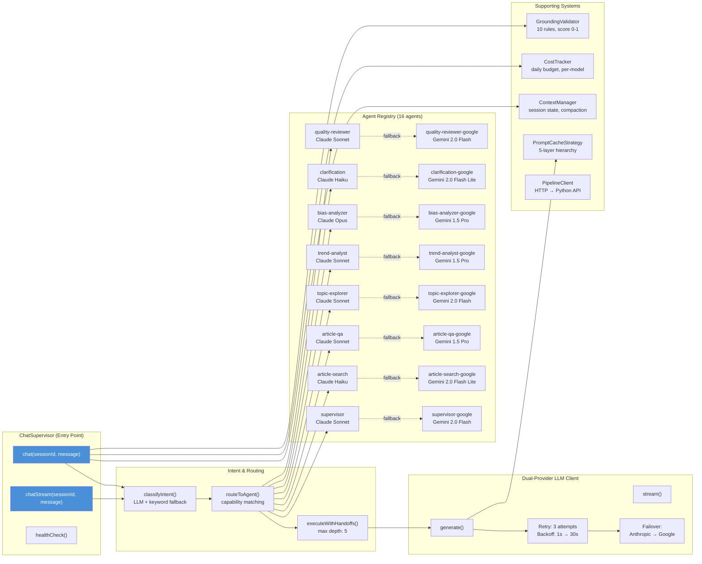
```mermaid
graph LR
    subgraph "ChatSupervisor (Entry Point)"
        CHAT["chat(sessionId, message)"]
        STREAM["chatStream(sessionId, message)"]
        HEALTH["healthCheck()"]
    end

    subgraph "Intent & Routing"
        IC["classifyIntent()<br/>LLM + keyword fallback"]
        RT["routeToAgent()<br/>capability matching"]
        HO["executeWithHandoffs()<br/>max depth: 5"]
    end

    subgraph "Agent Registry (16 agents)"
        direction TB
        A1["supervisor<br/>Claude Sonnet"]
        A2["article-search<br/>Claude Haiku"]
        A3["article-qa<br/>Claude Sonnet"]
        A4["topic-explorer<br/>Claude Sonnet"]
        A5["trend-analyst<br/>Claude Sonnet"]
        A6["bias-analyzer<br/>Claude Opus"]
        A7["clarification<br/>Claude Haiku"]
        A8["quality-reviewer<br/>Claude Sonnet"]
        A1G["supervisor-google<br/>Gemini 2.0 Flash"]
        A2G["article-search-google<br/>Gemini 2.0 Flash Lite"]
        A3G["article-qa-google<br/>Gemini 1.5 Pro"]
        A4G["topic-explorer-google<br/>Gemini 2.0 Flash"]
        A5G["trend-analyst-google<br/>Gemini 1.5 Pro"]
        A6G["bias-analyzer-google<br/>Gemini 1.5 Pro"]
        A7G["clarification-google<br/>Gemini 2.0 Flash Lite"]
        A8G["quality-reviewer-google<br/>Gemini 2.0 Flash"]
    end

    subgraph "Dual-Provider LLM Client"
        GEN["generate()"]
        STR["stream()"]
        RETRY["Retry: 3 attempts<br/>Backoff: 1s → 30s"]
        FO["Failover:<br/>Anthropic → Google"]
    end

    subgraph "Supporting Systems"
        CTX["ContextManager<br/>session state, compaction"]
        COST["CostTracker<br/>daily budget, per-model"]
        GND["GroundingValidator<br/>10 rules, score 0-1"]
        PCS["PromptCacheStrategy<br/>5-layer hierarchy"]
        BRG["PipelineClient<br/>HTTP → Python API"]
    end

    CHAT --> IC
    STREAM --> IC
    IC --> RT
    RT --> HO
    HO --> GEN
    GEN --> RETRY
    RETRY --> FO

    RT --> A1
    RT --> A2
    RT --> A3
    RT --> A4
    RT --> A5
    RT --> A6
    RT --> A7
    RT --> A8

    A1 -.->|fallback| A1G
    A2 -.->|fallback| A2G
    A3 -.->|fallback| A3G
    A4 -.->|fallback| A4G
    A5 -.->|fallback| A5G
    A6 -.->|fallback| A6G
    A7 -.->|fallback| A7G
    A8 -.->|fallback| A8G

    CHAT --> CTX
    CHAT --> COST
    CHAT --> GND
    GEN --> PCS

    style CHAT fill:#4a90d9,color:#fff
    style STREAM fill:#4a90d9,color:#fff
```

### Intent Classification & Routing

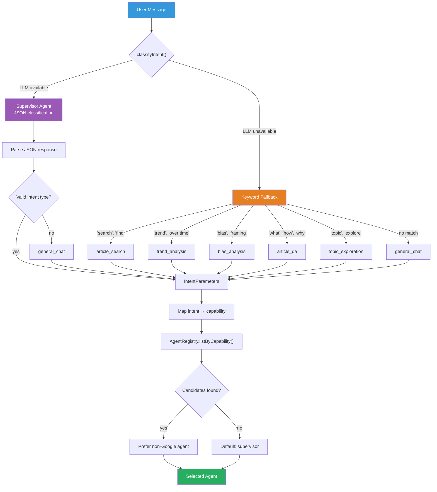
```mermaid
flowchart TD
    MSG["User Message"] --> IC{"classifyIntent()"}

    IC -->|LLM available| LLM["Supervisor Agent<br/>JSON classification"]
    IC -->|LLM unavailable| KW["Keyword Fallback"]

    LLM --> PARSE["Parse JSON response"]
    PARSE --> VALIDATE{"Valid intent type?"}
    VALIDATE -->|yes| INTENT
    VALIDATE -->|no| GC["general_chat"]
    GC --> INTENT

    KW -->|"'search', 'find'"| AS["article_search"]
    KW -->|"'trend', 'over time'"| TA["trend_analysis"]
    KW -->|"'bias', 'framing'"| BA["bias_analysis"]
    KW -->|"'what', 'how', 'why'"| AQ["article_qa"]
    KW -->|"'topic', 'explore'"| TE["topic_exploration"]
    KW -->|no match| GC2["general_chat"]

    AS --> INTENT["IntentParameters"]
    TA --> INTENT
    BA --> INTENT
    AQ --> INTENT
    TE --> INTENT
    GC2 --> INTENT

    INTENT --> CAP["Map intent → capability"]
    CAP --> REG["AgentRegistry.listByCapability()"]
    REG --> SELECT{"Candidates found?"}
    SELECT -->|yes| PRIMARY["Prefer non-Google agent"]
    SELECT -->|no| FALLBACK["Default: supervisor"]
    PRIMARY --> AGENT["Selected Agent"]
    FALLBACK --> AGENT

    style MSG fill:#3498db,color:#fff
    style AGENT fill:#27ae60,color:#fff
    style LLM fill:#9b59b6,color:#fff
    style KW fill:#e67e22,color:#fff
```

### The 16 Chat Agents

| Agent | Provider | Model | Capabilities | Cost Tier |
|-------|----------|-------|-------------|-----------|
| `supervisor` | Anthropic | claude-sonnet-4-6 | routing, synthesis, general_chat | STANDARD |
| `supervisor-google` | Google | gemini-2.0-flash | routing, synthesis, general_chat | ECONOMY |
| `article-search` | Anthropic | claude-haiku-4-5 | article_search, retrieval | ECONOMY |
| `article-search-google` | Google | gemini-2.0-flash-lite | article_search, retrieval | ECONOMY |
| `article-qa` | Anthropic | claude-sonnet-4-6 | article_qa, grounded_qa | STANDARD |
| `article-qa-google` | Google | gemini-1.5-pro | article_qa, grounded_qa | PREMIUM |
| `topic-explorer` | Anthropic | claude-sonnet-4-6 | topic_exploration, summarization | STANDARD |
| `topic-explorer-google` | Google | gemini-2.0-flash | topic_exploration, summarization | ECONOMY |
| `trend-analyst` | Anthropic | claude-sonnet-4-6 | trend_analysis, data_analysis | STANDARD |
| `trend-analyst-google` | Google | gemini-1.5-pro | trend_analysis, data_analysis | PREMIUM |
| `bias-analyzer` | Anthropic | claude-opus-4-6 | bias_analysis, media_literacy | PREMIUM |
| `bias-analyzer-google` | Google | gemini-1.5-pro | bias_analysis, media_literacy | PREMIUM |
| `clarification` | Anthropic | claude-haiku-4-5 | clarification, dialogue_management | ECONOMY |
| `clarification-google` | Google | gemini-2.0-flash-lite | clarification, dialogue_management | ECONOMY |
| `quality-reviewer` | Anthropic | claude-sonnet-4-6 | quality_review, evaluation | STANDARD |
| `quality-reviewer-google` | Google | gemini-2.0-flash | quality_review, evaluation | ECONOMY |

### 8 System Prompts

Each agent has a dedicated system prompt in `src/agents/prompts/system/`:

1. **Supervisor** — Orchestrates sub-agents, synthesizes responses
2. **Article Search** — Semantic/keyword search over Pinecone corpus
3. **Article Q&A** — Multi-hop reasoning, grounded answers with citations
4. **Topic Explorer** — Cross-article exploration, summarization
5. **Trend Analyst** — Time-series analysis, anomaly detection
6. **Bias Analyzer** — Framing, perspective, media literacy analysis
7. **Clarification** — Dialogue management, query disambiguation
8. **Quality Reviewer** — Response evaluation across 5 quality dimensions

---

## Module 2: Python Agentic Pipeline

### LangGraph Pipeline State Machine

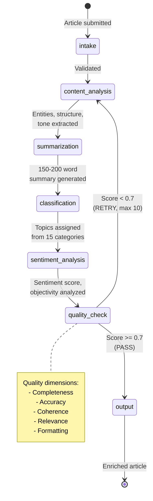
```mermaid
stateDiagram-v2
    [*] --> intake: Article submitted

    intake --> content_analysis: Validated

    content_analysis --> summarization: Entities, structure,<br/>tone extracted

    summarization --> classification: 150-200 word<br/>summary generated

    classification --> sentiment_analysis: Topics assigned<br/>from 15 categories

    sentiment_analysis --> quality_check: Sentiment score,<br/>objectivity analyzed

    quality_check --> output: Score >= 0.7<br/>(PASS)
    quality_check --> content_analysis: Score < 0.7<br/>(RETRY, max 10)

    output --> [*]: Enriched article

    note right of quality_check
        Quality dimensions:
        - Completeness
        - Accuracy
        - Coherence
        - Relevance
        - Formatting
    end note
```

### Pipeline Agent Detail

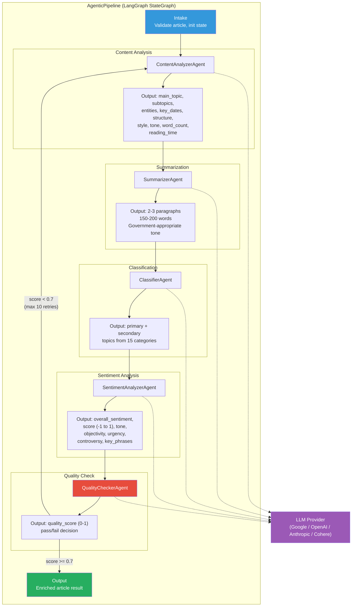
```mermaid
graph TB
    subgraph "AgenticPipeline (LangGraph StateGraph)"
        direction TB

        INTAKE["Intake<br/>Validate article, init state"]

        subgraph "Content Analysis"
            CA["ContentAnalyzerAgent"]
            CA_OUT["Output: main_topic, subtopics,<br/>entities, key_dates, structure,<br/>style, tone, word_count,<br/>reading_time"]
        end

        subgraph "Summarization"
            SUM["SummarizerAgent"]
            SUM_OUT["Output: 2-3 paragraphs<br/>150-200 words<br/>Government-appropriate tone"]
        end

        subgraph "Classification"
            CLS["ClassifierAgent"]
            CLS_OUT["Output: primary + secondary<br/>topics from 15 categories"]
        end

        subgraph "Sentiment Analysis"
            SA["SentimentAnalyzerAgent"]
            SA_OUT["Output: overall_sentiment,<br/>score (-1 to 1), tone,<br/>objectivity, urgency,<br/>controversy, key_phrases"]
        end

        subgraph "Quality Check"
            QC["QualityCheckerAgent"]
            QC_OUT["Output: quality_score (0-1)<br/>pass/fail decision"]
        end

        OUTPUT["Output<br/>Enriched article result"]
    end

    INTAKE --> CA
    CA --> CA_OUT --> SUM
    SUM --> SUM_OUT --> CLS
    CLS --> CLS_OUT --> SA
    SA --> SA_OUT --> QC
    QC --> QC_OUT
    QC_OUT -->|"score >= 0.7"| OUTPUT
    QC_OUT -->|"score < 0.7<br/>(max 10 retries)"| CA

    LLM["LLM Provider<br/>(Google / OpenAI / Anthropic / Cohere)"]
    CA -.-> LLM
    SUM -.-> LLM
    CLS -.-> LLM
    SA -.-> LLM
    QC -.-> LLM

    style INTAKE fill:#3498db,color:#fff
    style OUTPUT fill:#27ae60,color:#fff
    style QC fill:#e74c3c,color:#fff
    style LLM fill:#9b59b6,color:#fff
```

### 15 Topic Categories

Politics, Healthcare, Environment, Technology, Education, Economy, Defense, Infrastructure, Social Services, Immigration, Energy, Agriculture, Housing, Transportation, Justice.

### Orchestration Layer (`agentic_ai/orchestration/`)

Wraps the core pipeline with enterprise concerns:

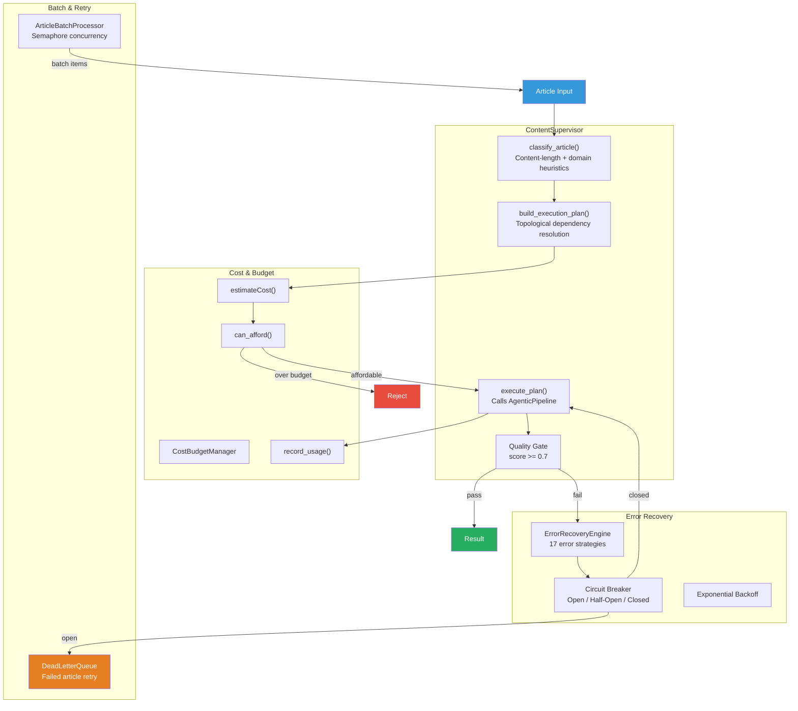
```mermaid
graph TB
    subgraph "ContentSupervisor"
        ROUTE["classify_article()<br/>Content-length + domain heuristics"]
        PLAN["build_execution_plan()<br/>Topological dependency resolution"]
        EXEC["execute_plan()<br/>Calls AgenticPipeline"]
        GATE["Quality Gate<br/>score >= 0.7"]
    end

    subgraph "Cost & Budget"
        CBM["CostBudgetManager"]
        EST["estimateCost()"]
        AFF["can_afford()"]
        REC["record_usage()"]
    end

    subgraph "Error Recovery"
        ERE["ErrorRecoveryEngine<br/>17 error strategies"]
        CB["Circuit Breaker<br/>Open / Half-Open / Closed"]
        BACK["Exponential Backoff"]
    end

    subgraph "Batch & Retry"
        ABP["ArticleBatchProcessor<br/>Semaphore concurrency"]
        DLQ["DeadLetterQueue<br/>Failed article retry"]
    end

    INPUT["Article Input"] --> ROUTE
    ROUTE --> PLAN
    PLAN --> EST
    EST --> AFF
    AFF -->|"affordable"| EXEC
    AFF -->|"over budget"| REJECT["Reject"]
    EXEC --> GATE
    GATE -->|"pass"| RESULT["Result"]
    GATE -->|"fail"| ERE
    ERE --> CB
    CB -->|"closed"| EXEC
    CB -->|"open"| DLQ
    EXEC --> REC

    ABP -->|"batch items"| INPUT

    style INPUT fill:#3498db,color:#fff
    style RESULT fill:#27ae60,color:#fff
    style REJECT fill:#e74c3c,color:#fff
    style DLQ fill:#e67e22,color:#fff
```

### HTTP Bridge (`agentic_ai/api.py`)

FastAPI server exposing the pipeline over HTTP for the TypeScript layer:

| Endpoint | Method | Description |
|----------|--------|-------------|
| `/health` | GET | Pipeline readiness check |
| `/process` | POST | Process single article through full pipeline |
| `/analyze` | POST | Run individual agents (content/sentiment/classification/summary/quality) |
| `/batch` | POST | Process multiple articles (max 25, concurrency 5) |

Start: `cd agentic_ai && uvicorn api:app --host 0.0.0.0 --port 8100`

### Cloud Adapters

- **AWS Lambda** — `aws/lambda_function.py`
- **Azure Functions** — `azure/function_app.py`

---

## Module 3: MCP Server

### MCP Architecture

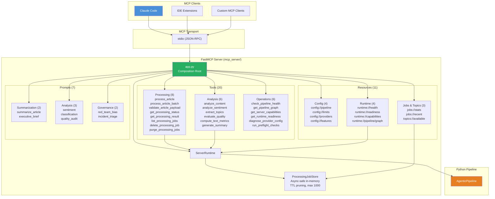
```mermaid
graph TB
    subgraph "MCP Clients"
        CC["Claude Code"]
        IDE["IDE Extensions"]
        CUSTOM["Custom MCP Clients"]
    end

    subgraph "MCP Transport"
        STDIO["stdio (JSON-RPC)"]
    end

    subgraph "FastMCP Server (mcp_server/)"
        APP["app.py<br/>Composition Root"]
        RT["ServerRuntime"]
        JS["ProcessingJobStore<br/>Async-safe in-memory<br/>TTL pruning, max 1000"]

        subgraph "Tools (20)"
            T_PROC["Processing (8)<br/>process_article<br/>process_article_batch<br/>validate_article_payload<br/>get_processing_status<br/>get_processing_result<br/>list_processing_jobs<br/>delete_processing_job<br/>purge_processing_jobs"]
            T_ANAL["Analysis (6)<br/>analyze_content<br/>analyze_sentiment<br/>extract_topics<br/>evaluate_quality<br/>compute_text_metrics<br/>generate_summary"]
            T_OPS["Operations (6)<br/>check_pipeline_health<br/>get_pipeline_graph<br/>get_server_capabilities<br/>get_runtime_readiness<br/>diagnose_provider_config<br/>run_preflight_checks"]
        end

        subgraph "Resources (11)"
            R_CFG["Config (4)<br/>config://pipeline<br/>config://limits<br/>config://providers<br/>config://features"]
            R_RT["Runtime (4)<br/>runtime://health<br/>runtime://readiness<br/>runtime://capabilities<br/>runtime://pipeline/graph"]
            R_JOBS["Jobs & Topics (3)<br/>jobs://stats<br/>jobs://recent<br/>topics://available"]
        end

        subgraph "Prompts (7)"
            P_SUM["Summarization (2)<br/>summarize_article<br/>executive_brief"]
            P_ANAL["Analysis (3)<br/>sentiment<br/>classification<br/>quality_audit"]
            P_GOV["Governance (2)<br/>red_team_bias<br/>incident_triage"]
        end
    end

    subgraph "Python Pipeline"
        AP["AgenticPipeline"]
    end

    CC --> STDIO
    IDE --> STDIO
    CUSTOM --> STDIO
    STDIO --> APP
    APP --> RT
    RT --> JS
    RT --> AP
    APP --> T_PROC
    APP --> T_ANAL
    APP --> T_OPS
    APP --> R_CFG
    APP --> R_RT
    APP --> R_JOBS
    APP --> P_SUM
    APP --> P_ANAL
    APP --> P_GOV

    T_PROC --> RT
    T_ANAL --> RT
    R_RT --> RT
    R_JOBS --> JS

    style CC fill:#4a90d9,color:#fff
    style APP fill:#27ae60,color:#fff
    style AP fill:#e67e22,color:#fff
```

### Configuration (`.mcp.json`)

```json
{
  "mcpServers": {
    "synthora-agentic-pipeline": {
      "command": "python",
      "args": ["-m", "mcp_server"],
      "env": { "PYTHONPATH": ".", "PYTHONUNBUFFERED": "1" }
    }
  }
}
```

### Guardrails

| Limit | Value | Purpose |
|-------|-------|---------|
| Max content | 20,000 chars | Prevent oversized payloads |
| Max batch | 25 items | Bound concurrency |
| Max job history | 1,000 records | Memory cap |
| Job TTL | 24 hours | Auto-cleanup |
| Logging | stderr only | Protect stdio JSON-RPC stream |
| Startup failure | Graceful degradation | Tools return `service_unavailable` |

---

## Integration Layer

### Cross-Module Dependency Graph

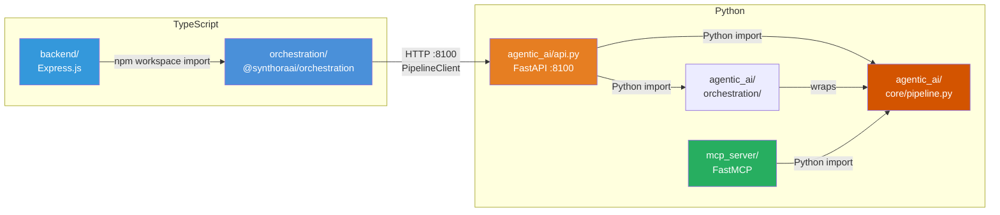
```mermaid
graph LR
    subgraph "TypeScript"
        BE["backend/<br/>Express.js"]
        ORC["orchestration/<br/>@synthoraai/orchestration"]
    end

    subgraph "Python"
        API["agentic_ai/api.py<br/>FastAPI :8100"]
        PIPE["agentic_ai/<br/>core/pipeline.py"]
        ORCHPY["agentic_ai/<br/>orchestration/"]
        MCP["mcp_server/<br/>FastMCP"]
    end

    BE -->|"npm workspace import"| ORC
    ORC -->|"HTTP :8100<br/>PipelineClient"| API
    API -->|"Python import"| PIPE
    API -->|"Python import"| ORCHPY
    ORCHPY -->|"wraps"| PIPE
    MCP -->|"Python import"| PIPE

    style BE fill:#3498db,color:#fff
    style ORC fill:#4a90d9,color:#fff
    style API fill:#e67e22,color:#fff
    style PIPE fill:#d35400,color:#fff
    style MCP fill:#27ae60,color:#fff
```

### Backend API Endpoints (Full Surface)

| Endpoint | Method | Handler | System |
|----------|--------|---------|--------|
| `/api/chat` | POST | `handleChat` | Direct Gemini |
| `/api/chat/sitewide` | POST | `handleSitewideChat` | Direct Gemini + Pinecone SSE |
| `/api/orchestrator/chat` | POST | `handleOrchestratedChat` | ChatSupervisor (16 agents) |
| `/api/orchestrator/chat/stream` | POST | `handleOrchestratedChatStream` | ChatSupervisor SSE |
| `/api/orchestrator/process` | POST | `handleArticleProcess` | Python pipeline |
| `/api/orchestrator/analyze` | POST | `handleArticleAnalyze` | Python analysis agents |
| `/api/orchestrator/batch` | POST | `handleBatchProcess` | Python batch pipeline |
| `/api/orchestrator/health` | GET | `handleOrchestratorHealth` | Combined health |
| `/api/orchestrator/cost` | GET | `handleCostSnapshot` | Cost tracking |
| `/api/orchestrator/session/:id` | DELETE | `handleDeleteSession` | Session cleanup |

### Task Coordination via Beads

Beads provide the cross-cutting task decomposition layer that coordinates work across all three AI modules. Each bead is a discrete, well-scoped unit of work that an agent (human or AI) can claim, execute, and verify independently.

**Identity:** Service-scoped IDs (`ORCH-001`, `PIPE-012`, `CRAWL-005`, etc.) tie each bead to the module it affects. Eight prefixes cover every service boundary.

**Lifecycle:**

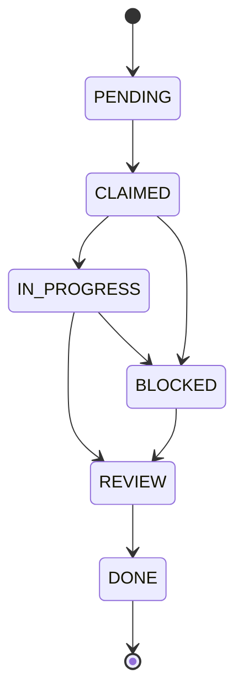
```mermaid
stateDiagram-v2
    [*] --> PENDING
    PENDING --> CLAIMED
    CLAIMED --> IN_PROGRESS
    CLAIMED --> BLOCKED
    IN_PROGRESS --> REVIEW
    IN_PROGRESS --> BLOCKED
    REVIEW --> DONE
    BLOCKED --> REVIEW
    DONE --> [*]
```

**Concurrency control:** File-level reservations in `.beads/.status.json` ensure only one agent owns a given file at a time. High-contention files (`docker-compose.yml`, root `package.json`, `ARCHITECTURE.md`) require explicit coordination; isolated directories (`orchestration/src/agents/prompts/`, `agentic_ai/agents/`, `.claude/skills/`) are safe parallel zones.

**Per-module integration:**

| Module | How Beads Apply |
|--------|----------------|
| TypeScript Chat Orchestration | `ChatSupervisor` decomposes complex requests into sub-beads distributed across the 16 chat agents; each agent reports bead-level status for aggregation |
| Python LangGraph Pipeline | Pipeline stages (scrape → summarize → bias → topics) map to beads during batch enrichment, giving per-article progress tracking and selective retry via `ContentSupervisor` |
| MCP Server | MCP tools read bead status to provide context-aware assistance in Claude Code, preventing conflicting edits |

**Cost attribution:** The TypeScript `CostTracker` and Python `CostBudgetManager` can tag LLM costs with the active bead ID, enabling per-task cost analysis and budget enforcement.

**Compound learning:** On completion, agents record structured session logs in `.agent-sessions/` via the `compound-review` skill. Each session captures work summary, files touched, codebase insights, gotchas, and recommendations. Future agents read recent sessions before starting related beads. Sessions older than 90 days are pruned unless tagged `[KEEP]`.

See [.beads/README.md](.beads/README.md) for the full specification and [.agent-sessions/README.md](.agent-sessions/README.md) for the session log format.

---

## LLM Providers & Models

### Provider Selection per Module


```mermaid
graph TB
    subgraph "TypeScript Chat (DualProviderClient)"
        TS_PRI["Primary: Anthropic"]
        TS_FB["Fallback: Google"]
        TS_PRI -->|"3 retries, then"| TS_FB
    end

    subgraph "Python Pipeline (BaseAgent)"
        PY_DEF["Default: Google"]
        PY_OAI["Optional: OpenAI"]
        PY_ANT["Optional: Anthropic"]
        PY_COH["Optional: Cohere"]
    end

    subgraph "Anthropic Models"
        A_OPUS["claude-opus-4-6<br/>$15 / $75 per 1M tok"]
        A_SON["claude-sonnet-4-6<br/>$3 / $15 per 1M tok"]
        A_HAI["claude-haiku-4-5<br/>$0.80 / $4 per 1M tok"]
    end

    subgraph "Google Models"
        G_20F["gemini-2.0-flash<br/>$0.10 / $0.40 per 1M tok"]
        G_20FL["gemini-2.0-flash-lite<br/>$0.075 / $0.30 per 1M tok"]
        G_15F["gemini-1.5-flash<br/>$0.075 / $0.30 per 1M tok"]
        G_15P["gemini-1.5-pro<br/>$1.25 / $5 per 1M tok"]
    end

    subgraph "OpenAI Models"
        O_4O["gpt-4o<br/>$2.50 / $10 per 1M tok"]
        O_4OM["gpt-4o-mini<br/>$0.15 / $0.60 per 1M tok"]
    end

    TS_PRI --> A_OPUS
    TS_PRI --> A_SON
    TS_PRI --> A_HAI
    TS_FB --> G_20F
    TS_FB --> G_20FL
    TS_FB --> G_15P

    PY_DEF --> G_15F
    PY_OAI --> O_4O
    PY_ANT --> A_SON
    PY_COH -.->|"Command R"| PY_COH

    style A_OPUS fill:#8e44ad,color:#fff
    style A_SON fill:#9b59b6,color:#fff
    style A_HAI fill:#a569bd,color:#fff
    style G_20F fill:#2ecc71,color:#fff
    style G_15P fill:#27ae60,color:#fff
```

### Full Pricing Table (USD per 1M tokens)

| Model | Input | Output | Cached Input | Used By |
|-------|-------|--------|-------------|---------|
| claude-opus-4-6 | $15.00 | $75.00 | $1.50 | bias-analyzer |
| claude-sonnet-4-6 | $3.00 | $15.00 | $0.30 | supervisor, article-qa, topic-explorer, trend-analyst, quality-reviewer |
| claude-haiku-4-5 | $0.80 | $4.00 | $0.08 | article-search, clarification |
| gemini-2.0-flash | $0.10 | $0.40 | $0.025 | supervisor-google, topic-explorer-google, quality-reviewer-google |
| gemini-2.0-flash-lite | $0.075 | $0.30 | $0.019 | article-search-google, clarification-google |
| gemini-1.5-flash | $0.075 | $0.30 | $0.019 | Python pipeline (default) |
| gemini-1.5-pro | $1.25 | $5.00 | $0.313 | article-qa-google, trend-analyst-google, bias-analyzer-google |
| gpt-4o | $2.50 | $10.00 | $1.25 | Python pipeline (optional) |
| gpt-4o-mini | $0.15 | $0.60 | $0.075 | Python pipeline (optional) |

---

## Cost Tracking & Budgets

### Cost Control Flow

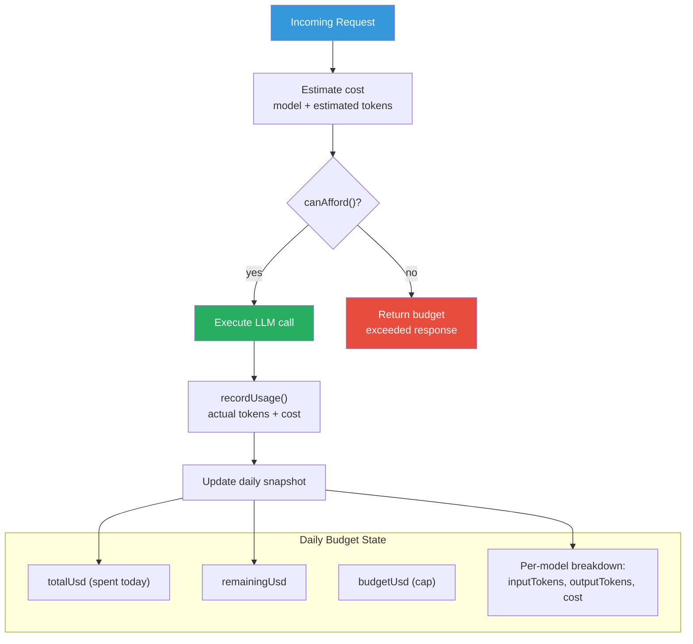
```mermaid
flowchart TD
    REQ["Incoming Request"] --> EST["Estimate cost<br/>model + estimated tokens"]
    EST --> CHECK{"canAfford()?"}
    CHECK -->|"yes"| EXEC["Execute LLM call"]
    CHECK -->|"no"| REJECT["Return budget<br/>exceeded response"]
    EXEC --> RECORD["recordUsage()<br/>actual tokens + cost"]
    RECORD --> SNAP["Update daily snapshot"]

    subgraph "Daily Budget State"
        TOTAL["totalUsd (spent today)"]
        REMAINING["remainingUsd"]
        BUDGET["budgetUsd (cap)"]
        BREAKDOWN["Per-model breakdown:<br/>inputTokens, outputTokens, cost"]
    end

    SNAP --> TOTAL
    SNAP --> REMAINING
    SNAP --> BREAKDOWN

    style REQ fill:#3498db,color:#fff
    style REJECT fill:#e74c3c,color:#fff
    style EXEC fill:#27ae60,color:#fff
```

### TypeScript CostTracker

- **Daily budget:** $10 USD default (`ORCHESTRATION_DAILY_BUDGET_USD`)
- **Pre-flight check:** `canAfford()` before every LLM call
- **Per-model breakdown:** tracks input/output tokens and cost per model
- **Budget response:** returns user-friendly message when budget exhausted

### Python CostBudgetManager

- **Daily budget:** configurable per `ContentSupervisor` instance
- **Per-model pricing table** with input/output/cached rates
- **Estimation before execution:** `can_afford()` check
- **Circuit breaker:** stops processing if budget exhausted

### Combined Health Endpoint

`GET /api/orchestrator/cost` returns real-time snapshot:

```json
{
  "totalUsd": 1.23,
  "remainingUsd": 8.77,
  "budgetUsd": 10.0,
  "breakdown": {
    "claude-sonnet-4-6": { "inputTokens": 50000, "outputTokens": 12000, "cost": 0.33 }
  }
}
```

---

## Grounding & Quality Validation

### TypeScript Grounding Pipeline

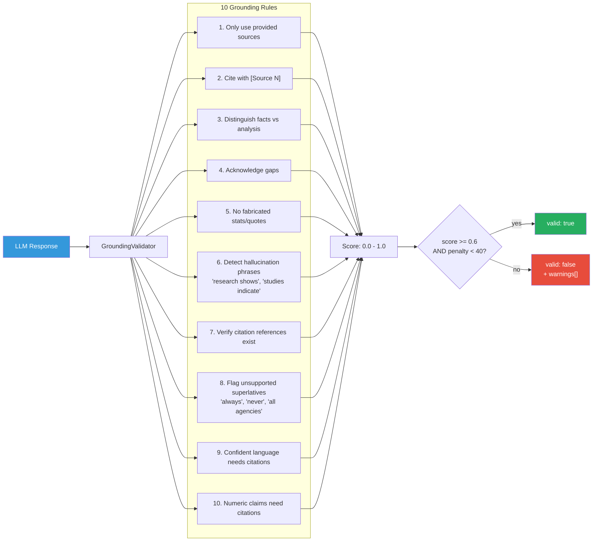
```mermaid
flowchart LR
    RESP["LLM Response"] --> GV["GroundingValidator"]

    subgraph "10 Grounding Rules"
        R1["1. Only use provided sources"]
        R2["2. Cite with [Source N]"]
        R3["3. Distinguish facts vs analysis"]
        R4["4. Acknowledge gaps"]
        R5["5. No fabricated stats/quotes"]
        R6["6. Detect hallucination phrases<br/>'research shows', 'studies indicate'"]
        R7["7. Verify citation references exist"]
        R8["8. Flag unsupported superlatives<br/>'always', 'never', 'all agencies'"]
        R9["9. Confident language needs citations"]
        R10["10. Numeric claims need citations"]
    end

    GV --> R1
    GV --> R2
    GV --> R3
    GV --> R4
    GV --> R5
    GV --> R6
    GV --> R7
    GV --> R8
    GV --> R9
    GV --> R10

    R1 --> SCORE["Score: 0.0 - 1.0"]
    R2 --> SCORE
    R3 --> SCORE
    R4 --> SCORE
    R5 --> SCORE
    R6 --> SCORE
    R7 --> SCORE
    R8 --> SCORE
    R9 --> SCORE
    R10 --> SCORE

    SCORE --> VALID{"score >= 0.6<br/>AND penalty < 40?"}
    VALID -->|yes| PASS["valid: true"]
    VALID -->|no| WARN["valid: false<br/>+ warnings[]"]

    style RESP fill:#3498db,color:#fff
    style PASS fill:#27ae60,color:#fff
    style WARN fill:#e74c3c,color:#fff
```

### Python Quality Gate

- **Score threshold:** 0.7 (articles scoring below retry through the pipeline)
- **Max retries:** configurable (default 10 iterations)
- **Quality dimensions:** completeness, accuracy, coherence, relevance, formatting

---

## Prompt Architecture

### TypeScript Prompt Cache Strategy

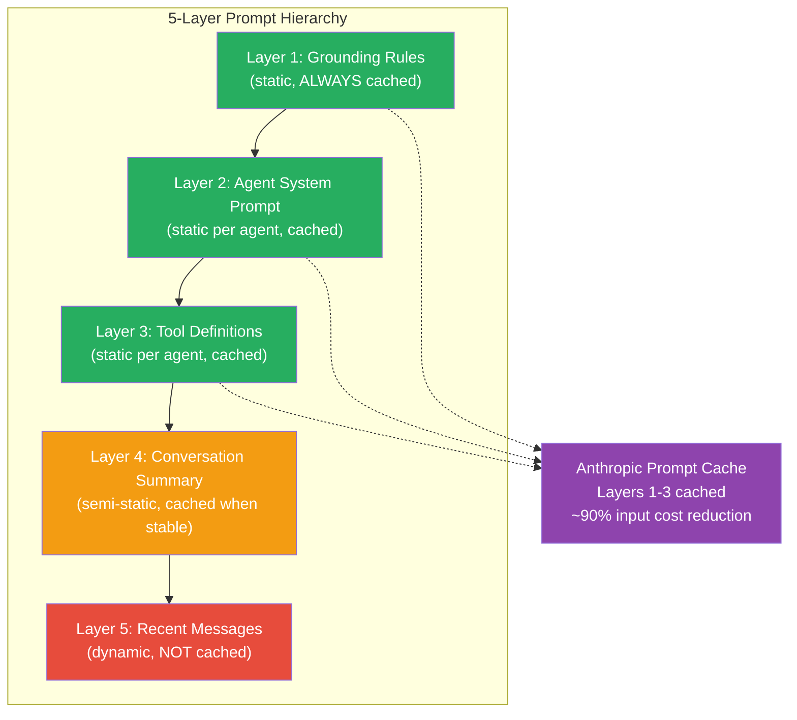
```mermaid
graph TB
    subgraph "5-Layer Prompt Hierarchy"
        L1["Layer 1: Grounding Rules<br/>(static, ALWAYS cached)"]
        L2["Layer 2: Agent System Prompt<br/>(static per agent, cached)"]
        L3["Layer 3: Tool Definitions<br/>(static per agent, cached)"]
        L4["Layer 4: Conversation Summary<br/>(semi-static, cached when stable)"]
        L5["Layer 5: Recent Messages<br/>(dynamic, NOT cached)"]
    end

    L1 --> L2 --> L3 --> L4 --> L5

    CACHE["Anthropic Prompt Cache<br/>Layers 1-3 cached<br/>~90% input cost reduction"]

    L1 -.-> CACHE
    L2 -.-> CACHE
    L3 -.-> CACHE

    style L1 fill:#27ae60,color:#fff
    style L2 fill:#27ae60,color:#fff
    style L3 fill:#27ae60,color:#fff
    style L4 fill:#f39c12,color:#fff
    style L5 fill:#e74c3c,color:#fff
    style CACHE fill:#8e44ad,color:#fff
```

### Python Prompt Templates

Each agent uses LangChain's `ChatPromptTemplate` + LLM + `OutputParser`:

| Agent | Prompt Pattern | Output Format |
|-------|---------------|---------------|
| Content Analysis | Structured JSON extraction | `{topics, entities, dates, style}` |
| Summarization | 2-3 paragraphs, government tone | Plain text (150-200 words) |
| Classification | Topic assignment with confidence | `["Politics", "Healthcare"]` |
| Sentiment | Score + dimensional analysis | `{score, tone, objectivity, urgency}` |
| Quality Check | Pass/fail with dimensional scoring | `{score: 0.85, pass: true}` |

### MCP Prompt Registry

7 versioned prompts with argument substitution:

| Category | Prompts |
|----------|---------|
| Summarization (2) | `summarize_article_prompt`, `executive_brief_prompt` |
| Analysis (3) | `analyze_sentiment_prompt`, `classify_article_prompt`, `quality_audit_prompt` |
| Governance (2) | `red_team_bias_prompt`, `incident_triage_prompt` |

---

## Error Recovery & Resilience

### TypeScript Resilience

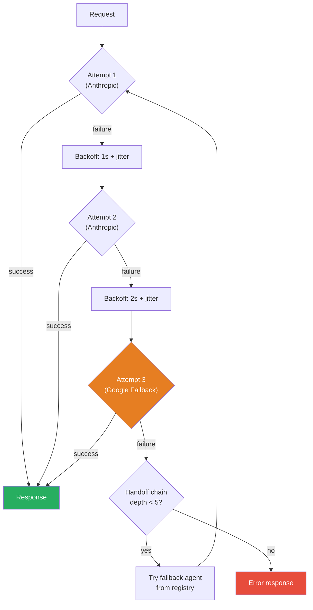
```mermaid
flowchart TD
    REQ["Request"] --> TRY1{"Attempt 1<br/>(Anthropic)"}
    TRY1 -->|success| DONE["Response"]
    TRY1 -->|failure| WAIT1["Backoff: 1s + jitter"]
    WAIT1 --> TRY2{"Attempt 2<br/>(Anthropic)"}
    TRY2 -->|success| DONE
    TRY2 -->|failure| WAIT2["Backoff: 2s + jitter"]
    WAIT2 --> TRY3{"Attempt 3<br/>(Google Fallback)"}
    TRY3 -->|success| DONE
    TRY3 -->|failure| HANDOFF{"Handoff chain<br/>depth < 5?"}
    HANDOFF -->|yes| FALLBACK["Try fallback agent<br/>from registry"]
    HANDOFF -->|no| ERR["Error response"]
    FALLBACK --> TRY1

    style DONE fill:#27ae60,color:#fff
    style ERR fill:#e74c3c,color:#fff
    style TRY3 fill:#e67e22,color:#fff
```

### Python Error Recovery Engine

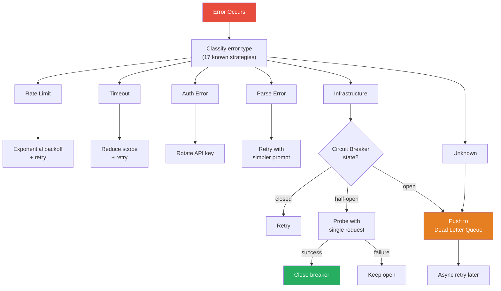
```mermaid
flowchart TD
    ERR["Error Occurs"] --> CLASSIFY["Classify error type<br/>(17 known strategies)"]

    CLASSIFY --> RATE["Rate Limit"] --> BACK1["Exponential backoff<br/>+ retry"]
    CLASSIFY --> TIMEOUT["Timeout"] --> BACK2["Reduce scope<br/>+ retry"]
    CLASSIFY --> AUTH["Auth Error"] --> ROTATE["Rotate API key"]
    CLASSIFY --> PARSE["Parse Error"] --> RETRY_PARSE["Retry with<br/>simpler prompt"]
    CLASSIFY --> INFRA["Infrastructure"] --> CB_CHECK{"Circuit Breaker<br/>state?"}
    CLASSIFY --> UNKNOWN["Unknown"] --> DLQ_PUSH["Push to<br/>Dead Letter Queue"]

    CB_CHECK -->|"closed"| RETRY["Retry"]
    CB_CHECK -->|"half-open"| PROBE["Probe with<br/>single request"]
    CB_CHECK -->|"open"| DLQ_PUSH

    PROBE -->|success| CLOSE["Close breaker"]
    PROBE -->|failure| OPEN["Keep open"]

    DLQ_PUSH --> ASYNC["Async retry later"]

    style ERR fill:#e74c3c,color:#fff
    style DLQ_PUSH fill:#e67e22,color:#fff
    style CLOSE fill:#27ae60,color:#fff
```

---

## Observability

### Metrics & Logging Architecture

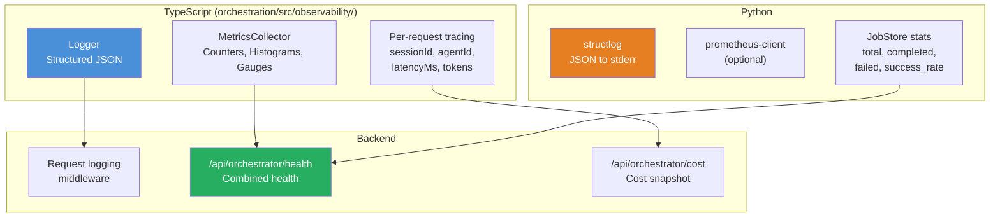
```mermaid
graph TB
    subgraph "TypeScript (orchestration/src/observability/)"
        TS_LOG["Logger<br/>Structured JSON"]
        TS_MET["MetricsCollector<br/>Counters, Histograms, Gauges"]
        TS_TRACE["Per-request tracing<br/>sessionId, agentId,<br/>latencyMs, tokens"]
    end

    subgraph "Python"
        PY_LOG["structlog<br/>JSON to stderr"]
        PY_MET["prometheus-client<br/>(optional)"]
        PY_JOBS["JobStore stats<br/>total, completed,<br/>failed, success_rate"]
    end

    subgraph "Backend"
        BE_LOG["Request logging<br/>middleware"]
        BE_HEALTH["/api/orchestrator/health<br/>Combined health"]
        BE_COST["/api/orchestrator/cost<br/>Cost snapshot"]
    end

    TS_LOG --> BE_LOG
    TS_MET --> BE_HEALTH
    PY_JOBS --> BE_HEALTH
    TS_TRACE --> BE_COST

    style TS_LOG fill:#4a90d9,color:#fff
    style PY_LOG fill:#e67e22,color:#fff
    style BE_HEALTH fill:#27ae60,color:#fff
```

---

## Environment Variables

### TypeScript Orchestration

| Variable | Required | Default | Purpose |
|----------|----------|---------|---------|
| `ANTHROPIC_API_KEY` | One provider required | — | Anthropic API auth |
| `GOOGLE_API_KEY` | One provider required | — | Google AI API auth |
| `ORCHESTRATION_DAILY_BUDGET_USD` | No | `10` | Daily cost cap |
| `ORCHESTRATION_MAX_CONCURRENCY` | No | `5` | Max concurrent requests |
| `ORCHESTRATION_TIMEOUT_MS` | No | `60000` | Request timeout |
| `ORCHESTRATION_MAX_HANDOFF_DEPTH` | No | `5` | Max agent hops |
| `ORCHESTRATION_MAX_ACTIVE_MESSAGES` | No | `20` | Session compaction threshold |
| `ORCHESTRATION_LOG_LEVEL` | No | `info` | Log verbosity |
| `PIPELINE_API_URL` | No | `http://localhost:8100` | Python pipeline bridge URL |
| `PIPELINE_TIMEOUT_MS` | No | `120000` | Pipeline request timeout |

### Python Pipeline

| Variable | Required | Default | Purpose |
|----------|----------|---------|---------|
| `DEFAULT_LLM_PROVIDER` | No | `google` | LLM provider selection |
| `DEFAULT_MODEL` | No | `gemini-1.5-flash` | Model name |
| `GOOGLE_AI_API_KEY` | Yes (if google) | — | Google Generative AI key |
| `OPENAI_API_KEY` | If openai | — | OpenAI key |
| `ANTHROPIC_API_KEY` | If anthropic | — | Anthropic key |
| `COHERE_API_KEY` | If cohere | — | Cohere key |
| `MONGODB_URI` | No | `mongodb://127.0.0.1:27017/synthora_ai` | Article storage |
| `PINECONE_API_KEY` | No | — | Vector search |
| `MAX_ITERATIONS` | No | `10` | Quality check retry limit |
| `AGENT_TIMEOUT` | No | `300` | Agent timeout (seconds) |

### MCP Server

| Variable | Default | Purpose |
|----------|---------|---------|
| `MCP_SERVER_NAME` | `synthora-agentic-pipeline` | Server identity |
| `MCP_MAX_CONTENT_CHARS` | `20000` | Content size limit |
| `MCP_MAX_BATCH_ITEMS` | `25` | Max batch size |
| `MCP_MAX_JOB_HISTORY` | `1000` | Max retained jobs |
| `MCP_JOB_TTL_SECONDS` | `86400` | Job retention (24h) |

---

## Deployment Architecture

### Production Topology

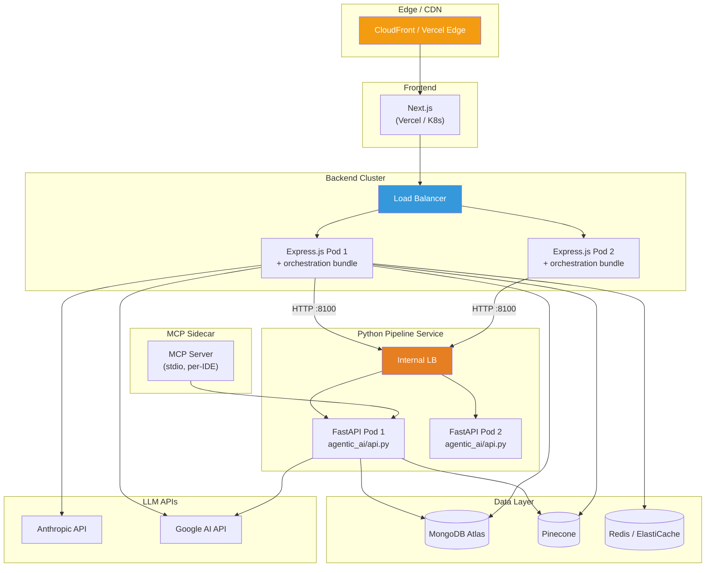
```mermaid
graph TB
    subgraph "Edge / CDN"
        CF["CloudFront / Vercel Edge"]
    end

    subgraph "Frontend"
        NEXT["Next.js<br/>(Vercel / K8s)"]
    end

    subgraph "Backend Cluster"
        LB["Load Balancer"]
        BE1["Express.js Pod 1<br/>+ orchestration bundle"]
        BE2["Express.js Pod 2<br/>+ orchestration bundle"]
    end

    subgraph "Python Pipeline Service"
        PY_LB["Internal LB"]
        PY1["FastAPI Pod 1<br/>agentic_ai/api.py"]
        PY2["FastAPI Pod 2<br/>agentic_ai/api.py"]
    end

    subgraph "MCP Sidecar"
        MCP1["MCP Server<br/>(stdio, per-IDE)"]
    end

    subgraph "Data Layer"
        MONGO[(MongoDB Atlas)]
        PINE[(Pinecone)]
        REDIS[(Redis / ElastiCache)]
    end

    subgraph "LLM APIs"
        ANTH["Anthropic API"]
        GOOG["Google AI API"]
    end

    CF --> NEXT
    NEXT --> LB
    LB --> BE1
    LB --> BE2
    BE1 -->|"HTTP :8100"| PY_LB
    BE2 -->|"HTTP :8100"| PY_LB
    PY_LB --> PY1
    PY_LB --> PY2

    BE1 --> ANTH
    BE1 --> GOOG
    PY1 --> GOOG
    PY1 --> MONGO
    PY1 --> PINE

    MCP1 --> PY1

    BE1 --> MONGO
    BE1 --> PINE
    BE1 --> REDIS

    style CF fill:#f39c12,color:#fff
    style LB fill:#3498db,color:#fff
    style PY_LB fill:#e67e22,color:#fff
```

### Local Development

```bash
# 1. Start Python pipeline bridge
cd agentic_ai && uvicorn api:app --host 0.0.0.0 --port 8100 --reload

# 2. Start backend (includes TypeScript orchestration)
cd backend && npm run dev

# 3. Start frontend
cd frontend && npm run dev

# 4. (Optional) Start MCP server for Claude Code
PYTHONPATH=. python -m mcp_server
```

### Infrastructure

See `infrastructure/` for:
- Terraform modules (`infrastructure/terraform/`)
- Kubernetes manifests (`infrastructure/kubernetes/`)
- Monitoring and alerting (`infrastructure/monitoring/`)
- Deployment wrappers (`infrastructure/scripts/`)

---

## Development Workflow

### Build & Test Pipeline

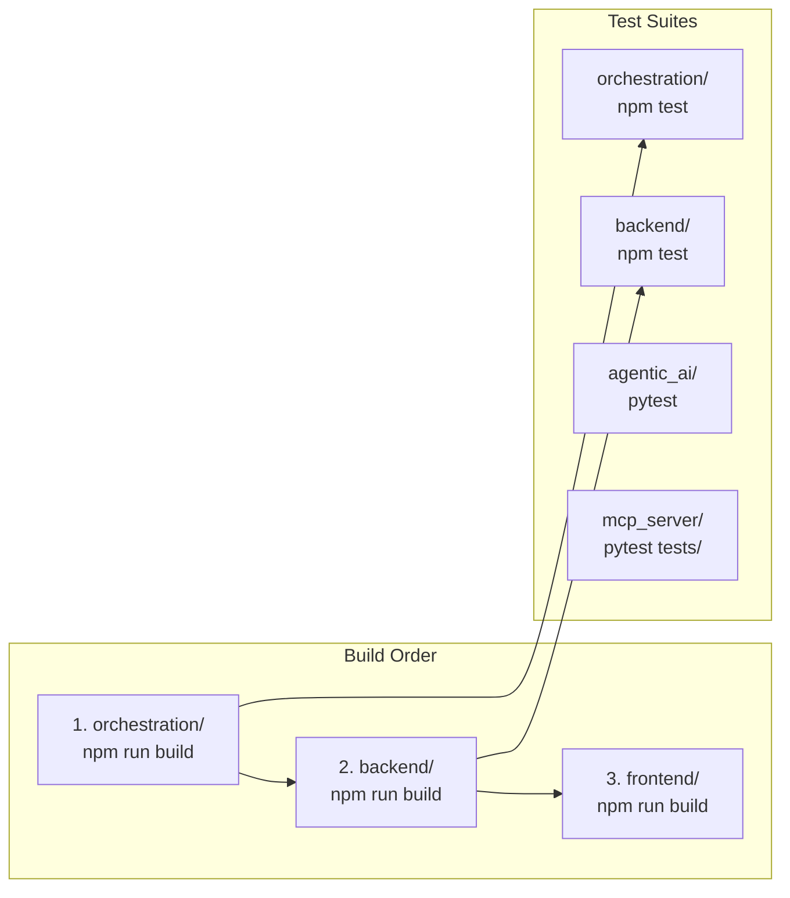
```mermaid
flowchart LR
    subgraph "Build Order"
        B1["1. orchestration/<br/>npm run build"]
        B2["2. backend/<br/>npm run build"]
        B3["3. frontend/<br/>npm run build"]
    end

    subgraph "Test Suites"
        T1["orchestration/<br/>npm test"]
        T2["backend/<br/>npm test"]
        T3["agentic_ai/<br/>pytest"]
        T4["mcp_server/<br/>pytest tests/"]
    end

    B1 --> B2 --> B3
    B1 --> T1
    B2 --> T2
    T3
    T4
```

### Adding a New Chat Agent

1. Create system prompt in `orchestration/src/agents/prompts/system/`
2. Register in `AgentRegistry.createWithDefaults()` (`agent-registry.ts`)
3. Add capabilities to `INTENT_CAPABILITY_MAP`
4. Add Google fallback agent with matching capabilities
5. Rebuild: `cd orchestration && npm run build`

### Adding a New Pipeline Agent

1. Create agent class extending `BaseAgent` in `agentic_ai/agents/`
2. Add as node in the LangGraph `StateGraph` in `core/pipeline.py`
3. Wire conditional edges for the new node
4. Add MCP tool in `mcp_server/tools/` if exposing via MCP
5. Add HTTP endpoint in `agentic_ai/api.py` if exposing via HTTP
6. Rebuild and restart Python service
