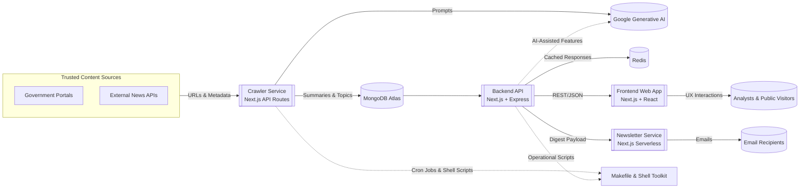
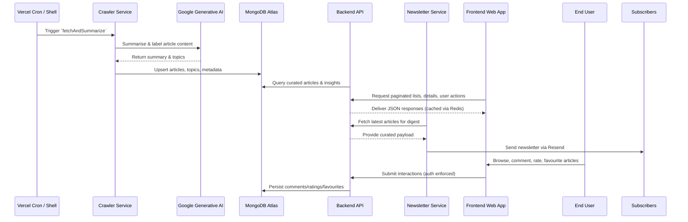
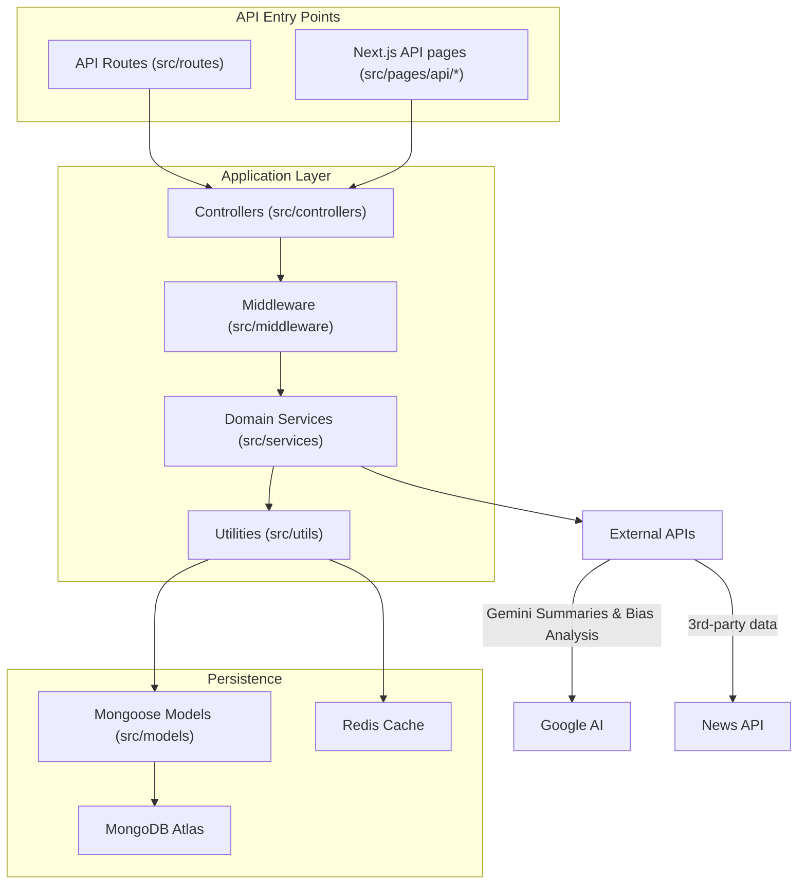
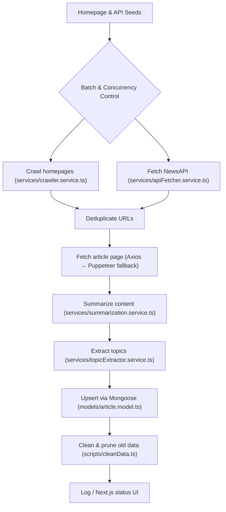
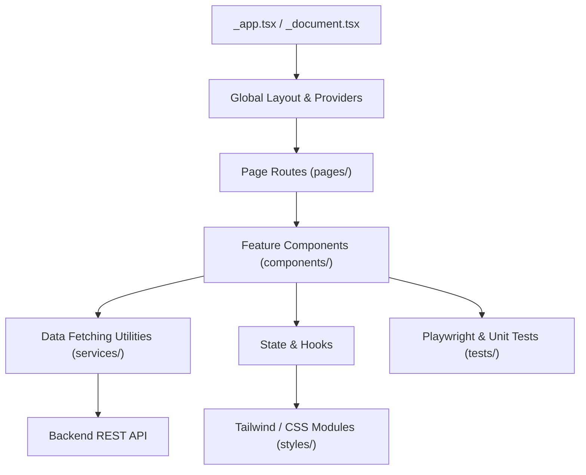
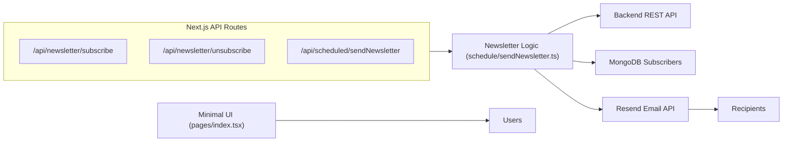
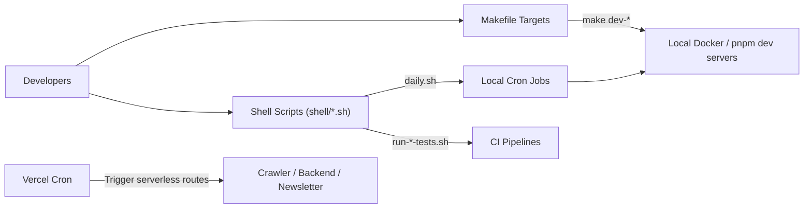

# SynthoraAI Architecture

This document provides a detailed view of the SynthoraAI monorepo and the way its services collaborate to curate, enrich, and deliver trusted government content. It expands on the high-level overview in the root `README.md` and is intended for engineers, contributors, and operators who need to understand how the pieces fit together.

## System Context

* **Shared database:** MongoDB Atlas acts as the single source of truth. Both the crawler and backend share data models (articles, comments, ratings, newsletter subscribers, chat sessions, and users).
* **AI integrations:** Google Generative AI powers summarisation, topic extraction, and conversational experiences. The crawler invokes it when harvesting content, while the backend uses it for on-demand chat/Q&A features.
* **Automation:** Cron jobs (Vercel Cron + shell scripts under `shell/`) coordinate scheduled crawls, data hygiene, newsletters, and ad-hoc management tasks.

## Service Responsibilities

| Service | Location | Primary Responsibilities | Key Tech | Deployment |
| --- | --- | --- | --- | --- |
| **Backend API** | `backend/` | REST endpoints, authentication, comments, ratings, bias analysis, topic extraction, newsletter webhooks, chat assistant, scheduled ingestion backup | Next.js (API routes), Express, TypeScript, Mongoose, Redis, Google Generative AI | Vercel (serverless) & Docker for local dev |
| **Crawler** | `crawler/` | Crawl homepages & APIs, deduplicate URLs, fetch full articles (Axios/Cheerio/Puppeteer), summarise via AI, extract topics, upsert into MongoDB, run clean-up scripts, expose monitoring UI | Next.js API routes, Puppeteer, Axios, Cheerio, TypeScript | Vercel (cron-triggered) & Docker |
| **Frontend Web App** | `frontend/` | User-facing portal with article lists, filters, detail views, theming, authentication UX, client-side article discussions | Next.js, React, Tailwind CSS, TypeScript | Vercel & Docker |
| **Newsletter Service** | `newsletters/` | Manage subscriber list, generate daily digests, call Resend, expose subscription/unsubscription endpoints | Next.js API routes, Resend SDK, TypeScript | Vercel cron route & Docker |
| **Python Crawler Toolkit** | `python_crawler/`, `backend/src/python_crawler/`, `crawler/python_crawler/` | Async crawling alternative with CLI, concurrency controls, local summarisation runner | Python, `aiohttp`, Google Generative AI SDK | Manual/CLI |
| **Shell & Make CLI** | `shell/`, `Makefile`, `daily.sh` | Developer ergonomics: bootstrap, dev servers, builds, scheduled jobs, lint/test runners, orchestration of multi-service workflows | Bash, Node.js scripts | Local/CI |

## End-to-End Data Flow

## Backend Architecture

* **Controllers:** Thin orchestration layer mapping HTTP routes to service operations (`article.controller.ts`, `auth.controller.ts`, `biasAnalysis.controller.ts`, etc.).
* **Services:** Encapsulate business logic (`summarization.service.ts`, `topicExtractor.service.ts`, `apiFetcher.service.ts`, `biasAnalysis.service.ts`, `crawler.service.ts`).
* **Middleware:** `auth.middleware.ts` validates JWTs and guards protected routes.
* **Utilities:** `utils/logger.ts` centralises logging, `utils/redis.ts` configures caching helpers.
* **Scheduling:** `src/schedule/fetchAndSummarize.ts` mirrors the crawler pipeline as a backup ingestion path, deployable as a Vercel cron job.
* **Python Companion:** `src/python_crawler/` mirrors the standalone Python toolkit for teams preferring async Python ingestion.

## Crawler Architecture

* **Resilience:** Retries, Puppeteer fallbacks, and timeout guards keep ingestion resilient to flaky endpoints.
* **Concurrency:** Batches are controlled through constants (e.g., `FETCH_CONCURRENCY`, `CRAWL_CONCURRENCY`) to balance throughput vs. rate limits.
* **Monitoring:** The landing page (`pages/index.tsx`) surfaces status context and helpful links for operators.
* **Scripts:** `scripts/fetchLatestArticles.ts`, `scripts/cleanData.ts`, and `schedule/fetchAndSummarize.ts` offer reusable workflows for CLI and cron usage.

## Frontend Architecture

* **Home experience:** Hero slider, latest articles, filters, and quick links built from modular components.
* **Article view:** Dynamic route under `pages/articles/[id].tsx` renders summaries, full text, metadata, comments, and related interactions.
* **Theming:** Dark/light support via `ThemeToggle` and Tailwind utilities.
* **Testing:** Playwright end-to-end suites and Jest/React Testing Library tests ensure regression safety.

## Newsletter Service Architecture

* **Digest creation:** Aggregates the most recent curated articles (via backend API) and truncates to digest-friendly snippets.
* **Resend integration:** Handles templating and delivery, with unsubscribe links driven by backend endpoints.
* **Landing page:** Provides human-readable information and redirects to the main products.

## Automation & Tooling

* **Unified entrypoints:** `bootstrap.sh`, `dev-*.sh`, `build-*.sh`, and `start-*.sh` scripts standardise local setup and deployment chores.
* **Daily automation:** `daily.sh` chains crawler ingestion, cleanup, and newsletter send-off for environments outside Vercel Cron.
* **Management utilities:** `shell/management.js` and `shell/utils.js` expose Node-based helpers for advanced orchestration.

## Data Model Overview

* **Articles (`article.model.ts`):** URL, title, content, AI summary, topics, source metadata, timestamps, and engagement metrics.
* **Users (`user.model.ts`):** Credentials, roles, favourites, JWT tokens.
* **Comments (`comment.model.ts`):** Threaded discussions tied to articles, with moderation flags.
* **Ratings (`rating.model.ts`):** Numerical sentiment/bias ratings per article.
* **Chat Sessions (`chatSession.ts`):** Stores context for AI-assisted Q&A.
* **Newsletter Subscribers (`newsletterSubscriber.model.ts`):** Email addresses and opt-in metadata.

These shared schemas enable consistent behaviour across services and streamline analytics.

## Deployment Considerations

* **Vercel serverless targets:** Each Next.js service (`backend/`, `crawler/`, `frontend/`, `newsletters/`) ships with its own `vercel.json` defining rewrites, cron jobs, and serverless entrypoints.
* **Container images:** Dockerfiles in each service support containerised development/testing. `docker-compose.yml` files mirror multi-service setups.
* **Environment management:** `.env` files (see per-service README) surface required secrets—MongoDB URIs, Google AI keys, Resend credentials, JWT secrets, etc.
* **CI/CD hooks:** Husky + lint/test scripts (configured in `package.json`) protect branches, while GitHub Actions (referenced in repo but configured externally) can call the provided shell scripts.

---

For further details, consult the individual service READMEs and inline documentation within each module.
