# Citation System & Hallucination Guardrails - SynthoraAI Documentation

## Table of Contents

- [Overview](#overview)
- [Citation System](#citation-system)
  - [Backend Implementation](#backend-implementation)
    - [System Instruction Enforcement](#system-instruction-enforcement)
    - [Citation Format](#citation-format)
    - [Citation Metadata](#citation-metadata)
  - [Frontend Implementation](#frontend-implementation)
    - [Interactive Inline Citations](#interactive-inline-citations)
    - [Citation List](#citation-list)
    - [Visual Design](#visual-design)
- [Hallucination Guardrails](#hallucination-guardrails)
  - [Detection Mechanisms](#detection-mechanisms)
    - [1. Missing Citations Check](#1-missing-citations-check)
    - [2. Invalid Citation Check](#2-invalid-citation-check)
    - [3. Unsourced Information Check](#3-unsourced-information-check)
    - [4. Confident Language Without Citations](#4-confident-language-without-citations)
    - [5. Numeric Claims Without Citations](#5-numeric-claims-without-citations)
  - [Warning Display](#warning-display)
  - [Accuracy-First Approach](#accuracy-first-approach)
- [Technical Implementation](#technical-implementation)
  - [Backend: Hallucination Detection Function](#backend-hallucination-detection-function)
  - [Frontend: Citation Rendering](#frontend-citation-rendering)
  - [SSE Event Types](#sse-event-types)
- [User Experience Flow](#user-experience-flow)
  - [1. User Asks Question](#1-user-asks-question)
  - [2. System Searches Sources](#2-system-searches-sources)
  - [3. AI Generates Response with Citations](#3-ai-generates-response-with-citations)
  - [4. User Interacts with Citations](#4-user-interacts-with-citations)
  - [5. Quality Checks (If Needed)](#5-quality-checks-if-needed)
- [Best Practices](#best-practices)
  - [For Users](#for-users)
  - [For Developers](#for-developers)
- [Metrics to Track](#metrics-to-track)
  - [Citation Quality Metrics](#citation-quality-metrics)
  - [Hallucination Metrics](#hallucination-metrics)
  - [User Engagement](#user-engagement)
- [Troubleshooting](#troubleshooting)
  - [Issue: No Citations in Response](#issue-no-citations-in-response)
  - [Issue: Too Many Warnings](#issue-too-many-warnings)
  - [Issue: Citations Not Linking Correctly](#issue-citations-not-linking-correctly)
- [Future Enhancements](#future-enhancements)
  - [Short Term (1-2 Weeks)](#short-term-1-2-weeks)
  - [Medium Term (1-2 Months)](#medium-term-1-2-months)
  - [Long Term (3+ Months)](#long-term-3-months)

## Overview

The enhanced chatbot now includes a robust citation system with inline references and comprehensive hallucination detection mechanisms. This ensures responses are accurate, verifiable, and grounded in source documents.


## Citation System

### Backend Implementation

#### System Instruction Enforcement

The AI is instructed to:
- **ALWAYS** cite sources using `[Source N]` notation
- **ONLY** use information from provided sources
- **NEVER** make up or invent information
- Explicitly acknowledge when sources don't contain requested information
- Distinguish between facts from sources and analysis

#### Citation Format

```
According to the report [Source 1], the policy was implemented in 2024.
Multiple sources [Source 1, 2] confirm this finding.
```

#### Citation Metadata

Each citation includes:
- `number` - Citation reference number
- `id` - Article ID in database
- `title` - Article title
- `source` - Publication source
- `url` - Link to original article
- `fetchedAt` - When article was retrieved
- `score` - Similarity score from Pinecone search

### Frontend Implementation

#### Interactive Inline Citations

Citations appear as clickable superscript numbers `[1]` inline with the text:
- **Hover**: Citation number changes color and moves up slightly
- **Click**: Scrolls to the citation in the sources list
- **Visual Feedback**: Highlights the corresponding source for 2 seconds

#### Citation List

At the end of each AI response:
- **Sources Header**: Clear label for the citations section
- **Citation Cards**: Each source displayed with:
  - Citation number `[N]`
  - Article title
  - Source publication
  - "View source →" link (opens in new tab)
- **Hover Effect**: When hovering inline citation, corresponding source card highlights

#### Visual Design

- **Inline Citations**: Blue color (`#60a5fa`), hover brightens to `#3b82f6`
- **Citation Cards**: Dark background with subtle borders, hover adds blue accent
- **Smooth Animations**: All interactions have 0.2s transitions
- **Responsive**: Works on all screen sizes

```mermaid
flowchart LR
    SSE["SSE citations event"] --> State["Store citation metadata\n(message context)"]
    State --> RenderText["Render message text\nwith superscript anchors"]
    State --> RenderCards["Render source cards\nnumber, title, domain, link"]
    UserHover["Hover inline citation"] --> Highlight["Highlight matching card"]
    UserClick["Click inline citation"] --> Scroll["Scroll to card\n+ temporary highlight"]
    UserClick --> OpenLink["Click 'View →'\nopens new tab"]
```



## Hallucination Guardrails

### Detection Mechanisms

The system performs **5 comprehensive checks** on every AI response:


#### 1. Missing Citations Check

**What it detects:**
- Responses that don't cite sources when sources are available

**Why it matters:**
- If sources are provided but not cited, the AI may be generating content from its training data instead of the sources

**Example:**
```
⚠️ Response lacks citations despite having available sources
```

#### 2. Invalid Citation Check

**What it detects:**
- Citations referencing non-existent source numbers
- e.g., `[Source 10]` when only 5 sources exist

**Why it matters:**
- Prevents AI from creating fake citations

**Example:**
```
⚠️ Citation [Source 6] references non-existent source
```

#### 3. Unsourced Information Check

**What it detects:**
- Responses providing specific information when no sources are available
- Checks if AI acknowledges lack of sources

**Why it matters:**
- AI should explicitly state when it doesn't have source material

**Required phrases when no sources:**
- "I don't have..."
- "No information..."
- "Not in the sources..."
- "Not available in the database..."

**Example:**
```
⚠️ Response provides information without available sources
```

#### 4. Confident Language Without Citations

**What it detects:**
- Use of overly confident phrases without nearby citations
- Checks within 50 characters before/after phrase

**Monitored phrases:**
- "definitely"
- "certainly"
- "without a doubt"
- "it is clear that"
- "obviously"
- "undoubtedly"

**Why it matters:**
- Confident claims should be backed by sources

**Example:**
```
⚠️ Response uses confident language without nearby citations
```

#### 5. Numeric Claims Without Citations

**What it detects:**
- Statistics, percentages, or numbers without citations nearby
- Checks within 100 characters after the number

**Patterns monitored:**
- Percentages: `45%`
- Large numbers: `5 million`, `2 billion`
- Currency: `100 dollars`

**Why it matters:**
- Specific numbers should come from sources, not AI training data

**Example:**
```
⚠️ Response includes specific numbers/statistics without citations
```

### Warning Display

When warnings are detected:

```
⚠️ Quality check detected potential issues. Please verify information independently.
```

- **Visual**: Yellow warning box with icon
- **Message**: Clear indication that response may have issues
- **Action**: User should verify information with original sources
- **Placement**: Appears at the top of the message, before text

### Accuracy-First Approach

The system prioritizes accuracy over completeness:
- ✅ Better to say "I don't know" than provide uncited information
- ✅ Better to acknowledge gaps than fill them with speculation
- ✅ Better to provide less information with citations than more without

## Technical Implementation

### Backend: Hallucination Detection Function

Located in: `backend/src/controllers/chat.controller.ts`

```typescript
function detectHallucinations(
  response: string,
  citationMetadata: any[],
  relevantArticles: any[]
): string[]
```

- **Input**: Full AI response, citation metadata, source articles
- **Output**: Array of warning messages
- **Runs**: After streaming completes, before sending "done" event
- **Performance**: Negligible impact (~5-10ms)

### Frontend: Citation Rendering

Located in: `frontend/pages/ai_chat.tsx`

```typescript
function MessageContent({ message }: { message: Message })
```

- **Parses**: Text for `[Source N]` patterns
- **Converts**: Citations to interactive React components
- **Manages**: Hover state for visual feedback
- **Handles**: Click events for scrolling to sources

### SSE Event Types

The streaming API sends these events:

```typescript
// Citation metadata
event: citations
data: {"sources": [...]}

// Hallucination warnings
event: warnings
data: {"message": "...", "warnings": [...]}

// Text chunks (existing)
event: chunk
data: {"text": "..."}

// Completion (enhanced)
event: done
data: {"success": true, "citationCount": 5}
```

## User Experience Flow

### 1. User Asks Question

```
User: "What are the latest climate policies?"
```

### 2. System Searches Sources

```
🔍 Searching relevant articles...
📄 Found 5 relevant sources
```

### 3. AI Generates Response with Citations

```
According to recent reports [Source 1], new climate policies
were announced in January 2025. These policies focus on renewable
energy [Source 2] and carbon reduction targets [Source 1, 3].

Sources:
[1] Climate Policy Update 2025
    whitehouse.gov
    View source →

[2] Renewable Energy Initiative
    nytimes.com
    View source →

[3] Carbon Reduction Targets
    congress.gov
    View source →
```

### 4. User Interacts with Citations

- **Hover** inline citation → Source card highlights
- **Click** inline citation → Scroll to source
- **Click** "View source" → Open original article

### 5. Quality Checks (If Needed)

If issues detected:
```
⚠️ Quality check detected potential issues.
Please verify information independently.
```

## Best Practices

### For Users

1. **Check Sources**: Click "View source" links to verify information
2. **Look for Citations**: Well-cited responses are more reliable
3. **Heed Warnings**: If warning appears, cross-reference with other sources
4. **Use Citations**: Click inline citations to see which source supports which claim

### For Developers

1. **Monitor Warnings**: Log hallucination warnings for analysis
2. **Tune Thresholds**: Adjust detection sensitivity based on false positive rate
3. **Expand Patterns**: Add more confident phrases or numeric patterns as needed
4. **Update Instructions**: Refine system instruction based on AI behavior
5. **A/B Test**: Compare cited vs uncited response quality

## Metrics to Track

### Citation Quality Metrics

- **Citation Rate**: % of responses with citations when sources available
- **Citation Density**: Average citations per 100 words
- **Source Coverage**: % of provided sources actually cited
- **Invalid Citations**: Count of citations to non-existent sources

### Hallucination Metrics

- **Warning Rate**: % of responses triggering warnings
- **Warning Types**: Distribution of warning categories
- **False Positive Rate**: Warnings on actually good responses
- **User Verification**: How often users click "View source" after warnings

### User Engagement

- **Citation Clicks**: How often users click inline citations
- **Source Visits**: How often users click "View source" links
- **Hover Interactions**: How often users hover over citations
- **Message Completeness**: Users satisfied with cited responses

## Troubleshooting

### Issue: No Citations in Response

**Possible Causes:**
1. No sources found in Pinecone (check vector database)
2. AI ignoring system instruction (adjust prompt)
3. Sources not relevant to query (improve search)

**Solutions:**
- Verify articles are vectorized: `npm run vectorize-articles`
- Check Pinecone index contents
- Review system instruction effectiveness

### Issue: Too Many Warnings

**Possible Causes:**
1. Detection too sensitive (false positives)
2. AI genuinely hallucinating frequently
3. Sources lack information for common queries

**Solutions:**
- Adjust detection thresholds
- Improve system instruction
- Expand source coverage in database

### Issue: Citations Not Linking Correctly

**Possible Causes:**
1. Citation numbering mismatch
2. Frontend parsing issues
3. Missing URL in metadata

**Solutions:**
- Verify backend sends correct citation metadata
- Check frontend regex pattern: `/\[Source (\d+(?:,\s*\d+)*)\]/gi`
- Ensure article URLs saved in Pinecone metadata

## Future Enhancements

### Short Term (1-2 Weeks)

1. **Citation Analytics Dashboard**
   - Track citation usage patterns
   - Identify most-cited sources
   - Monitor hallucination rates

2. **Smart Citation Suggestions**
   - AI suggests which sources to check first
   - Relevance scores displayed

3. **Quote Extraction**
   - Extract actual quotes from sources
   - Display quote snippets on hover

### Medium Term (1-2 Months)

1. **User Feedback Loop**
   - "Was this response accurate?" button
   - Report incorrect citations
   - Flag hallucinations

2. **Advanced Hallucination Detection**
   - Semantic similarity check between response and sources
   - Named entity verification
   - Temporal consistency checks (dates, timelines)

3. **Citation Styles**
   - Multiple citation format options (APA, MLA, Chicago)
   - Export citations for research papers

### Long Term (3+ Months)

1. **Multi-Modal Citations**
   - Image sources
   - Video timestamps
   - Audio transcripts

2. **Real-Time Fact Checking**
   - External fact-checking API integration
   - Cross-reference with multiple databases

3. **Citation Networks**
   - Visualize relationships between sources
   - Show citation paths through documents
