# MCP + ACP Architecture Guide

This document explains how SynthoraAI uses **MCP (Model Context Protocol)** and **ACP (Agent Communication Protocol)** together for production agent operations.

## Contents

- [Overview](#overview)
- [Why MCP and ACP both exist](#why-mcp-and-acp-both-exist)
- [End-to-end architecture](#end-to-end-architecture)
- [MCP surface (current)](#mcp-surface-current)
- [ACP protocol model](#acp-protocol-model)
- [Redis-backed ACP runtime model](#redis-backed-acp-runtime-model)
- [Production preflight and readiness gates](#production-preflight-and-readiness-gates)
- [Security and operational guardrails](#security-and-operational-guardrails)
- [Deployment patterns](#deployment-patterns)
- [Failure handling and fallback behavior](#failure-handling-and-fallback-behavior)
- [Validation checklist](#validation-checklist)

## Overview

MCP is the host-facing control plane (tool/resource/prompt interface).  
ACP is the agent-facing communication plane (agent registry + message lifecycle).

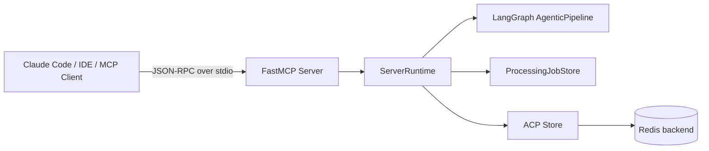

## Why MCP and ACP both exist

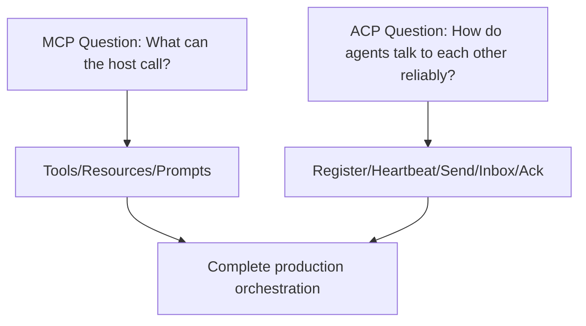

- **MCP** gives discoverability, standard invocation, host interoperability.
- **ACP** gives durable delivery semantics for inter-agent coordination.

## End-to-end architecture

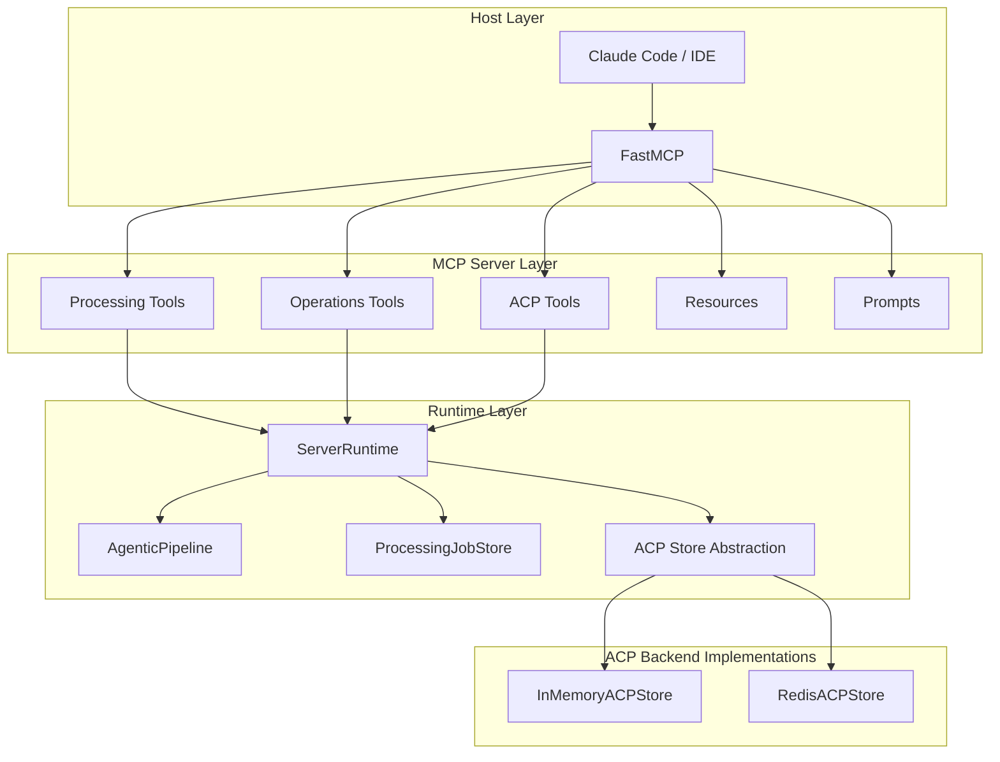

## MCP surface (current)

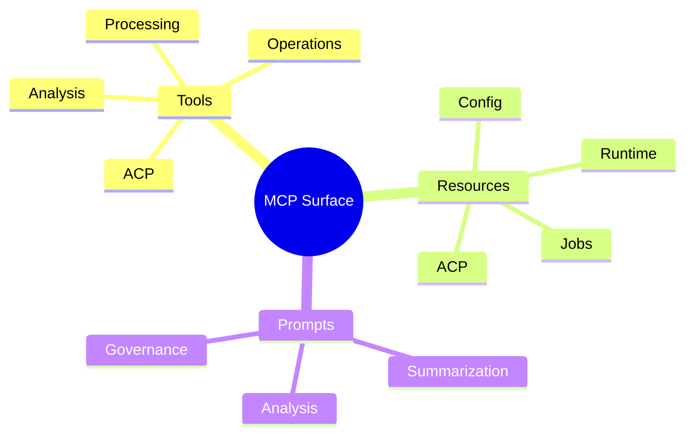

### Tool families

- **Processing:** article validation, single/batch processing, job status/result/list/purge.
- **Analysis:** content/sentiment/topics/quality metrics and summary generation.
- **Operations:** health/readiness/capabilities/provider diagnostics/preflight.
- **ACP:** register/unregister/heartbeat/send/fetch/ack/list/get.

### Resource families

- `config://*`, `runtime://*`, `jobs://*`, `topics://available`, `acp://*`.

## ACP protocol model

ACP message lifecycle:

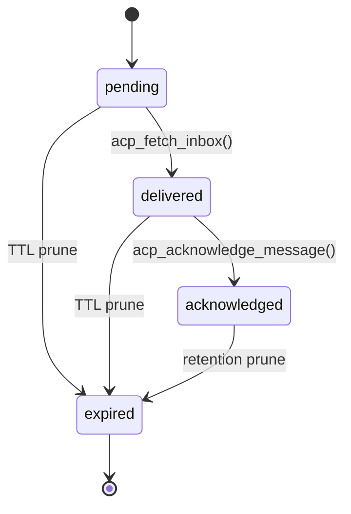

ACP actor lifecycle:

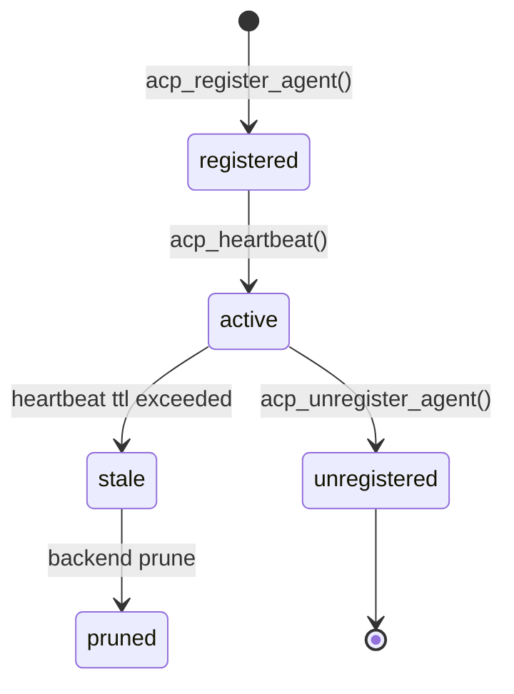

ACP roundtrip:

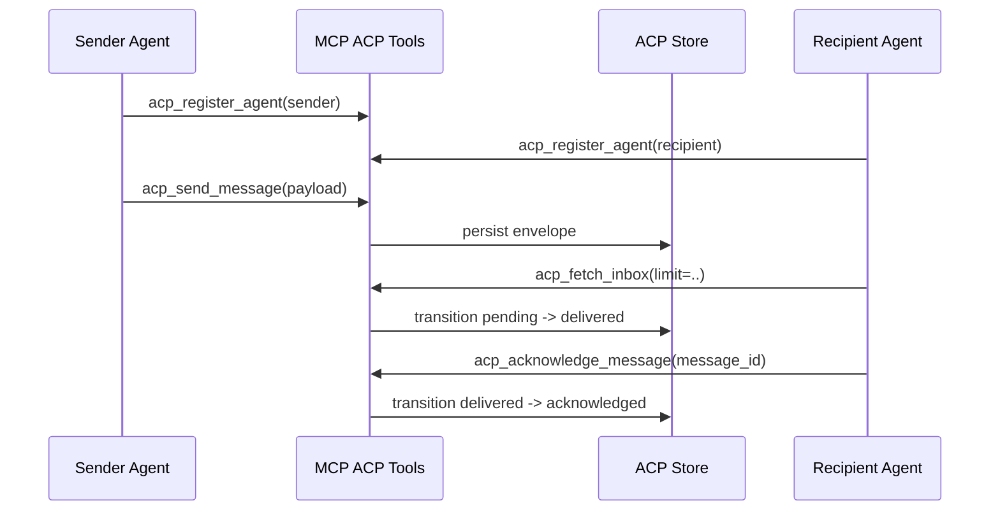

## Redis-backed ACP runtime model

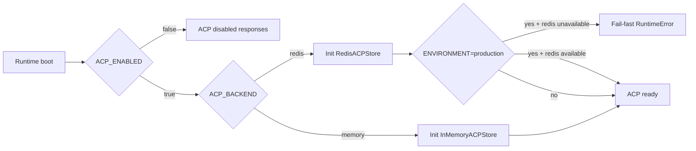

Redis data layout (logical):

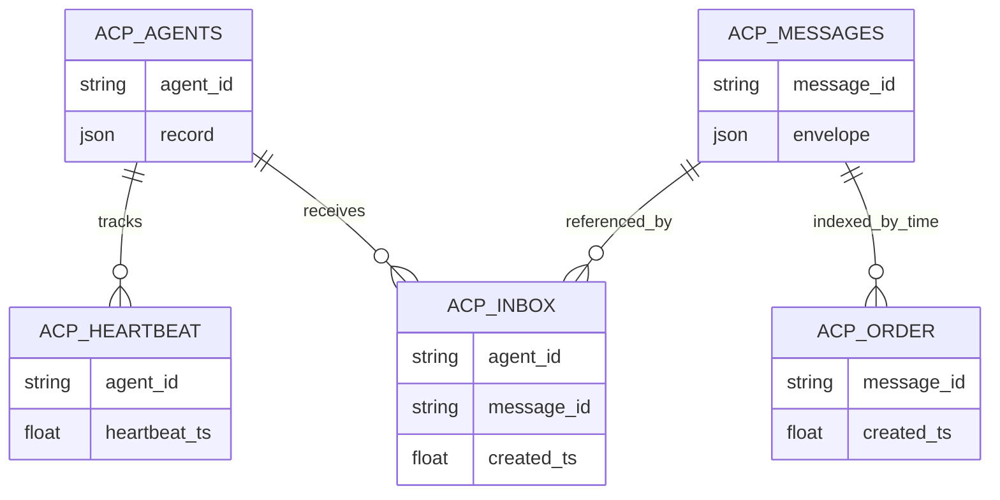

## Production preflight and readiness gates

`make mcp-preflight` validates:

1. Runtime compiled and pipeline ready.
2. ACP operational checks (`acp_preflight`):
   - Redis ping (when backend is redis)
   - register sender/recipient
   - send message
   - fetch recipient inbox
   - acknowledge message
   - cleanup/unregister

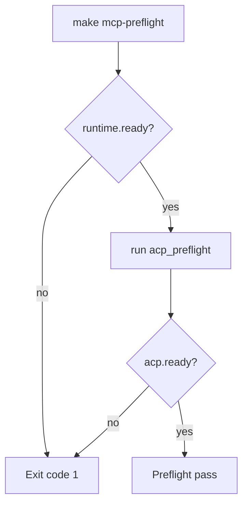

## Security and operational guardrails

- ACP enablement controlled via `ACP_ENABLED`.
- Production strict backend policy:
  - `ENVIRONMENT=production` + `ACP_ENABLED=true` + `ACP_BACKEND=redis` -> fail-fast if Redis unavailable.
- Payload and metadata limits:
  - `ACP_MAX_PAYLOAD_CHARS`
  - `ACP_MAX_METADATA_ENTRIES`
  - `ACP_MAX_CAPABILITIES`
- Message retention controls:
  - `ACP_MAX_MESSAGES`
  - `ACP_MESSAGE_TTL_SECONDS`
- Agent liveness controls:
  - `ACP_AGENT_TTL_SECONDS`

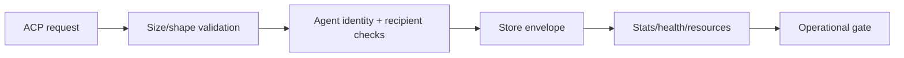

## Deployment patterns

### Local development

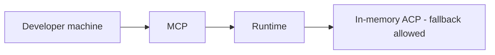

### Staging / production

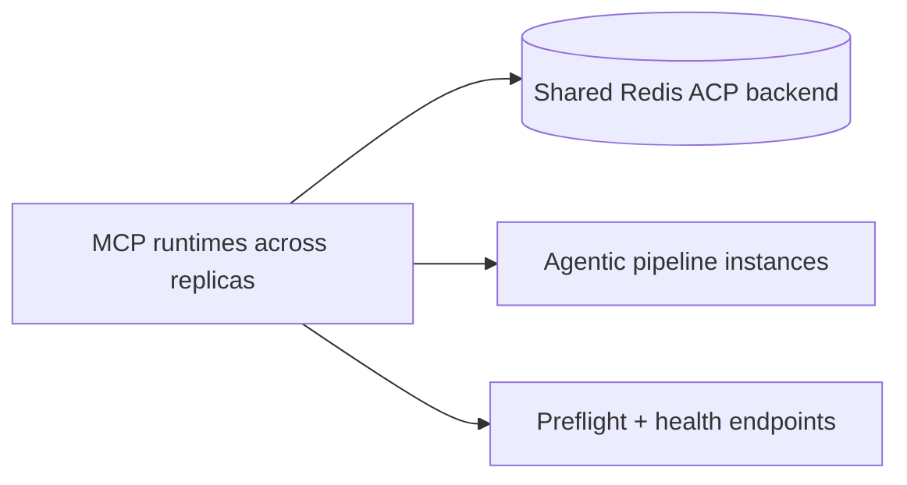

## Failure handling and fallback behavior

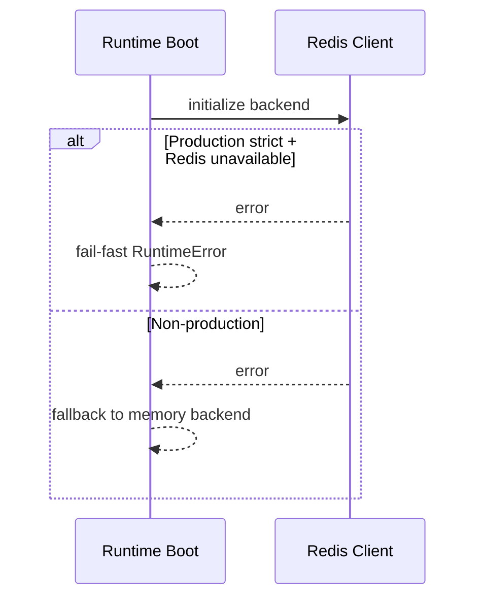

## Validation checklist

- [ ] `pip install -r agentic_ai/requirements.txt`
- [ ] `PYTHONPATH=.. pytest agentic_ai/tests/test_mcp_server_*.py`
- [ ] Redis reachable from runtime environment
- [ ] `ENVIRONMENT=production ACP_ENABLED=true ACP_BACKEND=redis make mcp-preflight`
- [ ] ACP resource checks in MCP host (`acp://stats`, `acp://agents`)
- [ ] Runtime readiness (`get_runtime_readiness`) and health (`check_pipeline_health`) healthy

---

For service-level details, see:
- [agentic_ai/README.md](agentic_ai/README.md)
- [mcp_server/README.md](mcp_server/README.md)
- [ARCHITECTURE.md](ARCHITECTURE.md)
- [AGENTIC-AI.md](AGENTIC-AI.md)
