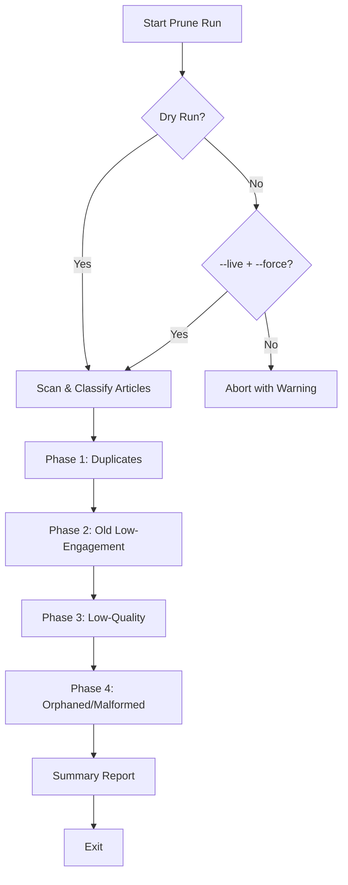

# Database Article Pruning Script

## Table of Contents

- [Overview](#overview)
- [Pruning Pipeline Diagram](#pruning-pipeline-diagram)
- [Current Database Stats](#current-database-stats)
- [Pruning Strategy](#pruning-strategy)
  - [Phase 1: Duplicate Removal](#phase-1-duplicate-removal)
  - [Phase 2: Old Low-Engagement Articles](#phase-2-old-low-engagement-articles)
  - [Phase 3: Low-Quality Articles](#phase-3-low-quality-articles)
  - [Phase 4: Orphaned/Malformed Articles](#phase-4-orphanedmalformed-articles)
- [Safety Features](#safety-features)
  - [Dry Run by Default](#dry-run-by-default)
  - [Confirmation Requirements](#confirmation-requirements)
  - [Comprehensive Logging](#comprehensive-logging)
  - [Data Preservation](#data-preservation)
- [Pre-Run Checklist](#pre-run-checklist)
- [Usage](#usage)
  - [Method 1: NPM Scripts (Recommended)](#method-1-npm-scripts-recommended)
  - [Method 2: Direct Execution](#method-2-direct-execution)
- [Example Output](#example-output)
- [Thresholds and Constants](#thresholds-and-constants)
- [Recommended Schedule](#recommended-schedule)
  - [Manual Execution](#manual-execution)
  - [Automated Scheduling (Future Enhancement)](#automated-scheduling-future-enhancement)
- [Monitoring & Maintenance](#monitoring--maintenance)
  - [Key Metrics to Watch](#key-metrics-to-watch)
  - [Red Flags](#red-flags)
- [Post-Run Validation](#post-run-validation)
- [Database Impact](#database-impact)
  - [Expected Results](#expected-results)
  - [What's Preserved](#whats-preserved)
- [Troubleshooting](#troubleshooting)
  - [Common Issues](#common-issues)
  - [Recovery](#recovery)
- [Script Location & Dependencies](#script-location--dependencies)

## Overview

As the AI Gov Content Curator collects articles continuously, the database can grow rapidly and eventually consume excessive storage space. This pruning script provides a safe and systematic way to remove low-value articles while preserving high-quality content.

## Pruning Pipeline Diagram



## Current Database Stats

- **Total Articles**: ~4,000+ and growing
- **Growth Rate**: Continuous via automated crawlers
- **Storage Impact**: Each article includes full content, summaries, and metadata

## Pruning Strategy

The script uses a **4-phase approach** to safely identify and remove articles that provide little value:

### Phase 1: Duplicate Removal

**Target**: Articles with identical URLs

- Keeps the most recently fetched version
- Removes older duplicates that may have outdated content
- **Logic**: Same URL = same article, keep latest

### Phase 2: Old Low-Engagement Articles

**Target**: Articles older than 90 days with poor engagement signals

- **Age Threshold**: 90+ days since `fetchedAt`
- **Low Engagement Indicators**:
  - Missing or empty AI-generated summary
  - No topic tags assigned
  - Very short content (< 500 characters)

**Logic**: If an article has been in the system for 3+ months but lacks basic processing indicators, it likely represents content that failed to engage users or automated systems.

### Phase 3: Low-Quality Articles

**Target**: Articles with fundamental quality issues (any age)

- **Missing Essential Data**:
  - No content or empty content
  - No title or empty title
  - Title too short (< 10 characters)
- **Error Content**:
  - Titles like "untitled", "404", "error", "page not found"
  - Content with crawling error messages ("sorry", "unable to access", etc.)
  - Very short content (< 300 characters)
- **Stale Errors**: Crawl error content older than 30 days

**Logic**: These articles represent failed crawls, malformed data, or content too brief to provide value.

### Phase 4: Orphaned/Malformed Articles

**Target**: Articles missing required fields or invalid URLs

- Missing URL, source, or fetchedAt fields
- URLs pointing to static assets (.css, .js, .png, etc.)
- Malformed database entries

**Logic**: These entries represent data corruption or crawler mistakes that collected non-article content.

## Safety Features

### Dry Run by Default

- Script runs in **read-only mode** unless explicitly told otherwise
- Shows exactly what would be deleted without touching data
- Provides detailed statistics and breakdown

### Confirmation Requirements

- Live deletion requires `--live` AND `--force` flags
- Prevents accidental data loss
- Clear warnings about permanent deletion

### Comprehensive Logging

- Phase-by-phase progress reporting
- Detailed statistics for each removal category
- Final summary with total impact

### Data Preservation

- Keeps newest version when duplicates exist
- Focuses on clearly problematic content
- Conservative thresholds to avoid false positives

## Pre-Run Checklist

Before a live prune, validate the following to reduce risk:

- **Recent backup available** (MongoDB snapshot or export)
- **Dry-run report reviewed** and thresholds make sense
- **Crawl health** looks normal (no recent upstream outages)
- **Disk/CPU headroom** for a full scan on production data

## Usage

### Method 1: NPM Scripts (Recommended)

```bash
# Safe preview - shows what would be deleted
npm run prune-articles

# Execute actual pruning (PERMANENT)
npm run prune-articles:live
```

### Method 2: Direct Execution

```bash
# Preview mode
npx ts-node src/scripts/pruneArticles.ts

# Live execution
npx ts-node src/scripts/pruneArticles.ts --live --force
```

## Example Output

```
Running in DRY RUN mode. Use --live flag to actually delete articles.

Connected to MongoDB
Starting pruning process. Total articles: 3879

Phase 1: Removing duplicate articles (same URL)...
Phase 1 complete. Duplicates removed: 0

Phase 2: Removing articles older than 90 days with low engagement...
Phase 2 complete. Old articles removed: 733

Phase 3: Removing low-quality articles...
Phase 3 complete. Low-quality articles removed: 117

Phase 4: Removing orphaned/malformed articles...
Phase 4 complete. Orphaned articles removed: 0

=== PRUNING SUMMARY ===
Mode: DRY RUN
Total articles before: 3879
Total articles after: 3029
Articles removed: 850
- Duplicates: 0
- Old low-engagement: 733
- Low-quality: 117
- Orphaned/malformed: 0
Space saved: 22%

This was a dry run. No articles were actually deleted.
Run with --live flag to execute the pruning.
```

## Thresholds and Constants

| Criteria               | Threshold      | Rationale                                      |
| ---------------------- | -------------- | ---------------------------------------------- |
| Old article age        | 90 days        | Allows time for engagement, seasonal relevance |
| Error content age      | 30 days        | Recent errors might resolve, old ones won't    |
| Minimum content length | 300 characters | Meaningful articles need substantial content   |
| Minimum title length   | 10 characters  | Descriptive titles require reasonable length   |
| Low engagement content | 500 characters | Very short content suggests poor extraction    |

## Recommended Schedule

### Manual Execution

- Run **dry-run monthly** to monitor database growth
- Execute **live pruning quarterly** or when storage becomes concerning
- Review statistics before executing live runs

### Automated Scheduling (Future Enhancement)

Consider adding to cron jobs:

```bash
# Monthly dry-run report
0 0 1 * * npm run prune-articles >> /var/log/prune-report.log

# Quarterly automated pruning (with monitoring)
0 2 1 */3 * npm run prune-articles:live >> /var/log/prune-execution.log
```

## Monitoring & Maintenance

### Key Metrics to Watch

- **Total article count growth rate**
- **Percentage of articles being pruned** (should be reasonable, not excessive)
- **Quality indicators**: Articles with summaries, topics, adequate length

### Red Flags

- Very high pruning percentages (>50%) might indicate crawler issues
- No articles being pruned might indicate criteria are too strict
- Many duplicates might indicate crawler URL normalization problems

## Post-Run Validation

After a live run, confirm the system still behaves as expected:

- **Sample article pages** load and render correctly
- **Daily crawler output** still produces new content
- **Newsletter and search** are returning results
- **DB size/collections** align with the pruning report

## Database Impact

### Expected Results

- **Storage reduction**: 20-30% on first run
- **Query performance**: Improved due to smaller dataset
- **Content quality**: Higher percentage of valuable articles

### What's Preserved

- Recent articles (< 90 days) regardless of quality
- Articles with engagement signals (summaries, topics)
- Articles with substantial content
- Unique, well-formed articles

## Troubleshooting

### Common Issues

1. **MongoDB connection errors**: Verify `MONGODB_URI` in `.env`
2. **Permission errors**: Ensure database user has delete permissions
3. **Memory issues**: Large datasets might need batch processing

### Recovery

- **No automated recovery** - deletions are permanent
- **Backup recommendation**: Create database backup before first live run
- **Re-crawling**: Deleted articles can be re-fetched if URLs are still valid

## Script Location & Dependencies

- **File**: `backend/src/scripts/pruneArticles.ts`
- **Dependencies**: mongoose, dotenv (already in project)
- **Database**: Uses same MongoDB connection as main application
- **Model**: Uses existing `Article` model from `src/models/article.model.ts`
