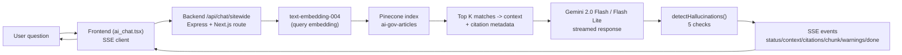
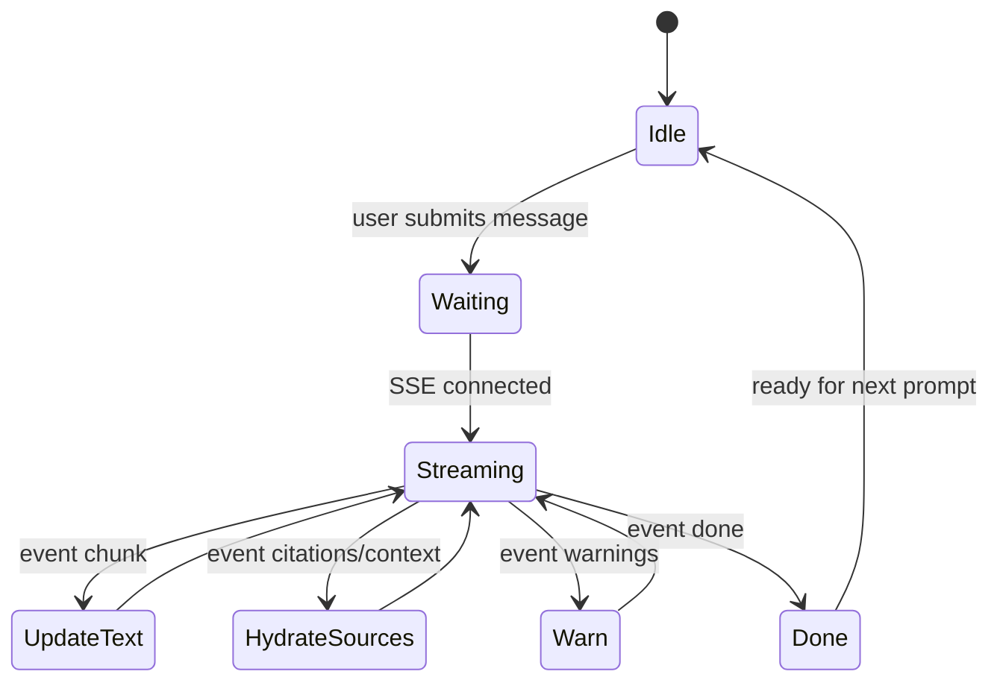
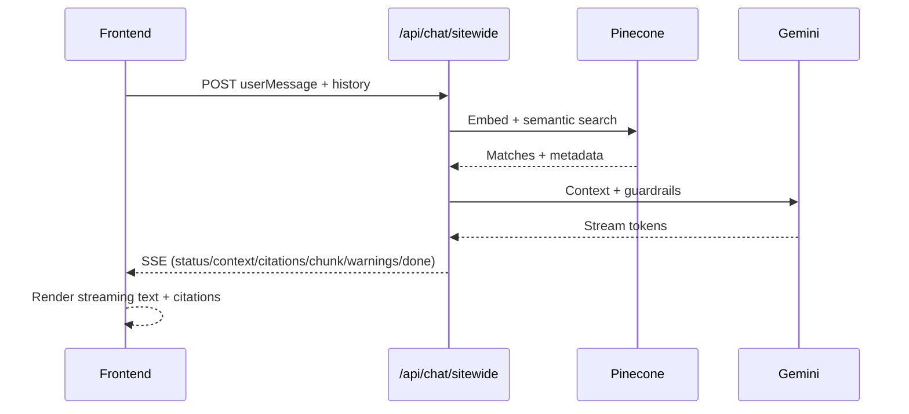

# Sitewide Chat Feature - Implementation Guide

## Overview

This document describes the implementation of the sitewide AI chat feature that allows users to ask questions about articles across the entire platform. The system uses Pinecone for semantic search and Google's Gemini AI for generating responses with real-time streaming.

**✨ Enhanced Features:**
- 📚 **Inline Citations**: Every claim is backed by source references
- 🎯 **Interactive Citations**: Click citations to jump to sources
- ⚠️ **Hallucination Guardrails**: 5 automated checks prevent AI from making things up
- 🔗 **Source Links**: One-click access to original articles
- ✅ **Quality Warnings**: Alerts when response quality may be questionable

**See [CHATBOT_GUARDRAILS](./CHATBOT_GUARDRAILS) for detailed documentation on the citation system and hallucination prevention.**

## Architecture



### Streaming Event Lifecycle (Frontend)



### Backend Components

1. **Pinecone Service** (`backend/src/services/pinecone.service.ts`)
   - Added `searchArticles()` function for semantic search
   - Converts user queries to embeddings using Google's text-embedding-004 model
   - Returns top 5 most relevant articles based on similarity scores

2. **Chat Controller** (`backend/src/controllers/chat.controller.ts`)
   - Added `handleSitewideChat()` function for streaming responses
   - Implements Server-Sent Events (SSE) for real-time streaming
   - Robust error handling with fallback to multiple API keys and models
   - Sends context events to inform the frontend about relevant articles

3. **Chat Routes** (`backend/src/routes/chat.routes.ts`)
   - New endpoint: `POST /api/chat/sitewide`
   - Accepts `userMessage` and optional `history` in request body
   - Returns text/event-stream for streaming responses

### Frontend Components

1. **AI Chat Page** (`frontend/pages/ai_chat.tsx`)
   - Full-featured chat interface with conversation management
   - Real-time streaming response handling using Fetch API
   - Robust error handling and fallback messages
   - Beautiful UI with dark theme and smooth animations

2. **Environment Configuration** (`frontend/.env.local`)
   - `NEXT_PUBLIC_API_URL` - Backend API URL (default: http://localhost:3000)

## API Specification

### Endpoint: `/api/chat/sitewide`

**Method:** POST

**Request Body:**
```json
{
  "userMessage": "What are the latest updates on climate policy?",
  "history": [
    {
      "role": "user",
      "text": "Previous question"
    },
    {
      "role": "assistant",
      "text": "Previous answer"
    }
  ]
}
```

**Response:** Server-Sent Events (SSE) stream

**Event Types:**
- `status` - Progress updates (e.g., "Searching relevant articles...")
- `context` - Information about relevant articles found
- `chunk` - Text chunks of the AI response
- `done` - Indicates successful completion
- `error` - Error information if something goes wrong

**Example SSE Stream:**
```
event: status
data: {"message":"Searching relevant articles..."}

event: context
data: {"articles":[{"id":"123","title":"Climate Policy Update","score":0.89}]}

event: citations
data: {"sources":[{"number":1,"id":"123","title":"Climate Policy Update","source":"whitehouse.gov","url":"https://...","score":0.89}]}

event: status
data: {"message":"Generating response..."}

event: chunk
data: {"text":"Based on the "}

event: chunk
data: {"text":"latest articles [Source 1], "}

event: warnings
data: {"message":"Quality check detected potential issues","warnings":["Response uses confident language without nearby citations"]}

event: done
data: {"success":true,"citationCount":5}
```

## How It Works

```mermaid
flowchart LR
    Req["Incoming POST /api/chat/sitewide"] --> Validate["Validate body\n+ trim history"]
    Validate --> EmbedQ["Embed query\ntext-embedding-004"]
    EmbedQ --> Search["Pinecone topK search"]
    Search --> Context["Build context\nwith [Source N]"]
    Context --> Prompt["System instruction\n+citation rules"]
    Prompt --> Gemini["Gemini 2.0 Flash\n(sendMessageStream)"]
    Gemini --> Checks["detectHallucinations()"]
    Checks --> SSE["Emit SSE events\nchunk/citations/warnings/done"]
    SSE --> Client["ai_chat.tsx stream handler"]
```



### Step 1: User Submits Query
User types a question in the chat interface and presses Enter or clicks Send.

### Step 2: Semantic Search
The backend:
1. Converts the user's query into a vector embedding
2. Searches Pinecone for the top 5 most relevant articles
3. Retrieves article metadata (title, summary, source)

### Step 3: Context Building
The system builds a context string from the retrieved articles:
```
[Article 1]
Title: Climate Policy Update
Source: whitehouse.gov
Summary: New regulations announced...

[Article 2]
Title: Environmental Impact Report
Source: nytimes.com
Summary: Study shows...
```

### Step 4: AI Response Generation
1. Creates a system instruction with the context
2. Starts a chat session with Gemini AI
3. Streams the response back to the client in real-time

### Step 5: Frontend Display
The frontend:
1. Creates a placeholder message
2. Accumulates streamed text chunks
3. Updates the UI in real-time as text arrives
4. Displays the complete response when streaming finishes



## Error Handling

### Backend
- **Rate Limiting**: Automatically tries multiple API keys if rate limited
- **Model Fallback**: Falls back through 3 different Gemini models (2.0-flash, 2.0-flash-lite, 1.5-flash)
- **Connection Issues**: Gracefully handles network errors and service overload
- **Invalid Input**: Validates request body and returns 400 for missing fields

### Frontend
- **Network Errors**: Shows user-friendly error message
- **Empty Responses**: Displays fallback message if no text is received
- **Stream Interruption**: Handles aborted connections gracefully
- **API Errors**: Shows error messages from the backend

## Performance Optimizations

1. **Streaming**: Responses appear character-by-character, reducing perceived latency
2. **Efficient Caching**: Pinecone client and embedding model are cached
3. **Smart Context**: Only includes top 5 most relevant articles to minimize token usage
4. **History Pruning**: Maintains only last 10 messages in conversation history
5. **API Key Rotation**: Distributes load across multiple API keys
6. **Fast Hallucination Detection**: Checks complete in ~5-10ms
7. **Lazy Citation Parsing**: Frontend parses citations only when message changes

## Security Considerations

1. **Input Validation**: All user inputs are validated and sanitized
2. **Rate Limiting**: Backend implements retry logic with backoff
3. **CORS**: Configured to accept requests from authorized origins
4. **API Key Protection**: Keys stored in environment variables, never exposed to client
5. **Error Messages**: Generic error messages to users, detailed logs server-side

## Configuration

### Required Environment Variables (Backend)

```env
# MongoDB
MONGODB_URI=mongodb://...

# Google AI API Keys (at least one required)
GOOGLE_AI_API_KEY=your_key_here
GOOGLE_AI_API_KEY1=optional_backup_key
GOOGLE_AI_API_KEY2=optional_backup_key
GOOGLE_AI_API_KEY3=optional_backup_key

# Pinecone
PINECONE_API_KEY=your_pinecone_key
PINECONE_INDEX=ai-gov-articles

# Server
PORT=3000
```

### Required Environment Variables (Frontend)

```env
# API URL
NEXT_PUBLIC_API_URL=http://localhost:3000
```

## Testing the Feature

### Local Development

1. **Start Backend:**
   ```bash
   cd backend
   npm install
   npm run dev
   ```

2. **Start Frontend:**
   ```bash
   cd frontend
   npm install
   npm run dev
   ```

3. **Access Chat:**
   Open browser to `http://localhost:3001/ai_chat` (or your configured port)

### Test Cases

1. **Basic Query**: "What are the latest government updates?"
2. **Follow-up Question**: Ask a related question to test conversation history
3. **No Results**: Ask about a very obscure topic to test fallback behavior
4. **Long Response**: Ask for a detailed explanation to test streaming
5. **Error Handling**: Turn off backend to test error messages

## Production Deployment

### Backend
1. Ensure all environment variables are configured
2. Run `npm run build` to compile TypeScript
3. Deploy to your hosting platform (Vercel, AWS, etc.)
4. Configure CORS to allow your frontend domain

### Frontend
1. Update `NEXT_PUBLIC_API_URL` to your production backend URL
2. Run `npm run build` to create production build
3. Deploy to hosting platform (Vercel, Netlify, etc.)

## Monitoring and Maintenance

### Logs to Monitor
- Pinecone search latency
- Gemini API response times
- Rate limit errors
- Failed searches (no results found)
- Stream interruptions

### Metrics to Track
- Average response time
- API key usage distribution
- Most common queries
- Error rates by type
- User engagement (messages per session)

## Future Enhancements

1. **Conversation Persistence**: Save conversations to MongoDB
2. **User Authentication**: Require login for chat access
3. **Advanced Filters**: Allow filtering by date, source, topic
4. ~~**Citation Links**: Add clickable links to source articles~~ ✅ **IMPLEMENTED**
5. **Feedback System**: Let users rate responses
6. **Multi-language Support**: Support queries in multiple languages
7. **Voice Input**: Add speech-to-text capability
8. **Export Conversations**: Allow users to download chat history
9. **Citation Analytics**: Track citation usage and accuracy
10. **Quote Extraction**: Show actual quotes from sources on hover

## Troubleshooting

### "No relevant articles found"
- Check if articles are vectorized in Pinecone
- Verify Pinecone API key and index name
- Run vectorization script: `npm run vectorize-articles`

### "All API keys exhausted"
- Check Gemini API key quotas
- Add more backup API keys
- Implement rate limiting on the frontend

### Streaming not working
- Verify nginx/proxy settings (disable buffering)
- Check browser compatibility (modern browsers required)
- Ensure `Content-Type: text/event-stream` header is set

### Build errors
- Run `npm install` to ensure all dependencies are installed
- Check TypeScript version compatibility
- Verify `styled-jsx.d.ts` exists in frontend directory

## Support

For issues or questions:
1. Check the logs for detailed error messages
2. Verify all environment variables are set correctly
3. Ensure Pinecone has vectorized articles
4. Test API keys individually
5. Check network connectivity between services
