# SynthoraAI - AI-Powered Article Content Curator

> [!TIP]
> **SynthoraAI - Synthesizing the world’s news & information through AI.**

The **SynthoraAI - AI-Powered Article Content Curator** is a comprehensive, AI-powered system designed to aggregate, summarize, and present curated government-related articles.
This monorepo, multi-services project is organized into four main components:

- **Backend:** Provides a robust RESTful API to store and serve curated articles.
- **Crawler:** Automatically crawls and extracts article URLs and metadata from government homepages and public API sources.
- **Frontend:** Offers an intuitive Next.js-based user interface for government staff (and potentially the public) to browse and view article details.
- **Newsletter:** Sends daily updates to subscribers with the latest articles.

<p align="center">
  
</p>

**High-Level Architecture:** Each component is maintained in its own directory:

- **Backend:** `backend/`
  - Live: [https://ai-content-curator-backend.vercel.app/](https://ai-content-curator-backend.vercel.app/)
- **Frontend:** `frontend/`
  - Live: [https://synthoraai.vercel.app/](https://synthoraai.vercel.app/)
- **Crawler:** `crawler/`
  - Live: [https://ai-content-curator-crawler.vercel.app/](https://ai-content-curator-crawler.vercel.app/)
- **Newsletter:** `newsletters/`
  - Live: [https://ai-content-curator-newsletters.vercel.app/](https://ai-content-curator-newsletters.vercel.app/)


> [!IMPORTANT]
> This is a work in progress. Please review the information, test out the applications, and provide feedback or contributions. More features are also coming soon!

---

## Table of Contents

- [Overview](#overview)
- [User Interface](#user-interface)
- [Architecture](#architecture)
- [Collaboration & Agile Workflow with Jira](#collaboration--agile-workflow-with-jira)
  - [Introduction](#introduction)
  - [Agile Approach](#agile-approach)
  - [Why Jira?](#why-jira)
  - [Project Board](#project-board)
  - [Workflow](#workflow)
- [Backend](#backend)
  - [Features](#features)
  - [Prerequisites & Installation](#prerequisites--installation-backend)
  - [Configuration](#configuration-backend)
  - [Running Locally](#running-locally-backend)
  - [Deployment on Vercel](#deployment-on-vercel-backend)
- [Crawler](#crawler)
  - [Features](#features-1)
  - [Prerequisites & Installation](#prerequisites--installation-crawler)
  - [Running Locally](#running-locally-crawler)
  - [Deployment on Vercel](#deployment-on-vercel-crawler)
- [Frontend](#frontend)
  - [Features](#features-2)
  - [Prerequisites & Installation](#prerequisites--installation-frontend)
  - [Configuration](#configuration-frontend)
  - [Running Locally](#running-locally-frontend)
  - [Deployment on Vercel](#deployment-on-vercel-frontend)
- [Newsletter Subscription](#newsletter-subscription)
  - [Features (Newsletter)](#features-newsletter)
  - [Prerequisites & Installation (Newsletter)](#prerequisites--installation-newsletter)
- [Article Q&A Feature](#article-qa-feature)
  - [Features (Article Q&A)](#features-article-qa)
  - [Prerequisites & Installation (Article Q&A)](#prerequisites--installation-article-qa)
- [Command Line Interface (CLI)](#command-line-interface-cli)
  - [Installation](#installation)
  - [Usage](#usage)
  - [Workspace Management](#workspace-management)
  - [Crawling](#crawling)
  - [Article CRUD](#article-crud)
- [Shell Scripts & Makefile](#shell-scripts--makefile)
  - [Shell Scripts](#shell-scripts)
  - [Makefile](#makefile)
- [Contributing](#contributing)
- [Testing](#testing)
  - [Backend](#backend-1)
  - [Frontend](#frontend-1)
  - [Crawler](#crawler-1)
- [Continuous Integration / Continuous Deployment (CI/CD)](#continuous-integration--continuous-deployment-cicd)
- [License](#license)
- [Contact](#contact)
- [Conclusion](#conclusion)

---

## Overview

The **SynthoraAI - AI-Powered Article Content Curator** system is designed to provide government staff with up-to-date, summarized content from trusted government sources and reputable news outlets. By leveraging AI (Google Generative AI / Gemini) for summarization and using modern web technologies, this solution ensures that users receive concise, accurate, and timely information.

- **Data Ingestion:**  
  The system aggregates article URLs from multiple sources (government homepages and public APIs like NewsAPI) using a decoupled crawler service.
- **Content Processing:**  
  The backend processes the fetched articles by generating concise summaries via Google Generative AI. This step includes handling rate limits and transient errors with robust retry mechanisms.
- **Data Storage & API Serving:**  
  Articles—comprising URLs, titles, full content, AI-generated summaries, source details, and fetch timestamps—are stored in MongoDB (managed through Mongoose). An Express.js API, integrated within a Next.js project, exposes REST endpoints for fetching article lists and individual article details.
- **Frontend Experience:**  
  A responsive Next.js/React interface allows users to easily browse paginated article lists, filter by source, and view detailed article pages, with dark/light mode support. The frontend also includes user authentication, enabling users to mark articles as favorites for quick access.
- **Scheduled Updates:**  
  Both the backend and crawler employ scheduled serverless functions (via Vercel cron) to periodically update the content. This ensures that the system (articles) remains fresh and up-to-date.
- **Newsletter Subscription:**  
  Users can subscribe to a newsletter for daily updates on the latest articles. This feature is integrated with a third-party service (Resend) for managing subscriptions and sending emails.
- **Architecture:**
  Monorepo structure with separate directories for the backend, crawler, and frontend. Each component is designed to be scalable, maintainable, and deployable on Vercel.
- **User Authentication:**  
  Users can create an account, log in, and receive a JWT token for secure access to the system.
- **Favorite Articles:**  
  Authenticated users can mark articles as favorites for quick access and reference.
- **Dark Mode:**  
  The frontend offers a dark mode option for improved readability and user experience.

---

## Architecture

Below is a high-level diagram outlining the system architecture:

```
      +----------------+       +--------------------------+
      |                |       |                          |
      |  Data Sources  |       |   Public API Sources     |
      |                |       |   (e.g., NewsAPI)        |
      +--------+-------+       +-------------+------------+
               |                              |
               |                              |
               v                              v
      +-----------------+       +--------------------------+
      |                 |       |                          |
      | Custom Crawlers |       |   API Fetcher Service    |
      | (Articles       |       |                          |
      |  Crawling)      |       +-------------+------------+
      |                 |                     |
      +--------+--------+                     |
               |                              |
               +------------+-----------------+
                            |
                            v
                  +--------------------+
                  |                    |
                  |   Data Processing  |
                  | (Summarization via |
                  | Google Generative  |
                  |        AI)         |
                  |                    |
                  +---------+----------+
                            |
                            v
                  +--------------------+              +-------------------+
                  |                    |              |                   |
                  |   MongoDB Storage  |              |   Redis Cache     |
                  |   (via Mongoose)   |<------------>| (Article Caching) |
                  |                    |              |                   |
                  +---------+----------+              +-------------------+
                            |                                   |
                            v                                   v
                  +--------------------+             +--------------------+
                  |                    |             |                    |
                  |   Express.js API   |             | Newsletter Service |
                  |  (REST Endpoints)  |             |  (Resend API with  |
                  |                    |             |     CRON Jobs)     |
                  +---------+----------+             +--------------------+
                            |
                            v
                  +--------------------+
                  |                    |
                  |  Next.js Frontend  |
                  | (Consumer of API)  |
                  |                    |
                  +--------------------+
```

This project consists of 4 primary microservices that interact with each other:

1. **Crawler:**
   - Crawls government homepages and public API sources to extract article URLs and metadata.
   - Uses Axios and Cheerio for static HTML parsing, with Puppeteer as a fallback for dynamic content.
   - Scheduled to run daily at 6:00 AM UTC via a serverless function on Vercel.
   - Provides a basic landing page with information about the crawler and links to the backend and frontend.
   - **_Deployed on Vercel at [https://ai-content-curator-crawler.vercel.app](https://ai-content-curator-crawler.vercel.app)._**
2. **Backend:**
   - Built with Express.js and Next.js, serving as a RESTful API for the frontend.
   - Integrates Google Generative AI (Gemini) for content summarization.
   - Stores articles in MongoDB using Mongoose, with fields for URL, title, full content, summary, source information, and fetch timestamp.
   - Scheduled serverless function to fetch and process new articles daily at 6:00 AM UTC.
   - **_Deployed on Vercel at [https://ai-content-curator-backend.vercel.app](https://ai-content-curator-backend.vercel.app)._**
3. **Newsletter Service:**
   - Allows users to subscribe to a newsletter for daily updates on the latest articles.
   - Integrated with Resend API for managing subscriptions and sending emails.
   - By default, the newsletter is sent daily at 9:00 AM UTC, from the email address with the `sonnguyenhoang.com` domain.
   - **_Deployed on Vercel as a serverless function, at [https://ai-content-curator-newsletters.vercel.app](https://ai-content-curator-newsletters.vercel.app)._**
4. **Frontend:**
   - Built with Next.js and React, providing a modern, mobile-responsive UI for browsing and viewing curated articles.
   - Fetches and displays a paginated list of articles from the backend API, with filtering options.
   - Dedicated pages for full article content, AI-generated summaries, source information, and fetched timestamps.
   - User authentication for marking articles as favorites, commenting, discussions, and upvoting/downvoting comments.
   - **_Deployed on Vercel at [https://synthoraai.vercel.app/](https://synthoraai.vercel.app/)._**

This monorepo, microservices architecture is designed to be modular and scalable, allowing for easy updates and maintenance. Each component can be developed, tested, and deployed independently, ensuring a smooth development workflow.

> [!NOTE]
> This architecture diagram above is a simplified representation and may not include all components or interactions. For a more detailed view, please refer to the individual service documentation.

---

## Collaboration & Agile Workflow with Jira

### Introduction

This project is currently using Jira for task management and collaboration. The project's Kanban board is organized into six main columns: **Backlog**, **To Do**, **In Progress**, **Testing**, **Code Review**, and **Done**.
Each task is assigned to a specific team member and includes detailed descriptions, acceptance criteria, and due dates.

### Agile Approach

We are following an AGILE approach to development, which emphasizes iterative progress, collaboration, and flexibility. This allows us to adapt to changes quickly and deliver value to users in a timely manner.

Agile methodologies, such as Scrum or Kanban, are used to manage the development process, ensuring that tasks are prioritized, completed, and reviewed efficiently. This approach helps us maintain a high level of quality and responsiveness to user needs.

We chose Kanban for this project because it allows us to visualize the workflow, limit work in progress, and focus on delivering value incrementally. The Kanban board provides a clear overview of the project's status, making it easy to track progress and identify bottlenecks.

- **A** in AGILE: Stands for **Adaptive**. We adapt to changes quickly and efficiently, ensuring that the project remains aligned with user needs and expectations.
- **G** in AGILE: Stands for **Goal-oriented**. We focus on achieving specific goals and delivering value to users, ensuring that each task contributes to the overall success of the project.
- **I** in AGILE: Stands for **Iterative**. We work in iterations, allowing us to continuously improve the project and respond to feedback from users and stakeholders.
- **L** in AGILE: Stands for **Lean**. We aim to minimize waste and maximize value, ensuring that resources are used efficiently and effectively.
- **E** in AGILE: Stands for **Empowered**. We empower team members to take ownership of their tasks and contribute to the project's success, fostering a collaborative and supportive environment.

We believe that this AGILE approach, combined with the use of Jira for task management, will help us deliver a high-quality product that meets the needs of government staff and the public.

### Why Jira?

We are currently pursuing an AGILE approach to development, and Jira is a great tool for managing tasks, tracking progress, and facilitating collaboration among team members. It allows us to create tasks, assign them to team members, set priorities, and track the status of each task in real-time.

Also, Jira provides a comprehensive set of features for managing projects, including sprint planning, backlog management, and reporting. It allows us to create user stories, epics, and tasks, and track their progress throughout the development cycle.

### Project Board

**You can view the project board and tasks at [https://ai-content-curator.atlassian.net](https://ai-content-curator.atlassian.net/jira/software/projects/AICC/boards/3?atlOrigin=eyJpIjoiZDM2MDQ4MWUwYTVkNGNhNzkzZmI5YjE2NGZmZjc2ZDAiLCJwIjoiaiJ9).**

> [!IMPORTANT]
> Login is required to access the board, and you can create an account if you don't have one.

If you need **access** to the project board, please contact me directly at [sonnguyenhoang.com](https://sonnguyenhoang.com) or via email at [hoangson091104@gmail.com](mailto:hoangson091104@gmail.com) for an invitation. I believe that having access to the project board will help you understand the project's progress, tasks, and overall workflow better, and it will also allow you to contribute more effectively to the project.

### Workflow

The workflow for this project is as follows: As soon as you receive a task (verbally or in writing) or come up with an idea:

1. Create a new task in the **Backlog** column of the Jira board.
2. Add a detailed description of the task, including acceptance criteria and due date.
3. Assign the task to yourself or another team member.
4. Create a new branch in the GitHub repository for the task. Make sure that you use the Jira issue key in the branch name (e.g., `AICC-123`).
   - Mark the Jira task as **To Do**/**In Progress**.
   - This is very important for Jira to recognize the branch and link it to the task!
5. Work on the task in your local development environment, committing changes to the branch as you go.
6. Once the task is complete, push the branch to the remote repository and create a pull request (PR) in GitHub.
   - Name the PR with a descriptive title that includes the Jira issue key (e.g., `feat(ui): implement new feature [AICC-123`).
   - Before you commit your changes, make sure to run any applicable tests and ensure that the code is properly formatted and linted.
7. Assign the PR to the appropriate team member for code review.
   - Move the Jira task to the **Code Review** column.
8. Make any necessary changes based on feedback from the code review.
9. Once the PR is approved, merge it into the main branch.
   - Make sure to resolve any merge conflicts before merging.
10. After merging, move the Jira task to the **Done** column.

This workflow ensures that tasks are tracked, code is reviewed, and the project progresses smoothly. It also allows for easy collaboration and communication among team members, and for our pursuit of an AGILE approach to development.

<p align="center">
  
</p>

---

## User Interface

The user interface is built with Next.js and React, providing a modern, mobile-responsive experience.
Below are some screenshots of the application (some screenshots may be outdated and not reflect the latest UI - visit [https://synthoraai.vercel.app/](https://synthoraai.vercel.app/) for the latest version):

### 0. Landing Page

<p align="center">
  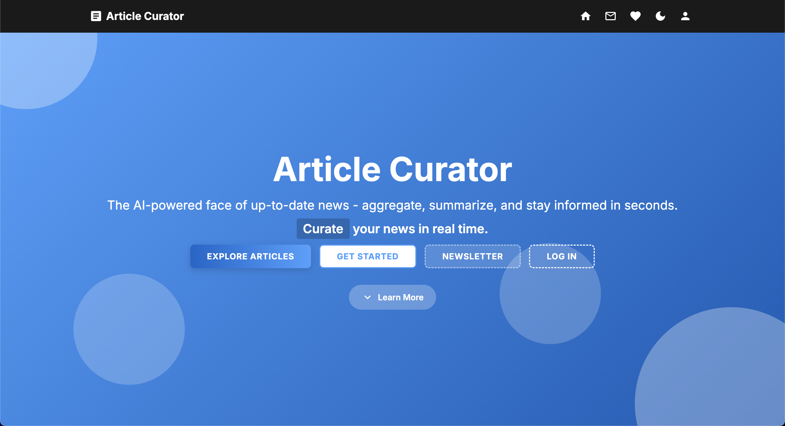
</p>

### 1. Home Page

<p align="center">
  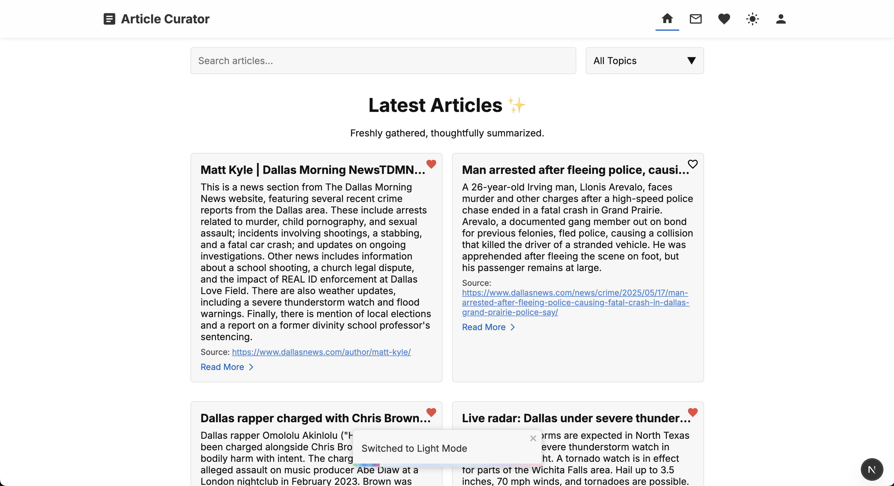
</p>

### 2. Home Page (Dark Mode)

<p align="center">
  
</p>

### 3. Home Page (Guest User)

<p align="center">
  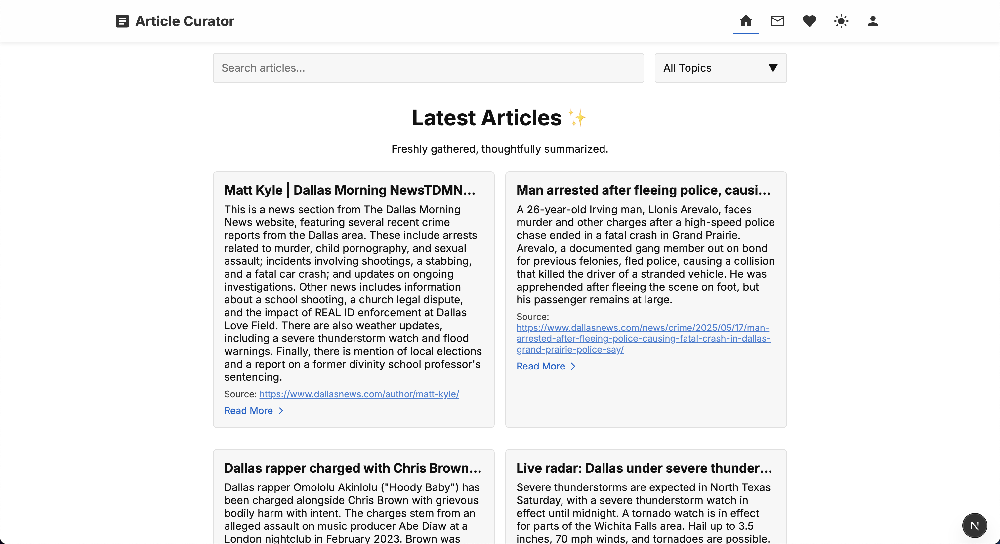
</p>

### 4. Article Details Page

<p align="center">
  
</p>

### 5. Article Details Page (Guest User)

<p align="center">
  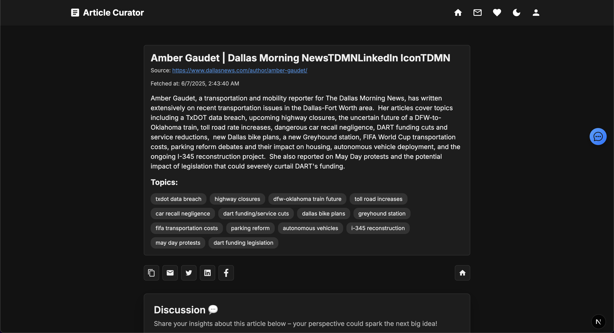
</p>

### 6. Article Q&A Feature

<p align="center">
  
</p>

### 7. Favorite Articles Page

<p align="center">
  
</p>

### 8. Favorite Articles Page (Unauthenticated User)

<p align="center">
  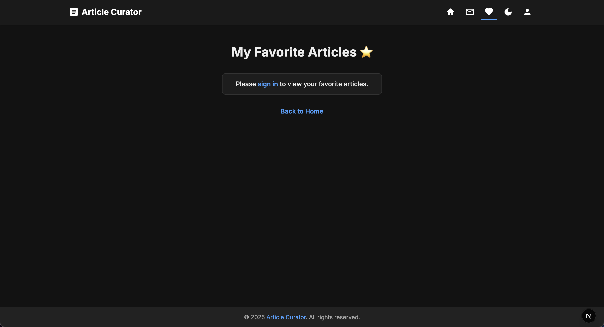
</p>

### 9. Newsletter Subscription Page

<p align="center">
  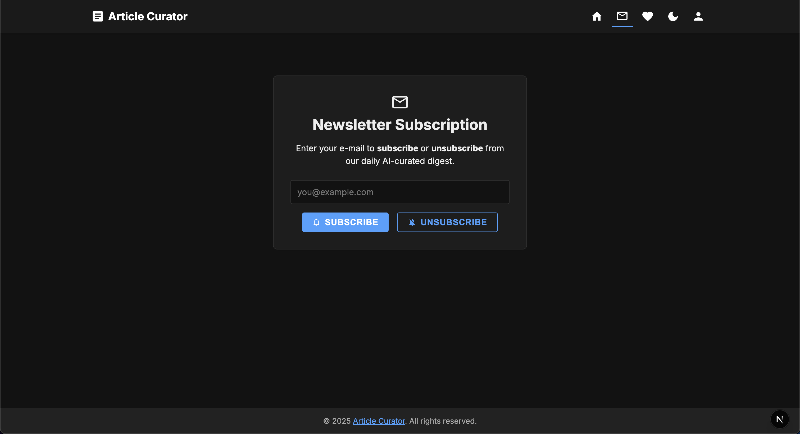
</p>

### 10. User Authentication

<p align="center">
  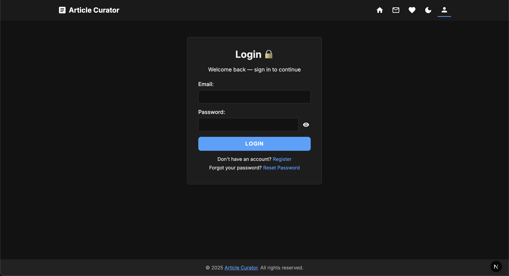
</p>

### 11. User Registration

<p align="center">
  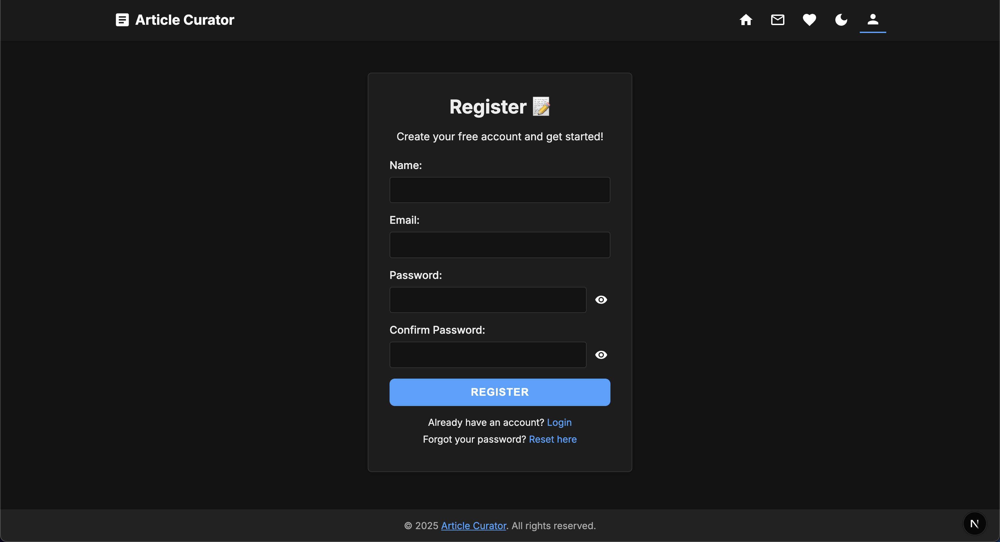
</p>

### 12. Reset Password

<p align="center">
  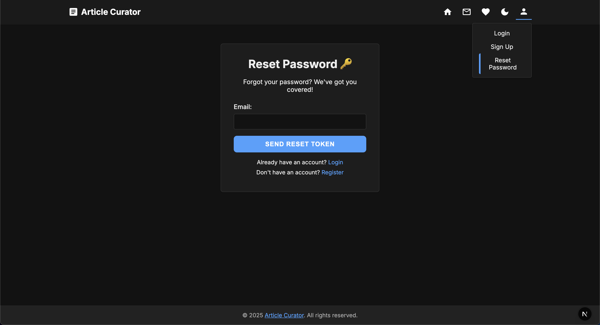
</p>

### 13. Search Results

<p align="center">
  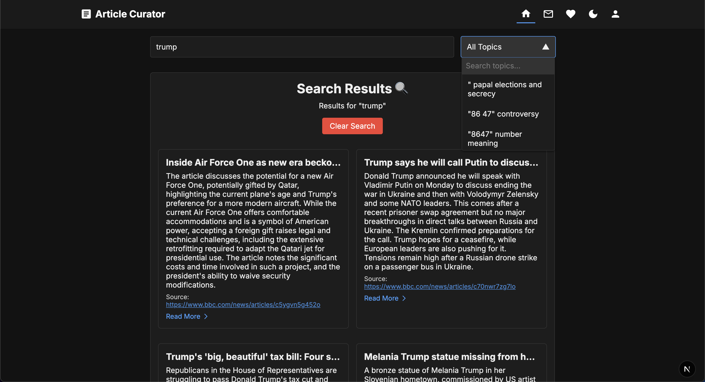
</p>

### 14. 404 Not Found Page

<p align="center">
  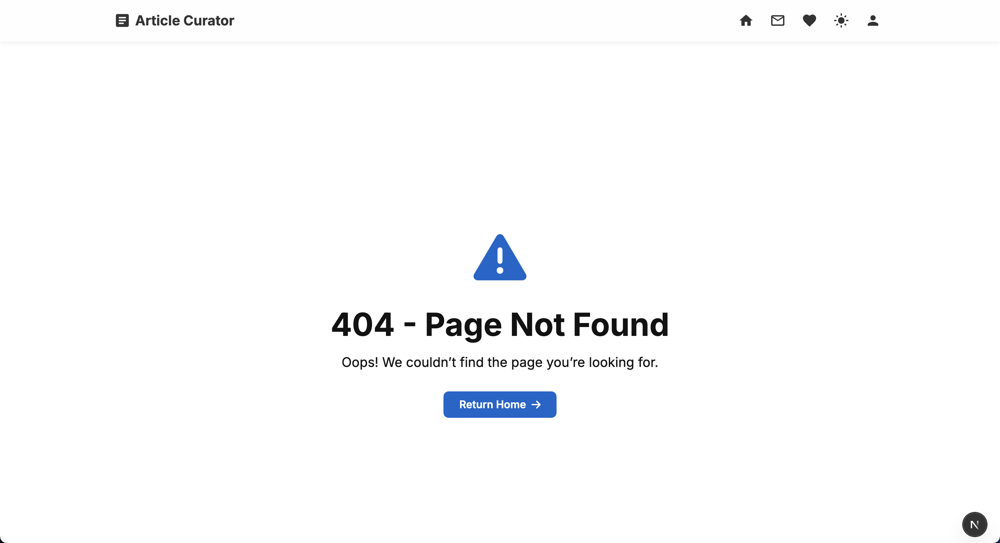
</p>

### 15. Daily Newsletter Email Example

<p align="center">
  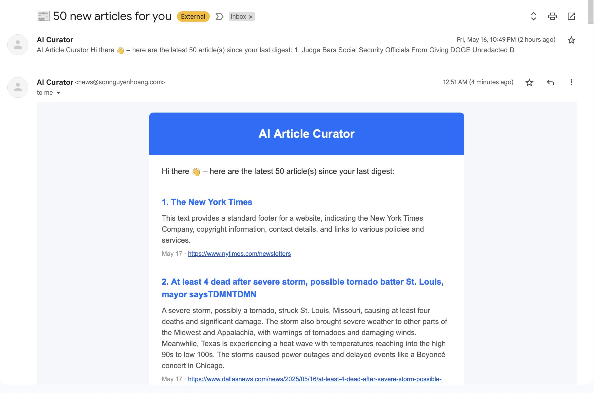
</p>

_more pages and features are available in the app - we encourage you to explore!_

---

## Backend

The **Backend** is responsible for storing articles and serving them via RESTful endpoints. It integrates AI summarization, MongoDB for storage, and runs within a Next.js environment using Express.js for API routes.

### Features

- **Data Ingestion:**  
  Receives article URLs and data from the crawler and external API sources.
- **Content Summarization:**  
  Uses Google Generative AI (Gemini) to generate concise summaries.
- **Storage:**  
  Persists articles in MongoDB using Mongoose with fields for URL, title, full content, summary, source information, and fetch timestamp.
- **API Endpoints:**
  - `GET /api/articles` – Retrieves a paginated list of articles (supports filtering via query parameters such as `page`, `limit`, and `source`).
  - `GET /api/articles/:id` – Retrieves detailed information for a specific article.
- **Scheduled Updates:**  
  A serverless function (triggered twice daily at 6:00 AM and 6:00 PM UTC) fetches and processes new articles, so that the system remains up-to-date!
- **User Authentication:**  
  Supports user registration, login, and JWT-based authentication for secure access to the system.
- **Favorite Articles:**  
  Authenticated users can mark articles as favorites for quick access.
- **Newsletter Subscription:**  
  Users can subscribe to a newsletter for daily updates on the latest articles. This feature is integrated with a third-party service (Resend) for managing subscriptions and sending emails.
- **Discussions & Comments:**  
  Users can also discuss and comment on articles, fostering engagement and collaboration.
- **Upvote/Downvote Comments:**  
  Users can upvote or downvote comments to highlight valuable contributions.

### Backend Swagger API Documentation

<p align="center">
  
</p>

### Prerequisites & Installation (Backend)

> [!CAUTION]
> Before proceeding, run `npm install` once in the root directory of the monorepo to install the necessary dependencies for managing the project!

1. **Prerequisites:**

   - Node.js (v18 or later)
   - MongoDB (local or cloud)
   - Vercel CLI (for deployment)

2. **Clone the Repository:**

   ```bash
   git clone https://github.com/hoangsonww/AI-Gov-Content-Curator.git
   cd AI-Gov-Content-Curator/backend
   ```

3. **Install Dependencies (inside `backend/`):**

   ```bash
   npm install
   ```

### Configuration (Backend)

Create a `.env` file in the ROOT directory with the following (this will be shared across all components in this monorepo):

```dotenv
MONGODB_URI=<your_mongodb_uri>
GOOGLE_AI_API_KEY=<your_google_ai_api_key>
GOOGLE_AI_API_KEY1=<your_google_ai_api_key1_optional>
GOOGLE_AI_API_KEY2=<your_google_ai_api_key2_optional>
GOOGLE_AI_API_KEY3=<your_google_ai_api_key3_optional>
AI_INSTRUCTIONS=Summarize the articles concisely and naturally (change if needed)
NEWS_API_KEY=<your_news_api_key>
NEWS_API_KEY1=<your_news_api_key1>
PORT=3000
CRAWL_URLS=https://www.state.gov/press-releases/,https://www.bbc.com/news,https://www.nytimes.com/,https://www.dallasnews.com/news/,https://www.houstonchronicle.com/,,https://www.whitehouse.gov/briefing-room/,https://www.congress.gov/,https://www.statesman.com/news/politics-elections/
AICC_API_URL=https://ai-content-curator-backend.vercel.app/
RESEND_API_KEY=<your_resend_api_key>
RESEND_FROM="AI Curator <your_email>"
UNSUBSCRIBE_BASE_URL=<your_unsubscribe_base_url>
```

Refer to the `.env.example` file for more details on each variable.

### Running Locally (Backend)

Start the development server:

```bash
npm run dev
```

Access endpoints:

- `GET http://localhost:3000/api/articles`
- `GET http://localhost:3000/api/articles/:id`

### Deployment on Vercel (Backend)

1. **Configure Environment Variables** in your Vercel project settings.
2. Create or update the `vercel.json` in the root of the backend directory:

   ```json
   {
     "version": 2,
     "builds": [
       {
         "src": "package.json",
         "use": "@vercel/next"
       }
     ],
     "crons": [
       {
         "path": "/api/scheduled/fetchAndSummarize",
         "schedule": "0 6,18 * * *"
       }
     ]
   }
   ```

3. **Deploy** with:

   ```bash
   vercel --prod
   ```

---

## Crawler

The **Crawler** automatically retrieves article links and metadata from government homepages and public API sources. It uses Axios and Cheerio for static HTML parsing and falls back to Puppeteer when necessary.

### Features

- **Article Extraction:**  
  Crawls specified URLs to extract article links and metadata.

- **Error Handling & Resilience:**  
  Implements a retry mechanism and fallback to Puppeteer for dynamic content fetching when encountering issues (e.g., HTTP 403, ECONNRESET).

- **Scheduling:**  
  Deployed as a serverless function on Vercel, scheduled via cron (runs daily at 6:00 AM UTC).

- **Next.js UI:**  
  Provides a basic landing page with information about the crawler and links to the backend and frontend.

### Prerequisites & Installation (Crawler)

1. **Prerequisites:**

- Node.js (v18 or later)
- NPM (or Yarn)
- Vercel CLI (for deployment)

2. **Clone the Repository:**

   ```bash
   git clone https://github.com/hoangsonww/AI-Gov-Content-Curator.git
   cd AI-Gov-Content-Curator/crawler
   ```

3. **Install Dependencies:**

   ```bash
   npm install
   ```

### Running Locally (Crawler)

Start the Next.js development server to test both the UI and crawler function:

```bash
npm run dev
```

- UI: [http://localhost:3000/](http://localhost:3000/)
- Crawler Function: [http://localhost:3000/api/scheduled/fetchAndSummarize](http://localhost:3000/api/scheduled/fetchAndSummarize)

Alternatively, run the crawler directly:

```bash
npx ts-node schedule/fetchAndSummarize.ts

# or
npm run crawl
```

Also, there are 2 more scripts for the crawler:

1. Fetch and crawl all past articles (will run indefinitely, unless you stop it):

   ```bash
   npx ts-node scripts/fetchPastArticles.ts

   # or
   npm run fetch:past
   ```

2. Fetch and crawl all newest/latest articles:

   ```bash
    npx ts-node scripts/fetchLatestArticles.ts

    # or
    npm run fetch:latest
   ```

Run these locally to test the crawler functionality. You can also run them in a Docker container if you prefer.

### Deployment on Vercel (Crawler)

1. **Set Environment Variables** in the Vercel dashboard.
2. Create or update the `vercel.json` in the `crawler` directory:

   ```json
   {
     "version": 2,
     "builds": [
       {
         "src": "package.json",
         "use": "@vercel/next"
       }
     ],
     "crons": [
       {
         "path": "/api/scheduled/fetchAndSummarize",
         "schedule": "0 6 * * *"
       }
     ]
   }
   ```

3. **Deploy** with:

   ```bash
   vercel --prod
   ```

---

## Frontend

The **Frontend** is built with Next.js and React, providing a modern, mobile-responsive UI for browsing and viewing curated articles.

### Features

- **Article Listing:**  
  Fetches and displays a paginated list of articles from the backend API. Supports filtering by source.

- **Article Detail View:**  
  Dedicated pages display full article content, AI-generated summaries, source information, and fetched timestamps.

- **Responsive Design:**  
  The UI is optimized for both desktop and mobile devices.

- **Authentication:**  
  Users can register, log in, and receive a JWT token for secure access to the system. Tokens are stored in HTTP-only cookies for security.

- **Favorite Articles:**  
  Authenticated users can mark articles as favorites for quick access. This is stored in the backend and displayed in the frontend.

- **Newsletter Subscription:**  
  Users can subscribe to a newsletter for daily updates on the latest articles. This feature is integrated with a third-party service (Resend) for managing subscriptions and sending emails.

- **Dark Mode:**  
  The frontend offers a dark mode option for improved readability and user experience.

- **Additional UI Components:**  
  Includes components like HeroSlider, LatestArticles, ThemeToggle, and more for an enhanced user experience.

- **Static Site Generation (SSG):**  
  The frontend uses Next.js's SSG capabilities to pre-render pages for improved performance and SEO.

### Prerequisites & Installation (Frontend)

1. **Prerequisites:**

- Node.js (v18 or later)
- NPM or Yarn

2. **Clone the Repository:**

   ```bash
   git clone https://github.com/hoangsonww/AI-Gov-Content-Curator.git
   cd AI-Gov-Content-Curator/frontend
   ```

3. **Install Dependencies:**

   ```bash
   npm install
   ```

   or

   ```bash
   yarn
   ```

### Configuration (Frontend)

(Optional) Create a `.env.local` file in the `frontend` directory to configure the API URL:

```dotenv
NEXT_PUBLIC_API_URL=https://your-backend.example.com
```

### Running Locally (Frontend)

Start the development server:

```bash
npm run dev
```

Access the application at [http://localhost:3000](http://localhost:3000).

### Deployment on Vercel (Frontend)

1. **Configure Environment Variables** in the Vercel dashboard (e.g., `NEXT_PUBLIC_API_URL`).
2. Vercel automatically detects the Next.js project; if needed, customize with a `vercel.json`.
3. **Deploy** with:

   ```bash
   vercel --prod
   ```

Alternatively, you can deploy directly from the Vercel dashboard.

---

## Newsletter Subscription

The app also includes a newsletter subscription feature, allowing users to sign up for updates.
This is integrated with a third-party service ([Resend](https://resend.com)) for managing subscriptions.

### Features (Newsletter)

- **Subscription Form:**  
  Users can enter their email addresses to subscribe to the newsletter.
- **Unsubscribe Option:**  
  Users can unsubscribe from the newsletter at any time.
- **Daily Updates:**  
   Subscribers receive daily updates with the latest articles. Only the
  latest articles are sent to subscribers, ensuring they receive the most relevant information.

### Prerequisites & Installation (Newsletter)

> [!IMPORTANT]
> This assumes that you have already set up the backend and frontend as described above.

1. **Prerequisites:** Sign up for a Resend account and obtain your API key.
2. **Go to Domain Settings:** In your Resend dashboard, navigate to the "Domains" section and add your domain (you'll have to have
   purchased a domain name that you have access to). Render will ask that you verify your domain ownership by adding a TXT record to your DNS settings, as
   well as adding an MX record to your DNS settings, and more. Follow the instructions provided by Resend to complete this step.
3. **Configure Environment Variables:** Create a `.env` file in the `newsletters` directory with the following variables:
   - `RESEND_API_KEY`: Your Resend API key.
   - `RESEND_DOMAIN`: The domain you added in the Resend dashboard.
4. **Deploy the CRON Job:** Simply run `vercel --prod` in the `newsletters` directory to deploy the CRON job that sends daily updates to subscribers.
5. **Configure the CRON Job:** In your Vercel dashboard, navigate to the "Functions" section and set up a CRON job that runs daily at 9:00 AM UTC. This job will send the latest articles to subscribers.
6. **That's it!** Your newsletter subscription feature is now set up and ready to go. Users can subscribe to receive daily updates with the latest articles.

### Note

> [!IMPORTANT]
>
> - The newsletter subscription feature is designed to be simple and effective. It allows users to stay informed about the latest articles without overwhelming them with too many emails.
> - The subscription form is integrated into the frontend, and users can easily sign up or unsubscribe at any time.
> - The daily updates are sent via email, ensuring that subscribers receive the most relevant information without having to check the app constantly.
> - The newsletter feature is built using the Resend API, which provides a reliable and scalable solution for managing subscriptions and sending emails.
> - Sometimes, the emails may end up in the spam folder, so users should check their spam folder if they don't see the emails in their inbox.

---

## Article Q&A Feature

The article Q&A feature allows users to ask questions about specific articles and receive AI-generated answers. This feature is integrated into the frontend and backend, providing a seamless experience for users.

The AI will have access to the article content and will use RAG to generate answers based on the information provided in the article. This feature is designed to enhance user engagement and provide quick answers to common questions.

### Features (Article Q&A)

The chatbot is given an identity (ArticleIQ) and is designed to answer questions related to the articles. The AI will have access to the article content and will use RAG (Retrieval-Augmented Generation) to generate answers based on the information provided in the article:

- **Ask Questions:** Users can ask questions about specific articles directly from the article detail page.
- **AI-Generated Answers:** The AI will generate answers based on the content of the article, providing users with relevant information.
- **User-Friendly Interface:** The Q&A feature is integrated into the article detail page, making it easy for users to ask questions and receive answers without navigating away from the content.
- **RAG Integration:** The AI will use RAG (Retrieval-Augmented Generation) to provide accurate and contextually relevant answers based on the article content.
- **Real-Time Responses:** Users will receive answers in real-time, enhancing the overall user experience and engagement with the content.

### Prerequisites & Installation (Article Q&A)

> [!TIP]
> This feature is integrated into the existing backend and frontend, so you don't need to set up anything separately.

1. **Prerequisites:** Ensure that you have the backend and frontend set up as described above.
2. **Install Dependencies:** Make sure you have the necessary dependencies installed in both the backend and frontend directories. You can run `npm install` in the root directory to install dependencies for all components.
3. **Configure Environment Variables:** Ensure that you have the necessary environment variables set up in your `.env` file. This includes the Google AI API key and any other required variables.
4. **Deploy the Backend:** If you haven't already, deploy the backend to Vercel using `vercel --prod` in the backend directory. Or, just run locally with `npm run dev`.
5. **Deploy the Frontend:** If you haven't already, deploy the frontend to Vercel using `vercel --prod` in the frontend directory. Or, just run locally with `npm run dev`.
6. **Test the Feature:** Once everything is set up, you can test the article Q&A feature by navigating to an article detail page of an article and asking questions. The AI will generate answers based on the content of the article.
7. **That's it!** The article Q&A feature is now integrated into the existing system, providing users with an enhanced experience and quick access to information.

### Using the Article Q&A Feature

To use the article Q&A feature, simply navigate to the article detail page of an article and look for the Q&A section. You can ask questions related to the article, and the AI will generate answers based on the content provided.

Feel free to ask any questions related to the article, and the AI will do its best to provide accurate and relevant answers. This feature is designed to enhance user engagement and provide quick access to information without having
to read through the entire article.

---

## Command Line Interface (CLI)

The `aicc` command gives you a single entrypoint to manage your entire monorepo—frontend, backend, crawler—and perform content‐curation tasks.

### Installation

From the **project root**:

```bash
# Install dependencies
npm install

# Link the CLI so `aicc` is on your PATH
npm link
```

> [!TIP]
> This sets up a global symlink named `aicc` pointing at `./bin/aicc.js`.

### Usage

Run `aicc` with no arguments to display help:

```bash
aicc
```

#### Workspace Management

| Command                | Description                                                   |
| ---------------------- | ------------------------------------------------------------- |
| `aicc dev`             | Start **all** services in development mode                    |
| `aicc dev <service>`   | Start one service (`frontend` / `backend` / `crawler`) in dev |
| `aicc build`           | Build **all** services for production                         |
| `aicc build <service>` | Build one service                                             |
| `aicc start`           | Start **all** services in production mode                     |
| `aicc start <service>` | Start one service                                             |
| `aicc lint`            | Run Prettier across all packages                              |
| `aicc format`          | Alias for `aicc lint`                                         |

**Examples**:

```bash
# Run frontend + backend + crawler in parallel
aicc dev

# Build only the backend
aicc build backend

# Start crawler in prod mode
aicc start crawler

# Lint & format everything
aicc lint
```

#### Crawling

Kick off your scheduled crawler (`schedule/fetchAndSummarize.ts`) in the **crawler** package:

```bash
aicc crawl
```

This will `cd crawler` and run `npm run crawl` under the hood.

#### Article CRUD

Interact with your backend’s `/api/articles` endpoints directly from the CLI:

| Command                                                    | Description                                   |
| ---------------------------------------------------------- | --------------------------------------------- |
| `aicc article create --title <t> --content <c> [...flags]` | Create a new article                          |
| `aicc article get <id>`                                    | Fetch one article by its MongoDB `_id`        |
| `aicc article list [--limit N]`                            | List articles, optionally limiting the number |
| `aicc article update <id> [--flags]`                       | Update fields on an existing article          |
| `aicc article delete <id>`                                 | Delete an article by ID                       |

**Flags for `create` & `update`:**

- `--title <string>` — Article title
- `--content <string>` — Full article content (stored in `content`)
- `--summary <string>` — Brief summary
- `--topics <topic1> ...` — One or more topic tags
- `--source <string>` — Source identifier

**Examples**:

```bash
# Create a new article
aicc article create \
  --title "AI in 2025" \
  --content "Deep dive into AI trends..." \
  --summary "Key trends in AI" \
  --topics ai machine-learning \
  --source "manual-cli"

# Get an article
aicc article get 64a1f2d3e4b5c6a7d8e9f0

# List up to 5 articles
aicc article list --limit 5

# Update title and topics
aicc article update 64a1f2d3e4b5c6a7d8e9f0 \
  --title "AI Trends 2025" \
  --topics ai trends

# Delete an article
aicc article delete 64a1f2d3e4b5c6a7d8e9f0
```

With `aicc` in your toolbox, you can develop, build, run, lint, crawl, and manage content—all from one unified interface.

---

## Shell Scripts & Makefile

The project includes several shell scripts and a Makefile to simplify common tasks. These scripts are located in the `scripts` directory and can be executed directly from the command line.

### Shell Scripts

Various shell scripts are provided for tasks such as:

- Starting the backend or frontend
- Running the crawler
- Building the project
- Running tests
- Deploying to Vercel
- and more...

These scripts are designed to be easy to use and can be executed with a simple command.
Visit the `shell` directory for more details on each script.

To run a shell script, use the following command:

```bash
chmod +x scripts/<script_name>.sh
./scripts/<script_name>.sh
```

#### `daily.sh` Script in Root Directory

The `daily.sh` script is a shell script that automates the process of running the crawler and sending out the newsletter.
It is designed to be run daily, and it performs the following tasks:

- Runs the crawler to fetch the latest articles.
- Processes the articles and generates summaries.
- Cleanups any temporary files or artifacts, as well as dirty/corrupted articles.
- Sends out the newsletter to subscribers with the latest articles.
- Performs any other necessary tasks related to the daily operation of the application.

To run the `daily.sh` script, use the following command:

```bash
chmod +x daily.sh
./daily.sh
```

Please ensure that you have the necessary permissions and environment variables set up before running the script.

Also, you can set up a cron job to run this script automatically at a specified time each day. To do so, simply run
the `install_daily_cron.sh` script, which will install the cron job for you.

```bash
chmod +x install_daily_cron.sh
./install_daily_cron.sh
```

This will create a cron job that runs the `daily.sh` script every day at 16:00 (4:00 PM) UTC. You can adjust the timing in the `install_daily_cron.sh` script if needed.

To confirm, run the following command to view your cron jobs:

```bash
crontab -l
```

This will display a list of all your cron jobs, including the one you just created for the `daily.sh` script.

> [!CAUTION]
> Be sure to keep your computer on and connected to the internet for the cron job to run successfully at the scheduled time!

> [!TIP]
> Logs will be saved in the `daily.log` file in the root directory, so you can check the output of the script and any errors that may occur.

### Makefile

The Makefile provides a convenient way to run common tasks using the `make` command. It includes targets for building, testing, and deploying the project.

To use the Makefile, navigate to the project root directory and run:

```bash
make <target>
```

#### Example Makefile Targets

| Target         | Description                                |
| -------------- | ------------------------------------------ |
| `bootstrap`    | Install dependencies for all packages      |
| `clean`        | Remove build artifacts and temporary files |
| `deps`         | Install dependencies for all packages      |
| `dev:frontend` | Start the frontend in development mode     |
| `dev:backend`  | Start the backend in development mode      |
| and more...    |                                            |

To see all available targets, run:

```bash
make help
```

This will display a list of all targets defined in the Makefile along with their descriptions.

---

## Testing

### Backend

The backend uses Jest + Supertest (with an in-memory MongoDB) for unit and integration tests. From the **backend** workspace root, run:

```bash
# Install dependencies (npm ci is correct here—it installs exactly from package-lock)
npm ci

# Run all tests once
npm run test

# Rerun tests on file changes
npm run test:watch

# Generate a coverage report
npm run test:coverage
```

### Frontend

The frontend uses Playwright for end-to-end testing. From the **frontend** workspace directory, run:

```bash
# Install dependencies
npm ci

# Headless E2E run (default)
npm run test:e2e

# Run in headed mode (open real browser windows)
npm run test:e2e:headed

# Open the HTML report after a run
npm run test:e2e:report
```

By default, the Playwright report is served at `http://localhost:9323` (or another port as printed in your console).

### Crawler

The crawler uses Jest + ts-jest to test the `fetchAndSummarize` job. From the **crawler** workspace root, run:

```bash
# Install dependencies
npm ci

# Run all crawler tests once
npm run test

# (Optional) Re-run on file changes
npm run test -- --watch

# To execute an actual crawl against your configured URLs:
npm run crawl
```

Make sure required environment variables (e.g. `MONGODB_URI`, `CRAWL_URLS`, `CRAWL_MAX_LINKS`, etc.) are defined before invoking `npm run crawl` and any test commands. Using `npm ci` in each workspace ensures a clean, reproducible installation based on your lockfile.

---

## Continuous Integration / Continuous Deployment (CI/CD)

The project uses **GitHub Actions** for CI/CD. The workflow is defined in `.github/workflows/ci.yml`. It includes:

- **Linting:** Runs ESLint and Prettier checks on all code changes.
- **Testing:** Executes unit tests for the backend and frontend.
- **Deployment:** Automatically deploys the backend and frontend to Vercel on successful merges to the main branch.
- **Docker:** Builds and pushes Docker images for the backend and crawler.
- **Cron Jobs:** Configures scheduled tasks for the backend and crawler.
- **Environment Variables:** Sets up environment variables for the backend and crawler.
- and more...

<p align="center">
  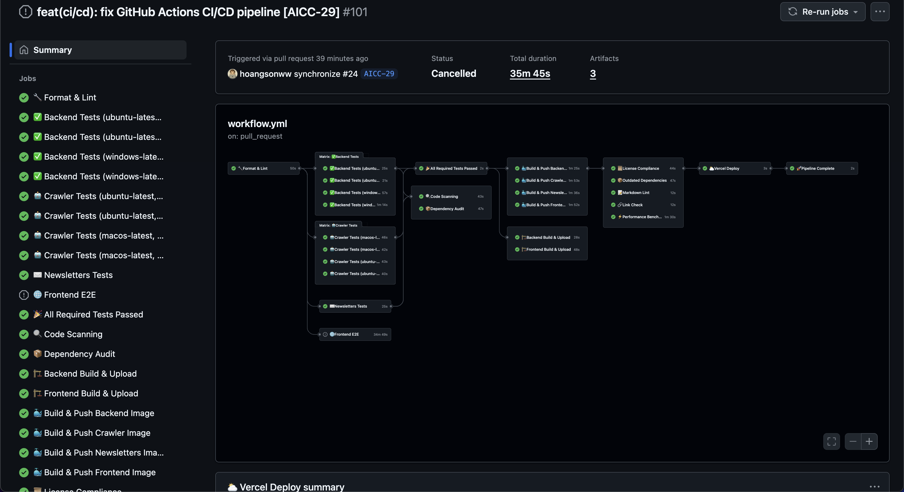
</p>

Additional `.yml` files are also available for specific tasks, such as `backend-ci.yml`, `crawler-ci.yml`, and `frontend-ci.yml`.

---

## License

This project is licensed under the MIT License. See the [LICENSE](./LICENSE) file for more details.

---

## Contact

If you have any questions or suggestions, feel free to reach out to the repository maintainer:

- **David Nguyen**
  - [LinkedIn](https://www.linkedin.com/in/hoangsonw/)
  - [GitHub](https://github.com/hoangsonww)
  - [Email](mailto:hoangson091104@gmail.com)
  - [Website](https://sonnguyenhoang.com/)

I will be happy to assist you with any questions or issues you may have regarding this project.

> [!TIP]
> If I don't know the answer, I'll be able to forward your question to the right person in the AICC team who can help you!

---

## Conclusion

The **SynthoraAI - AI-Powered Article Content Curator** project brings together a powerful backend, an intelligent crawler,
a newsletter service, and a modern frontend to deliver up-to-date, summarized government-related articles. Leveraging advanced technologies
like Google Generative AI, Next.js, Express.js, and MongoDB, the system is both scalable and robust. Whether you’re a government staff member
or a curious public user, this solution provides a streamlined, user-friendly experience to quickly access relevant, summarized content.

> [!NOTE]
> This project is a work in progress, and contributions are welcome! If you have ideas for improvements, bug fixes, or new features, please feel free to open an issue or submit a pull request.

---

Thank you for exploring this project! If you have any questions, suggestions, or contributions, feel free to reach out. Your feedback is invaluable in making this project even better.
Cheers to a more informed world! 🚀

**[🔝 Back to Top](#ai-powered-article-content-curator)**
