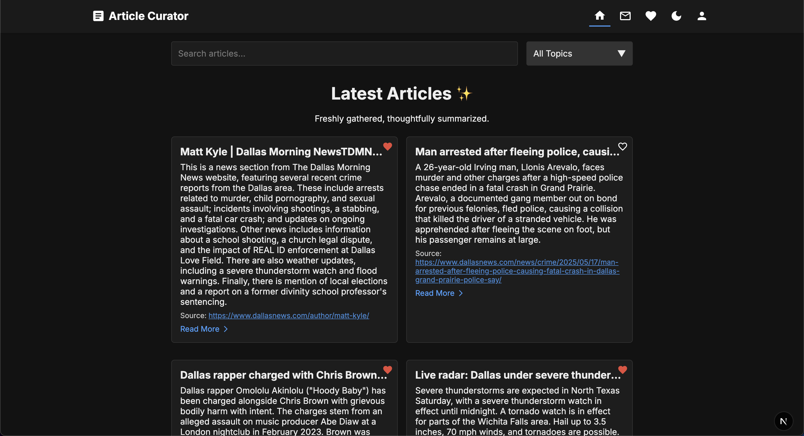

# AI-Powered Article Content Curator

The **AI-Powered Article Content Curator** is a comprehensive, AI-powered system designed to aggregate, summarize, and present curated government-related articles. The project is organized into three main components:

- **Backend:** Provides a robust RESTful API to store and serve curated articles.
- **Crawler:** Automatically crawls and extracts article URLs and metadata from government homepages and public API sources.
- **Frontend:** Offers an intuitive Next.js-based user interface for government staff (and potentially the public) to browse and view article details.

Each component is maintained in its own directory:

- **Backend:** `backend/`
  - Live: [https://ai-content-curator-backend.vercel.app/](https://ai-content-curator-backend.vercel.app/)
- **Crawler:** `crawler/`
  - Live: [https://ai-content-curator-crawler.vercel.app/](https://ai-content-curator-crawler.vercel.app/)
- **Frontend:** `frontend/`
  - Live: [https://ai-gov-content-curator.vercel.app/](https://ai-gov-content-curator.vercel.app/)


> Note: This is a work in progress. Please review the information, test out the applications, and provide feedback or contributions. More features are also coming soon!

---

## Table of Contents

- [Overview](#overview)
- [User Interface](#user-interface)
- [Architecture](#architecture)
- [Backend](#backend)
  - [Features](#features)
  - [Prerequisites & Installation](#prerequisites--installation-backend)
  - [Configuration](#configuration-backend)
  - [Running Locally](#running-locally-backend)
  - [Deployment on Vercel](#deployment-on-vercel-backend)
- [Crawler](#crawler)
  - [Features](#features-1)
  - [Prerequisites & Installation](#prerequisites--installation-crawler)
  - [Configuration](#configuration-crawler)
  - [Running Locally](#running-locally-crawler)
  - [Deployment on Vercel](#deployment-on-vercel-crawler)
- [Frontend](#frontend)
  - [Features](#features-2)
  - [Prerequisites & Installation](#prerequisites--installation-frontend)
  - [Configuration](#configuration-frontend)
  - [Running Locally](#running-locally-frontend)
  - [Deployment on Vercel](#deployment-on-vercel-frontend)
- [Logging, Error Handling & Future Enhancements](#logging-error-handling--future-enhancements)
- [Contributing](#contributing)
- [License](#license)
- [Conclusion](#conclusion)

---

## Overview

The **AI-Powered Article Content Curator** system is designed to provide government staff with up-to-date, summarized content from trusted government sources and reputable news outlets. By leveraging AI (Google Generative AI / Gemini) for summarization and using modern web technologies, this solution ensures that users receive concise, accurate, and timely information.

- **Data Ingestion:**  
  The system aggregates article URLs from multiple sources (government homepages and public APIs like NewsAPI) using a decoupled crawler service.
- **Content Processing:**  
  The backend processes the fetched articles by generating concise summaries via Google Generative AI. This step includes handling rate limits and transient errors with robust retry mechanisms.
- **Data Storage & API Serving:**  
  Articles—comprising URLs, titles, full content, AI-generated summaries, source details, and fetch timestamps—are stored in MongoDB (managed through Mongoose). An Express.js API, integrated within a Next.js project, exposes REST endpoints for fetching article lists and individual article details.
- **Frontend Experience:**  
  A responsive Next.js/React interface allows users to easily browse paginated article lists, filter by source, and view detailed article pages.
- **Scheduled Updates:**  
  Both the backend and crawler employ scheduled serverless functions (via Vercel cron) to periodically update the content.

- **Architecture:**
  Monorepo structure with separate directories for the backend, crawler, and frontend. Each component is designed to be scalable, maintainable, and deployable on Vercel.

---

## User Interface

### 1. Home Page

<p align="center">
  
</p>

### 2. Home Page (Dark Mode)

<p align="center">
  
</p>

### 3. Article Details Page

<p align="center">
  
</p>

---

## Architecture

Below is a high-level diagram outlining the system architecture:

```
      +----------------+       +--------------------------+
      |                |       |                          |
      |   Data Sources |       |   Public API Sources     |
      |                |       |   (e.g., NewsAPI)        |
      +--------+-------+       +-------------+------------+
               |                              |
               |                              |
               v                              v
      +----------------+       +--------------------------+
      |                |       |                          |
      | Custom Crawlers|       | API Fetcher Service      |
      | (Homepage      |       |                          |
      |  Crawling)     |       +-------------+------------+
      |                |                     |
      +--------+-------+                     |
               |                             |
               +------------+----------------+
                            |
                            v
                  +--------------------+
                  |                    |
                  |   Data Processing  |
                  | (Summarization via |
                  |  Gemini AI /       |
                  | GoogleGenerativeAI)|
                  |                    |
                  +---------+----------+
                            |
                            v
                  +--------------------+
                  |                    |
                  |   MongoDB Storage  |
                  | (via Mongoose)     |
                  |                    |
                  +---------+----------+
                            |
                            v
                  +--------------------+
                  |                    |
                  |   Express.js API   |
                  | (REST Endpoints)   |
                  |                    |
                  +---------+----------+
                            |
                            v
                  +--------------------+
                  |                    |
                  |   Next.js Frontend |
                  |  (Consumer of API) |
                  |                    |
                  +--------------------+
```

---

## Backend

The **Backend** is responsible for storing articles and serving them via RESTful endpoints. It integrates AI summarization, MongoDB for storage, and runs within a Next.js environment using Express.js for API routes.

### Features

- **Data Ingestion:**  
  Receives article URLs and data from the crawler and external API sources.
- **Content Summarization:**  
  Uses Google Generative AI (Gemini) to generate concise summaries.
- **Storage:**  
  Persists articles in MongoDB using Mongoose with fields for URL, title, full content, summary, source information, and fetch timestamp.
- **API Endpoints:**
  - `GET /api/articles` – Retrieves a paginated list of articles (supports filtering via query parameters such as `page`, `limit`, and `source`).
  - `GET /api/articles/:id` – Retrieves detailed information for a specific article.
- **Scheduled Updates:**  
  A serverless function (triggered twice daily at 6:00 AM and 6:00 PM UTC) fetches and processes new articles, so that the system remains up-to-date!

### Prerequisites & Installation (Backend)

> Note: Instead of installing the node modules separately, you can run `npm install` in the root directory to install dependencies for all components.

1. **Prerequisites:**

   - Node.js (v18 or later)
   - MongoDB (local or cloud)
   - Vercel CLI (for deployment)

2. **Clone the Repository:**

   ```bash
   git clone https://github.com/hoangsonww/AI-Gov-Content-Curator.git
   cd AI-Gov-Content-Curator/backend
   ```

3. **Install Dependencies:**

   ```bash
   npm install
   ```

### Configuration (Backend)

Create a `.env` file in the `backend` directory with the following:

```dotenv
MONGODB_URI=your_production_mongodb_connection_string
GOOGLE_AI_API_KEY=your_google_ai_api_key
AI_INSTRUCTIONS=Your system instructions for Gemini AI
NEWS_API_KEY=your_newsapi_key
PORT=3000
CRAWL_URLS=https://www.whitehouse.gov/briefing-room/,https://www.congress.gov/,https://www.state.gov/press-releases/,https://www.bbc.com/news,https://www.nytimes.com/
```

### Running Locally (Backend)

Start the development server:

```bash
npm run dev
```

Access endpoints:

- `GET http://localhost:3000/api/articles`
- `GET http://localhost:3000/api/articles/:id`

### Deployment on Vercel (Backend)

1. **Configure Environment Variables** in your Vercel project settings.
2. Create or update the `vercel.json` in the root of the backend directory:

   ```json
   {
     "version": 2,
     "builds": [
       {
         "src": "package.json",
         "use": "@vercel/next"
       }
     ],
     "crons": [
       {
         "path": "/api/scheduled/fetchAndSummarize",
         "schedule": "0 6,18 * * *"
       }
     ]
   }
   ```

3. **Deploy** with:

   ```bash
   vercel --prod
   ```

---

## Crawler

The **Crawler** automatically retrieves article links and metadata from government homepages and public API sources. It uses Axios and Cheerio for static HTML parsing and falls back to Puppeteer when necessary.

### Features

- **Article Extraction:**  
  Crawls specified URLs to extract article links and metadata.

- **Error Handling & Resilience:**  
  Implements a retry mechanism and fallback to Puppeteer for dynamic content fetching when encountering issues (e.g., HTTP 403, ECONNRESET).

- **Scheduling:**  
  Deployed as a serverless function on Vercel, scheduled via cron (runs daily at 6:00 AM UTC).

- **Next.js UI:**  
  Provides a basic landing page with information about the crawler and links to the backend and frontend.

### Prerequisites & Installation (Crawler)

1. **Prerequisites:**

- Node.js (v18 or later)
- NPM (or Yarn)
- Vercel CLI (for deployment)

2. **Clone the Repository:**

   ```bash
   git clone https://github.com/hoangsonww/AI-Gov-Content-Curator.git
   cd AI-Gov-Content-Curator/crawler
   ```

3. **Install Dependencies:**

   ```bash
   npm install
   ```

### Configuration (Crawler)

Create a `.env` file in the `crawler` directory with the following variables:

```dotenv
MONGODB_URI=your_mongodb_connection_string
GOOGLE_AI_API_KEY=your_google_ai_api_key
AI_INSTRUCTIONS=Your system instructions for Gemini AI
NEWS_API_KEY=your_newsapi_key
PORT=3000
CRAWL_URLS=https://www.whitehouse.gov/briefing-room/,https://www.congress.gov/,https://www.state.gov/press-releases/,https://www.bbc.com/news,https://www.nytimes.com/
```

### Running Locally (Crawler)

Start the Next.js development server to test both the UI and crawler function:

```bash
npm run dev
```

- UI: [http://localhost:3000/](http://localhost:3000/)
- Crawler Function: [http://localhost:3000/api/scheduled/fetchAndSummarize](http://localhost:3000/api/scheduled/fetchAndSummarize)

Alternatively, run the crawler directly:

```bash
npx ts-node schedule/fetchAndSummarize.ts
```

### Deployment on Vercel (Crawler)

1. **Set Environment Variables** in the Vercel dashboard.
2. Create or update the `vercel.json` in the `crawler` directory:

   ```json
   {
     "version": 2,
     "builds": [
       {
         "src": "package.json",
         "use": "@vercel/next"
       }
     ],
     "crons": [
       {
         "path": "/api/scheduled/fetchAndSummarize",
         "schedule": "0 6 * * *"
       }
     ]
   }
   ```

3. **Deploy** with:

   ```bash
   vercel --prod
   ```

---

## Frontend

The **Frontend** is built with Next.js and React, providing a modern, mobile-responsive UI for browsing and viewing curated articles.

### Features

- **Article Listing:**  
  Fetches and displays a paginated list of articles from the backend API. Supports filtering by source.

- **Article Detail View:**  
  Dedicated pages display full article content, AI-generated summaries, source information, and fetched timestamps.

- **Responsive Design:**  
  The UI is optimized for both desktop and mobile devices.

- **Additional UI Components:**  
  Includes components like HeroSlider, LatestArticles, ThemeToggle, and more for an enhanced user experience.

### Prerequisites & Installation (Frontend)

1. **Prerequisites:**

- Node.js (v18 or later)
- NPM or Yarn

2. **Clone the Repository:**

   ```bash
   git clone https://github.com/hoangsonww/AI-Gov-Content-Curator.git
   cd AI-Gov-Content-Curator/frontend
   ```

3. **Install Dependencies:**

   ```bash
   npm install
   ```

   or

   ```bash
   yarn
   ```

### Configuration (Frontend)

(Optional) Create a `.env.local` file in the `frontend` directory to configure the API URL:

```dotenv
NEXT_PUBLIC_API_URL=https://your-backend.example.com
```

### Running Locally (Frontend)

Start the development server:

```bash
npm run dev
```

Access the application at [http://localhost:3000](http://localhost:3000).

### Deployment on Vercel (Frontend)

1. **Configure Environment Variables** in the Vercel dashboard (e.g., `NEXT_PUBLIC_API_URL`).
2. Vercel automatically detects the Next.js project; if needed, customize with a `vercel.json`.
3. **Deploy** with:

   ```bash
   vercel --prod
   ```

Alternatively, you can deploy directly from the Vercel dashboard.

---

## Logging, Error Handling & Future Enhancements

- **Logging:**

  - Development: Uses basic console logging.
  - Production: Consider integrating advanced logging libraries (e.g., Winston, Sentry) for improved error monitoring.

- **Error Handling:**

  - The backend implements retry mechanisms for AI summarization.
  - The crawler gracefully handles network errors and switches between Axios/Cheerio and Puppeteer as needed.

- **Future Enhancements:**
  - Expand the Next.js UI into a richer dashboard featuring analytics, logs, and user authentication.
  - Refine scheduling options for more granular updates.
  - Integrate additional public API sources and extend filtering capabilities.

---

## Contributing

1. **Fork** the repository and clone it locally.
2. **Create a Feature Branch:**

   ```bash
   git checkout -b feature/your-feature-name
   ```

3. **Commit Your Changes:**

   ```bash
   git commit -m "Description of your feature"
   ```

4. **Push the Branch and Open a Pull Request.**

Contributions are welcome! Please ensure that your code adheres to the project’s linting and formatting guidelines.

---

## License

This project is licensed under the MIT License. See the [LICENSE](./LICENSE) file for more details.

---

## Conclusion

The **AI-Powered Article Content Curator** project brings together a powerful backend, an intelligent crawler, and a modern frontend to deliver up-to-date, summarized government-related articles. Leveraging advanced technologies like Google Generative AI, Next.js, Express.js, and MongoDB, the system is both scalable and robust. Whether you’re a government staff member or a curious public user, this solution provides a streamlined, user-friendly experience to quickly access relevant, summarized content.

---

Happy Building and Crawling! 🚀

**[🔝 Back to Top](#ai-powered-article-content-curator)**
