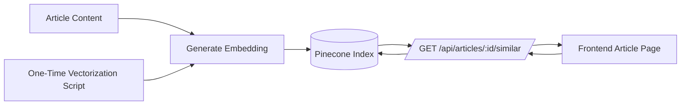

# Related Articles Implementation - SynthoraAI Documentation

## Table of Contents

- [Overview](#overview)
- [End-to-End Flow](#end-to-end-flow)
- [Components](#components)
  - [1. Backend Service (`backend/src/services/pinecone.service.ts`)](#1-backend-service-backendsrcservicespineconeservicets)
  - [2. Backend API Endpoint](#2-backend-api-endpoint)
  - [3. Crawler Integration (`crawler/services/pinecone.service.ts`)](#3-crawler-integration-crawlerservicespineconeservicets)
  - [4. Frontend Component (`frontend/components/RelatedArticles.tsx`)](#4-frontend-component-frontendcomponentsrelatedarticlestsx)
- [Setup Instructions](#setup-instructions)
  - [1. Environment Variables](#1-environment-variables)
  - [2. One-Time Vectorization of Existing Articles](#2-one-time-vectorization-of-existing-articles)
  - [3. Automatic Sync (Already Integrated)](#3-automatic-sync-already-integrated)
- [Architecture](#architecture)
  - [Vector Embedding](#vector-embedding)
  - [Pinecone Storage](#pinecone-storage)
  - [Similarity Search](#similarity-search)
- [Ranking & Filtering Notes](#ranking--filtering-notes)
- [Operational Notes](#operational-notes)
- [Usage](#usage)
  - [Frontend](#frontend)
  - [API Testing](#api-testing)
- [Performance Considerations](#performance-considerations)

## Overview

This feature adds a related articles carousel to article detail pages using Pinecone vector similarity search with Google's gemini-embedding-001 model.

## End-to-End Flow



## Components

### 1. Backend Service (`backend/src/services/pinecone.service.ts`)

- **upsertArticleVector**: Vectorizes and stores articles in Pinecone
- **findSimilarArticles**: Retrieves similar articles using ANN (Approximate Nearest Neighbor)
- **deleteArticleVector**: Removes article vectors from Pinecone

### 2. Backend API Endpoint

- **GET** `/api/articles/:id/similar?limit=6`
- Returns similar articles based on vector similarity
- Supports optional limit parameter (default: 6)

### 3. Crawler Integration (`crawler/services/pinecone.service.ts`)

- Non-blocking vectorization when articles are added to MongoDB
- Uses `setImmediate()` to avoid blocking the main crawler logic
- Automatic sync between MongoDB and Pinecone

### 4. Frontend Component (`frontend/components/RelatedArticles.tsx`)

- Responsive carousel using react-slick
- Shows 3 articles on desktop, 2 on tablet, 1 on mobile
- Auto-play with 5-second intervals
- Hover to pause
- Dark mode support

## Setup Instructions

### 1. Environment Variables

Add to `backend/.env` and `crawler/.env`:

```env
PINECONE_API_KEY=
PINECONE_INDEX=
```

### 2. One-Time Vectorization of Existing Articles

Run this script to vectorize all existing articles in MongoDB:

```bash
cd backend
npx ts-node src/scripts/vectorizeArticles.ts
```

This will:

- Connect to MongoDB
- Fetch all articles in batches of 50
- Generate embeddings using Google's gemini-embedding-001
- Upload vectors to Pinecone with metadata
- Show progress and completion stats

**Note**: This can take time depending on the number of articles. The script includes a 100ms delay between articles to avoid rate limiting.

### 3. Automatic Sync (Already Integrated)

The crawler script (`crawler/scripts/fetchLatestArticles.ts`) now automatically:

- Saves new articles to MongoDB
- Asynchronously vectorizes and uploads to Pinecone
- Logs any vectorization errors without blocking the crawler

## Architecture

### Vector Embedding

- **Model**: Google Generative AI `gemini-embedding-001`
- **Input**: Article title + summary
- **Dimension**: 768 (default for gemini-embedding-001)

### Pinecone Storage

Each vector stores:

- **id**: MongoDB article ID
- **values**: 768-dimensional embedding vector
- **metadata**:
  - url
  - title
  - summary
  - topics (array)
  - source
  - fetchedAt

### Similarity Search

- Uses cosine similarity (Pinecone default)
- Filters out the query article itself
- Returns top K similar articles with scores
- Combines with recency/quality heuristics (via metadata)

## Ranking & Filtering Notes

To keep results relevant and diverse, typical production setups apply lightweight filters:

- **Self-exclusion** by article ID
- **Soft recency bias**, e.g., prefer recent content when scores are close
- **Topic-aware filtering** to avoid showing duplicates from the same source
- **Minimum similarity threshold** to avoid low-quality matches

If you add or tune these rules, keep them centralized in the backend so the frontend remains a simple renderer.

## Operational Notes

- **Re-index on schema changes**: if metadata fields or embedding inputs change, re-vectorize to avoid mismatches.
- **Handle missing embeddings**: fall back to recent or popular articles when an article is not embedded yet.
- **Backfill scheduling**: run the bulk vectorization script off-hours for large datasets.

## Usage

### Frontend

The carousel automatically appears on article detail pages (`/articles/[id]`).

### API Testing

```bash
curl https://your-backend.com/api/articles/ARTICLE_ID/similar?limit=6
```

Response:

```json
{
  "data": [
    {
      "id": "article_id",
      "title": "Article Title",
      "summary": "Article summary...",
      "topics": ["topic1", "topic2"],
      "source": "source.com",
      "fetchedAt": "2025-01-15T10:30:00Z",
      "score": 0.92
    }
  ]
}
```

## Performance Considerations

1. **Non-blocking**: Vectorization happens asynchronously via `setImmediate()`
2. **Batching**: Initial vectorization processes 50 articles at a time
3. **Rate Limiting**: 100ms delay between embeddings to avoid API limits
4. **Caching**: Frontend could add SWR caching for similar articles
5. **Error Handling**: Vectorization errors are logged but don't break the crawler
