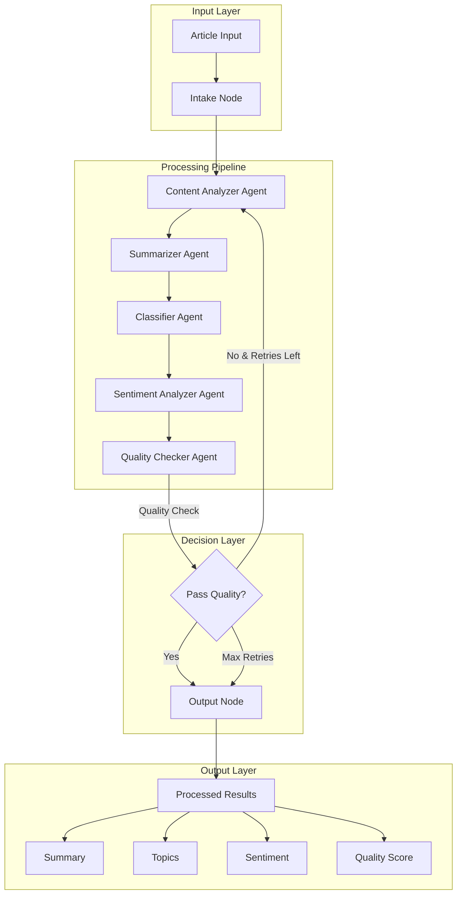
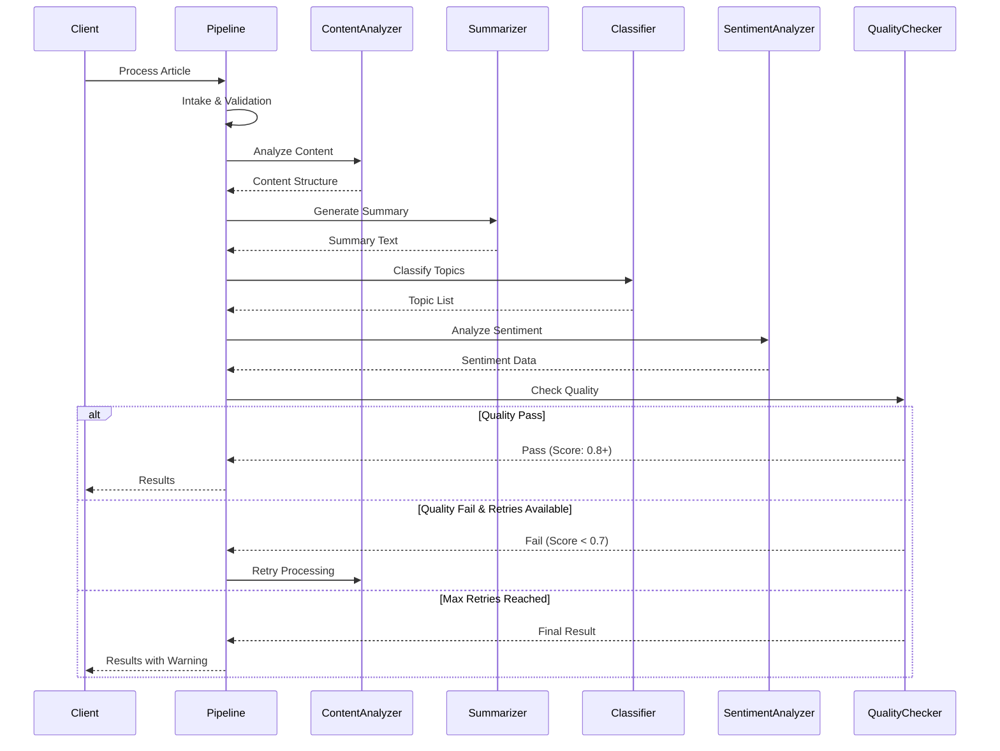
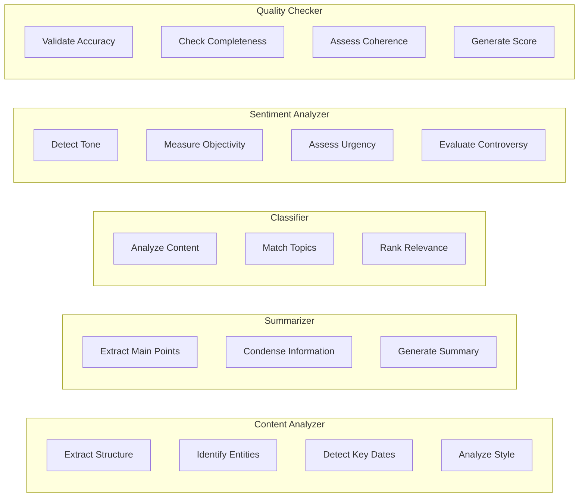
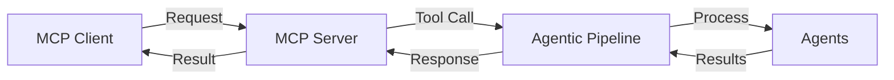
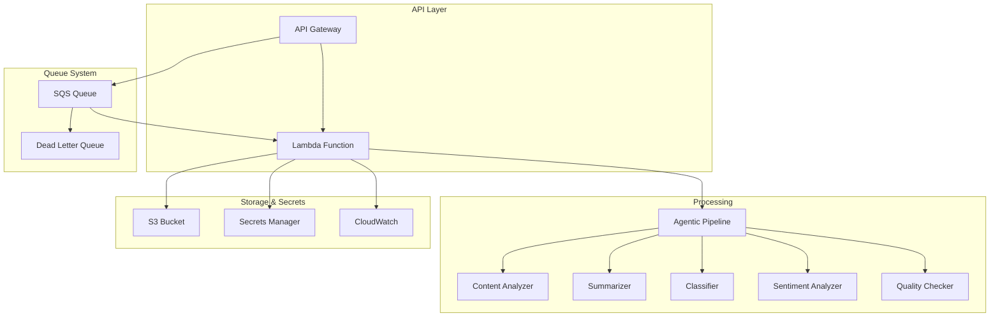
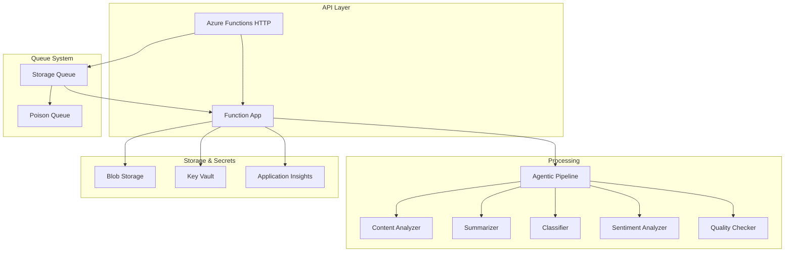

# SynthoraAI Agentic AI Pipeline

A sophisticated, production-ready Agentic AI system built with LangGraph and LangChain, featuring assembly line architecture, MCP server integration, and cloud deployment support for AWS and Azure.

## Table of Contents

- [🌟 Overview](#-overview)
  - [Key Features](#key-features)
- [🏗️ Architecture](#-architecture)
  - [System Overview](#system-overview)
  - [Assembly Line Flow](#assembly-line-flow)
  - [Agent Responsibilities](#agent-responsibilities)
- [🎯 Agent Details](#-agent-details)
  - [1. Content Analyzer Agent](#1-content-analyzer-agent)
  - [2. Summarizer Agent](#2-summarizer-agent)
  - [3. Classifier Agent](#3-classifier-agent)
  - [4. Sentiment Analyzer Agent](#4-sentiment-analyzer-agent)
  - [5. Quality Checker Agent](#5-quality-checker-agent)
- [🔌 MCP Server](#-mcp-server)
  - [Available Tools](#available-tools)
    - [`process_article`](#processarticle)
    - [`analyze_content`](#analyzecontent)
    - [`generate_summary`](#generatesummary)
    - [`check_pipeline_health`](#checkpipelinehealth)
    - [`get_processing_status`](#getprocessingstatus)
  - [Resources](#resources)
  - [MCP Integration Flow](#mcp-integration-flow)
- [☁️ Cloud Deployment](#-cloud-deployment)
  - [AWS Architecture](#aws-architecture)
  - [Azure Architecture](#azure-architecture)
- [🚀 Getting Started](#-getting-started)
  - [Prerequisites](#prerequisites)
  - [Installation](#installation)
  - [Running Locally](#running-locally)
    - [Start the MCP Server](#start-the-mcp-server)
    - [Use the Pipeline Programmatically](#use-the-pipeline-programmatically)
- [🌩️ Deployment](#-deployment)
  - [Deploy to AWS](#deploy-to-aws)
  - [Deploy to Azure](#deploy-to-azure)
- [📊 Monitoring & Observability](#-monitoring--observability)
  - [Structured Logging](#structured-logging)
  - [Metrics](#metrics)
  - [Health Checks](#health-checks)
- [⚙️ Configuration](#-configuration)
  - [Environment Variables](#environment-variables)
  - [.env Example](#env-example)
- [🧪 Testing](#-testing)
  - [Run Tests](#run-tests)
  - [Example Test](#example-test)
- [📈 Performance](#-performance)
  - [Benchmarks](#benchmarks)
  - [Optimization Tips](#optimization-tips)
- [🔐 Security](#-security)
  - [Best Practices](#best-practices)
  - [API Key Rotation](#api-key-rotation)
- [🤝 Integration](#-integration)
  - [Integrate with Existing Backend](#integrate-with-existing-backend)
  - [MCP Client Integration](#mcp-client-integration)
- [📚 API Reference](#-api-reference)
  - [Pipeline API](#pipeline-api)
    - [`AgenticPipeline.process_article(article_data: Dict) -> Dict`](#agenticpipelineprocessarticlearticledata-dict---dict)
    - [`AgenticPipeline.visualize() -> str`](#agenticpipelinevisualize---str)
- [🛠️ Troubleshooting](#-troubleshooting)
  - [Common Issues](#common-issues)
    - [Pipeline Timeout](#pipeline-timeout)
    - [Low Quality Scores](#low-quality-scores)
    - [Memory Issues](#memory-issues)
- [👥 Contributing](#-contributing)
- [📄 License](#-license)
- [🙏 Acknowledgments](#-acknowledgments)
- [📞 Support](#-support)

## 🌟 Overview

The SynthoraAI Agentic AI Pipeline is an advanced content processing system that leverages multiple specialized AI agents working in concert to analyze, summarize, classify, and quality-check articles. Built on LangGraph's state machine architecture, it provides reliability, scalability, and sophisticated multi-agent orchestration.

### Key Features

- **🤖 Multi-Agent Architecture**: Specialized agents for content analysis, summarization, classification, sentiment analysis, and quality checking
- **🔄 Assembly Line Processing**: LangGraph-based pipeline with state management and conditional routing
- **🔌 MCP Server**: Model Context Protocol server for standardized AI interactions
- **☁️ Cloud-Ready**: Production deployment configurations for AWS Lambda and Azure Functions
- **📊 Quality Assurance**: Built-in quality checking with automatic retry mechanisms
- **⚡ Production-Ready**: Comprehensive logging, monitoring, error handling, and observability
- **🔐 Secure**: Secrets management with AWS Secrets Manager and Azure Key Vault

---

## 🏗️ Architecture

### System Overview



### Assembly Line Flow

The pipeline implements an assembly line architecture where each agent performs a specific task:



### Agent Responsibilities



---

## 🎯 Agent Details

### 1. Content Analyzer Agent

Extracts structure and key information from articles.

**Outputs:**
- Main topic and subtopics
- Named entities (people, organizations, locations)
- Important dates and events
- Content structure analysis
- Writing style and tone
- Word count and reading time

### 2. Summarizer Agent

Generates concise, accurate summaries.

**Features:**
- Captures main points and key facts
- Maintains factual accuracy
- Uses clear, accessible language
- 150-200 word summaries
- Highlights important takeaways

### 3. Classifier Agent

Categorizes articles into relevant topics.

**Topic Categories:**
- Politics & Governance
- Economy & Finance
- Healthcare
- Education
- Environment & Climate
- Technology & Innovation
- Security & Defense
- Social Issues
- Infrastructure
- International Relations
- Law & Justice
- Public Safety
- Energy
- Transportation
- Science & Research

### 4. Sentiment Analyzer Agent

Analyzes emotional tone and sentiment.

**Analysis Dimensions:**
- Overall sentiment (positive/negative/neutral)
- Sentiment score (-1 to 1)
- Emotional tone
- Objectivity score (0 to 1)
- Urgency level (low/medium/high)
- Controversy level (low/medium/high)
- Key phrases indicating sentiment

### 5. Quality Checker Agent

Validates output quality and completeness.

**Evaluation Criteria:**
- Summary quality (accuracy, completeness, clarity)
- Classification relevance
- Sentiment accuracy
- Overall coherence
- Generates quality score (0 to 1)

---

## 🔌 MCP Server

The Model Context Protocol (MCP) server provides a standardized interface for AI interactions.

### Available Tools

#### `process_article`
Process an article through the full pipeline.

```python
{
    "article_id": "unique-id",
    "content": "Article content...",
    "url": "https://example.com/article",
    "source": "government"
}
```

#### `analyze_content`
Run specific analysis (content, sentiment, or classification).

#### `generate_summary`
Generate only a summary without full pipeline processing.

#### `check_pipeline_health`
Get health status of the pipeline and all agents.

#### `get_processing_status`
Check the status of an article processing job.

### Resources

- `config://pipeline` - Pipeline configuration
- `config://topics` - Available topic categories
- `stats://processing` - Processing statistics

### MCP Integration Flow



---

## ☁️ Cloud Deployment

### AWS Architecture



**AWS Services:**
- **Lambda**: Serverless compute for pipeline execution
- **API Gateway**: REST API endpoint
- **S3**: Storage for artifacts and models
- **SQS**: Asynchronous processing queue
- **Secrets Manager**: Secure API key storage
- **CloudWatch**: Logging and monitoring

### Azure Architecture



**Azure Services:**
- **Azure Functions**: Serverless compute
- **Storage Queues**: Asynchronous processing
- **Blob Storage**: Artifact storage
- **Key Vault**: Secrets management
- **Application Insights**: Monitoring and analytics

---

## 🚀 Getting Started

### Prerequisites

- Python 3.11+
- pip or poetry for package management
- MongoDB (for article storage)
- Redis (for state management)
- API keys:
  - Google AI (Gemini)
  - Pinecone (optional, for vector search)

### Installation

1. **Clone and navigate:**
   ```bash
   cd agentic_ai
   ```

2. **Install dependencies:**
   ```bash
   pip install -r requirements.txt
   ```

3. **Configure environment:**
   ```bash
   cp .env.example .env
   # Edit .env with your configuration
   ```

4. **Set required environment variables:**
   ```bash
   export MONGODB_URI=your-mongodb-uri
   export GOOGLE_AI_API_KEY=your-google-api-key
   export REDIS_HOST=localhost
   export REDIS_PORT=6379
   ```

### Running Locally

#### Start the MCP Server

```bash
python -m agentic_ai.mcp_server.server
```

The MCP server will start on `http://localhost:8001`.

#### Use the Pipeline Programmatically

```python
import asyncio
from agentic_ai.core.pipeline import AgenticPipeline

# Initialize pipeline
pipeline = AgenticPipeline()

# Process an article
article_data = {
    "id": "article-123",
    "content": "Your article content here...",
    "url": "https://example.com/article",
    "source": "government"
}

# Run pipeline
result = asyncio.run(pipeline.process_article(article_data))

print(f"Summary: {result['summary']}")
print(f"Topics: {result['topics']}")
print(f"Sentiment: {result['sentiment']['overall_sentiment']}")
print(f"Quality Score: {result['quality_score']}")
```

---

## 🌩️ Deployment

### Deploy to AWS

```bash
cd aws
chmod +x deploy.sh
./deploy.sh production
```

See [aws/README.md](aws/README.md) for detailed instructions.

### Deploy to Azure

```bash
cd azure
chmod +x deploy.sh
./deploy.sh production
```

See [azure/README.md](azure/README.md) for detailed instructions.

---

## 📊 Monitoring & Observability

### Structured Logging

All components use structured logging with `structlog`:

```python
logger.info(
    "Article processed",
    article_id=article_id,
    quality_score=quality_score,
    processing_time=elapsed_time
)
```

### Metrics

Prometheus metrics are available on port 9090 (configurable):

- `pipeline_processing_total` - Total articles processed
- `pipeline_processing_duration_seconds` - Processing time histogram
- `pipeline_quality_score` - Quality score distribution
- `agent_execution_duration_seconds` - Per-agent execution time

### Health Checks

Check pipeline health via MCP server:

```bash
curl http://localhost:8001/health
```

---

## ⚙️ Configuration

### Environment Variables

See [config/settings.py](config/settings.py) for all configuration options.

Key settings:
- `ENVIRONMENT`: deployment environment (development/staging/production)
- `DEFAULT_LLM_PROVIDER`: LLM provider (google/openai/anthropic)
- `MAX_ITERATIONS`: maximum retry attempts
- `AGENT_TIMEOUT`: agent execution timeout
- `ENABLE_METRICS`: enable Prometheus metrics

### .env Example

```bash
# Application
ENVIRONMENT=production
DEBUG=false
LOG_LEVEL=INFO

# LLM Configuration
GOOGLE_AI_API_KEY=your-key-here
DEFAULT_LLM_PROVIDER=google
DEFAULT_MODEL=gemini-pro
TEMPERATURE=0.7
MAX_TOKENS=2000

# Database
MONGODB_URI=mongodb://localhost:27017
MONGODB_DATABASE=synthora_ai

# Redis
REDIS_HOST=localhost
REDIS_PORT=6379
REDIS_PASSWORD=

# Vector Store
PINECONE_API_KEY=your-key-here
PINECONE_ENVIRONMENT=us-east-1
PINECONE_INDEX_NAME=synthora-ai

# Pipeline Settings
MAX_ITERATIONS=10
AGENT_TIMEOUT=300
ENABLE_HUMAN_IN_LOOP=false

# Monitoring
ENABLE_METRICS=true
METRICS_PORT=9090

# Cloud (AWS)
AWS_REGION=us-east-1
AWS_S3_BUCKET=your-bucket

# Cloud (Azure)
AZURE_SUBSCRIPTION_ID=your-subscription-id
AZURE_RESOURCE_GROUP=your-resource-group
```

---

## 🧪 Testing

### Run Tests

```bash
# Install test dependencies
pip install -r requirements.txt

# Run all tests
pytest tests/ -v

# Run with coverage
pytest tests/ --cov=agentic_ai --cov-report=html
```

### Example Test

```python
import pytest
from agentic_ai.core.pipeline import AgenticPipeline

@pytest.mark.asyncio
async def test_pipeline_processing():
    pipeline = AgenticPipeline()

    result = await pipeline.process_article({
        "id": "test-1",
        "content": "Test article content...",
        "url": "https://test.com",
        "source": "test"
    })

    assert result["article_id"] == "test-1"
    assert result["summary"] is not None
    assert len(result["topics"]) > 0
    assert result["quality_score"] > 0
```

---

## 📈 Performance

### Benchmarks

- **Average processing time**: 5-15 seconds per article
- **Throughput**: 100+ articles/minute (with proper scaling)
- **Quality score**: Average 0.85+
- **Success rate**: 99%+

### Optimization Tips

1. **Use connection pooling** for MongoDB and Redis
2. **Enable caching** for frequently accessed data
3. **Adjust timeout values** based on content length
4. **Scale horizontally** using queues for high volume
5. **Use pre-warmed instances** in cloud deployments

---

## 🔐 Security

### Best Practices

- Store secrets in AWS Secrets Manager or Azure Key Vault
- Use IAM roles and managed identities
- Enable HTTPS-only traffic
- Implement rate limiting
- Validate and sanitize inputs
- Regular security audits

### API Key Rotation

1. Generate new API keys
2. Update in secrets manager
3. Redeploy functions
4. Revoke old keys after grace period

---

## 🤝 Integration

### Integrate with Existing Backend

```python
from agentic_ai.core.pipeline import AgenticPipeline

# In your article processing logic
pipeline = AgenticPipeline()

async def process_new_article(article):
    result = await pipeline.process_article({
        "id": article.id,
        "content": article.content,
        "url": article.url,
        "source": article.source
    })

    # Update article with processed data
    article.summary = result["summary"]
    article.topics = result["topics"]
    article.sentiment = result["sentiment"]
    article.quality_score = result["quality_score"]

    await article.save()
```

### MCP Client Integration

```python
from mcp import Client

client = Client("http://localhost:8001")

# Process article via MCP
result = await client.call_tool(
    "process_article",
    {
        "article_id": "123",
        "content": "Article content...",
        "url": "https://example.com",
        "source": "government"
    }
)
```

---

## 📚 API Reference

### Pipeline API

#### `AgenticPipeline.process_article(article_data: Dict) -> Dict`

Process an article through the complete pipeline.

**Parameters:**
- `article_data`: Dictionary with article information

**Returns:**
- Dictionary with processing results

#### `AgenticPipeline.visualize() -> str`

Generate a mermaid diagram of the pipeline.

**Returns:**
- Mermaid diagram string

---

## 🛠️ Troubleshooting

### Common Issues

#### Pipeline Timeout
- Increase `AGENT_TIMEOUT` in settings
- Check network connectivity to LLM providers
- Optimize content preprocessing

#### Low Quality Scores
- Review LLM prompt templates
- Adjust temperature settings
- Increase max_tokens for longer content

#### Memory Issues
- Reduce batch sizes
- Implement pagination for large datasets
- Use streaming for long content

---

## 👥 Contributing

We welcome contributions! Please see [CONTRIBUTING.md](../CONTRIBUTING.md) for guidelines.

---

## 📄 License

This project is licensed under the MIT License - see [LICENSE](../LICENSE) file for details.

---

## 🙏 Acknowledgments

- **LangChain** & **LangGraph** teams for excellent frameworks
- **Model Context Protocol** for standardized AI interfaces
- **SynthoraAI** core team for integration support

---

## 📞 Support

For questions or issues:
- GitHub Issues: [Create an issue](https://github.com/hoangsonww/AI-Gov-Content-Curator/issues)
- Email: hoangson091104@gmail.com
- Website: [sonnguyenhoang.com](https://sonnguyenhoang.com)

---

**Built with ❤️ by the SynthoraAI Team**
