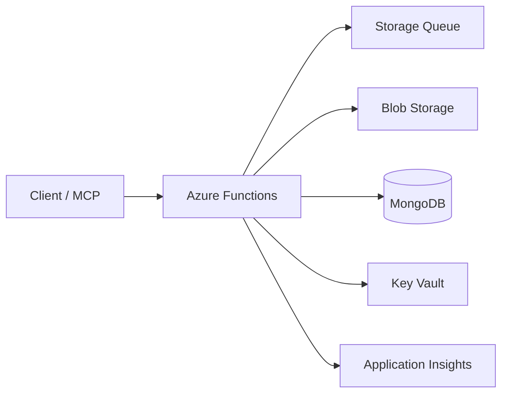

# Azure Deployment Guide

This directory contains Azure deployment configurations for the SynthoraAI Agentic AI Pipeline.

## Table of Contents

- [Architecture](#architecture)
- [Prerequisites](#prerequisites)
- [Deployment](#deployment)
  - [Quick Deploy](#quick-deploy)
  - [Manual Deployment](#manual-deployment)
- [Testing](#testing)
- [Monitoring](#monitoring)
- [Scaling Configuration](#scaling-configuration)
- [Cost Optimization](#cost-optimization)
- [Security](#security)
- [Troubleshooting](#troubleshooting)
  - [Cold Start Issues](#cold-start-issues)
  - [Memory Issues](#memory-issues)
  - [Timeout Issues](#timeout-issues)
- [Cleanup](#cleanup)
- [CI/CD Integration](#cicd-integration)

## Architecture

The Azure deployment uses serverless architecture with:
- **Azure Functions**: For processing articles through the pipeline
- **Azure Storage**: Queue for async processing and blob storage
- **Azure Key Vault**: Secure storage for API keys and secrets
- **Application Insights**: Monitoring and logging
- **App Service Plan**: Elastic Premium for production workloads



## Prerequisites

1. **Azure CLI** installed and configured:
   ```bash
   az login
   ```

2. **Azure Functions Core Tools** installed:
   ```bash
   npm install -g azure-functions-core-tools@4
   ```

3. **Environment variables** set:
   ```bash
   export MONGODB_URI=your-mongodb-uri
   export GOOGLE_AI_API_KEY=your-google-api-key
   export PINECONE_API_KEY=your-pinecone-key
   export AZURE_LOCATION=eastus
   ```

## Deployment

### Quick Deploy

```bash
chmod +x deploy.sh
./deploy.sh production
```

### Manual Deployment

1. **Create resource group**:
   ```bash
   az group create \
       --name synthora-ai-production \
       --location eastus
   ```

2. **Deploy infrastructure**:
   ```bash
   az deployment group create \
       --resource-group synthora-ai-production \
       --template-file bicep-template.bicep \
       --parameters \
           environment=production \
           mongoDbUri=$MONGODB_URI \
           googleAiApiKey=$GOOGLE_AI_API_KEY \
           pineconeApiKey=$PINECONE_API_KEY
   ```

3. **Deploy function code**:
   ```bash
   cd ..
   pip install -r requirements.txt --target .python_packages/lib/site-packages
   cd azure
   func azure functionapp publish synthora-ai-agentic-production --python
   ```

## Testing

Test the deployed endpoint:

```bash
# Get function URL
FUNCTION_URL=$(az functionapp show \
    --name synthora-ai-agentic-production \
    --resource-group synthora-ai-production \
    --query "defaultHostName" \
    --output tsv)

# Test article processing
curl -X POST "https://${FUNCTION_URL}/api/process" \
    -H 'Content-Type: application/json' \
    -d '{
        "article_id": "test-123",
        "content": "Government announces new infrastructure bill...",
        "url": "https://example.com/article",
        "source": "government"
    }'
```

## Monitoring

View function logs:
```bash
func azure functionapp logstream synthora-ai-agentic-production
```

View Application Insights metrics:
```bash
az monitor app-insights metrics show \
    --app synthora-ai-insights-production \
    --resource-group synthora-ai-production \
    --metric requests/count \
    --aggregation count
```

## Scaling Configuration

The deployment uses Azure Functions Elastic Premium plan with:
- **Auto-scaling**: Based on load
- **Pre-warmed instances**: Avoid cold starts
- **VNET integration**: For secure connectivity

To adjust scaling:
```bash
az functionapp plan update \
    --name synthora-ai-plan-production \
    --resource-group synthora-ai-production \
    --max-burst 20 \
    --min-instances 1
```

## Cost Optimization

- Use Consumption plan for development ($0.20 per million executions)
- Use Premium plan for production (predictable performance)
- Set appropriate timeout values to avoid long-running functions
- Monitor execution times and optimize code

## Security

- API keys stored in Azure Key Vault
- Managed Identity for Function App
- HTTPS-only traffic
- CORS configured for specific origins
- Soft delete enabled for Key Vault

## Troubleshooting

### Cold Start Issues
- Use Premium plan with pre-warmed instances
- Optimize imports in function code
- Use connection pooling for databases

### Memory Issues
- Monitor memory usage in Application Insights
- Increase plan size if needed
- Optimize model loading

### Timeout Issues
- Increase function timeout in host.json (max 10 minutes)
- Use queue-triggered functions for long-running tasks
- Consider Durable Functions for complex workflows

## Cleanup

To remove all resources:

```bash
az group delete --name synthora-ai-production --yes --no-wait
```

## CI/CD Integration

Example GitHub Actions workflow:

```yaml
name: Deploy to Azure

on:
  push:
    branches: [ main ]

jobs:
  deploy:
    runs-on: ubuntu-latest
    steps:
      - uses: actions/checkout@v2
      - uses: Azure/login@v1
        with:
          creds: ${{ secrets.AZURE_CREDENTIALS }}
      - name: Deploy
        run: |
          cd agentic_ai/azure
          ./deploy.sh production
```
