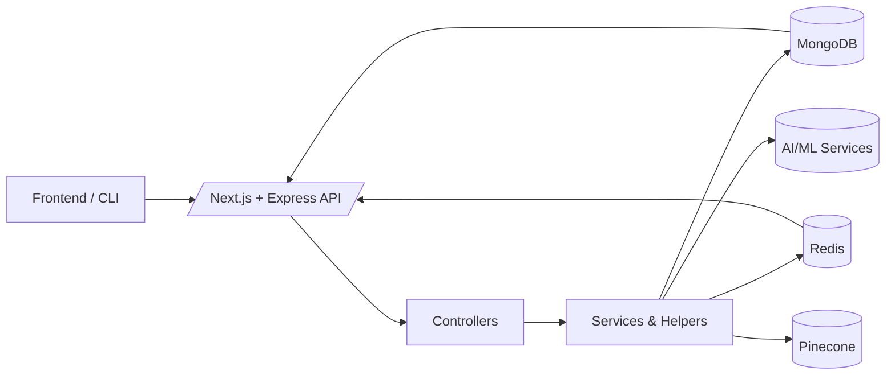
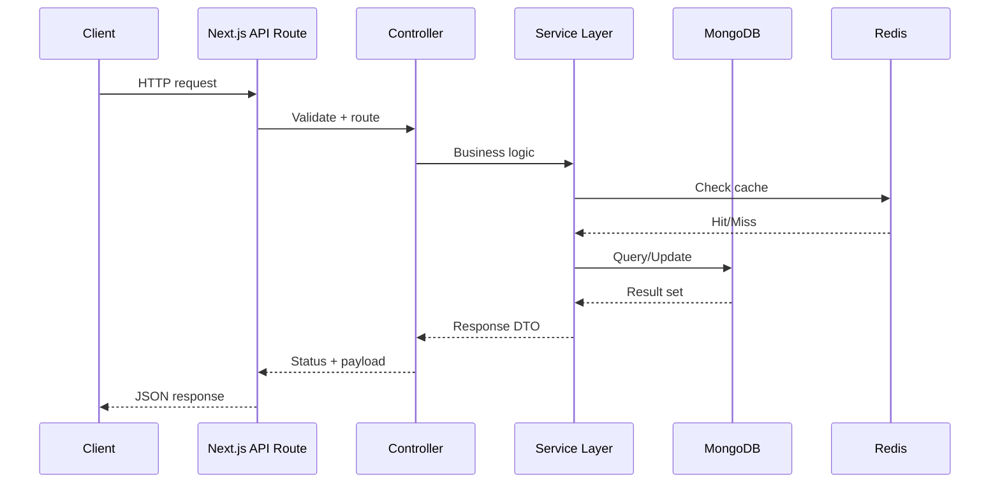

# SynthoraAI - AI Article Content Curator Backend (work in progress)

Backend API service for the AI Article Content Curator project. This service is responsible for:

- Ingesting article URLs from government homepage sources and public APIs (e.g., NewsAPI, fetched by an external crawler service).
- Processing article content using AI summarization (Google Generative AI - Gemini).
- Storing article data (URL, title, full content, AI summary, source info, fetch timestamp) in MongoDB via Mongoose.
- Authentication and user management for government staff access. Includes password-based and passkey-based authentication flows, email verification, and password reset functionality.
- Exposing RESTful API endpoints (built with Express.js running within a Next.js project) for the frontend to retrieve article lists and details.
- A serverless function (deployed on Vercel and scheduled via cron) periodically fetches and processes new articles (running twice daily at 6:00 AM and 6:00 PM UTC).
- And more...

**Currently live at: [https://ai-content-curator-backend.vercel.app/](https://ai-content-curator-backend.vercel.app/).**

---

## Table of Contents

- [Overview](#overview)
- [Architecture Overview](#architecture-overview)
- [Detailed Description](#detailed-description)
  - [Data Ingestion & Processing](#data-ingestion--processing)
  - [Database & Storage](#database--storage)
  - [API Layer](#api-layer)
  - [Request Lifecycle](#request-lifecycle)
- [Scheduling & Deployment](#scheduling--deployment)
- [Getting Started](#getting-started)
  - [Prerequisites](#prerequisites)
  - [Installation](#installation)
  - [Run Locally](#run-locally)
- [Logging & Error Handling](#logging--error-handling)
- [Conclusion](#conclusion)

## Overview

The **Government Content Curator Backend** is a robust API service designed to serve curated articles to government staff. This backend performs the following tasks:

- **Data Ingestion:**  
  Aggregates article URLs from government homepage sources and public APIs such as NewsAPI (fetched by an external crawler service).

- **Content Processing:**  
  Uses AI-powered summarization via Google Generative AI (Gemini) to generate concise summaries from full article content.

- **Data Storage:**  
  Stores articles—including URLs, titles, full content, AI-generated summaries, source information, and fetch timestamps—in MongoDB via Mongoose.

- **API Serving:**  
  Exposes RESTful endpoints (built with Express.js running within a Next.js project) for a frontend application to retrieve article lists and details.

- **Scheduled Updates:**  
  A serverless function, deployed on Vercel and scheduled via cron, periodically fetches and processes new articles (running twice daily at 6:00 AM and 6:00 PM UTC).

- **Authentication & User Management:**  
  Implements both password-based and passkey-based authentication flows, email verification, and password reset functionality to manage government staff access.

> **Note:** The actual crawling logic has been decoupled and placed in a separate [crawler directory](../crawler/README.md). This backend focuses on storing, summarizing, and serving content.

---

## Architecture Overview


```mermaid
flowchart LR
    Client[Frontend / CLI] --> API[/Next.js + Express API/]
    API --> Ctrl[Controllers]
    Ctrl --> Services[Services & Helpers]
    Services --> DB[(MongoDB)]
    Services --> Cache[(Redis)]
    Services --> AI[(AI/ML Services)]
    Services --> Vec[(Pinecone)]
    DB --> API
    Cache --> API
```

---

## Detailed Description

### Data Ingestion & Processing

- **Decoupled Crawler & API Fetcher:**  
  The system gathers article URLs from multiple sources (e.g., government homepages, public APIs). The crawling is performed by a separate crawler service (see [crawler directory](../crawler/README.md)). This backend receives article data, then applies AI-based summarization using Google Generative AI (Gemini).

- **Content Summarization:**  
  Summarization is performed using Google Generative AI. This service uses predefined safety settings and implements a retry mechanism for handling rate limits (HTTP 429) and other transient issues.

### Database & Storage

- **MongoDB & Mongoose:**  
  Article data is stored in MongoDB with schemas defined via Mongoose. Each article document contains:
  - **URL**
  - **Title**
  - **Full Content**
  - **AI-Generated Summary**
  - **Source Information**
  - **Fetched Timestamp**

### API Layer

- **Express.js API Endpoints:**  
  The backend provides the following RESTful endpoints (running within a Next.js environment):

  | **Method** | **Endpoint**                            | **Auth** | **Description**                                                                                                                                                                            |
  | ---------- | --------------------------------------- | -------- | ------------------------------------------------------------------------------------------------------------------------------------------------------------------------------------------ |
  | GET        | `/api/articles`                         | —        | Returns a paginated list of articles. Accepts `page`, `limit`, `source` query params.                                                                                                      |
  | GET        | `/api/articles/:id`                     | —        | Retrieves detailed information about a single article by its ID.                                                                                                                           |
  | POST       | `/api/auth/register`                    | —        | Email + password signup. Returns user + JWT.                                                                                                                                               |
  | POST       | `/api/auth/login`                       | —        | Email + password login. Returns user + JWT.                                                                                                                                                |
  | GET        | `/api/auth/verify-email`                | —        | Email verification via token (`?email&token`).                                                                                                                                             |
  | POST       | `/api/auth/reset-password`              | —        | Request a password-reset token.                                                                                                                                                            |
  | POST       | `/api/auth/confirm-reset-password`      | —        | Confirm reset and set a new password (also doubles as "set initial password" for passkey-only accounts).                                                                                   |
  | POST       | `/api/auth/passkey/signup/begin`        | —        | Start passkey-only signup (no User row created yet).                                                                                                                                       |
  | POST       | `/api/auth/passkey/signup/verify`       | —        | Finish passkey signup. Creates User + Passkey atomically and issues JWT.                                                                                                                   |
  | POST       | `/api/auth/passkey/authenticate/begin`  | —        | Begin discoverable / usernameless passkey login.                                                                                                                                           |
  | POST       | `/api/auth/passkey/authenticate/verify` | —        | Finish passkey login. Returns user + JWT identical to password login.                                                                                                                      |
  | POST       | `/api/auth/passkey/register/begin`      | JWT      | Begin adding a passkey to the current account.                                                                                                                                             |
  | POST       | `/api/auth/passkey/register/verify`     | JWT      | Persist a newly registered passkey.                                                                                                                                                        |
  | GET        | `/api/auth/passkey`                     | JWT      | List the caller's passkeys.                                                                                                                                                                |
  | PATCH      | `/api/auth/passkey/:id`                 | JWT      | Rename a passkey.                                                                                                                                                                          |
  | DELETE     | `/api/auth/passkey/:id`                 | JWT      | Delete a passkey (refuses if it would orphan a passwordless account).                                                                                                                      |
  | GET        | `/api/privacy/export`                   | JWT      | Download a JSON archive of all data held for the caller — profile, favorites, comments, ratings, passkey metadata, newsletter subscription. Excludes password hashes and raw passkey keys. |
  | POST       | `/api/privacy/request-deletion`         | JWT      | Issue a short-lived (1 h TTL) account-deletion token to authorize the delete step.                                                                                                         |
  | DELETE     | `/api/privacy/account`                  | JWT      | Verify the deletion token, then permanently delete the user and all linked records (comments, ratings, passkeys, newsletter subscription).                                                 |

### Privacy & Data Controls

The `privacy.controller.ts` + `privacy.routes.ts` pair implements GDPR-style
data-subject controls, all JWT-protected and scoped to the authenticated
caller:

- **Data export** — `GET /api/privacy/export` streams a downloadable JSON
  archive (`synthoraai-export-<id>.json`) of every record tied to the user.
  Sensitive fields (password hash, internal tokens, raw passkey public keys)
  are deliberately omitted.
- **Account deletion** — a two-step flow. `POST /api/privacy/request-deletion`
  issues a 256-bit random token (`deletionToken` + `deletionTokenExpiry` on
  the `User` model, 1-hour TTL). `DELETE /api/privacy/account` verifies that
  token and then hard-deletes the user plus all associated comments, ratings,
  passkeys, and the newsletter subscription. Deletion is irreversible — there
  is no soft-delete or grace period.

### Request Lifecycle

At a high level, each request follows the same pattern:

1. **Request validation** and parameter parsing at the API layer
2. **Controller orchestration** to call the right service logic
3. **Data fetch / compute** (MongoDB, Redis cache, AI calls, vector search)
4. **Response shaping** to keep payloads consistent and UI-friendly


```mermaid
sequenceDiagram
    participant Client
    participant API as Next.js API Route
    participant Ctrl as Controller
    participant Svc as Service Layer
    participant DB as MongoDB
    participant Cache as Redis

    Client->>API: HTTP request
    API->>Ctrl: Validate + route
    Ctrl->>Svc: Business logic
    Svc->>Cache: Check cache
    Cache-->>Svc: Hit/Miss
    Svc->>DB: Query/Update
    DB-->>Svc: Result set
    Svc-->>Ctrl: Response DTO
    Ctrl-->>API: Status + payload
    API-->>Client: JSON response
```

---

## Scheduling & Deployment

- **Scheduled Fetch Function**  
  A function at `/api/scheduled/fetchAndSummarize` is deployed on Vercel, triggered twice daily (6:00 AM & 6:00 PM UTC) via Vercel cron. Although actual crawling is decoupled, this function orchestrates final data ingestion, AI summarization, and storage updates.

- **Express + Next.js**  
  The project runs Express.js routes within Next.js, all deployed on Vercel. This setup allows for seamless scaling and easy environment management.

---

## Getting Started

### Prerequisites

- **Node.js** (v18 or later)
- **MongoDB** (local or cloud)

### Installation

1. **Clone the Repository:**

   ```bash
   git clone https://github.com/hoangsonww/AI-Gov-Content-Curator.git
   cd AI-Gov-Content-Curator/backend
   ```

2. **Install Dependencies:**

   ```bash
   npm install
   ```

3. **Configure Environment Variables:**

   Create a `.env` file in the root with:

   ```dotenv
   MONGODB_URI=your_production_mongodb_connection_string
   GOOGLE_AI_API_KEY=your_google_ai_api_key
   AI_INSTRUCTIONS=Your system instructions for Gemini AI
   NEWS_API_KEY=your_newsapi_key
   PORT=3000
   CRAWL_URLS=https://www.whitehouse.gov/briefing-room/,https://www.congress.gov/,https://www.state.gov/press-releases/,https://www.bbc.com/news,https://www.nytimes.com/

   # Auth
   JWT_SECRET=replace_with_a_long_random_string

   # WebAuthn / Passkey configuration
   # RP_ID MUST equal the FRONTEND apex domain (eTLD+1), not the backend's host.
   # Production: synthoraai.vercel.app — vercel.app is on the Public Suffix
   # List, so the subdomain itself is the registrable domain.
   # Local dev: localhost.
   RP_ID=localhost
   RP_NAME=SynthoraAI
   # Comma-separated allowlist of full origins the frontend will be served from.
   RP_ORIGIN=http://localhost:3000,https://synthoraai.vercel.app
   ```

### Run Locally

```bash
npm run dev
```

The server runs on `http://localhost:3000`. Test endpoints like:

- `GET /api/articles`
- `GET /api/articles/:id`

---

## Logging & Error Handling

- **Logging:**  
  Basic console logging is used during development. In production, consider advanced logging solutions (e.g., Winston, Sentry) for more robust monitoring.

- **Error Handling:**
  - AI summarization implements retry logic for rate-limiting or transient errors.
  - Duplicate articles are gracefully skipped via unique constraints in MongoDB.

---

## Conclusion

The **Government Content Curator Backend** offers a scalable, AI-driven way to serve summarized articles to government staff. By integrating Google Generative AI, Next.js + Express, and MongoDB, this service provides reliable endpoints for retrieving and displaying fresh content. The **crawler** is decoupled for flexibility, while the scheduled fetch function ensures timely updates.

Happy Building!

---
