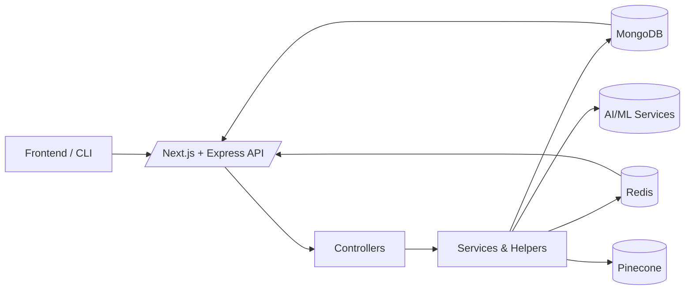
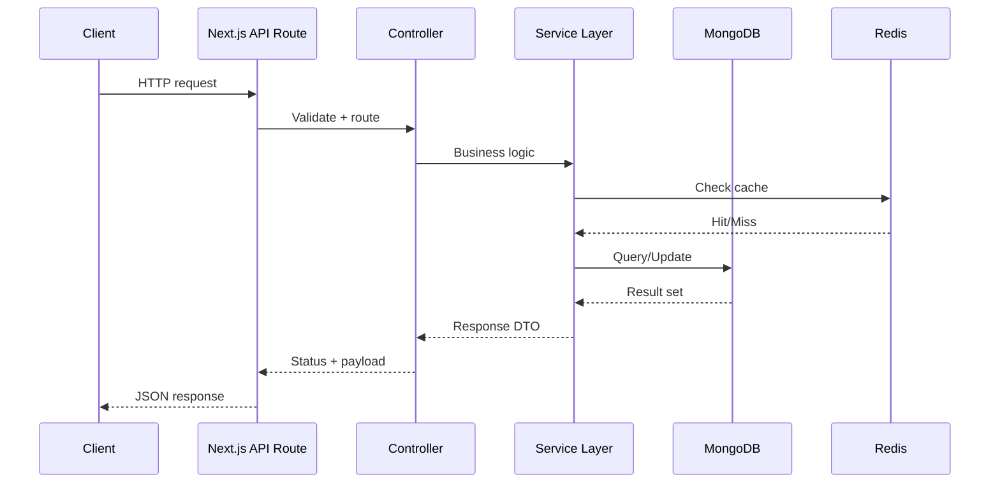

# SynthoraAI - AI Article Content Curator Backend (work in progress)

[](https://nodejs.org)
[](https://expressjs.com)
[](https://nextjs.org)
[](https://www.mongodb.com)
[](https://mongoosejs.com)
[](https://github.com/axios/axios)
[](https://cheerio.js.org)
[](https://pptr.dev)
[](https://developers.generativeai.google)
[](https://vercel.com)
[](https://en.wikipedia.org/wiki/Cron)

**Currently live at: [https://ai-content-curator-backend.vercel.app/](https://ai-content-curator-backend.vercel.app/).**

---

## Table of Contents

- [Overview](#overview)
- [Architecture Overview](#architecture-overview)
- [Detailed Description](#detailed-description)
  - [Data Ingestion & Processing](#data-ingestion--processing)
  - [Database & Storage](#database--storage)
  - [API Layer](#api-layer)
  - [Request Lifecycle](#request-lifecycle)
- [Scheduling & Deployment](#scheduling--deployment)
- [Getting Started](#getting-started)
  - [Prerequisites](#prerequisites)
  - [Installation](#installation)
  - [Run Locally](#run-locally)
- [Logging & Error Handling](#logging--error-handling)
- [Conclusion](#conclusion)

## Overview

The **Government Content Curator Backend** is a robust API service designed to serve curated articles to government staff. This backend performs the following tasks:

- **Data Ingestion:**  
  Aggregates article URLs from government homepage sources and public APIs such as NewsAPI (fetched by an external crawler service).

- **Content Processing:**  
  Uses AI-powered summarization via Google Generative AI (Gemini) to generate concise summaries from full article content.

- **Data Storage:**  
  Stores articles—including URLs, titles, full content, AI-generated summaries, source information, and fetch timestamps—in MongoDB via Mongoose.

- **API Serving:**  
  Exposes RESTful endpoints (built with Express.js running within a Next.js project) for a frontend application to retrieve article lists and details.

- **Scheduled Updates:**  
  A serverless function, deployed on Vercel and scheduled via cron, periodically fetches and processes new articles (running twice daily at 6:00 AM and 6:00 PM UTC).

> **Note:** The actual crawling logic has been decoupled and placed in a separate [crawler directory](../crawler/README.md). This backend focuses on storing, summarizing, and serving content.

---

## Architecture Overview



---

## Detailed Description

### Data Ingestion & Processing

- **Decoupled Crawler & API Fetcher:**  
  The system gathers article URLs from multiple sources (e.g., government homepages, public APIs). The crawling is performed by a separate crawler service (see [crawler directory](../crawler/README.md)). This backend receives article data, then applies AI-based summarization using Google Generative AI (Gemini).

- **Content Summarization:**  
  Summarization is performed using Google Generative AI. This service uses predefined safety settings and implements a retry mechanism for handling rate limits (HTTP 429) and other transient issues.

### Database & Storage

- **MongoDB & Mongoose:**  
  Article data is stored in MongoDB with schemas defined via Mongoose. Each article document contains:
  - **URL**
  - **Title**
  - **Full Content**
  - **AI-Generated Summary**
  - **Source Information**
  - **Fetched Timestamp**

### API Layer

- **Express.js API Endpoints:**  
  The backend provides the following RESTful endpoints (running within a Next.js environment):

  | **Method** | **Endpoint**        | **Description**                                                                       |
  | ---------- | ------------------- | ------------------------------------------------------------------------------------- |
  | GET        | `/api/articles`     | Returns a paginated list of articles. Accepts `page`, `limit`, `source` query params. |
  | GET        | `/api/articles/:id` | Retrieves detailed information about a single article by its ID.                      |

### Request Lifecycle

At a high level, each request follows the same pattern:

1. **Request validation** and parameter parsing at the API layer
2. **Controller orchestration** to call the right service logic
3. **Data fetch / compute** (MongoDB, Redis cache, AI calls, vector search)
4. **Response shaping** to keep payloads consistent and UI-friendly



---

## Scheduling & Deployment

- **Scheduled Fetch Function**  
  A function at `/api/scheduled/fetchAndSummarize` is deployed on Vercel, triggered twice daily (6:00 AM & 6:00 PM UTC) via Vercel cron. Although actual crawling is decoupled, this function orchestrates final data ingestion, AI summarization, and storage updates.

- **Express + Next.js**  
  The project runs Express.js routes within Next.js, all deployed on Vercel. This setup allows for seamless scaling and easy environment management.

---

## Getting Started

### Prerequisites

- **Node.js** (v18 or later)
- **MongoDB** (local or cloud)

### Installation

1. **Clone the Repository:**

   ```bash
   git clone https://github.com/hoangsonww/AI-Gov-Content-Curator.git
   cd AI-Gov-Content-Curator/backend
   ```

2. **Install Dependencies:**

   ```bash
   npm install
   ```

3. **Configure Environment Variables:**

   Create a `.env` file in the root with:

   ```dotenv
   MONGODB_URI=your_production_mongodb_connection_string
   GOOGLE_AI_API_KEY=your_google_ai_api_key
   AI_INSTRUCTIONS=Your system instructions for Gemini AI
   NEWS_API_KEY=your_newsapi_key
   PORT=3000
   CRAWL_URLS=https://www.whitehouse.gov/briefing-room/,https://www.congress.gov/,https://www.state.gov/press-releases/,https://www.bbc.com/news,https://www.nytimes.com/
   ```

### Run Locally

```bash
npm run dev
```

The server runs on `http://localhost:3000`. Test endpoints like:

- `GET /api/articles`
- `GET /api/articles/:id`

---

## Logging & Error Handling

- **Logging:**  
  Basic console logging is used during development. In production, consider advanced logging solutions (e.g., Winston, Sentry) for more robust monitoring.

- **Error Handling:**
  - AI summarization implements retry logic for rate-limiting or transient errors.
  - Duplicate articles are gracefully skipped via unique constraints in MongoDB.

---

## Conclusion

The **Government Content Curator Backend** offers a scalable, AI-driven way to serve summarized articles to government staff. By integrating Google Generative AI, Next.js + Express, and MongoDB, this service provides reliable endpoints for retrieving and displaying fresh content. The **crawler** is decoupled for flexibility, while the scheduled fetch function ensures timely updates.

Happy Building!

---
