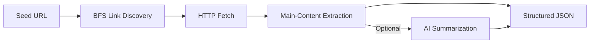
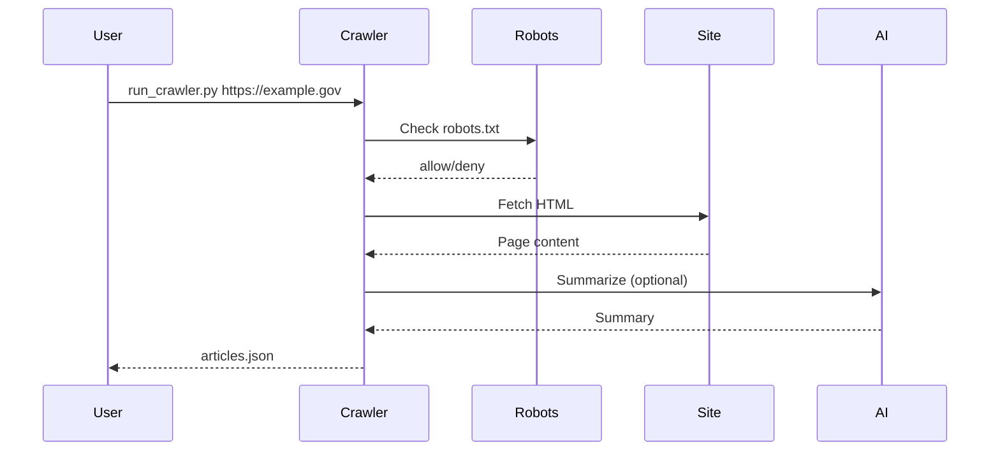

# Python Production Crawler

An asynchronous crawler and summarizer optimized for government and news content. It supports polite crawling, robots.txt compliance, structured output, and resilient extraction with Playwright fallback.

## Table of Contents

- [Overview](#overview)
- [Architecture](#architecture)
- [Key Features](#key-features)
- [Installation](#installation)
- [Configuration](#configuration)
- [Project Layout](#project-layout)
- [Usage](#usage)
  - [Examples](#examples)
  - [CLI Flags](#cli-flags)
- [Output Schema](#output-schema)
- [Operational Guidance](#operational-guidance)
- [Troubleshooting](#troubleshooting)

## Overview

The crawler discovers links starting from a homepage, filters URLs based on domain and patterns, and extracts article text using readability heuristics. It then optionally generates summaries with Google Generative AI. The output is JSON or JSONL, ready for ingestion into downstream pipelines.

## Architecture





## Key Features

- **Polite crawling**: robots.txt compliance and request delays
- **Resilient fetching**: retries with exponential backoff
- **JS fallback**: Playwright for dynamic pages
- **Content extraction**: readability-lxml with HTML cleanup
- **Filtering**: include/exclude regexes + allowed domains
- **Structured output**: JSON / JSONL with timestamps

## Installation

```bash
cd python_crawler
python3 -m venv .venv
source .venv/bin/activate
pip install -r requirements.txt
playwright install
```

## Configuration

Environment variables (optional):

```dotenv
# AI summarization
GOOGLE_AI_API_KEY=your-key
GOOGLE_AI_MODEL=models/gemini-1.5-flash
AI_INSTRUCTIONS=Optional system instruction
AI_MAX_RETRIES=3
AI_RETRY_DELAY=2
AI_MAX_INPUT_CHARS=12000

# Logging
CRAWLER_LOG_LEVEL=INFO
```

## Project Layout

```
python_crawler/
├── README.md
├── requirements.txt
├── run_crawler.py         # convenience wrapper
├── __init__.py
└── src/
    ├── __init__.py
    ├── cli.py             # CLI entrypoint
    ├── config.py          # crawler config + constants
    ├── crawler.py         # crawl orchestration
    ├── extractor.py       # content extraction (readability)
    ├── fetcher.py         # HTTP + JS fetching
    ├── models.py          # ArticleData schema
    ├── robots.py          # robots.txt cache
    ├── summarizer.py      # AI + fallback summarizer
    └── utils.py           # URL helpers + filters
```

## Usage

```bash
python run_crawler.py https://example.gov --max-links 50 --depth 2 --output articles.json
```

Or run as a module:

```bash
python -m python_crawler.src.cli https://example.gov --max-links 50 --depth 2
```

### Examples

```bash
# Crawl with strict domain filtering
python run_crawler.py https://example.gov \
  --allowed-domain example.gov \
  --max-links 80 --depth 2

# Disable summarization and JS fallback
python run_crawler.py https://example.gov \
  --no-summarize --no-js-fallback

# JSONL output for streaming ingestion
python run_crawler.py https://example.gov \
  --output articles.jsonl --output-format jsonl
```

### CLI Flags

| Flag | Description | Default |
| --- | --- | --- |
| `--max-links` | Max links to fetch | `50` |
| `--depth` | Max crawl depth | `2` |
| `--concurrency` | Parallel fetch slots | `8` |
| `--output` | Output file path | `articles.json` |
| `--output-format` | `json` or `jsonl` | `json` |
| `--allowed-domain` | Allowed domain (repeatable) | seed domain |
| `--include` | URL include regex (repeatable) | none |
| `--exclude` | URL exclude regex (repeatable) | none |
| `--no-robots` | Ignore robots.txt | false |
| `--request-delay` | Delay between requests (s) | `0.2` |
| `--timeout` | Request timeout (s) | `12` |
| `--max-retries` | Max retries per request | `3` |
| `--no-js-fallback` | Disable Playwright | false |
| `--min-text-length` | Minimum text length | `600` |
| `--no-summarize` | Disable summarization | false |

## Output Schema

Each output item is a JSON object:

```json
{
  "url": "https://example.gov/news/123",
  "title": "Example Title",
  "content": "Full extracted text...",
  "source": "https://example.gov/news/123",
  "summary": "Optional AI summary...",
  "fetched_at": "2026-01-31T12:34:56+00:00"
}
```

## Operational Guidance

- **Respect robots.txt** by default to stay compliant.
- **Tune request delay** for sensitive domains and rate limits.
- **Use JSONL** for streaming ingestion into ETL pipelines.
- **Monitor extraction length**: very short outputs may indicate paywalls or blocking.
- **Add include/exclude patterns** for higher precision crawling.

## Troubleshooting

- **Very short content**: increase `--min-text-length` or enable JS fallback.
- **Too many 403s**: lower request rate and confirm user-agent.
- **Slow crawls**: reduce depth or max links, or increase concurrency if allowed.
- **Summarization failures**: verify `GOOGLE_AI_API_KEY` and model name.
