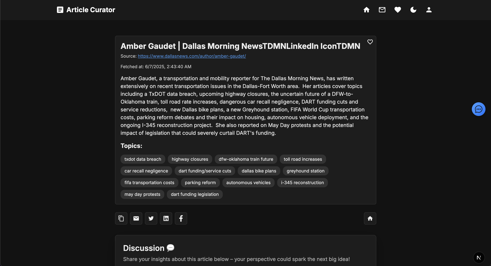

# SynthoraAI - AI Article Content Curator Frontend (work in progress)

[](https://nextjs.org)
[](https://react.dev)
[](https://www.typescriptlang.org)
[](https://vercel.com)
[](https://developer.mozilla.org/en-US/docs/Web/CSS)
[](https://tailwindcss.com)
[](https://playwright.dev)
[](https://eslint.org)
[](https://prettier.io)

This **frontend** provides an interface for government staff (and potentially the public) to browse curated articles, view article details, and perform simple interactions (e.g., pagination, filtering). It is designed to work seamlessly with the **Government Content Curator Backend**.

**Currently live at: [https://ai-gov-content-curator.vercel.app/](https://ai-gov-content-curator.vercel.app/).**

---

## Overview

1. **Fetch & Display Articles**  
   The frontend calls a REST API (hosted by the backend) to retrieve a paginated list of articles. Users can navigate between pages, filter by source, or view individual article details.

2. **Article Details Page**  
   Clicking on an article leads to a detail view, which displays the full content, AI-generated summary, source info, and fetch time.

3. **Next.js & React**  
   Built on Next.js (React-based framework), offering server-side rendering for SEO optimization, faster initial loads, and an overall better user experience.

---

## Folder Structure

A high-level look at the project structure:

```
.
├── components/
│   ├── HeroSlider.tsx
│   ├── LatestArticles.tsx
│   ├── ...
│   └── ThemeToggle.tsx
├── pages/
│   ├── articles/
│   │   └── [id].tsx
│   ├── _app.tsx
│   ├── _document.tsx
│   └── index.tsx
├── public/
│   ├── favicon.ico
│   └── images/
│       └── ...
├── styles/
│   ├── global.css
│   └── ...
├── package.json
├── tsconfig.json
└── ...
```

### `components/`

- **Reusable UI Components**  
  Contains React components like `HeroSlider`, `LatestArticles`, `AllArticles`, or `ThemeToggle`. These encapsulate distinct UI features (sliders, lists, toggles, etc.).

### `pages/`

- **Next.js Routing**  
  Each file or folder in `pages/` maps to a route.

  - **`index.tsx`:**  
    The homepage, showing recent or featured articles, links, and general info.

  - **`articles/[id].tsx`:**  
    A dynamic route handling individual article pages. The `[id]` placeholder is replaced by the article’s unique MongoDB ID (or any other identifier).

  - **`_app.tsx`:**  
    Global app component. Wraps every page, typically used for global styles or layout components (e.g., navigation bars, footers).

  - **`_document.tsx`:**  
    Custom document for advanced control of the initial HTML structure, meta tags, etc.

### `public/`

- **Static Assets**  
  Contains favicon (`favicon.ico`), images, or other publicly served files. Accessed via `/favicon.ico`, `/images/...`, etc.

### `styles/`

- **CSS & SCSS**  
  Global styles, utility classes, or theme files. Often includes `global.css` for site-wide resets and theming.

### Other Notable Files

- **`package.json`:**  
  Project metadata, dependencies, and scripts for building, linting, and starting the Next.js app.

- **`tsconfig.json`:**  
  TypeScript configuration for controlling strictness, module resolution, etc.

---

## Key Features

1. **Article List with Pagination**

- Users can browse a paginated list of articles retrieved from `GET /api/articles`.
- Pagination controls allow navigation to next/previous pages.

2. **Source Filtering**

- The frontend passes `source` query params to filter articles by publisher (e.g., “BBC”, “White House”, “NYTimes”).

3. **Article Detail View**

- A dedicated page for each article (e.g., `/articles/63f1...`) that shows the article’s **title**, **full text**, **AI-generated summary**, **publish source**, and **fetched date**.

4. **Mobile-Responsive UI**

- Pages are mobile-friendly (responsive) with a CSS grid or flex layout for article cards.

---

## Setup & Installation

1. **Clone the Repository**

   ```bash
   git clone https://github.com/hoangsonww/AI-Gov-Content-Curator.git
   cd AI-Gov-Content-Curator/frontend
   ```

2. **Install Dependencies**

   ```bash
   npm install
   ```

   or

   ```bash
   yarn
   ```

3. **Environment Variables** (Optional)  
   If the app references environment variables for API URLs, create a `.env.local` with entries like:

   ```dotenv
   NEXT_PUBLIC_API_URL=https://your-backend.example.com
   ```

4. **Run Locally**
   ```bash
   npm run dev
   ```

- The application starts at `http://localhost:3000`.

---

## Usage

### 1. Home Page

<p align="center">
  
</p>

### 2. Home Page (Dark Mode)

<p align="center">
  
</p>

### 3. Article Details Page

<p align="center">
  
</p>

---

## Deployment

The frontend is deployed on [Vercel](https://vercel.com):

1. **Add a `vercel.json`** (if needed)  
   Typically, you may not need a custom `vercel.json` because Next.js is auto-detected by Vercel. However, if you have special rewrites or environment settings, define them here.

2. **Set Environment Variables**  
   In the Vercel dashboard, under “Settings > Environment Variables,” set any needed values (e.g. `NEXT_PUBLIC_API_URL`).

3. **Deploy**
   ```bash
   vercel --prod
   ```
   or connect GitHub and configure an automated deployment for pushes to the main branch.

---

## Additional Configuration

- **Linting & Formatting**:  
  This project may use ESLint, Prettier, or other tools. Run `npm run lint` (if configured) to ensure code quality.

- **TypeScript Strictness**:  
  The `tsconfig.json` can be customized for more/less strict typing.

- **Styles**:  
  You can use CSS Modules, SCSS, or styled-components. By default, Next.js supports global CSS in `pages/_app.tsx` or in a dedicated `styles/global.css`.

---

## Testing

The frontend features Playwright for end-to-end testing. To run tests:

```bash
npm run test:e2e
```

Alternatively, you can run tests in headed mode:

```bash
npm run test:e2e:headed
```

This will open a browser window and run the tests interactively.

All tests are located in the `tests` directory. You can add or modify tests as needed.

To open the latest test report, run:

```bash
npm run test:e2e:report
```

This will open the HTML report in your default browser, available at `http://localhost:9323` or another port if specified.

---

## Troubleshooting

1. **API Connection Issues**

- Check `.env.local` to ensure `NEXT_PUBLIC_API_URL` is correct.
- Inspect browser console for CORS or network errors.

2. **Page 404 Errors**

- Ensure you have files named properly in `pages/`. For example, `pages/articles/[id].tsx` must exactly match the dynamic route pattern.

3. **Typescript Build Failures**

- Run `npm run build` locally or check Vercel build logs. Fix any missing types or interface conflicts.

---

## Contributing

1. **Fork** the repository and clone locally.
2. **Create a Feature Branch**:
   ```bash
   git checkout -b feature/amazing-ui
   ```
3. **Commit Changes**
   ```bash
   git commit -m "Add amazing new UI widget"
   ```
4. **Push** and open a **Pull Request**.

---

## License

This project is licensed under the MIT License. See [LICENSE](../LICENSE) for more information.

---

## Conclusion

The **Government Content Curator Frontend** offers a clean, efficient Next.js experience to browse curated government-related articles. With server-side rendering for optimal performance, a mobile-responsive layout, and direct integration with the backend’s RESTful APIs, this UI helps staff quickly discover and review summarized content.

**Enjoy exploring, and let us know if you have any questions or suggestions!**
