# 🚀 AI Curator - Advanced Deployment Guide

## Table of Contents

1. [Overview](#overview)
2. [Deployment Strategies](#deployment-strategies)
3. [Infrastructure](#infrastructure)
4. [Quick Start](#quick-start)
5. [AWS Deployment](#aws-deployment)
6. [Kubernetes Deployment](#kubernetes-deployment)
7. [CI/CD Pipelines](#cicd-pipelines)
8. [Monitoring & Observability](#monitoring--observability)
9. [Disaster Recovery](#disaster-recovery)
10. [Troubleshooting](#troubleshooting)

---

## Overview

This project supports multiple advanced deployment strategies across AWS and Kubernetes platforms:

- **Blue/Green Deployments**: Zero-downtime deployments with instant rollback capability
- **Canary Deployments**: Progressive traffic shifting with automated analysis
- **Rolling Deployments**: Gradual instance replacement
- **Multi-Region**: Active-active deployment across multiple AWS regions
- **Auto-scaling**: Dynamic scaling based on CPU, memory, and request metrics

---

## Deployment Strategies

### Blue/Green Deployment

**Best for**: Production environments requiring zero downtime and instant rollback

**How it works**:
1. Deploy new version (Green) alongside current version (Blue)
2. Run health checks and smoke tests on Green
3. Switch traffic from Blue to Green instantly
4. Keep Blue running for quick rollback if needed
5. Terminate Blue after confirmation period

**AWS Implementation**: AWS CodeDeploy with ECS
**K8s Implementation**: Argo Rollouts with Istio traffic management

```bash
# Deploy with blue/green strategy
make aws-deploy ENVIRONMENT=prod DEPLOYMENT_STRATEGY=blue-green

# Rollback if needed
make aws-rollback-backend
```

### Canary Deployment

**Best for**: High-risk changes, new features, performance testing

**How it works**:
1. Deploy new version to small subset of servers (10%)
2. Monitor metrics and error rates
3. Gradually increase traffic: 10% → 25% → 50% → 75% → 100%
4. Auto-rollback if error threshold exceeded
5. Manual promotion gates between steps

**Traffic Progression**:


**Automated Analysis**:
- Success rate > 95%
- P95 latency < 500ms
- Error rate < 5%
- CPU usage < 80%
- Memory usage < 80%

```bash
# Deploy with canary strategy
make k8s-deploy SERVICE=backend

# Check canary status
make k8s-status SERVICE=backend

# Promote canary manually
make k8s-promote SERVICE=backend

# Abort canary if issues detected
make k8s-abort SERVICE=backend
```

### Rolling Deployment

**Best for**: Non-critical updates, gradual rollouts

**How it works**:
1. Replace instances one at a time
2. Wait for health check to pass
3. Continue to next instance
4. Maintain minimum healthy percentage

```bash
# AWS rolling update
aws ecs update-service \
  --cluster ai-curator-prod \
  --service ai-curator-prod-backend \
  --force-new-deployment
```

---

## Infrastructure

### Architecture Overview


### Components

#### AWS Infrastructure
- **VPC**: Isolated network with public/private subnets across 3 AZs
- **ALB**: Application Load Balancer with WAF integration
- **ECS**: Fargate tasks with auto-scaling
- **CodeDeploy**: Blue/green deployment orchestration
- **CloudWatch**: Metrics, logs, and alarms
- **S3**: ALB logs and backups
- **SSM Parameter Store**: Secrets management

#### Kubernetes Infrastructure
- **Istio**: Service mesh for traffic management
- **Argo Rollouts**: Progressive delivery controller
- **Prometheus**: Metrics collection and alerting
- **Grafana**: Dashboards and visualization
- **External Secrets Operator**: Secrets synchronization

---

## Quick Start

### Prerequisites

```bash
# Install required tools
brew install terraform aws-cli kubectl helm

# Install Argo Rollouts plugin
curl -LO https://github.com/argoproj/argo-rollouts/releases/latest/download/kubectl-argo-rollouts-darwin-amd64
chmod +x kubectl-argo-rollouts-darwin-amd64
sudo mv kubectl-argo-rollouts-darwin-amd64 /usr/local/bin/kubectl-argo-rollouts

# Configure AWS credentials
aws configure

# Configure kubectl (for Kubernetes deployments)
aws eks update-kubeconfig --name ai-curator-cluster --region us-east-1
```

### Environment Setup

```bash
# Clone repository
git clone https://github.com/hoangsonww/AI-Gov-Content-Curator.git
cd AI-Gov-Content-Curator

# Set environment variables
export ENVIRONMENT=prod
export AWS_REGION=us-east-1
export AWS_ACCOUNT_ID=$(aws sts get-caller-identity --query Account --output text)

# Initialize Terraform
cd infrastructure
make terraform-init
```

---

## AWS Deployment

### Step 1: Infrastructure Provisioning

```bash
# Plan infrastructure changes
make terraform-plan ENVIRONMENT=prod

# Review and apply
make terraform-apply
```

**What gets created**:
- VPC with 3 AZs (public + private subnets)
- Application Load Balancer with HTTPS
- ECS Cluster with Fargate
- 2 target groups per service (blue/green)
- CodeDeploy applications and deployment groups
- CloudWatch dashboards and alarms
- SNS topics for alerts
- IAM roles and policies

### Step 2: Deploy Services

```bash
# Deploy all services with blue/green
make aws-deploy SERVICE=all ENVIRONMENT=prod

# Or deploy individual services
make aws-deploy-backend
make aws-deploy-frontend
```

### Step 3: Verify Deployment

```bash
# Check service status
make aws-status

# Get ALB DNS
cd infrastructure && terraform output alb_dns_name

# Test health endpoints
curl https://your-alb-dns/health
curl https://your-alb-dns/api/health
```

### Rollback

```bash
# Rollback backend
make aws-rollback-backend

# Rollback frontend
make aws-rollback-frontend
```

### Manual Blue/Green Deployment

```bash
# Create new task definition with updated image
TASK_DEF=$(aws ecs register-task-definition \
  --cli-input-json file://task-definition.json \
  --query 'taskDefinition.taskDefinitionArn' \
  --output text)

# Create CodeDeploy deployment
aws deploy create-deployment \
  --application-name ai-curator-prod-backend \
  --deployment-group-name ai-curator-prod-backend-dg \
  --revision file://appspec.json \
  --deployment-config-name CodeDeployDefault.ECSAllAtOnce

# Monitor deployment
aws deploy get-deployment --deployment-id <deployment-id>
```

---

## Kubernetes Deployment

### Step 1: Install Infrastructure

```bash
# Install Istio, Argo Rollouts, Prometheus, Grafana
make k8s-deploy-infrastructure
```

This installs:
- Istio service mesh (v1.20+)
- Argo Rollouts controller
- Prometheus + Grafana stack
- Istio ingress gateway
- Virtual services and destination rules

### Step 2: Configure Secrets

```bash
# Update secrets
export MONGODB_URI="mongodb+srv://..."
export GOOGLE_AI_API_KEY="..."
export RESEND_API_KEY="..."
export NEWS_API_KEY="..."

# Deploy will prompt for secrets if not set
make k8s-deploy-all IMAGE_TAG=v1.2.3
```

### Step 3: Deploy Services

```bash
# Deploy with canary strategy
make k8s-deploy-all IMAGE_TAG=latest

# Watch rollout progress
kubectl argo rollouts get rollout backend -n ai-curator --watch
```

**Canary Deployment Flow**:

```mermaid
flowchart TD
    A[Deploy v2] --> B["10% traffic → v2 (canary)<br/>90% traffic → v1 (stable)<br/>Wait 5 minutes + analysis"]
    B --> C["25% traffic → v2<br/>75% traffic → v1<br/>Wait 5 minutes + analysis"]
    C --> D["50% traffic → v2<br/>50% traffic → v1<br/>Wait 10 minutes + analysis"]
    D --> E[Manual approval required]
    E --> F["100% traffic → v2 (promotion)<br/>v1 terminated"]
```



### Step 4: Promote or Rollback

```bash
# Check analysis results
kubectl get analysisrun -n ai-curator

# Promote canary to stable
make k8s-promote SERVICE=backend

# Or abort if issues detected
make k8s-abort SERVICE=backend

# Or rollback to previous version
make k8s-rollback SERVICE=backend
```

### Advanced Traffic Management

#### A/B Testing

```yaml
# Route specific users to canary
apiVersion: networking.istio.io/v1beta1
kind: VirtualService
metadata:
  name: backend-ab-test
spec:
  http:
    - match:
        - headers:
            X-User-Group:
              exact: "beta"
      route:
        - destination:
            host: backend-canary
    - route:
        - destination:
            host: backend
```

#### Header-Based Routing

```bash
# Test canary version with header
curl -H "X-Canary: true" https://api.example.com/health
```

---

## CI/CD Pipelines

### GitHub Actions

Current pipeline (`.github/workflows/workflow.yml`):
- ✅ Linting and formatting
- ✅ Unit tests (multiple Node versions)
- ✅ E2E tests with Playwright
- ✅ Docker image builds
- ✅ Security scanning
- ✅ Code quality checks

### CircleCI

Enhanced pipeline with:
- Parallel testing across services
- Terraform plan/apply workflows
- Blue/green AWS deployments
- Canary Kubernetes deployments
- Approval gates for production
- Slack notifications

```bash
# Trigger deployment
git push origin main

# CircleCI will:
# 1. Run tests
# 2. Build images
# 3. Plan infrastructure
# 4. Wait for approval (prod only)
# 5. Deploy with selected strategy
# 6. Run smoke tests
# 7. Notify Slack
```

### Jenkins

Full-featured pipeline with:
- Multi-environment support
- Security scanning (Snyk, Trivy)
- Performance testing (k6)
- Database migrations
- Backup creation
- Custom deployment strategies
- Integration tests

```bash
# Trigger via Jenkins UI or:
curl -X POST https://jenkins.example.com/job/ai-curator/buildWithParameters \
  -u user:token \
  --data ENVIRONMENT=prod \
  --data DEPLOYMENT_STRATEGY=canary \
  --data PLATFORM=kubernetes
```

---

## Monitoring & Observability

### Metrics

#### CloudWatch (AWS)
- CPU/Memory utilization
- Request count and latency
- Error rates (4xx, 5xx)
- Target health
- Auto-scaling events

**Access Dashboard**:
```bash
aws cloudwatch get-dashboard \
  --dashboard-name ai-curator-prod
```

#### Prometheus (Kubernetes)
- Application metrics
- Service mesh metrics
- Canary analysis metrics
- Custom business metrics

**Query Examples**:
```promql
# Success rate
sum(rate(http_requests_total{status!~"5.."}[5m]))
/
sum(rate(http_requests_total[5m]))

# P95 latency
histogram_quantile(0.95,
  sum(rate(http_request_duration_milliseconds_bucket[5m])) by (le)
)

# Error rate
sum(rate(http_requests_total{status=~"5.."}[5m])) by (service)
```

### Dashboards

#### Grafana

```bash
# Access Grafana
make monitoring-dashboard

# Default credentials
# Username: admin
# Password: changeme123
```

**Pre-built Dashboards**:
- Service Overview (request rate, errors, latency)
- Deployment Metrics (canary weight, rollout status)
- Infrastructure Metrics (CPU, memory, network)
- Business Metrics (articles processed, emails sent)

### Alerts

**Critical Alerts** (PagerDuty):
- Service down (> 2 minutes)
- Error rate > 5%
- P95 latency > 2 seconds
- Deployment failed

**Warning Alerts** (Slack):
- CPU > 80%
- Memory > 80%
- Disk > 90%
- Canary rollout stuck

**Alert Configuration**:
```yaml
# infrastructure/kubernetes/monitoring/prometheus.yaml
- alert: HighErrorRate
  expr: |
    sum(rate(http_requests_total{status=~"5.."}[5m]))
    /
    sum(rate(http_requests_total[5m]))
    > 0.05
  for: 5m
  labels:
    severity: critical
  annotations:
    summary: "High error rate detected"
```

### Logging

#### Log Aggregation
- **AWS**: CloudWatch Logs with Log Insights
- **K8s**: EFK stack (Elasticsearch, Fluentd, Kibana)

**Query Examples**:
```bash
# CloudWatch Logs Insights
fields @timestamp, @message
| filter @message like /ERROR/
| sort @timestamp desc
| limit 100

# Kubectl logs
kubectl logs -f -l app=backend -n ai-curator --tail=100

# Stern (multi-pod tailing)
stern backend -n ai-curator
```

### Distributed Tracing

**Istio + Jaeger**:
```bash
# Access Jaeger UI
kubectl port-forward -n istio-system svc/jaeger-query 16686:16686

# View traces
open http://localhost:16686
```

---

## Disaster Recovery

### Backup Strategy

**Automated Backups**:
- MongoDB: Daily snapshots to S3
- Configuration: Git repository
- Secrets: AWS Secrets Manager with replication
- Docker images: Multi-region GHCR replication

```bash
# Manual backup
aws s3 sync s3://ai-curator-backups/latest \
  s3://ai-curator-backups/$(date +%Y%m%d-%H%M%S)

# Restore from backup
aws s3 sync s3://ai-curator-backups/20240115-120000 \
  s3://ai-curator-backups/latest
```

### Multi-Region Deployment

**Primary Region**: us-east-1
**Secondary Region**: us-west-2

```bash
# Deploy to multiple regions
terraform apply -var="aws_region=us-east-1"
terraform apply -var="aws_region=us-west-2"

# Configure Route53 for failover
aws route53 change-resource-record-sets \
  --hosted-zone-id Z1234567890ABC \
  --change-batch file://failover-config.json
```

### Failover Procedure

1. **Detect Failure**
   - CloudWatch alarm triggers
   - Health check fails
   - Manual detection

2. **Initiate Failover**
   ```bash
   # Update Route53 to point to secondary region
   ./infrastructure/scripts/failover.sh us-west-2
   ```

3. **Verify Secondary**
   ```bash
   # Check services
   curl https://api.example.com/health

   # Monitor metrics
   aws cloudwatch get-metric-statistics \
     --namespace AWS/ApplicationELB \
     --metric-name TargetResponseTime \
     --region us-west-2
   ```

4. **Restore Primary**
   ```bash
   # Fix issues in primary region
   # Sync data from secondary
   # Failback when ready
   ./infrastructure/scripts/failover.sh us-east-1
   ```

### Recovery Time Objectives (RTO/RPO)

| Scenario | RTO | RPO | Strategy |
|----------|-----|-----|----------|
| Single service failure | 2 minutes | 0 | Auto-scaling + Health checks |
| Deployment rollback | 5 minutes | 0 | Blue/green instant switch |
| Canary abort | 2 minutes | 0 | Automatic traffic revert |
| AZ failure | 5 minutes | 0 | Multi-AZ with auto-failover |
| Region failure | 15 minutes | 5 minutes | Multi-region with Route53 |
| Database corruption | 1 hour | 1 hour | Point-in-time recovery |

---

## Troubleshooting

### Common Issues

#### 1. Deployment Stuck

**Symptoms**: Deployment not progressing, tasks pending

**Diagnosis**:
```bash
# AWS
aws ecs describe-services \
  --cluster ai-curator-prod \
  --services ai-curator-prod-backend

# Kubernetes
kubectl describe rollout backend -n ai-curator
kubectl get events -n ai-curator --sort-by='.lastTimestamp'
```

**Solutions**:
- Check resource limits (CPU/Memory)
- Verify health check endpoints
- Review task/pod logs
- Check security group rules (AWS)
- Verify network policies (K8s)

#### 2. High Error Rate

**Diagnosis**:
```bash
# Check application logs
kubectl logs -l app=backend -n ai-curator --tail=1000 | grep ERROR

# Check metrics
kubectl top pods -n ai-curator

# Check database connectivity
kubectl exec -it backend-pod -n ai-curator -- curl mongodb://...
```

**Solutions**:
- Rollback deployment
- Scale up resources
- Check external dependencies
- Review recent code changes

#### 3. Canary Stuck

**Diagnosis**:
```bash
# Check analysis results
kubectl get analysisrun -n ai-curator
kubectl describe analysisrun <name> -n ai-curator

# Check Prometheus metrics
kubectl port-forward -n monitoring svc/prometheus 9090:9090
```

**Solutions**:
```bash
# Abort and investigate
make k8s-abort SERVICE=backend

# Fix metrics/thresholds
# Retry deployment
make k8s-deploy SERVICE=backend
```

#### 4. Database Connection Issues

**Diagnosis**:
```bash
# Test connectivity
kubectl run test-pod --image=mongo:latest -it --rm -- \
  mongosh "mongodb+srv://..."

# Check secrets
kubectl get secret backend-secrets -n ai-curator -o yaml
```

**Solutions**:
- Verify MongoDB URI
- Check network ACLs
- Rotate credentials if needed
- Update security groups

### Debug Commands

```bash
# Get all resources
kubectl get all -n ai-curator

# Describe problematic resource
kubectl describe pod <pod-name> -n ai-curator

# Get logs
kubectl logs <pod-name> -n ai-curator --previous
kubectl logs <pod-name> -n ai-curator --all-containers

# Shell into pod
kubectl exec -it <pod-name> -n ai-curator -- /bin/sh

# Check resource usage
kubectl top nodes
kubectl top pods -n ai-curator

# Network debugging
kubectl run test --image=nicolaka/netshoot -it --rm -- bash

# View rollout history
kubectl argo rollouts history backend -n ai-curator

# Inspect virtual service
kubectl get virtualservice -n ai-curator -o yaml
```

### Performance Debugging

```bash
# Profile application
kubectl port-forward <pod> 9229:9229
chrome://inspect

# Flame graphs
kubectl exec <pod> -- node --prof app.js
kubectl exec <pod> -- node --prof-process isolate-*.log > profile.txt

# Heap snapshots
kubectl exec <pod> -- kill -USR2 <pid>
kubectl cp <pod>:/heapdump-*.heapsnapshot ./heapdump.heapsnapshot
```

---

## Additional Resources

- [Terraform AWS Provider Docs](https://registry.terraform.io/providers/hashicorp/aws/latest/docs)
- [Argo Rollouts Documentation](https://argoproj.github.io/argo-rollouts/)
- [Istio Documentation](https://istio.io/latest/docs/)
- [AWS ECS Best Practices](https://docs.aws.amazon.com/AmazonECS/latest/bestpracticesguide/intro.html)
- [Kubernetes Best Practices](https://kubernetes.io/docs/concepts/configuration/overview/)

---

## Support

For issues and questions:
- **Issues**: https://github.com/hoangsonww/AI-Gov-Content-Curator/issues
- **Email**: hoangson091104@gmail.com
