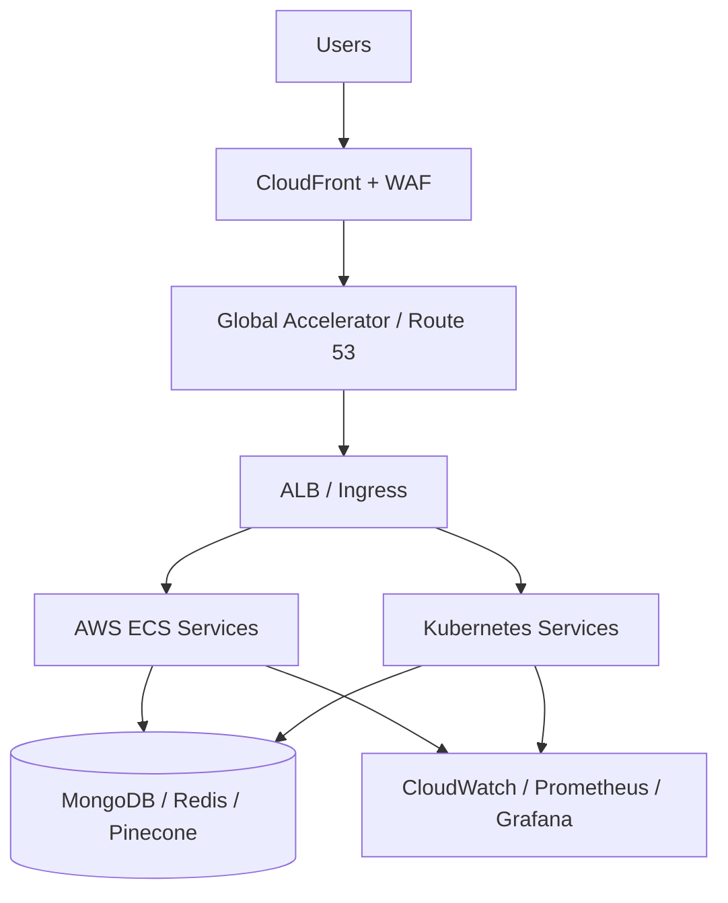
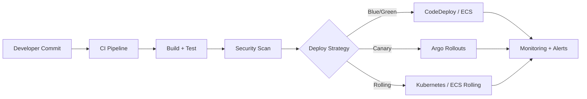

# 🚀 AI Curator - Advanced DevOps & Deployment Infrastructure

## Table of Contents

- [Overview](#overview)
- [High-Level Topology](#high-level-topology)
- [CI/CD Flow](#cicd-flow)
- [🎯 Key Features](#-key-features)
  - [✨ Deployment Strategies](#-deployment-strategies)
  - [🌍 Multi-Cloud & Multi-Region](#-multi-cloud--multi-region)
  - [📊 Monitoring & Observability](#-monitoring--observability)
  - [🔄 Auto-Scaling](#-auto-scaling)
  - [🛡️ Security & Compliance](#-security--compliance)
  - [🔧 CI/CD Pipelines](#-cicd-pipelines)
  - [💾 Disaster Recovery](#-disaster-recovery)
- [📁 Directory Structure](#-directory-structure)
- [🚀 Quick Start](#-quick-start)
  - [Prerequisites](#prerequisites)
  - [Deploy to AWS (Blue/Green)](#deploy-to-aws-bluegreen)
  - [Deploy to Kubernetes (Canary)](#deploy-to-kubernetes-canary)
- [📊 Monitoring](#-monitoring)
  - [Grafana Dashboard](#grafana-dashboard)
  - [Prometheus Queries](#prometheus-queries)
  - [CloudWatch Dashboard](#cloudwatch-dashboard)
- [🔄 CI/CD Pipelines](#-cicd-pipelines-1)
  - [GitHub Actions (Current)](#github-actions-current)
  - [CircleCI (Enhanced)](#circleci-enhanced)
  - [Jenkins (Full-Featured)](#jenkins-full-featured)
- [🌍 Multi-Region Architecture](#-multi-region-architecture)
  - [Regions](#regions)
  - [Traffic Routing](#traffic-routing)
  - [Failover](#failover)
- [💰 Cost Optimization](#-cost-optimization)
  - [Fargate Spot](#fargate-spot)
  - [Scheduled Scaling](#scheduled-scaling)
  - [Cost Reports](#cost-reports)
- [🔧 Troubleshooting](#-troubleshooting)
  - [Deployment Stuck](#deployment-stuck)
  - [High Error Rate](#high-error-rate)
  - [Canary Analysis Failed](#canary-analysis-failed)
- [📚 Additional Resources](#-additional-resources)
- [🛠️ Makefile Commands](#-makefile-commands)
- [🎯 Deployment Decision Matrix](#-deployment-decision-matrix)
- [📞 Support](#-support)

## Overview

This directory contains a comprehensive, production-ready deployment infrastructure supporting multiple advanced deployment strategies, platforms, and regions.

## High-Level Topology



## CI/CD Flow



## 🎯 Key Features

### ✨ Deployment Strategies
- **Blue/Green Deployments**: Zero-downtime with instant rollback (AWS CodeDeploy)
- **Canary Deployments**: Progressive traffic shifting with automated analysis (Argo Rollouts)
- **Rolling Deployments**: Gradual instance replacement
- **A/B Testing**: Header-based traffic routing for feature testing

### 🌍 Multi-Cloud & Multi-Region
- **AWS ECS**: Fargate-based container orchestration with blue/green deployments
- **Kubernetes**: Native K8s with Argo Rollouts for progressive delivery
- **Multi-Region**: Active-active deployment across US East, US West, and EU
- **Global Accelerator**: Multi-region traffic management with health-based failover
- **CloudFront CDN**: Global content delivery with Lambda@Edge

### 📊 Monitoring & Observability
- **CloudWatch**: Comprehensive metrics, logs, and alarms
- **Prometheus**: Application and infrastructure metrics
- **Grafana**: Beautiful dashboards and visualizations
- **Istio**: Service mesh with distributed tracing
- **Custom Metrics**: Business logic and SQS-based auto-scaling

### 🔄 Auto-Scaling
- **Predictive Scaling**: ML-based capacity forecasting
- **Scheduled Scaling**: Time-based scaling for predictable patterns
- **Target Tracking**: CPU, memory, and request-based scaling
- **Step Scaling**: Aggressive scaling for traffic spikes
- **SQS-based Scaling**: Queue depth-driven worker scaling
- **Fargate Spot**: 70% cost savings with spot instances

### 🛡️ Security & Compliance
- **AWS WAF**: DDoS protection and rate limiting
- **VPC Security**: Multi-AZ with private subnets
- **Secrets Management**: AWS SSM Parameter Store with encryption
- **TLS/SSL**: End-to-end encryption with ACM
- **IAM Roles**: Least-privilege access control
- **Security Scanning**: Trivy + Snyk integration in CI/CD

### 🔧 CI/CD Pipelines
- **GitHub Actions**: Current lightweight pipeline
- **CircleCI**: Advanced pipeline with approval gates
- **Jenkins**: Full-featured pipeline with security scanning
- **Multi-Environment**: Dev, staging, prod with promotion workflows

### 💾 Disaster Recovery
- **Multi-Region Failover**: Route53 health-based failover
- **Automated Backups**: S3, DynamoDB, and MongoDB snapshots
- **Cross-Region Replication**: S3 and DynamoDB global tables
- **Point-in-Time Recovery**: Database PITR capabilities
- **RTO**: 2-15 minutes depending on failure type
- **RPO**: 0-5 minutes depending on scenario

---

## 📁 Directory Structure

```
infrastructure/
├── terraform/                    # Infrastructure as Code
│   ├── main.tf                  # Main Terraform configuration
│   ├── variables.tf             # Input variables
│   ├── outputs.tf               # Output values
│   ├── multi-region.tf          # Multi-region setup
│   ├── autoscaling-advanced.tf  # Advanced auto-scaling
│   └── modules/                 # Reusable Terraform modules
│       ├── vpc/                 # VPC with multi-AZ
│       ├── alb/                 # ALB with WAF
│       ├── ecs/                 # ECS cluster
│       ├── ecs-service/         # ECS service with blue/green
│       ├── ecs-scheduled-task/  # Scheduled ECS tasks
│       ├── codedeploy/          # CodeDeploy for blue/green
│       └── monitoring/          # CloudWatch dashboards & alarms
├── kubernetes/                   # Kubernetes manifests
│   ├── namespace.yaml           # Namespace definition
│   ├── backend/                 # Backend service
│   │   └── deployment.yaml      # Argo Rollout + Analysis
│   ├── frontend/                # Frontend service
│   │   └── deployment.yaml      # Argo Rollout + Analysis
│   ├── cronjobs/                # Scheduled jobs
│   │   ├── crawler.yaml         # Article crawler cron
│   │   └── newsletter.yaml      # Newsletter sender cron
│   ├── istio/                   # Istio configuration
│   │   └── gateway.yaml         # Gateway + VirtualServices
│   └── monitoring/              # Monitoring stack
│       ├── prometheus.yaml      # Prometheus + rules
│       └── grafana.yaml         # Grafana + dashboards
├── scripts/                      # Deployment automation
│   ├── deploy-aws.sh            # AWS deployment with rollback
│   └── deploy-k8s.sh            # K8s deployment with Argo
├── Makefile                      # Convenience commands
├── DEPLOYMENT.md                 # Comprehensive deployment guide
└── README.md                     # This file
```

---

## 🚀 Quick Start

### Prerequisites

```bash
# Install tools
brew install terraform aws-cli kubectl helm jq

# Install Argo Rollouts plugin
kubectl krew install argo-rollouts
# OR
curl -LO https://github.com/argoproj/argo-rollouts/releases/latest/download/kubectl-argo-rollouts-darwin-amd64
chmod +x kubectl-argo-rollouts-darwin-amd64
sudo mv kubectl-argo-rollouts-darwin-amd64 /usr/local/bin/kubectl-argo-rollouts

# Configure AWS
aws configure

# Configure kubectl
aws eks update-kubeconfig --name ai-curator-cluster --region us-east-1
```

### Deploy to AWS (Blue/Green)

```bash
cd infrastructure

# Initialize Terraform
make terraform-init

# Plan changes
make terraform-plan ENVIRONMENT=prod

# Apply infrastructure
make terraform-apply

# Deploy services with blue/green
make aws-deploy SERVICE=all ENVIRONMENT=prod

# Check status
make aws-status

# Rollback if needed
make aws-rollback-backend
```

### Deploy to Kubernetes (Canary)

```bash
cd infrastructure

# Install infrastructure (Istio, Argo, Prometheus)
make k8s-deploy-infrastructure

# Deploy services
make k8s-deploy-all IMAGE_TAG=v1.2.3

# Watch canary progress
kubectl argo rollouts get rollout backend -n ai-curator --watch

# Promote after validation
make k8s-promote SERVICE=backend

# Or abort if issues detected
make k8s-abort SERVICE=backend
```

---

## 📊 Monitoring

### Grafana Dashboard

```bash
# Access Grafana
make monitoring-dashboard

# Open browser to http://localhost:3000
# Username: admin
# Password: changeme123 (change in production!)
```

**Available Dashboards**:
- **Service Overview**: Request rate, latency, error rate
- **Deployment Metrics**: Canary weight, rollout status
- **Infrastructure**: CPU, memory, network usage
- **Business Metrics**: Articles processed, emails sent

### Prometheus Queries

```bash
# Access Prometheus
make monitoring-prometheus

# Open browser to http://localhost:9090
```

**Useful Queries**:
```promql
# Request rate
rate(http_requests_total[5m])

# Error rate
sum(rate(http_requests_total{status=~"5.."}[5m]))
/
sum(rate(http_requests_total[5m]))

# P95 latency
histogram_quantile(0.95,
  sum(rate(http_request_duration_milliseconds_bucket[5m])) by (le)
)
```

### CloudWatch Dashboard

```bash
# Get dashboard URL
cd terraform && terraform output cloudwatch_dashboard_url

# Or access via AWS Console
aws cloudwatch get-dashboard --dashboard-name ai-curator-prod
```

---

## 🔄 CI/CD Pipelines

### GitHub Actions (Current)

**File**: `.github/workflows/workflow.yml`

**Triggers**: Push to main/master
**Steps**: Lint → Test → Build → Push Images

### CircleCI (Enhanced)

**File**: `.circleci/config.yml`

**Features**:
- Parallel testing across services
- Terraform plan/apply with approval gates
- Blue/green AWS deployments
- Canary Kubernetes deployments
- Smoke tests and notifications

**Usage**:
```bash
# Push triggers automatic deployment
git push origin main

# CircleCI will:
# 1. Run tests in parallel
# 2. Build and push Docker images
# 3. Plan Terraform changes
# 4. Wait for manual approval (prod only)
# 5. Deploy with selected strategy
# 6. Run integration tests
# 7. Notify Slack
```

### Jenkins (Full-Featured)

**File**: `Jenkinsfile`

**Features**:
- Multi-environment support (dev/staging/prod)
- Multiple deployment strategies
- Security scanning (Snyk, Trivy)
- Performance testing (k6)
- Database migrations
- Cost optimization reports

**Parameters**:
- `ENVIRONMENT`: dev, staging, prod
- `DEPLOYMENT_STRATEGY`: blue-green, canary, rolling
- `PLATFORM`: aws, kubernetes, both
- `IMAGE_TAG`: Docker image tag
- `RUN_SECURITY_SCAN`: Enable security scanning
- `RUN_PERFORMANCE_TESTS`: Enable performance tests
- `AUTO_APPROVE`: Skip manual approval

---

## 🌍 Multi-Region Architecture

### Regions

- **Primary**: us-east-1 (N. Virginia)
- **Secondary**: us-west-2 (Oregon)
- **Tertiary**: eu-west-1 (Ireland)

### Traffic Routing

```
User Request
    ↓
Route53 / Global Accelerator
    ↓
Health Checks
    ↓
Primary Region (100% traffic)
    ↓ (on failure)
Secondary Region (automatic failover)
```

### Failover

**Automatic Failover**:
- Health checks every 30 seconds
- 3 failed checks trigger failover
- Traffic automatically routed to healthy region
- ~2-minute failover time

**Manual Failover**:
```bash
# Initiate failover to secondary region
./scripts/failover.sh us-west-2

# Verify secondary region
curl https://api.example.com/health

# Failback to primary when ready
./scripts/failover.sh us-east-1
```

---

## 💰 Cost Optimization

### Fargate Spot

**Strategy**: 70% Spot, 30% On-Demand

**Savings**: ~70% on compute costs

**Configuration**:
```hcl
default_capacity_provider_strategy {
  capacity_provider = "FARGATE_SPOT"
  weight            = 70
  base              = 0
}
```

### Scheduled Scaling

**Morning Scale-Up** (7 AM Mon-Fri):
- Min: 5 tasks
- Max: 20 tasks

**Evening Scale-Down** (8 PM Mon-Fri):
- Min: 2 tasks
- Max: 10 tasks

### Cost Reports

**Daily Reports**: Automated cost analysis
**Lambda Function**: `cost-optimizer`
**Schedule**: 9 AM daily

```bash
# Manual cost report
aws ce get-cost-and-usage \
  --time-period Start=2024-01-01,End=2024-01-31 \
  --granularity MONTHLY \
  --metrics "BlendedCost"
```

---

## 🔧 Troubleshooting

### Deployment Stuck

```bash
# AWS
aws ecs describe-services \
  --cluster ai-curator-prod \
  --services ai-curator-prod-backend

# Kubernetes
kubectl describe rollout backend -n ai-curator
kubectl get events -n ai-curator --sort-by='.lastTimestamp'
```

### High Error Rate

```bash
# Check logs
kubectl logs -l app=backend -n ai-curator --tail=1000 | grep ERROR

# Check metrics
kubectl top pods -n ai-curator

# Rollback
make k8s-rollback SERVICE=backend
```

### Canary Analysis Failed

```bash
# View analysis results
kubectl get analysisrun -n ai-curator
kubectl describe analysisrun <name> -n ai-curator

# Check Prometheus metrics
kubectl port-forward -n monitoring svc/prometheus 9090:9090

# Abort canary
make k8s-abort SERVICE=backend
```

---

## 📚 Additional Resources

- **Deployment Guide**: [DEPLOYMENT.md](DEPLOYMENT.md)
- **Terraform Docs**: https://registry.terraform.io/providers/hashicorp/aws/latest/docs
- **Argo Rollouts**: https://argoproj.github.io/argo-rollouts/
- **Istio**: https://istio.io/latest/docs/
- **AWS ECS**: https://docs.aws.amazon.com/AmazonECS/latest/developerguide/

---

## 🛠️ Makefile Commands

```bash
# Terraform
make terraform-init          # Initialize Terraform
make terraform-plan          # Plan infrastructure changes
make terraform-apply         # Apply infrastructure
make terraform-destroy       # Destroy infrastructure

# AWS Deployment
make aws-deploy              # Deploy to AWS with blue/green
make aws-deploy-backend      # Deploy backend only
make aws-deploy-frontend     # Deploy frontend only
make aws-rollback-backend    # Rollback backend
make aws-rollback-frontend   # Rollback frontend
make aws-status              # Check deployment status

# Kubernetes Deployment
make k8s-deploy-infrastructure  # Install Istio, Argo, Prometheus
make k8s-deploy              # Deploy services with canary
make k8s-deploy-all          # Deploy all services
make k8s-status              # Check rollout status
make k8s-promote             # Promote canary
make k8s-abort               # Abort canary
make k8s-rollback            # Rollback deployment
make k8s-logs                # Tail logs
make k8s-shell               # Get shell access

# Monitoring
make monitoring-dashboard    # Open Grafana
make monitoring-prometheus   # Open Prometheus

# Utilities
make build-images            # Build Docker images
make push-images             # Push to registry
make validate-health         # Check service health
make clean                   # Clean temporary files
```

---

## 🎯 Deployment Decision Matrix

| Scenario | Recommended Strategy | Platform | Notes |
|----------|---------------------|----------|-------|
| Production release | Blue/Green | AWS | Zero downtime, instant rollback |
| High-risk feature | Canary | Kubernetes | Progressive rollout with analysis |
| Hotfix | Blue/Green | AWS | Fast deployment with rollback |
| New feature testing | A/B Test | Kubernetes | Header-based routing |
| Cost optimization | Canary + Spot | Both | Gradual rollout with spot instances |
| Multi-region | Global Accelerator | AWS | Automatic failover |

---

## 📞 Support

- **Issues**: https://github.com/hoangsonww/AI-Gov-Content-Curator/issues
- **Email**: hoangson091104@gmail.com
- **Documentation**: [DEPLOYMENT.md](DEPLOYMENT.md)

---

**Built with ❤️ for reliable, scalable deployments**
