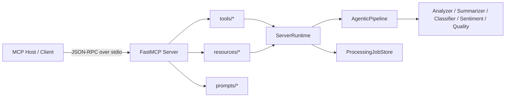

# MCP Server (`mcp_server`)

Implementation-first documentation for the SynthoraAI Model Context Protocol server package.

This package exposes the Agentic AI pipeline through MCP primitives (tools, resources, prompts) over **stdio transport** for local and hosted MCP clients.

## Table of Contents

1. [Overview](#overview)
2. [Architecture](#architecture)
3. [Package Layout](#package-layout)
4. [MCP Primitive Catalog](#mcp-primitive-catalog)
5. [Runtime Model](#runtime-model)
6. [Configuration](#configuration)
7. [Run Locally](#run-locally)
8. [MCP Client Integration](#mcp-client-integration)
9. [Operational Notes](#operational-notes)
10. [Testing](#testing)
11. [Migration Notes](#migration-notes)
12. [Troubleshooting](#troubleshooting)

## Overview

`mcp_server` is the MCP-facing boundary for the Python Agentic AI subsystem.

It does the following:

- Boots `FastMCP` with server identity from `agentic_ai.config.settings`.
- Initializes shared runtime state (`ServerRuntime`) with a compiled `AgenticPipeline` instance and an async-safe in-memory processing `job_store`.
- Registers tools/resources/prompts from modular packages.
- Emits structured logs to **stderr** to keep MCP stdio JSON-RPC output clean.

The server is launched via:

```bash
python -m mcp_server
```

## Architecture



## Package Layout

```text
mcp_server/
  __main__.py                # module entrypoint (python -m mcp_server)
  app.py                     # composition root and server bootstrap
  server.py                  # compatibility wrapper exports
  runtime.py                 # runtime container (pipeline + job store)
  job_store.py               # async-safe in-memory processing jobs
  diagnostics.py             # health/capabilities/provider/limits snapshots
  catalog.py                 # canonical tool/resource/prompt inventories
  models.py                  # pydantic request/status models
  validation.py              # payload + metadata guardrails
  text_metrics.py            # content diagnostics/readability metrics
  logging_config.py          # stderr-safe structlog setup
  tools/
    processing.py            # process + lifecycle + job controls
    analysis.py              # analysis/summarization/classification tools
    operations.py            # readiness/capabilities/preflight tools
  resources/
    config.py                # config://* resources
    runtime.py               # runtime://* resources
    jobs.py                  # jobs://* and topics://* resources
  prompts/
    summarization.py         # summarize/executive prompts
    analysis.py              # sentiment/classification/quality prompts
    governance.py            # bias and incident prompts
```

## MCP Primitive Catalog

Source of truth is `mcp_server/catalog.py`.

### Tools

#### Processing lifecycle tools

- `process_article`
- `process_article_batch`
- `validate_article_payload`
- `get_processing_status`
- `get_processing_result`
- `list_processing_jobs`
- `delete_processing_job`
- `purge_processing_jobs`

#### Analysis tools

- `analyze_content`
- `analyze_sentiment`
- `extract_topics`
- `evaluate_quality`
- `compute_text_metrics`
- `generate_summary`

#### Operations/diagnostics tools

- `check_pipeline_health`
- `get_pipeline_graph`
- `get_runtime_readiness`
- `get_server_capabilities`
- `diagnose_provider_configuration`
- `run_preflight_checks`

### Resources

- `config://pipeline`
- `config://limits`
- `config://providers`
- `config://features`
- `runtime://health`
- `runtime://readiness`
- `runtime://capabilities`
- `runtime://pipeline/graph`
- `jobs://stats`
- `jobs://recent`
- `topics://available`

### Prompts

- `summarize_article_prompt`
- `executive_brief_prompt`
- `analyze_sentiment_prompt`
- `classify_article_prompt`
- `quality_audit_prompt`
- `red_team_bias_prompt`
- `incident_triage_prompt`

## Runtime Model

`ServerRuntime` (`runtime.py`) initializes two shared objects:

- `pipeline`: an `AgenticPipeline` instance, marked unavailable if startup fails.
- `jobs`: a `ProcessingJobStore` with bounded history and TTL.

### Job store behavior

The in-memory store provides:

- Async lock protection for concurrent tool calls.
- Ordered recency listing with filters and pagination.
- TTL pruning for completed jobs.
- Max-history enforcement.
- Bulk purge by status and/or age.

Guardrails are controlled by settings:

- `mcp_max_job_history`
- `mcp_job_ttl_seconds`

## Configuration

All config is loaded from `agentic_ai/config/settings.py` (`.env` support via `agentic_ai/.env` and `.env`).

### Key MCP settings

- `MCP_SERVER_NAME` (default `synthora-agentic-pipeline`)
- `MCP_SERVER_VERSION` (default `1.0.0`)
- `MCP_MAX_CONTENT_CHARS` (default `20000`)
- `MCP_MAX_METADATA_ENTRIES` (default `50`)
- `MCP_MAX_METADATA_VALUE_CHARS` (default `2000`)
- `MCP_MAX_BATCH_ITEMS` (default `25`)
- `MCP_MAX_JOB_HISTORY` (default `1000`)
- `MCP_JOB_TTL_SECONDS` (default `86400`)

### Provider readiness

The runtime can operate in degraded mode if providers are misconfigured; inspect with:

- Tool: `diagnose_provider_configuration`
- Tool: `run_preflight_checks`
- Resource: `config://providers`
- Resource: `runtime://readiness`

## Run Locally

### Prerequisites

- Python 3.11+
- Dependencies installed from `agentic_ai/requirements.txt`
- At least one configured model provider for full runtime readiness

### Install

From repository root:

```bash
pip install -r agentic_ai/requirements.txt
```

### Start server

From repository root:

```bash
PYTHONPATH=. python -m mcp_server
```

Or from `agentic_ai/`:

```bash
PYTHONPATH=.. python -m mcp_server
```

### Preflight check

```bash
cd agentic_ai
make mcp-preflight
```

## MCP Client Integration

### Repository `.mcp.json` usage

This repository already configures the server in `.mcp.json`:

```json
{
  "mcpServers": {
    "synthora-agentic-pipeline": {
      "command": "python",
      "args": ["-m", "mcp_server"],
      "env": {
        "PYTHONPATH": ".",
        "PYTHONUNBUFFERED": "1"
      }
    }
  }
}
```

### Minimal Python stdio client example

```python
import asyncio
from mcp import ClientSession, StdioServerParameters
from mcp.client.stdio import stdio_client


async def main() -> None:
    server = StdioServerParameters(
        command="python",
        args=["-m", "mcp_server"],
        env={"PYTHONPATH": "."},
    )

    async with stdio_client(server) as (read, write):
        async with ClientSession(read, write) as session:
            await session.initialize()

            capabilities = await session.call_tool("get_server_capabilities", {})
            print(capabilities)

            result = await session.call_tool(
                "process_article",
                {
                    "article_id": "example-1",
                    "content": "Policy article content goes here.",
                    "url": "https://example.com/article",
                    "source": "government",
                    "metadata": {"department": "transport"},
                },
            )
            print(result)


asyncio.run(main())
```

## Operational Notes

- Transport is stdio in `app.py` (`self.mcp.run(transport="stdio")`).
- Logging is intentionally stderr-only (`logging_config.py`) to avoid corrupting JSON-RPC streams.
- `generate_summary` returns a **string** response; most other tools return object payloads.
- `process_article_batch` supports fail-fast via `continue_on_error=False`.
- `purge_processing_jobs` requires explicit confirmation when purging everything (`confirm=true`).

## Testing

Focused tests currently live in `agentic_ai/tests/`.

From repository root:

```bash
PYTHONPATH=. pytest -q \
  agentic_ai/tests/test_mcp_server_job_store.py \
  agentic_ai/tests/test_mcp_server_validation.py
```

Optional compile check:

```bash
python -m py_compile $(find mcp_server -name '*.py')
```

## Migration Notes

- Package path is now `mcp_server`.
- Legacy `standalone_mcp_server` references were removed.
- Compatibility alias retained in code: `StandaloneAgenticMCPServer = AgenticMCPServer`.

Use `python -m mcp_server` as the canonical entrypoint.

## Troubleshooting

### Runtime shows degraded / not ready

- Run `make mcp-preflight` from `agentic_ai/`.
- Call `get_runtime_readiness` and `diagnose_provider_configuration`.
- Verify required provider keys are set in `.env`.

### MCP client fails to connect

- Confirm client launches with `python -m mcp_server`.
- Confirm `PYTHONPATH` includes repo root.
- Ensure no stdout logging is introduced in server code.

### Empty `topics://available`

- This indicates pipeline runtime is unavailable.
- Fix readiness first, then retry resource call.
