# MCP Server (`mcp_server`)

Implementation-first documentation for the SynthoraAI Model Context Protocol server package.

This package exposes the Agentic AI pipeline through MCP primitives (tools, resources, prompts) over **stdio transport** for local and hosted MCP clients.

## Table of Contents

1. [Overview](#overview)
2. [Architecture](#architecture)
3. [Package Layout](#package-layout)
4. [Startup Sequence](#startup-sequence)
5. [Request Lifecycle](#request-lifecycle)
6. [tool_middleware Pipeline](#tool_middleware-pipeline)
7. [MCP Primitive Catalog](#mcp-primitive-catalog)
8. [Runtime Model](#runtime-model)
9. [Job Store Lifecycle](#job-store-lifecycle)
10. [ACP Runtime Model](#acp-runtime-model)
11. [Pipeline Execution](#pipeline-execution)
12. [Reliability & Observability](#reliability--observability)
13. [Configuration](#configuration)
14. [Run Locally](#run-locally)
15. [MCP Client Integration](#mcp-client-integration)
16. [Operational Notes](#operational-notes)
17. [Testing](#testing)
18. [Migration Notes](#migration-notes)
19. [Troubleshooting](#troubleshooting)

## Overview

`mcp_server` is the MCP-facing boundary for the Python Agentic AI subsystem.

It does the following:

- Boots `FastMCP` with server identity from `agentic_ai.config.settings`.
- Configures structured logging + OpenTelemetry observability at startup.
- Initializes shared runtime state (`ServerRuntime`) with a compiled `AgenticPipeline` instance, an async-safe in-memory processing `job_store`, and the ACP store.
- Registers tools/resources/prompts from modular packages; every tool is wrapped by `tool_middleware` (span + metrics + typed-error envelope + rate limit).
- Emits JSON logs to **stderr** — with OTel `trace_id` correlation and secret redaction — to keep the MCP stdio JSON-RPC channel clean.

This package also hosts the cross-cutting hardening layer shared with the
agentic pipeline: `errors.py` (typed exceptions), `resilience.py` (retry
+ circuit breaker + timeout), `observability.py` (OTel + Prometheus),
`security.py` (redaction / sanitization / rate limiting), `health.py`,
`middleware.py`, and `cost.py`.

The server uses **stdio transport** and is launched on demand by an MCP
host/client — it is not a long-running daemon (see
[`../agentic_ai/docs/adr/0002-mcp-transport.md`](../agentic_ai/docs/adr/0002-mcp-transport.md)):

```bash
python -m mcp_server
```

### Design principles

| Principle | How it shows up in the code |
|-----------|-----------------------------|
| Single composition root | `app.py` is the only place that wires logging, observability, runtime, and primitive registration. |
| Uniform tool contract | Every tool returns a JSON-serializable object and is wrapped by `tool_middleware` — no per-tool boilerplate for spans, metrics, errors, or rate limiting. |
| Fail-soft runtime | A missing provider key degrades the runtime (`ready=false`) instead of crashing the server; health/diagnostic tools still answer. |
| Fail-fast in production | When `ENVIRONMENT=production` + `ACP_BACKEND=redis`, an unreachable Redis aborts startup rather than silently falling back. |
| Clean transport | Logs go to stderr only; stdout is reserved exclusively for JSON-RPC. |
| Source-of-truth catalogs | `catalog.py` holds the canonical tool/resource/prompt inventory used by capability tools and tests. |

## Architecture

### System context

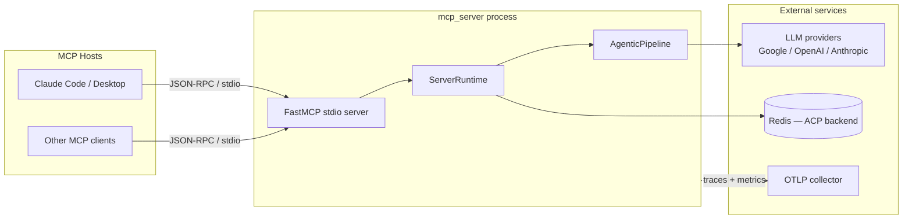
```mermaid
flowchart LR
    subgraph Hosts[MCP Hosts]
        Claude[Claude Code / Desktop]
        Other[Other MCP clients]
    end

    subgraph Server[mcp_server process]
        FastMCP[FastMCP stdio server]
        Runtime[ServerRuntime]
        Pipeline[AgenticPipeline]
    end

    subgraph External[External services]
        LLM[LLM providers<br/>Google / OpenAI / Anthropic]
        Redis[(Redis — ACP backend)]
        OTLP[OTLP collector]
    end

    Claude -->|JSON-RPC / stdio| FastMCP
    Other -->|JSON-RPC / stdio| FastMCP
    FastMCP --> Runtime
    Runtime --> Pipeline
    Pipeline --> LLM
    Runtime --> Redis
    Server -.traces + metrics.-> OTLP
```

### Component architecture

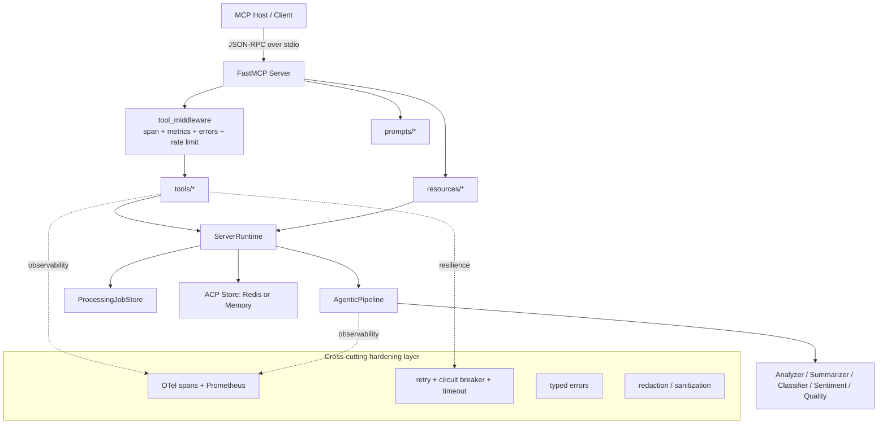
```mermaid
flowchart TB
    Client[MCP Host / Client] -->|JSON-RPC over stdio| FastMCP[FastMCP Server]

    FastMCP --> MW[tool_middleware<br/>span + metrics + errors + rate limit]
    MW --> Tools[tools/*]
    FastMCP --> Resources[resources/*]
    FastMCP --> Prompts[prompts/*]

    Tools --> Runtime[ServerRuntime]
    Resources --> Runtime

    Runtime --> Pipeline[AgenticPipeline]
    Runtime --> JobStore[ProcessingJobStore]
    Runtime --> ACPStore[ACP Store: Redis or Memory]

    Pipeline --> Agents[Analyzer / Summarizer / Classifier / Sentiment / Quality]

    Tools -.observability.-> OTel[OTel spans + Prometheus]
    Pipeline -.observability.-> OTel
    Tools -.resilience.-> Guard[retry + circuit breaker + timeout]

    subgraph Cross[Cross-cutting hardening layer]
        OTel
        Guard
        Errors[typed errors]
        Security[redaction / sanitization]
    end
```

## Package Layout

```text
mcp_server/
  __main__.py                # module entrypoint (python -m mcp_server)
  app.py                     # composition root; configures logging + observability
  server.py                  # compatibility wrapper exports
  runtime.py                 # runtime container (pipeline + job store + ACP)
  job_store.py               # async-safe in-memory processing jobs
  diagnostics.py             # health/capabilities/provider/limits snapshots
  catalog.py                 # canonical tool/resource/prompt inventories
  models.py                  # pydantic request/status models
  validation.py              # payload + metadata guardrails (routes through security)
  text_metrics.py            # content diagnostics/readability metrics
  logging_config.py          # stderr JSON logging + OTel trace correlation + redaction
  ruff.toml                  # shares lint/format config with agentic_ai/pyproject.toml
  # ── cross-cutting hardening layer (shared with the agentic pipeline) ──
  errors.py                  # typed exception hierarchy + retryable classification
  resilience.py              # retry (tenacity) + in-process circuit breaker + timeout
  observability.py           # OpenTelemetry tracing + Prometheus metric registry
  security.py                # secret redaction, sanitization, rate limiter
  health.py                  # liveness / readiness / deep-health
  middleware.py              # tool_middleware — wraps every MCP tool
  cost.py                    # per-model LLM cost estimation
  acp_models.py              # ACP agent + message pydantic records
  acp_store.py               # in-memory ACP registry + message routing
  acp_redis_store.py         # Redis-backed ACP store for multi-replica use
  tools/
    processing.py            # process + lifecycle + job controls
    analysis.py              # analysis/summarization/classification tools
    operations.py            # readiness/capabilities/preflight tools
    acp.py                   # ACP register/heartbeat/send/inbox/ack tools
    common.py                # shared tool helpers (validation, parsing)
  resources/
    config.py                # config://* resources
    runtime.py               # runtime://* resources
    jobs.py                  # jobs://* and topics://* resources
    acp.py                   # acp://* resources
  prompts/
    summarization.py         # summarize/executive prompts
    analysis.py              # sentiment/classification/quality prompts
    governance.py            # bias and incident prompts
```

### Module dependency layers

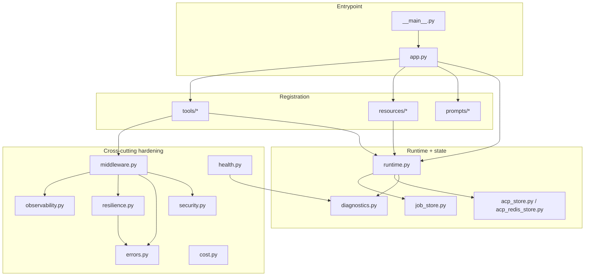
```mermaid
flowchart TD
    subgraph L4[Entrypoint]
        Main[__main__.py]
        App[app.py]
    end
    subgraph L3[Registration]
        ToolsReg[tools/*]
        ResReg[resources/*]
        PromptReg[prompts/*]
    end
    subgraph L2[Runtime + state]
        Runtime[runtime.py]
        JobStore[job_store.py]
        ACP[acp_store.py / acp_redis_store.py]
        Diag[diagnostics.py]
    end
    subgraph L1[Cross-cutting hardening]
        Mw[middleware.py]
        Res[resilience.py]
        Obs[observability.py]
        Sec[security.py]
        Err[errors.py]
        Health[health.py]
        Cost[cost.py]
    end

    Main --> App
    App --> ToolsReg & ResReg & PromptReg
    App --> Runtime
    ToolsReg --> Mw
    ToolsReg --> Runtime
    ResReg --> Runtime
    Runtime --> JobStore & ACP
    Runtime --> Diag
    Mw --> Obs & Res & Err & Sec
    Res --> Err
    Health --> Diag
```

## Startup Sequence

`app.py` is the composition root. Boot is deterministic and ordered so
that observability and logging are live before any runtime work happens.

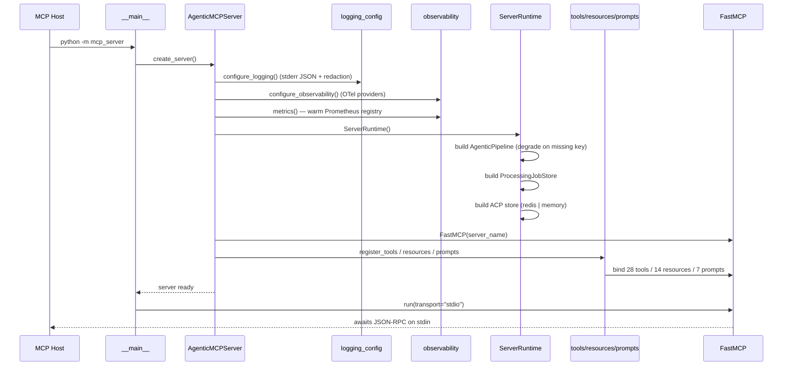
```mermaid
sequenceDiagram
    participant Host as MCP Host
    participant Main as __main__
    participant App as AgenticMCPServer
    participant Log as logging_config
    participant Obs as observability
    participant RT as ServerRuntime
    participant Reg as tools/resources/prompts
    participant MCP as FastMCP

    Host->>Main: python -m mcp_server
    Main->>App: create_server()
    App->>Log: configure_logging() (stderr JSON + redaction)
    App->>Obs: configure_observability() (OTel providers)
    App->>Obs: metrics() — warm Prometheus registry
    App->>RT: ServerRuntime()
    RT->>RT: build AgenticPipeline (degrade on missing key)
    RT->>RT: build ProcessingJobStore
    RT->>RT: build ACP store (redis | memory)
    App->>MCP: FastMCP(server_name)
    App->>Reg: register_tools / resources / prompts
    Reg->>MCP: bind 28 tools / 14 resources / 7 prompts
    App-->>Main: server ready
    Main->>MCP: run(transport="stdio")
    MCP-->>Host: awaits JSON-RPC on stdin
```

## Request Lifecycle

A single tool call from an MCP client travels through the middleware,
the runtime, and (for processing tools) the pipeline.

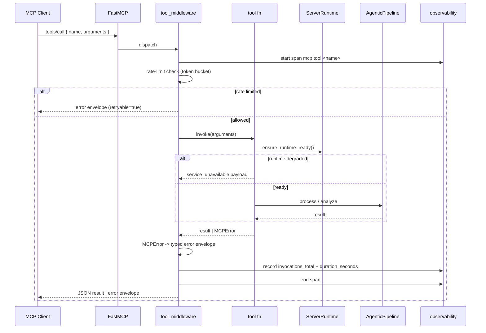
```mermaid
sequenceDiagram
    participant Client as MCP Client
    participant MCP as FastMCP
    participant MW as tool_middleware
    participant Tool as tool fn
    participant RT as ServerRuntime
    participant Pipe as AgenticPipeline
    participant Obs as observability

    Client->>MCP: tools/call { name, arguments }
    MCP->>MW: dispatch
    MW->>Obs: start span mcp.tool.<name>
    MW->>MW: rate-limit check (token bucket)
    alt rate limited
        MW-->>Client: error envelope (retryable=true)
    else allowed
        MW->>Tool: invoke(arguments)
        Tool->>RT: ensure_runtime_ready()
        alt runtime degraded
            Tool-->>MW: service_unavailable payload
        else ready
            Tool->>Pipe: process / analyze
            Pipe-->>Tool: result
        end
        Tool-->>MW: result | MCPError
        MW->>MW: MCPError -> typed error envelope
        MW->>Obs: record invocations_total + duration_seconds
        MW->>Obs: end span
        MW-->>Client: JSON result | error envelope
    end
```

## tool_middleware Pipeline

`middleware.py` exposes the `tool_middleware(name, rate_limit=True)`
decorator applied to every registered tool. It collapses cross-cutting
concerns into one wrapper so individual tools stay pure.

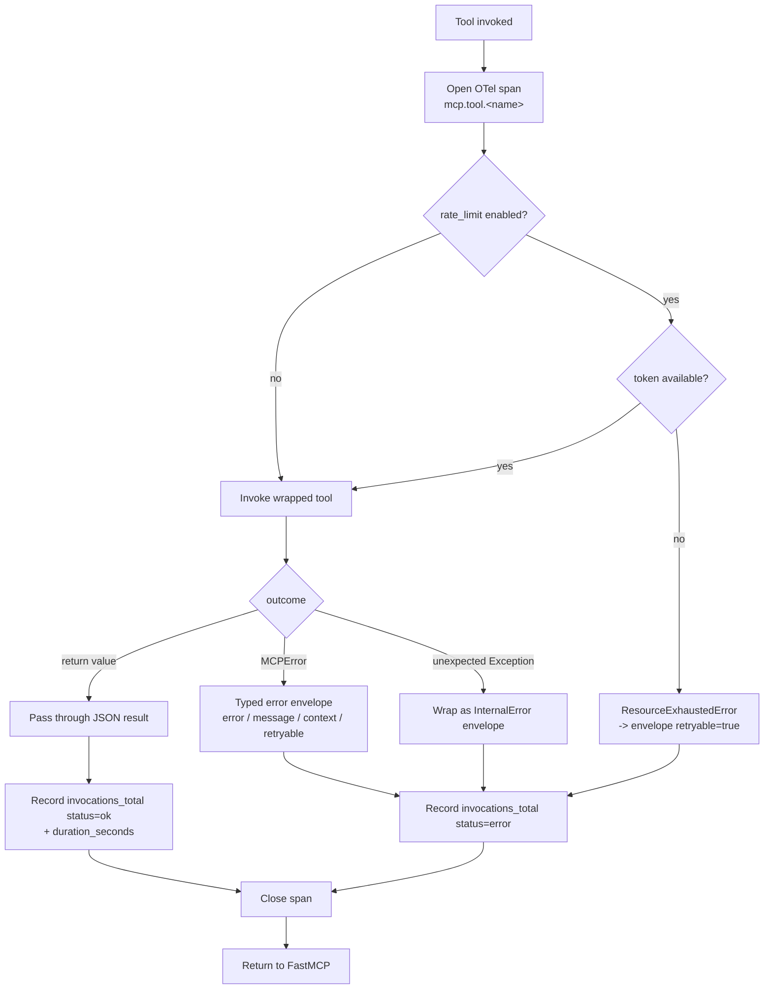
```mermaid
flowchart TD
    Enter[Tool invoked] --> Span[Open OTel span<br/>mcp.tool.&lt;name&gt;]
    Span --> RL{rate_limit enabled?}
    RL -->|yes| Bucket{token available?}
    RL -->|no| Run
    Bucket -->|no| Rate[ResourceExhaustedError<br/>-> envelope retryable=true]
    Bucket -->|yes| Run[Invoke wrapped tool]
    Run --> Outcome{outcome}
    Outcome -->|return value| OK[Pass through JSON result]
    Outcome -->|MCPError| Env[Typed error envelope<br/>error / message / context / retryable]
    Outcome -->|unexpected Exception| Wrap[Wrap as InternalError envelope]
    OK --> Metrics[Record invocations_total status=ok<br/>+ duration_seconds]
    Env --> Metrics2[Record invocations_total status=error]
    Wrap --> Metrics2
    Rate --> Metrics2
    Metrics --> Close[Close span] --> Done[Return to FastMCP]
    Metrics2 --> Close
```

## MCP Primitive Catalog

Source of truth is `mcp_server/catalog.py`.

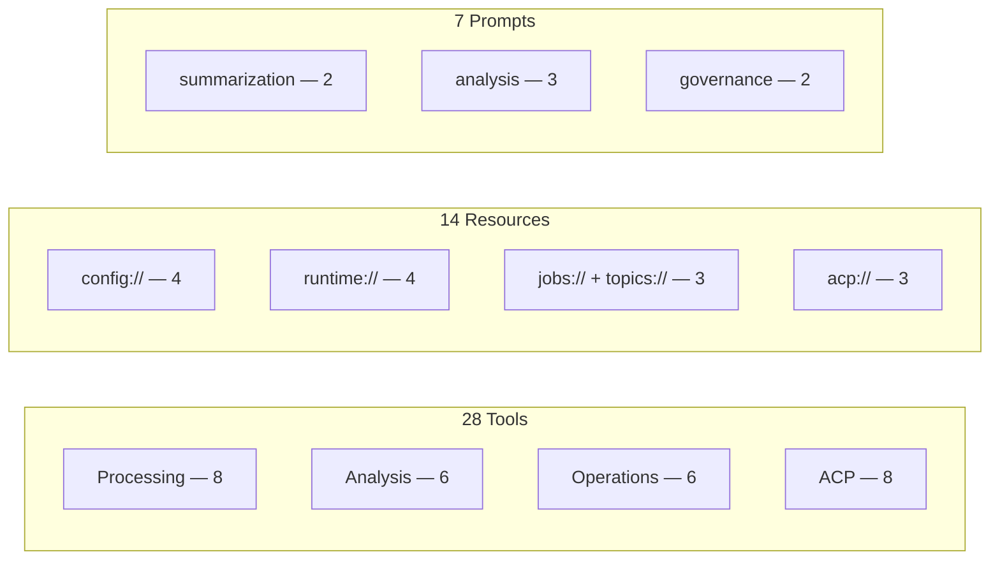
```mermaid
flowchart LR
    subgraph Tools[28 Tools]
        T1[Processing — 8]
        T2[Analysis — 6]
        T3[Operations — 6]
        T4[ACP — 8]
    end
    subgraph Resources[14 Resources]
        R1[config:// — 4]
        R2[runtime:// — 4]
        R3[jobs:// + topics:// — 3]
        R4[acp:// — 3]
    end
    subgraph Prompts[7 Prompts]
        P1[summarization — 2]
        P2[analysis — 3]
        P3[governance — 2]
    end
```

### Tools

#### Processing lifecycle tools

- `process_article`
- `process_article_batch`
- `validate_article_payload`
- `get_processing_status`
- `get_processing_result`
- `list_processing_jobs`
- `delete_processing_job`
- `purge_processing_jobs`

#### Analysis tools

- `analyze_content`
- `analyze_sentiment`
- `extract_topics`
- `evaluate_quality`
- `compute_text_metrics`
- `generate_summary`

#### Operations/diagnostics tools

- `check_pipeline_health`
- `get_pipeline_graph`
- `get_runtime_readiness`
- `get_server_capabilities`
- `diagnose_provider_configuration`
- `run_preflight_checks`

#### ACP tools

- `acp_register_agent`
- `acp_unregister_agent`
- `acp_heartbeat`
- `acp_send_message`
- `acp_fetch_inbox`
- `acp_acknowledge_message`
- `acp_list_agents`
- `acp_get_message`

### Resources

- `config://pipeline`
- `config://limits`
- `config://providers`
- `config://features`
- `runtime://health`
- `runtime://readiness`
- `runtime://capabilities`
- `runtime://pipeline/graph`
- `jobs://stats`
- `jobs://recent`
- `topics://available`
- `acp://agents`
- `acp://stats`
- `acp://messages/recent`

### Prompts

- `summarize_article_prompt`
- `executive_brief_prompt`
- `analyze_sentiment_prompt`
- `classify_article_prompt`
- `quality_audit_prompt`
- `red_team_bias_prompt`
- `incident_triage_prompt`

## Runtime Model

`ServerRuntime` (`runtime.py`) initializes three shared objects:

- `pipeline`: an `AgenticPipeline` instance, marked unavailable if startup fails.
- `jobs`: a `ProcessingJobStore` with bounded history and TTL.
- `acp`: ACP store selected by `ACP_BACKEND` (`redis` in production, `memory` fallback outside strict mode).

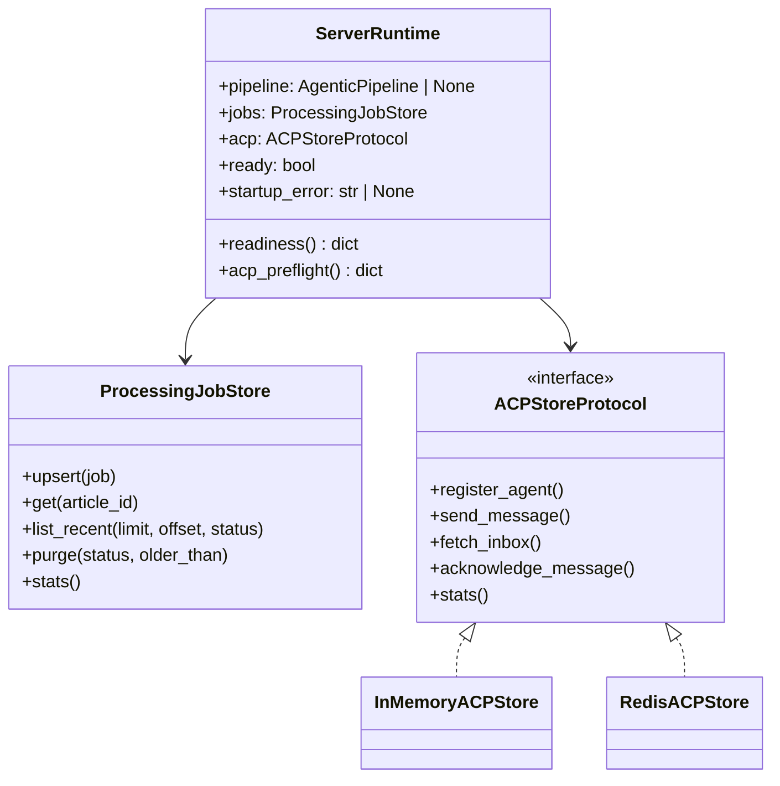
```mermaid
classDiagram
    class ServerRuntime {
        +pipeline: AgenticPipeline | None
        +jobs: ProcessingJobStore
        +acp: ACPStoreProtocol
        +ready: bool
        +startup_error: str | None
        +readiness() dict
        +acp_preflight() dict
    }
    class ProcessingJobStore {
        +upsert(job)
        +get(article_id)
        +list_recent(limit, offset, status)
        +purge(status, older_than)
        +stats()
    }
    class ACPStoreProtocol {
        <<interface>>
        +register_agent()
        +send_message()
        +fetch_inbox()
        +acknowledge_message()
        +stats()
    }
    class InMemoryACPStore
    class RedisACPStore

    ServerRuntime --> ProcessingJobStore
    ServerRuntime --> ACPStoreProtocol
    ACPStoreProtocol <|.. InMemoryACPStore
    ACPStoreProtocol <|.. RedisACPStore
```

### Job store behavior

The in-memory store provides:

- Async lock protection for concurrent tool calls.
- Ordered recency listing with filters and pagination.
- TTL pruning for completed jobs.
- Max-history enforcement.
- Bulk purge by status and/or age.

Guardrails are controlled by settings:

- `mcp_max_job_history`
- `mcp_job_ttl_seconds`

## Job Store Lifecycle

A processing job moves through a small status machine. Terminal jobs are
retained until either the TTL elapses or max-history eviction removes the
oldest entries.

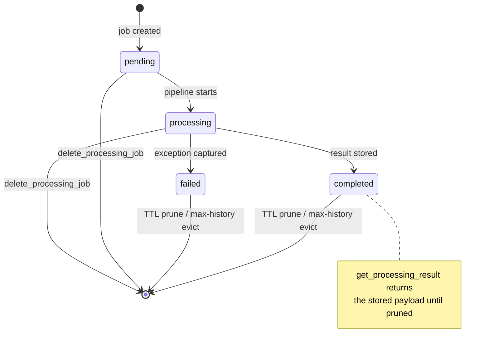
```mermaid
stateDiagram-v2
    [*] --> pending: job created
    pending --> processing: pipeline starts
    processing --> completed: result stored
    processing --> failed: exception captured
    completed --> [*]: TTL prune / max-history evict
    failed --> [*]: TTL prune / max-history evict
    pending --> [*]: delete_processing_job
    processing --> [*]: delete_processing_job

    note right of completed
        get_processing_result returns
        the stored payload until pruned
    end note
```

`get_processing_status` for an unknown id returns a synthetic
`not_found` status rather than an error.

## ACP Runtime Model

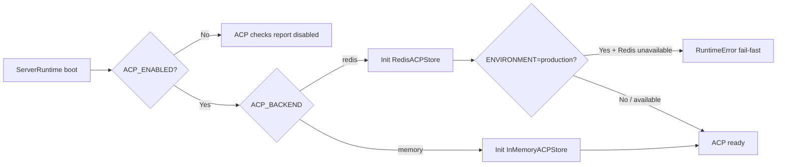
```mermaid
flowchart LR
    Start[ServerRuntime boot] --> ACPEnabled{ACP_ENABLED?}
    ACPEnabled -->|No| ACPDisabled[ACP checks report disabled]
    ACPEnabled -->|Yes| Backend{ACP_BACKEND}
    Backend -->|redis| RedisInit[Init RedisACPStore]
    Backend -->|memory| MemInit[Init InMemoryACPStore]
    RedisInit --> StrictProd{ENVIRONMENT=production?}
    StrictProd -->|Yes + Redis unavailable| FailFast[RuntimeError fail-fast]
    StrictProd -->|No / available| ACPReady[ACP ready]
    MemInit --> ACPReady
```

ACP operational preflight (`acp_preflight`) performs:
- Optional Redis ping (when Redis backend selected)
- Agent registration roundtrip
- Message send -> inbox fetch -> acknowledgment
- Cleanup/unregister

### ACP message lifecycle

Each message envelope is a small state machine with a TTL. Delivery is
pull-based: `fetch_inbox` transitions `pending` messages to `delivered`.

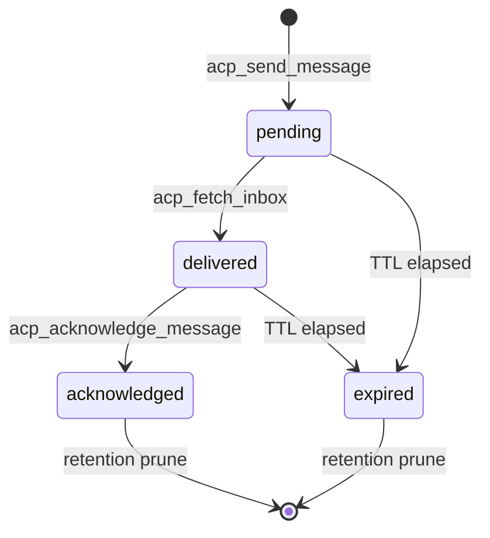
```mermaid
stateDiagram-v2
    [*] --> pending: acp_send_message
    pending --> delivered: acp_fetch_inbox
    delivered --> acknowledged: acp_acknowledge_message
    pending --> expired: TTL elapsed
    delivered --> expired: TTL elapsed
    acknowledged --> [*]: retention prune
    expired --> [*]: retention prune
```

### ACP agent + message exchange

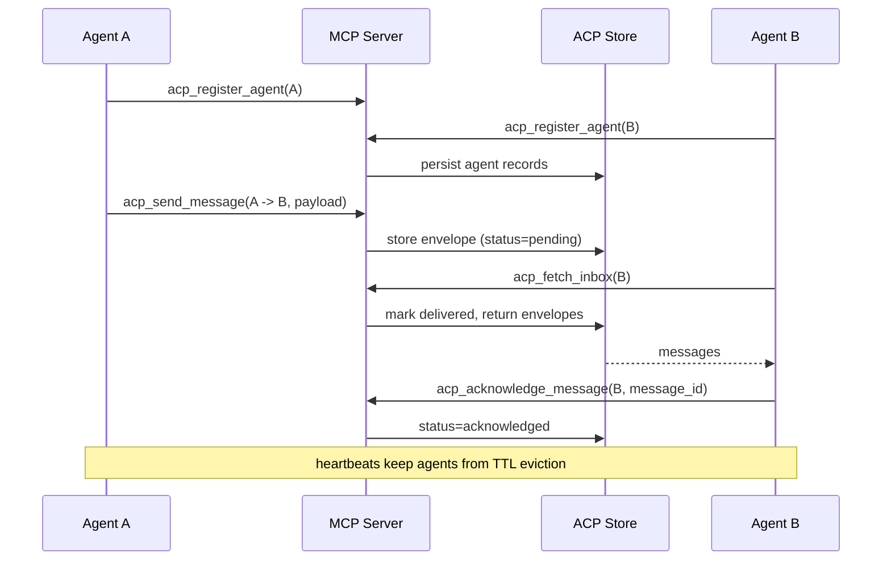
```mermaid
sequenceDiagram
    participant A as Agent A
    participant MCP as MCP Server
    participant Store as ACP Store
    participant B as Agent B

    A->>MCP: acp_register_agent(A)
    B->>MCP: acp_register_agent(B)
    MCP->>Store: persist agent records
    A->>MCP: acp_send_message(A -> B, payload)
    MCP->>Store: store envelope (status=pending)
    B->>MCP: acp_fetch_inbox(B)
    MCP->>Store: mark delivered, return envelopes
    Store-->>B: messages
    B->>MCP: acp_acknowledge_message(B, message_id)
    MCP->>Store: status=acknowledged
    Note over A,B: heartbeats keep agents from TTL eviction
```

## Pipeline Execution

`process_article` runs the LangGraph assembly-line pipeline. The graph is
strictly linear with a single bounded quality-retry loop.

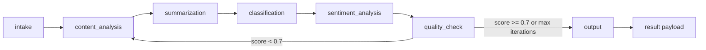
```mermaid
flowchart LR
    Intake[intake] --> CA[content_analysis]
    CA --> Sum[summarization]
    Sum --> Cls[classification]
    Cls --> Sent[sentiment_analysis]
    Sent --> QC[quality_check]
    QC -->|score >= 0.7 or max iterations| Out[output]
    QC -->|score < 0.7| CA
    Out --> Done[result payload]
```

Each stage runs inside its own trace span and records
`synthora_agent_invocations_total` / `synthora_agent_duration_seconds`.
A top-level deadline and a `recursion_limit` sized to the worst-case
retry path prevent a low-quality article from wedging a worker.

## Reliability & Observability

Every MCP tool is wrapped by `tool_middleware` (`middleware.py`), which
provides, uniformly and without per-tool boilerplate:

- an OpenTelemetry span (`mcp.tool.<name>`),
- Prometheus metrics (`synthora_mcp_tool_invocations_total`,
  `synthora_mcp_tool_duration_seconds`),
- conversion of any `MCPError` subclass into a typed error envelope
  (`{error, message, context, retryable}`) — callers never see a raw
  traceback,
- optional per-caller token-bucket rate limiting.

External calls (LLM providers via the pipeline, Redis) flow through
`resilience.guarded_call`: exponential-backoff retry on classified
*transient* errors, a per-provider circuit breaker, and a timeout.

### Resilience: circuit breaker

`resilience.py` ships a self-contained circuit breaker. It protects each
external dependency from repeated failing calls.

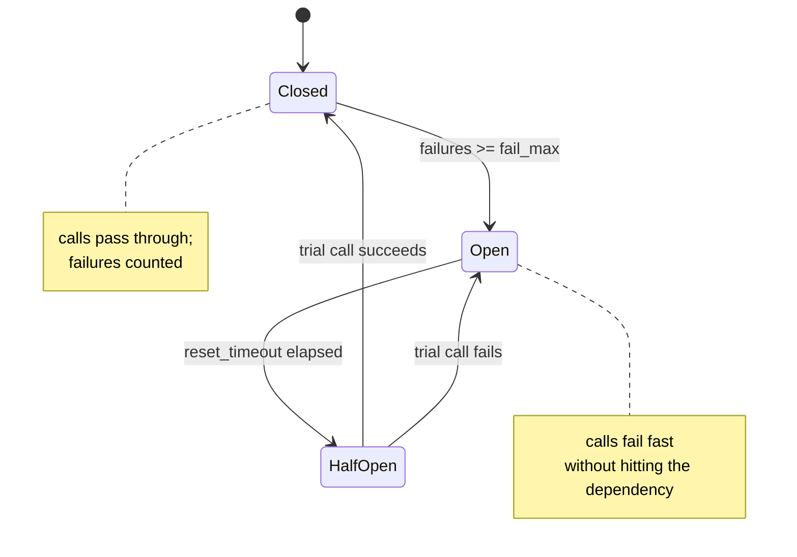
```mermaid
stateDiagram-v2
    [*] --> Closed
    Closed --> Open: failures >= fail_max
    Open --> HalfOpen: reset_timeout elapsed
    HalfOpen --> Closed: trial call succeeds
    HalfOpen --> Open: trial call fails

    note right of Closed
        calls pass through;
        failures counted
    end note
    note right of Open
        calls fail fast
        without hitting the dependency
    end note
```

### Retry + error classification

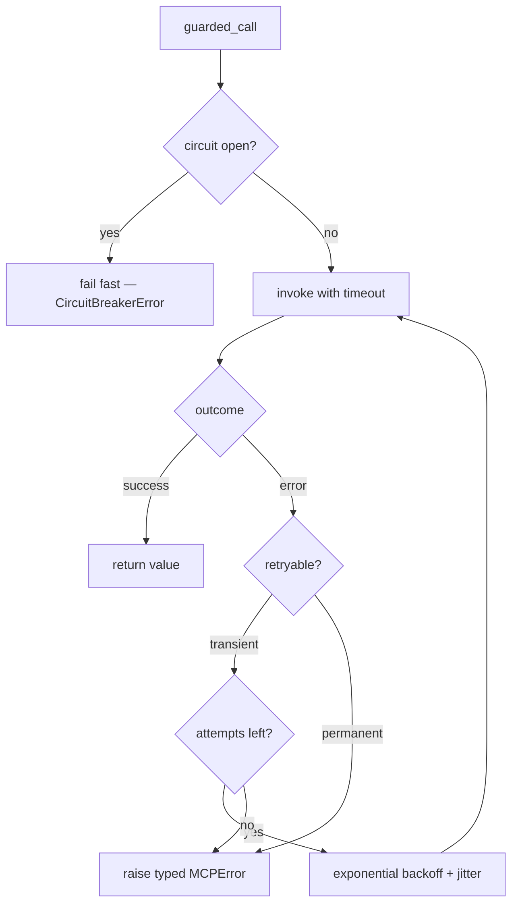
```mermaid
flowchart TD
    Call[guarded_call] --> CB{circuit open?}
    CB -->|yes| Fast[fail fast — CircuitBreakerError]
    CB -->|no| Try[invoke with timeout]
    Try --> Result{outcome}
    Result -->|success| OK[return value]
    Result -->|error| Classify{retryable?}
    Classify -->|transient| Budget{attempts left?}
    Classify -->|permanent| Raise[raise typed MCPError]
    Budget -->|yes| Backoff[exponential backoff + jitter] --> Try
    Budget -->|no| Raise
```

`errors.py` defines the typed hierarchy. Each error carries a
`retryable` flag and a `context` dict, and renders to the same envelope
shape the middleware returns.

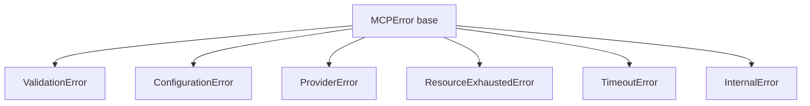
```mermaid
flowchart TD
    MCPError[MCPError base] --> Validation[ValidationError]
    MCPError --> Config[ConfigurationError]
    MCPError --> Provider[ProviderError]
    MCPError --> Resource[ResourceExhaustedError]
    MCPError --> Timeout[TimeoutError]
    MCPError --> Internal[InternalError]
```

### Observability data flow

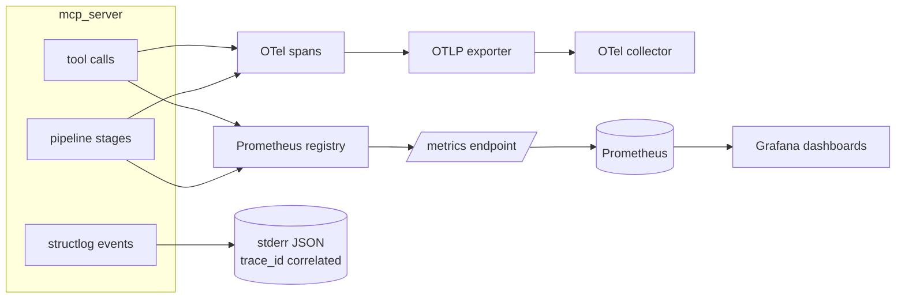
```mermaid
flowchart LR
    subgraph Source[mcp_server]
        Tools[tool calls]
        Pipe[pipeline stages]
        Logs[structlog events]
    end
    Tools --> Spans[OTel spans]
    Pipe --> Spans
    Tools --> Metrics[Prometheus registry]
    Pipe --> Metrics
    Logs --> Stderr[(stderr JSON<br/>trace_id correlated)]
    Spans --> OTLP[OTLP exporter]
    Metrics --> Scrape[/metrics endpoint/]
    OTLP --> Collector[OTel collector]
    Scrape --> Prom[(Prometheus)]
    Prom --> Graf[Grafana dashboards]
```

`observability.py` exposes a typed Prometheus registry; `metrics_text()`
renders it for the FastAPI `/metrics` endpoint. Logs (`logging_config.py`)
are JSON on stderr, carry `trace_id`/`span_id`, and are secret-redacted.

Health is three-tiered in `health.py`: liveness, readiness (ACP/Redis
preflight), and a deep-health snapshot.

### Exposed metric families

| Metric | Type | Purpose |
|--------|------|---------|
| `synthora_mcp_tool_invocations_total` | counter | tool calls by name + status |
| `synthora_mcp_tool_duration_seconds` | histogram | tool latency |
| `synthora_pipeline_runs_total` | counter | pipeline executions by terminal status |
| `synthora_pipeline_duration_seconds` | histogram | end-to-end pipeline latency |
| `synthora_agent_invocations_total` | counter | per-agent stage calls |
| `synthora_agent_duration_seconds` | histogram | per-agent stage latency |
| `synthora_llm_calls_total` | counter | LLM calls by provider/model/status |
| `synthora_llm_duration_seconds` | histogram | LLM call latency |
| `synthora_llm_tokens_total` | counter | token usage |
| `synthora_llm_cost_usd_total` | counter | estimated spend |
| `synthora_circuit_breaker_state` | gauge | breaker state per dependency |
| `synthora_retries_total` | counter | retry attempts |
| `synthora_errors_total` | counter | typed errors by class |
| `synthora_acp_messages_total` | counter | ACP messages sent/received |
| `synthora_acp_agents_registered` | gauge | live ACP agents |
| `synthora_job_queue_depth` | gauge | processing jobs in flight |

## Configuration

All config is loaded from `agentic_ai/config/settings.py` (`.env` support via `agentic_ai/.env` and `.env`).

### Key MCP settings

- `MCP_SERVER_NAME` (default `synthora-agentic-pipeline`)
- `MCP_SERVER_VERSION` (default `1.0.0`)
- `MCP_MAX_CONTENT_CHARS` (default `20000`)
- `MCP_MAX_METADATA_ENTRIES` (default `50`)
- `MCP_MAX_METADATA_VALUE_CHARS` (default `2000`)
- `MCP_MAX_BATCH_ITEMS` (default `25`)
- `MCP_MAX_JOB_HISTORY` (default `1000`)
- `MCP_JOB_TTL_SECONDS` (default `86400`)
- `ACP_ENABLED` (default `true`)
- `ACP_BACKEND` (default `redis`, options: `redis`, `memory`)
- `ACP_REDIS_KEY_PREFIX` (default `synthora:acp`)
- `ACP_MAX_AGENTS` (default `200`)
- `ACP_MAX_MESSAGES` (default `5000`)
- `ACP_MESSAGE_TTL_SECONDS` (default `3600`)
- `ACP_AGENT_TTL_SECONDS` (default `900`)
- `ACP_MAX_PAYLOAD_CHARS` (default `20000`)
- `ACP_MAX_METADATA_ENTRIES` (default `50`)
- `ACP_MAX_CAPABILITIES` (default `32`)

When `ENVIRONMENT=production` and `ACP_ENABLED=true`, setting `ACP_BACKEND=redis` is strict:
if Redis dependencies/backend are unavailable at startup, runtime initialization fails fast.

### Provider readiness

The runtime can operate in degraded mode if providers are misconfigured; inspect with:

- Tool: `diagnose_provider_configuration`
- Tool: `run_preflight_checks`
- Resource: `config://providers`
- Resource: `runtime://readiness`

## Run Locally

### Prerequisites

- Python 3.11+
- Dependencies installed from `agentic_ai/requirements/base.txt`
- At least one configured model provider for full runtime readiness

### Install

From repository root:

```bash
pip install -r agentic_ai/requirements/base.txt
```

### Start server

From repository root:

```bash
PYTHONPATH=. python -m mcp_server
```

Or from `agentic_ai/`:

```bash
PYTHONPATH=.. python -m mcp_server
```

### Preflight check

```bash
cd agentic_ai
make mcp-preflight
```

## MCP Client Integration

### Repository `.mcp.json` usage

This repository already configures the server in `.mcp.json`:

```json
{
  "mcpServers": {
    "synthora-agentic-pipeline": {
      "command": "python",
      "args": ["-m", "mcp_server"],
      "env": {
        "PYTHONPATH": ".",
        "PYTHONUNBUFFERED": "1"
      }
    }
  }
}
```

### Minimal Python stdio client example

```python
import asyncio
from mcp import ClientSession, StdioServerParameters
from mcp.client.stdio import stdio_client


async def main() -> None:
    server = StdioServerParameters(
        command="python",
        args=["-m", "mcp_server"],
        env={"PYTHONPATH": "."},
    )

    async with stdio_client(server) as (read, write):
        async with ClientSession(read, write) as session:
            await session.initialize()

            capabilities = await session.call_tool("get_server_capabilities", {})
            print(capabilities)

            result = await session.call_tool(
                "process_article",
                {
                    "article_id": "example-1",
                    "content": "Policy article content goes here.",
                    "url": "https://example.com/article",
                    "source": "government",
                    "metadata": {"department": "transport"},
                },
            )
            print(result)


asyncio.run(main())
```

### Client connection handshake

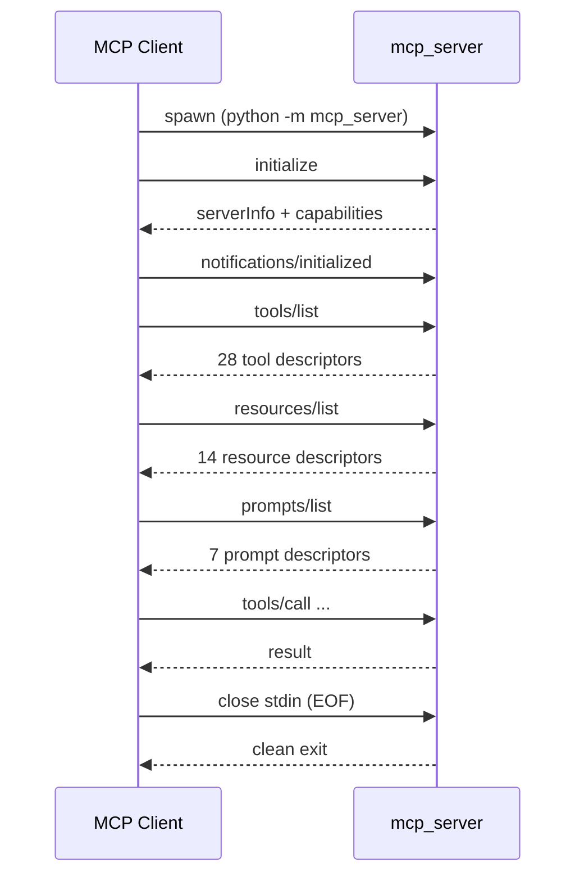
```mermaid
sequenceDiagram
    participant C as MCP Client
    participant S as mcp_server

    C->>S: spawn (python -m mcp_server)
    C->>S: initialize
    S-->>C: serverInfo + capabilities
    C->>S: notifications/initialized
    C->>S: tools/list
    S-->>C: 28 tool descriptors
    C->>S: resources/list
    S-->>C: 14 resource descriptors
    C->>S: prompts/list
    S-->>C: 7 prompt descriptors
    C->>S: tools/call ...
    S-->>C: result
    C->>S: close stdin (EOF)
    S-->>C: clean exit
```

## Operational Notes

- Transport is stdio in `app.py` (`self.mcp.run(transport="stdio")`).
- The MCP server is launched **on demand** by an MCP client; it is not a
  daemon and exits cleanly on stdin EOF — do not run it as a long-lived
  Deployment.
- Logging is intentionally stderr-only (`logging_config.py`) to avoid corrupting JSON-RPC streams.
- `app.py` calls `configure_observability()` at boot; tracing degrades
  to a no-op if no OTLP endpoint is configured.
- `generate_summary` returns a **string** response; most other tools return object payloads.
- `process_article_batch` supports fail-fast via `continue_on_error=False`.
- `purge_processing_jobs` requires explicit confirmation when purging everything (`confirm=true`).

## Testing

Tests live in `agentic_ai/tests/` (77 total — unit, MCP integration,
end-to-end pipeline). They cover this package's job store, validation,
ACP store + Redis backend, errors, security/redaction, resilience,
observability, middleware, health, cost, and a full `test_mcp_integration.py`
that boots the real server and exercises tool registration + invocation.

From repository root:

```bash
PYTHONPATH=. pytest -q agentic_ai/tests/
# or, from agentic_ai/:
make test
```

Optional compile check:

```bash
python -m py_compile $(find mcp_server -name '*.py')
```

Static analysis (`mcp_server/ruff.toml` shares config with
`agentic_ai/pyproject.toml`):

```bash
cd agentic_ai && make lint typecheck security
```

## Migration Notes

- Package path is now `mcp_server`.
- Legacy `standalone_mcp_server` references were removed.
- Compatibility alias retained in code: `StandaloneAgenticMCPServer = AgenticMCPServer`.

Use `python -m mcp_server` as the canonical entrypoint.

## Troubleshooting

### Runtime shows degraded / not ready

- Run `make mcp-preflight` from `agentic_ai/`.
- Call `get_runtime_readiness` and `diagnose_provider_configuration`.
- Verify required provider keys are set in `.env`.

### MCP client fails to connect

- Confirm client launches with `python -m mcp_server`.
- Confirm `PYTHONPATH` includes repo root.
- Ensure no stdout logging is introduced in server code.

### Empty `topics://available`

- This indicates pipeline runtime is unavailable.
- Fix readiness first, then retry resource call.

### ACP preflight reports `ready: false`

- With `ACP_BACKEND=redis`, confirm Redis is reachable from the server.
- Outside production the server falls back to the in-memory store; in
  production an unreachable Redis fails startup by design.
