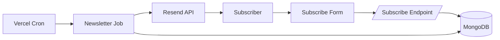
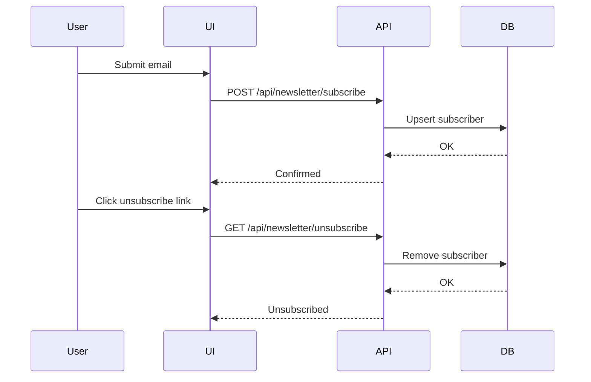

# SynthoraAI - AI Article Curator Newsletter Service

This directory contains the **Newsletter Service** for the SynthoraAI - AI Article Curator project. It is responsible for:

- Maintaining a subscriber list (emails only, no authentication).
- Periodically fetching new articles from the main database.
- Sending a beautifully formatted daily newsletter via Resend.
- Providing a minimal landing page to redirect human visitors.

---

## Table of Contents

- [Features](#features)
- [Newsletter Flow](#newsletter-flow)
- [Subscription Lifecycle](#subscription-lifecycle)
- [Prerequisites](#prerequisites)
- [Installation](#installation)
- [Environment Variables](#environment-variables)
- [Available Scripts](#available-scripts)
- [Local Development](#local-development)
- [Cron / Scheduled Job](#cron--scheduled-job)
- [API Endpoints](#api-endpoints)
- [Minimal UI](#minimal-ui)
- [License](#license)

---

## Features

- **Subscription / Unsubscription**: Users can subscribe or unsubscribe via email only.
- **Daily Digest**: Sends up to 50 new articles per run, with trimming and batching logic.
- **Resend Integration**: Utilizes Resend for reliable email delivery, with unsubscribe link built-in.
- **Lightweight UI**: A simple Next.js page explains the service and redirects to main apps.
- **Logging**: Console logs each step when run locally or as a cron job.

---

## Newsletter Flow



## Subscription Lifecycle



## Prerequisites

- Node.js v18.x
- npm or yarn
- MongoDB Atlas (or other MongoDB) connection URI
- Resend account and verified sending domain

---

## Installation

1. `cd newsletters/`
2. Install dependencies:

   ```bash
   npm install
   ```

---

## Environment Variables

Create a `.env` file at the root of this directory with the following keys:

```ini
# MongoDB connection
MONGODB_URI=<Your MongoDB URI>

# Resend API
RESEND_API_KEY=<Your Resend API Key>
RESEND_FROM="AI Curator <news@yourdomain.com>"

# Unsubscribe link base (should match your backend URL)
UNSUBSCRIBE_BASE_URL=https://<your-backend-domain>/api/newsletter/unsubscribe
```

---

## Available Scripts

In the `newsletters/` directory, run:

| Command              | Description                                                 |
| -------------------- | ----------------------------------------------------------- |
| `npm run dev`        | Launch Next.js UI locally at `http://localhost:3000`.       |
| `npm run build`      | Build Next.js for production.                               |
| `npm run start`      | Start Next.js in production mode.                           |
| `npm run newsletter` | Run the newsletter sender script (TypeScript via ts-node).  |
| `npm run send`       | Run built JS sender: `node dist/schedule/sendNewsletter.js` |

---

## Local Development

- **UI**:

  ```bash
  npm run dev
  ```

  Browse [http://localhost:3000](http://localhost:3000).

- **Send a Test Newsletter**:

  ```bash
  npm run newsletter
  ```

  Logs appear in the console.

---

## Cron / Scheduled Job

For daily automation, schedule the `newsletter` script (e.g., via `cron`, `daily.sh`, or Vercel Cron):

```bash
# daily.sh example
#!/usr/bin/env bash
cd /path/to/crawler && npm run crawl
cd /path/to/crawler && npm run clean:articles
cd /path/to/newsletters && npm run newsletter
```

---

## API Endpoints

- **Subscribe**: `POST /api/newsletter/subscribe`

  - Body: `{ "email": "user@example.com" }`
  - Success: `200` or `201` with JSON message.

- **Unsubscribe**:

  - `POST /api/newsletter/unsubscribe` with same body structure, or
  - `GET  /api/newsletter/unsubscribe?email=user@example.com`.

All endpoints return JSON with `message` or `error` fields.

---

## Minimal UI

The Next.js app in this directory has a single page (`pages/index.tsx`) that:

- Explains that this is the newsletter cron project.
- Provides buttons linking to the **main backend** and **frontend** sites.
- Adapts to light & dark themes with animations.

You can preview it locally via `npm run dev`.

---

## License

This service is MIT licensed. See the [LICENSE](../LICENSE) file in the root of the repository.
