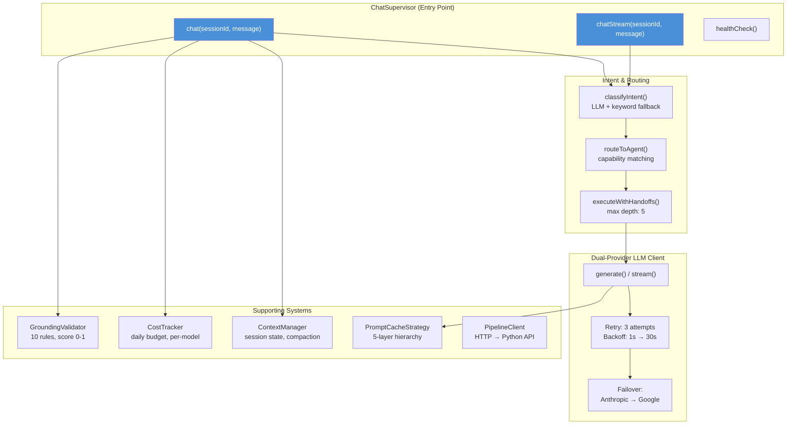
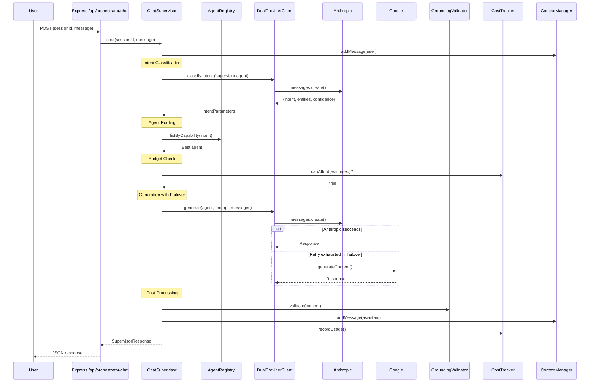
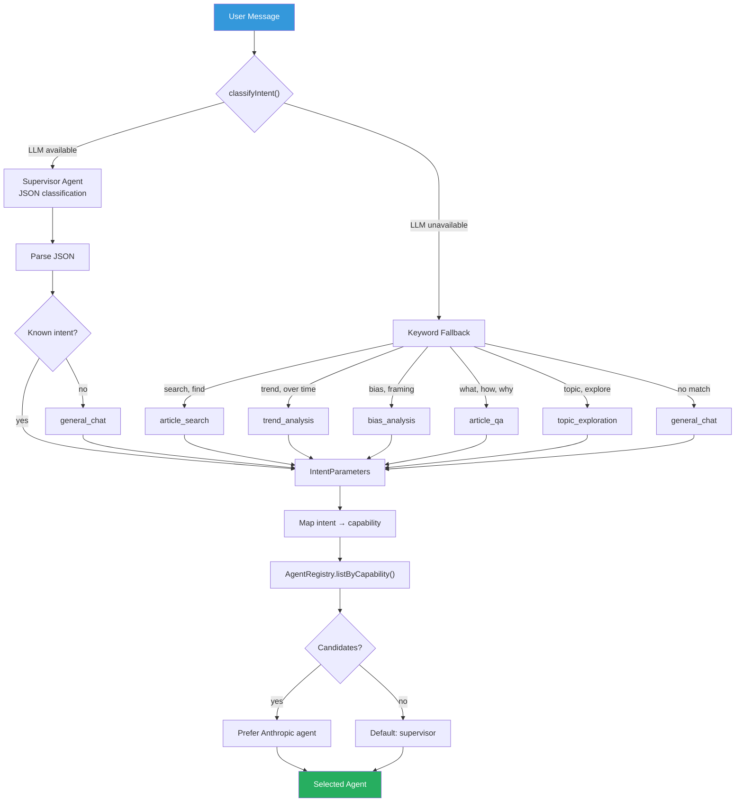
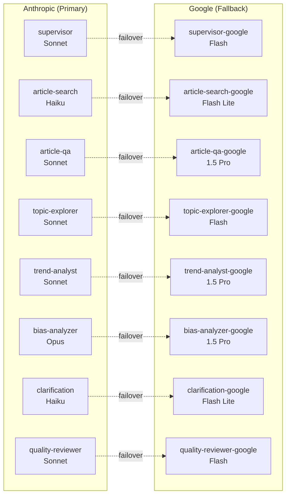
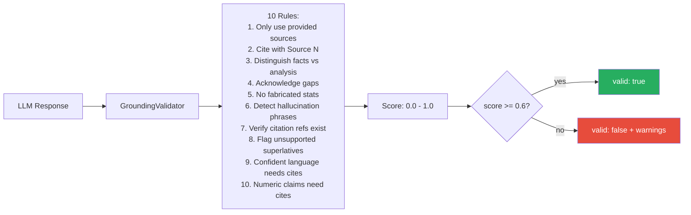
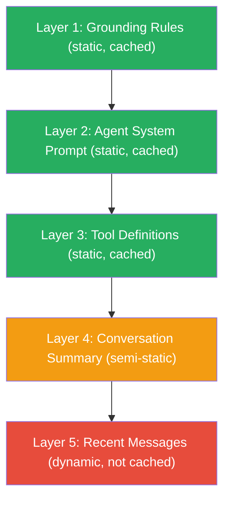
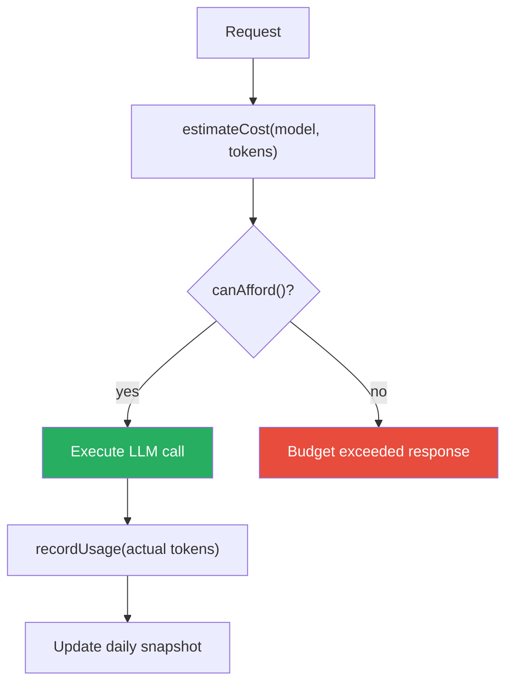
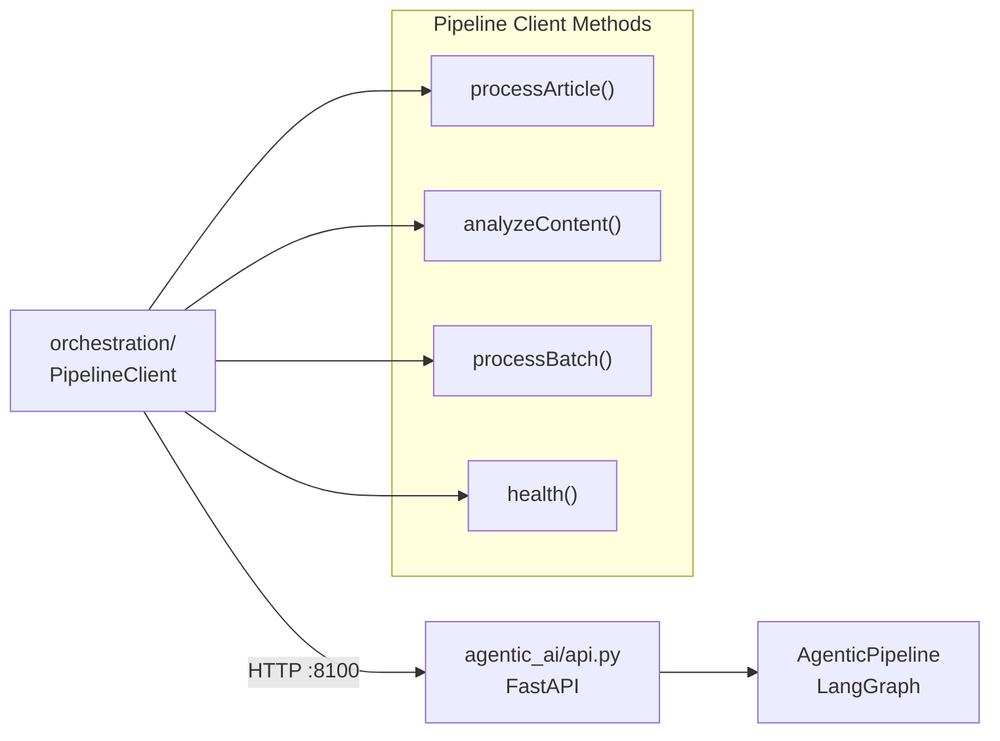

# @synthoraai/orchestration

Agent orchestration layer for SynthoraAI — dual-provider LLM client, chat supervisor with 16 specialized agents, intent-based routing, grounding validation, context management, cost tracking, prompt caching, and enterprise observability.

## Architecture

The orchestration package powers the **chat experience** in SynthoraAI. It wraps Anthropic (Claude) and Google (Gemini) APIs behind a unified interface with automatic provider failover, intent-based agent routing, and budget enforcement. A `PipelineClient` bridge connects to the Python agentic pipeline over HTTP for article processing.



## Request Flow



## Intent Classification & Routing



## Modules

| Module | Path | Description |
|---|---|---|
| **Supervisor** | `src/supervisor/` | Intent classification, agent routing, handoff chains (max depth 5), health check |
| **LLM Client** | `src/llm/` | Dual-provider (Anthropic + Google) with retry, streaming, failover |
| **Agent Registry** | `src/agents/` | 16 agents with cross-provider fallback, capability-based lookup |
| **Context Manager** | `src/context/` | Session state, message history, token-aware compaction (20 msg threshold) |
| **Cost Tracker** | `src/cost/` | Daily budget enforcement ($10 default), per-model cost breakdown |
| **Pipeline Bridge** | `src/bridge/` | HTTP client (`PipelineClient`) for the Python agentic pipeline API on :8100 |
| **Config** | `src/config/` | Zod-validated environment, preflight checks |
| **Observability** | `src/observability/` | Structured JSON logging, metrics collector (counters, histograms, gauges) |
| **Schemas** | `src/schemas/` | Zod request/response validation for API boundaries |
| **Templates** | `src/templates/` | Standardised error responses with HTTP status mapping |
| **Prompts** | `src/agents/prompts/` | 8 system prompts, 10 grounding rules, prompt cache strategy, versioning registry |

## Agents

16 agents are registered by default (8 primary + 8 Google fallbacks):



| Agent | Provider | Model | Capabilities | Cost Tier |
|---|---|---|---|---|
| supervisor | Anthropic | claude-sonnet-4-6 | routing, synthesis, general_chat | STANDARD |
| supervisor-google | Google | gemini-2.0-flash | routing, synthesis, general_chat | ECONOMY |
| article-search | Anthropic | claude-haiku-4-5 | article_search, retrieval | ECONOMY |
| article-search-google | Google | gemini-2.0-flash-lite | article_search, retrieval | ECONOMY |
| article-qa | Anthropic | claude-sonnet-4-6 | article_qa, grounded_qa | STANDARD |
| article-qa-google | Google | gemini-1.5-pro | article_qa, grounded_qa | PREMIUM |
| topic-explorer | Anthropic | claude-sonnet-4-6 | topic_exploration, summarization | STANDARD |
| topic-explorer-google | Google | gemini-2.0-flash | topic_exploration, summarization | ECONOMY |
| trend-analyst | Anthropic | claude-sonnet-4-6 | trend_analysis, data_analysis | STANDARD |
| trend-analyst-google | Google | gemini-1.5-pro | trend_analysis, data_analysis | PREMIUM |
| bias-analyzer | Anthropic | claude-opus-4-6 | bias_analysis, media_literacy | PREMIUM |
| bias-analyzer-google | Google | gemini-1.5-pro | bias_analysis, media_literacy | PREMIUM |
| clarification | Anthropic | claude-haiku-4-5 | clarification, dialogue_management | ECONOMY |
| clarification-google | Google | gemini-2.0-flash-lite | clarification, dialogue_management | ECONOMY |
| quality-reviewer | Anthropic | claude-sonnet-4-6 | quality_review, evaluation | STANDARD |
| quality-reviewer-google | Google | gemini-2.0-flash | quality_review, evaluation | ECONOMY |

## Grounding Validation

10 rules applied post-generation to every response:



## Prompt Cache Strategy

5-layer hierarchy for Anthropic prompt caching (~90% input cost reduction on multi-turn conversations):



## Cost Tracking



**Model pricing (USD per 1M tokens):**

| Model | Input | Output | Cached Input |
|---|---|---|---|
| claude-opus-4-6 | $15.00 | $75.00 | $1.50 |
| claude-sonnet-4-6 | $3.00 | $15.00 | $0.30 |
| claude-haiku-4-5 | $0.80 | $4.00 | $0.08 |
| gemini-2.0-flash | $0.10 | $0.40 | $0.025 |
| gemini-2.0-flash-lite | $0.075 | $0.30 | $0.019 |
| gemini-1.5-pro | $1.25 | $5.00 | $0.313 |

## Pipeline Bridge

The `PipelineClient` (`src/bridge/pipeline-client.ts`) connects the TypeScript orchestration layer to the Python agentic pipeline over HTTP:



- Retry with exponential backoff on 502/503/504
- Configurable timeout (default 120s)
- Network error detection and retry
- `PIPELINE_API_URL` env var (default `http://localhost:8100`)

## Setup

```bash
cd orchestration
npm install
```

### Environment Variables

| Variable | Required | Default | Description |
|---|---|---|---|
| `ANTHROPIC_API_KEY` | At least one | — | Anthropic API key |
| `GOOGLE_API_KEY` | provider | — | Google AI API key |
| `ORCHESTRATION_DAILY_BUDGET_USD` | No | `10` | Daily cost cap (USD) |
| `ORCHESTRATION_MAX_CONCURRENCY` | No | `5` | Max concurrent LLM requests |
| `ORCHESTRATION_TIMEOUT_MS` | No | `60000` | Request timeout (ms) |
| `ORCHESTRATION_MAX_HANDOFF_DEPTH` | No | `5` | Max agent handoff chain depth |
| `ORCHESTRATION_MAX_ACTIVE_MESSAGES` | No | `20` | Session messages before compaction |
| `ORCHESTRATION_LOG_LEVEL` | No | `info` | Log level (debug/info/warn/error) |
| `PIPELINE_API_URL` | No | `http://localhost:8100` | Python pipeline HTTP bridge URL |
| `PIPELINE_TIMEOUT_MS` | No | `120000` | Pipeline request timeout (ms) |

## Usage

### Basic Chat

```typescript
import { ChatSupervisor } from '@synthoraai/orchestration';

const supervisor = new ChatSupervisor({
  dailyBudgetUsd: 5,
});

const response = await supervisor.chat('session-123', 'What are the latest AI regulations?');
console.log(response.content);
console.log(response.intent);      // { intent: 'article_search', ... }
console.log(response.grounding);   // { valid: true, score: 0.85, warnings: [] }
```

### Streaming

```typescript
for await (const chunk of supervisor.chatStream('session-123', 'Summarize climate policy')) {
  process.stdout.write(chunk.delta);
  if (chunk.done) {
    console.log('\nTokens:', chunk.usage);
  }
}
```

### Article Processing (via Python Pipeline)

```typescript
import { PipelineClient } from '@synthoraai/orchestration';

const pipeline = new PipelineClient();

const result = await pipeline.processArticle({
  article: {
    article_id: 'art-123',
    content: 'Full article text...',
    url: 'https://example.gov/article',
    source: 'government',
  },
  mode: 'full',
});
console.log(result.status);   // 'completed'
console.log(result.result);   // { summary, topics, sentiment, quality_score }
```

### Health Check

```typescript
const health = supervisor.healthCheck();
// { status: 'healthy', providers: ['anthropic', 'google'], warnings: [], budget: { ... } }

const pipelineOk = await pipeline.isAvailable();
// true if Python API is reachable and pipeline initialized
```

### Direct LLM Client

```typescript
import { DualProviderClient, AgentRegistry } from '@synthoraai/orchestration';

const client = new DualProviderClient();
const registry = AgentRegistry.createWithDefaults();
const agent = registry.get('article-search')!;

const result = await client.generate({
  agent,
  messages: [{ role: 'user', content: 'Find articles about healthcare' }],
});
```

### Config Validation

```typescript
import { tryLoadOrchestrationEnv, preflightCheck } from '@synthoraai/orchestration';

const envResult = tryLoadOrchestrationEnv();
if (!envResult.success) {
  console.error('Config errors:', envResult.errors);
  process.exit(1);
}

const preflight = preflightCheck(envResult.data);
if (!preflight.ready) {
  console.error('Preflight failed:', preflight.warnings);
  process.exit(1);
}
```

## Commands

```bash
npm run build     # Compile TypeScript to dist/
npm run lint      # Type-check without emitting
npm test          # Run Jest test suite
```

## File Structure

```
orchestration/
├── package.json
├── tsconfig.json
├── jest.config.js
└── src/
    ├── index.ts                          # Barrel exports (public API)
    ├── agents/
    │   ├── agent-registry.ts             # 16 agents with fallback chains
    │   ├── types.ts                      # Enums, interfaces, pricing table
    │   └── prompts/
    │       ├── index.ts                  # Prompt registry with versioning
    │       ├── grounding.ts              # 10 grounding rules + validator
    │       ├── cache-strategy.ts         # Anthropic prompt cache layers
    │       └── system/                   # 8 system prompts
    ├── bridge/
    │   ├── pipeline-client.ts            # HTTP client for Python pipeline API
    │   └── index.ts
    ├── llm/
    │   ├── index.ts
    │   └── dual-provider-client.ts       # Anthropic + Google unified client
    ├── supervisor/
    │   ├── index.ts
    │   └── chat-supervisor.ts            # Intent routing + handoff chains
    ├── context/
    │   ├── index.ts
    │   └── context-manager.ts            # Session state + compaction
    ├── cost/
    │   ├── index.ts
    │   └── cost-tracker.ts               # Daily budget enforcement
    ├── config/
    │   ├── index.ts
    │   └── environment.ts                # Zod env validation + preflight
    ├── observability/
    │   ├── index.ts
    │   ├── logger.ts                     # Structured JSON logging
    │   └── metrics.ts                    # Counters, histograms, gauges
    ├── schemas/
    │   ├── index.ts
    │   └── chat.ts                       # Zod request/response schemas
    └── templates/
        ├── index.ts
        └── error-responses.ts            # Standardised error templates
```
