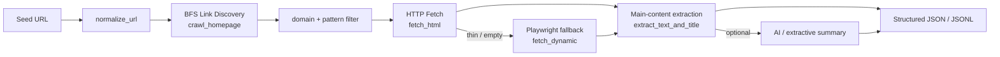
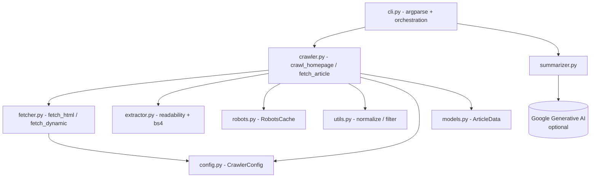
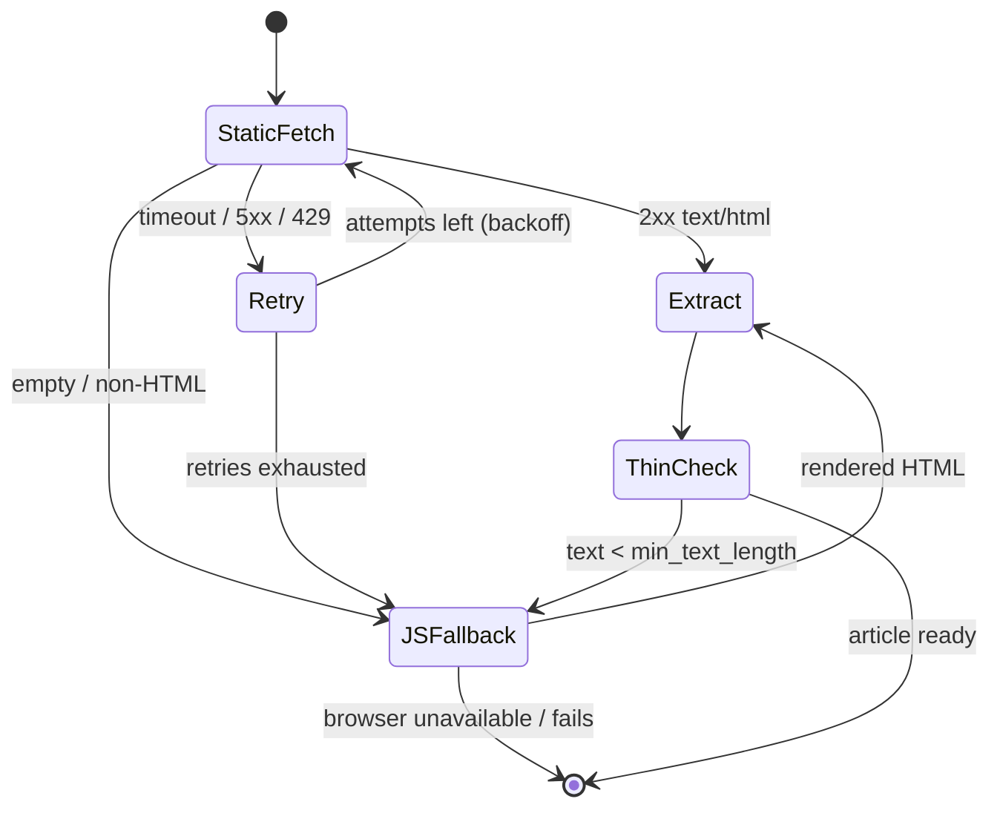
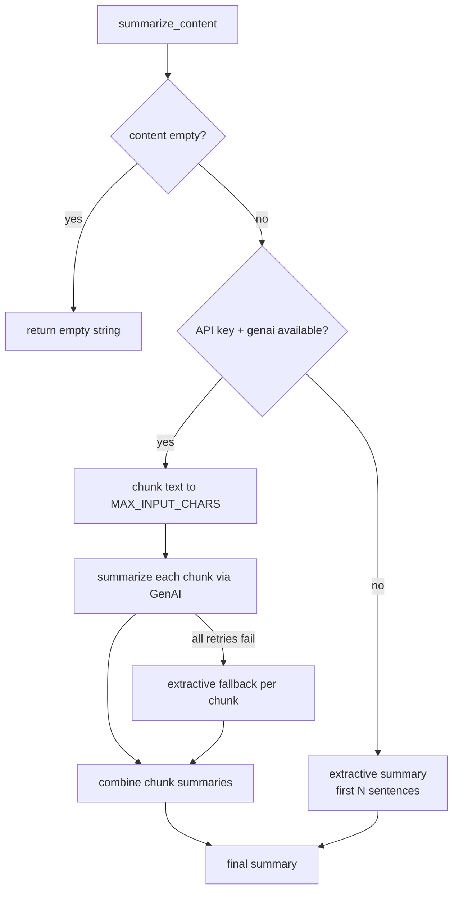
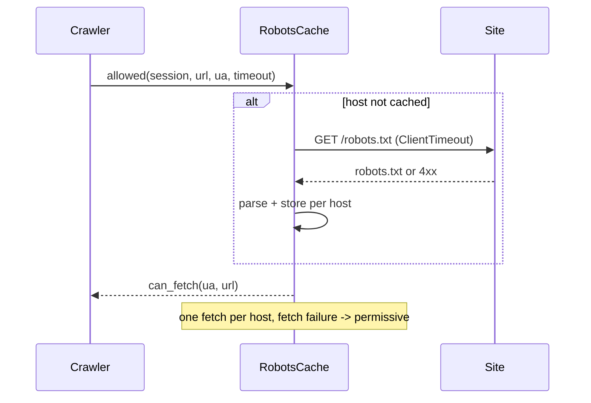

# Python Production Crawler

An asynchronous crawler and summarizer optimized for government and news
content. It supports polite crawling, robots.txt compliance, structured
output, resilient extraction with a Playwright fallback, and a strict
typed/tested toolchain.

## Table of Contents

- [Overview](#overview)
- [Architecture](#architecture)
  - [Pipeline Flow](#pipeline-flow)
  - [Component Map](#component-map)
  - [Fetch State Machine](#fetch-state-machine)
  - [Summarizer Decision Flow](#summarizer-decision-flow)
  - [Robots Cache](#robots-cache)
- [Key Features](#key-features)
- [Reliability & Error Handling](#reliability--error-handling)
- [Installation](#installation)
- [Configuration](#configuration)
- [Project Layout](#project-layout)
- [Usage](#usage)
  - [Examples](#examples)
  - [CLI Flags](#cli-flags)
- [Output Schema](#output-schema)
- [Development & Testing](#development--testing)
- [Operational Guidance](#operational-guidance)
- [Troubleshooting](#troubleshooting)

## Overview

The crawler discovers links starting from a homepage, filters URLs based
on domain and patterns, and extracts article text using readability
heuristics. It then optionally generates summaries with Google Generative
AI, falling back to a deterministic extractive summary when the SDK or an
API key is unavailable. Output is JSON or JSONL, ready for ingestion into
downstream pipelines.

It is a **standalone subsystem**: it has its own `pyproject.toml`
(mypy-strict, ruff, pytest config), its own dependency set, and a
hermetic test suite. It does not import from the rest of the monorepo.

## Architecture

### Pipeline Flow



### Component Map



### Fetch State Machine

`fetch_html` retries transient failures with exponential backoff; the
crawler escalates to a headless browser when the static fetch returns
nothing or the extracted text is too thin.



### Summarizer Decision Flow



### Robots Cache



## Key Features

- **Polite crawling**: robots.txt compliance and configurable request delays
- **Resilient fetching**: retries with exponential backoff + jitter
- **JS fallback**: Playwright for dynamic / client-rendered pages
- **Content extraction**: readability-lxml with BeautifulSoup cleanup
- **Filtering**: include/exclude regexes + allowed-domain control
- **Structured output**: JSON / JSONL with UTC timestamps
- **Strict toolchain**: `mypy --strict` clean, `ruff` clean, 49 hermetic tests

## Reliability & Error Handling

The crawler is built so a single bad URL never aborts a run:

- `fetch_html` catches `asyncio.TimeoutError` / `aiohttp.ClientError`,
  retries with exponential backoff + jitter, and returns `None` on
  exhaustion rather than raising.
- `fetch_dynamic` (Playwright) degrades to `None` when the browser is
  unavailable or navigation fails.
- `fetch_and_process` wraps the per-URL fetch in a guard: any unexpected
  exception (malformed HTML, browser launch failure) is logged and the
  URL is skipped - sibling tasks in the `asyncio.gather` batch continue.
- `RobotsCache` treats an unreachable `robots.txt` as permissive and
  caches one parser per host.
- The summarizer always has a deterministic extractive fallback, so
  summarization never fails the run.

## Installation

```bash
cd python_crawler
python3 -m venv .venv
source .venv/bin/activate
pip install -r requirements.txt
playwright install   # only needed for the JS fallback
```

## Configuration

Environment variables (all optional):

```dotenv
# AI summarization
GOOGLE_AI_API_KEY=your-key
GOOGLE_AI_MODEL=models/gemini-1.5-flash
AI_INSTRUCTIONS=Optional system instruction
AI_MAX_RETRIES=3
AI_RETRY_DELAY=2
AI_MAX_INPUT_CHARS=12000

# Logging
CRAWLER_LOG_LEVEL=INFO
```

`CrawlerConfig` (`src/config.py`) holds runtime knobs - link/depth caps,
concurrency, timeouts, retry/backoff, robots and JS-fallback toggles,
domain and pattern filters. CLI flags map onto it (see below).

## Project Layout

```
python_crawler/
├── README.md
├── pyproject.toml         # mypy (strict) + ruff + pytest config
├── requirements.txt
├── run_crawler.py         # convenience wrapper
├── __init__.py
├── src/
│   ├── __init__.py
│   ├── cli.py             # CLI entrypoint + batch orchestration
│   ├── config.py          # CrawlerConfig + skip-extension constants
│   ├── crawler.py         # crawl_homepage / fetch_article
│   ├── extractor.py       # content extraction (readability + bs4)
│   ├── fetcher.py         # HTTP + Playwright fetching
│   ├── models.py          # ArticleData schema
│   ├── robots.py          # robots.txt cache
│   ├── summarizer.py       # AI + extractive-fallback summarizer
│   └── utils.py           # URL normalization + filtering
└── tests/
    └── test_crawler.py    # 49 hermetic tests
```

## Usage

```bash
python run_crawler.py https://example.gov --max-links 50 --depth 2 --output articles.json
```

Or run as a module:

```bash
python -m python_crawler.src.cli https://example.gov --max-links 50 --depth 2
```

### Examples

```bash
# Crawl with strict domain filtering
python run_crawler.py https://example.gov \
  --allowed-domain example.gov \
  --max-links 80 --depth 2

# Disable summarization and JS fallback
python run_crawler.py https://example.gov \
  --no-summarize --no-js-fallback

# JSONL output for streaming ingestion
python run_crawler.py https://example.gov \
  --output articles.jsonl --output-format jsonl
```

### CLI Flags

| Flag | Description | Default |
| --- | --- | --- |
| `--max-links` | Max links to fetch | `50` |
| `--depth` | Max crawl depth | `2` |
| `--concurrency` | Parallel fetch slots | `8` |
| `--output` | Output file path | `articles.json` |
| `--output-format` | `json` or `jsonl` | `json` |
| `--allowed-domain` | Allowed domain (repeatable) | seed domain |
| `--include` | URL include regex (repeatable) | none |
| `--exclude` | URL exclude regex (repeatable) | none |
| `--no-robots` | Ignore robots.txt | false |
| `--request-delay` | Delay between requests (s) | `0.2` |
| `--timeout` | Request timeout (s) | `12` |
| `--max-retries` | Max retries per request | `3` |
| `--no-js-fallback` | Disable Playwright | false |
| `--min-text-length` | Minimum text length | `600` |
| `--no-summarize` | Disable summarization | false |

## Output Schema

Each output item is a JSON object:

```json
{
  "url": "https://example.gov/news/123",
  "title": "Example Title",
  "content": "Full extracted text...",
  "source": "https://example.gov/news/123",
  "summary": "Optional AI summary...",
  "fetched_at": "2026-01-31T12:34:56+00:00"
}
```

## Development & Testing

Tooling config lives in `pyproject.toml`. Run all checks from the
`python_crawler/` directory:

```bash
mypy src run_crawler.py __init__.py    # strict type checking - 0 errors
ruff check .                           # lint
ruff format --check .                  # format check
pytest tests -q                        # 49 hermetic tests
```

- **Typing**: `mypy --strict` clean across all 12 source modules.
  Optional/stub-less packages (`readability`, `playwright`,
  `google.generativeai`) are scoped overrides in `pyproject.toml`.
- **Tests**: `tests/test_crawler.py` - 49 tests, fully hermetic (no
  network, no Playwright, no real LLM calls). Async helpers that touch
  the network are exercised with stubbed sessions. Covers URL
  normalization, skip rules, pattern matching, config, extraction,
  summarizer chunking + extractive fallback, the `RobotsCache`, and the
  per-URL failure-isolation contract in `fetch_and_process`.

## Operational Guidance

- **Respect robots.txt** by default to stay compliant.
- **Tune request delay** for sensitive domains and rate limits.
- **Use JSONL** for streaming ingestion into ETL pipelines.
- **Monitor extraction length**: very short outputs may indicate paywalls or blocking.
- **Add include/exclude patterns** for higher-precision crawling.

## Troubleshooting

- **Very short content**: increase `--min-text-length` or enable JS fallback.
- **Too many 403s**: lower request rate and confirm the user-agent.
- **Slow crawls**: reduce depth or max links, or increase concurrency if allowed.
- **Summarization failures**: verify `GOOGLE_AI_API_KEY` and model name -
  the crawler still emits articles with an extractive summary.
- **`google.generativeai` deprecation warning**: the summarizer uses the
  legacy SDK; it is fully fallback-guarded and functional. Migrating to
  `google-genai` is tracked as future work.
