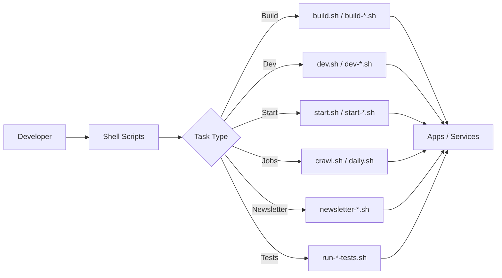

# Shell Toolkit

A collection of shell scripts for building, running, and maintaining the SynthoraAI monorepo. These scripts are meant to be run from the repo root and provide a simple, consistent interface for common developer workflows.

## Table of Contents

- [Overview](#overview)
- [Script Categories](#script-categories)
  - [Build & Clean](#build--clean)
  - [Dev & Start](#dev--start)
  - [Crawler & Jobs](#crawler--jobs)
  - [Newsletter](#newsletter)
  - [Tests](#tests)
  - [Compute Helpers](#compute-helpers)
- [Execution Flow](#execution-flow)
- [Common Commands](#common-commands)
- [Notes](#notes)

## Overview

The shell toolkit wraps common tasks into simple commands like `dev.sh`, `build.sh`, and `start.sh`. It also includes specialized scripts for crawling, newsletters, and scheduled jobs.

## Script Categories

### Build & Clean

- `build.sh`, `build-frontend.sh`, `build-backend.sh`, `build-crawler.sh`
- `clean.sh`, `clean-build.sh`

### Dev & Start

- `dev.sh`, `dev-frontend.sh`, `dev-backend.sh`, `dev-crawler.sh`
- `start.sh`, `start-frontend.sh`, `start-backend.sh`, `start-crawler.sh`

### Crawler & Jobs

- `crawl.sh`, `daily.sh`, `install_daily_cron.sh`

### Newsletter

- `newsletter-dev.sh`, `newsletter-build.sh`, `newsletter-start.sh`, `newsletter-run.sh`, `newsletter-send.sh`

### Tests

- `run-backend-tests.sh`, `run-frontend-tests.sh`

### Compute Helpers

- `compute.sh`, `docker_compute.sh`, `enter_compute.sh`

## Execution Flow



## Common Commands

```bash
# Run all services in dev mode
./shell/dev.sh

# Build specific services
./shell/build-frontend.sh
./shell/build-backend.sh
./shell/build-crawler.sh

# Start services in production mode
./shell/start.sh

# Run crawler once
./shell/crawl.sh

# Send newsletter now
./shell/newsletter-send.sh
```

## Notes

- Run scripts from the repo root so relative paths resolve correctly.
- Some scripts read env vars from `.env` files in service directories.
- Use `install_daily_cron.sh` to register a scheduled daily job on supported environments.
